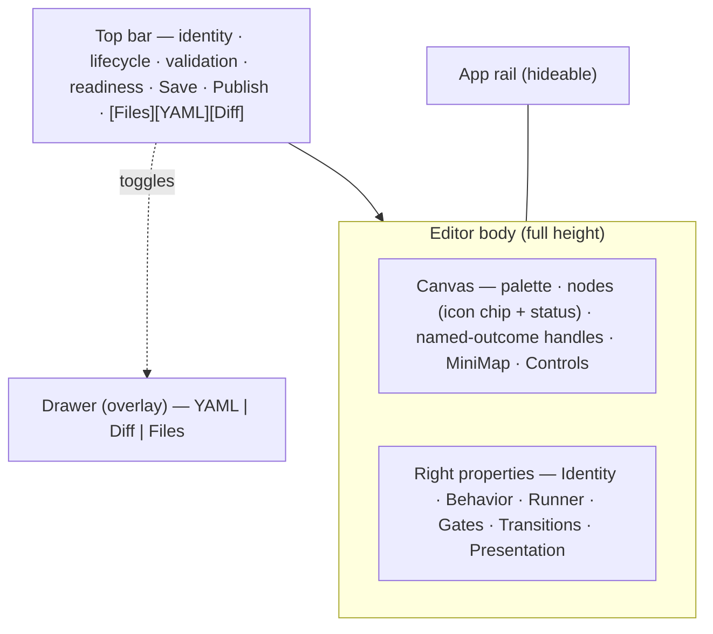

# SDD Spec (FROZEN) — Flow Studio · Phase B (Editor usability)

> **Status:** Phase-0 spec freeze. **Single source of truth** for the Phase B
> implementation. Every later deviation requires a spec amendment, never an
> ad-hoc code change. Plan:
> [`.ai-factory/plans/feature-flow-studio-editor.md`](../plans/feature-flow-studio-editor.md).
> Predecessor (Phase A, merged): [`feature-flow-studio-redesign.md`](feature-flow-studio-redesign.md).
> Surface SSOT: [`docs/screens/studio/editor.md`](../../docs/screens/studio/editor.md)
> + [`docs/screens/studio/README.md`](../../docs/screens/studio/README.md).
>
> At Phase-0 HEAD every Phase B piece is **(Designed)**; the §"Implementation
> status" tags flip to **(Implemented)** on Phase B merge (T2.1). Phase C pieces
> (the package-coupled editor half: redesigned Files drawer, cross-artifact
> pickers, "new artifact", "cut version") stay **(Designed)** / **(Phase 2)** here.
>
> Conventions inherited (non-negotiable): `MaisterError` taxonomy (no plain
> `Error` for domain failures; UI branches on `code`), EN+RU key parity, HeroUI v3
> + Tailwind 4 (NO new component lib, NO new dep), default Server Components (`"use
> client"` only for state/effects/browser), strict TS (no `any` without
> `// FIXME(any):`), `no-console` lint (allowed `console.debug|warn|error`
> server-side; client surfaces state via UI). **No migration, no `db:generate`, no
> engine bump, no new `runs.status`, no new `MaisterError` code, no new HTTP/SSE
> route, no new env var.**
>
> Branch: `claude/angry-chaum-31d223`. Baseline: `main @ dc1a3c7c` (Phase A
> merged).
>
> **Grounding:** anchors verified against code on 2026-06-15 — the editor page
> `web/app/(app)/flows/[projectSlug]/[capId]/page.tsx` (form `action={updateAuthoredFlowAction}`,
> hidden `expectedDraftVersion`, right-`<aside>` InfoPanels, `<PackageFilesEditor>`);
> `FlowEditorTabs` (`components/flows/flow-editor-tabs.tsx`) the single `yaml`-state
> owner (hidden `name="flowYaml"`, 400 ms reseed via `syncYamlToCanvas`, graph/yaml/diff
> tabs); `FlowGraphEditor` (`components/flows/flow-graph-editor.tsx`) already a
> canvas + 340 px right sidebar (`NodeSideForm` + `EditorValidationSummary`,
> `h-[440px]`, `FlowEditorToolbar`, `makeEditorNodeView`, `toEditorEdges`); the
> SHARED `FlowNodeBody` + `makeFlowNodeView` in `components/board/flow-graph-view.tsx`;
> `FlowNodeData` carries `nodeType` (`lib/board/flow-graph-view-layout.ts:59`);
> `validateEditorManifest` (`lib/flows/editor/validation.ts`) pure + client-safe;
> `NODE_TYPES`/`GATE_KINDS` in `lib/flows/editor/node-form.ts`; `LeftRail`
> (`components/chrome/left-rail.tsx`) an async Server Component; the forest token
> palette in `styles/globals.css` (`@theme inline` → `--accent-2/3/4`, `--amber`,
> `--attention`, `--mute`, `--good`, `--danger`); icon convention = inline SVG
> (`viewBox="0 0 16 16"`, `stroke="currentColor"`), per `left-rail.tsx` `sectionIcons`.

---

## 1. Purpose & scope

Phase A unified the catalog surfaces into `/studio` over the existing backend.
Phase B is the **storage-agnostic editor redesign** — it makes the flow editor go
"unusable → usable" while leaving the draft/publish/trust backend untouched, and
it does so behind a small **load/save seam** so Phase C (editable local packages)
plugs in without rebuilding B.

Phase B delivers, over the unchanged editor backend:

1. The node/gate **visual scheme** (colored icon chip per type, on the **shared**
   node renderer) + **named-outcome handles** + **dashed amber rework edges**.
2. A **3-pane layout** — compact **top bar** + dominant **canvas** + right
   **properties panel** — replacing the page's header + two-column form +
   tabs-inside-a-form structure.
3. **Drawers** for YAML / Diff / Files (toggled from the top bar), replacing the
   in-form tabs and the always-mounted `PackageFilesEditor`.
4. A **hideable app rail** so the canvas can claim near-full width.
5. The **load/save seam**: save/publish remain **server actions** preserving the
   `expectedDraftVersion` CAS, made **injectable** so Phase C can pass a
   local-package-targeting action.

### Out of scope (Phase C — separate plan; do NOT implement in Phase B)

- The **redesigned, package-aware Files drawer** with cross-artifact reference
  pickers (a node's schema/skill/MCP picks a sibling package artifact), "new
  artifact in package", and the top-bar **"cut version"** action.
- The editor's move to the `/studio/edit/{...}` route (Phase B keeps the existing
  `/flows/{projectSlug}/{capId}` route — see §5).
- The `local_packages` backend (Variant B) and standalone artifact kinds.

**No regression:** Phase B re-homes the **existing** `package-files-editor` behind
a `[Files]` drawer (relocated, NOT redesigned), so bundled-file editing keeps
working; Phase C redesigns what that drawer shows.

---

## 2. Reuse map (build on, do NOT rebuild)

Every symbol below is **(Implemented)**; Phase B restyles / re-homes / extends it.

| Capability | Reused symbol (verified 2026-06-15) | Phase B use |
|---|---|---|
| Shared node body | `components/board/flow-graph-view.tsx` `FlowNodeBody` (presentational, no `<Handle>`) | gains a `nodeType` prop → renders the colored icon chip (T1.1) |
| Read-only node view | same file `makeFlowNodeView` (wraps body with handles) | passes `d.nodeType` through; keeps simple L/R handles |
| Editor node view | `components/flows/flow-graph-editor.tsx` `makeEditorNodeView` | passes `d.nodeType`; named-outcome handles (T1.2) |
| Editor edges | same file `toEditorEdges` | label by `outcome` + dashed-amber style for rework/back edges (T1.2) |
| Status color | `lib/board/flow-graph-view-layout.ts` `colorForNodeStatus` | UNCHANGED; the type accent composes with it |
| Canvas + sidebar | `FlowGraphEditor` (canvas + 340 px `NodeSideForm`/`EditorValidationSummary`) | becomes full-height 3-pane; sidebar collapsible; +MiniMap (T1.5) |
| Manifest validation | `lib/flows/editor/validation.ts` `validateEditorManifest` (pure) | drives the top-bar validation chip (T1.4) |
| Manifest-state owner | `components/flows/flow-editor-tabs.tsx` `FlowEditorTabs` (single `yaml` state, 400 ms reseed) | hosts the top bar + drawers; keeps reseed + flush (T1.4/T1.6) |
| Save / publish | `app/(app)/flows/actions.ts` `updateAuthoredFlowAction` / `publishAuthoredFlowAction` (server actions, CAS) | passed as **injectable props** (default), unchanged contract (T1.4) |
| YAML editor | `components/flows/code-editor.tsx` `CodeEditor` | opens inside the `[YAML]` drawer (T1.6) |
| Diff view | `components/flows/flow-draft-diff.tsx` `FlowDraftDiffText` | opens inside the `[Diff]` drawer (T1.6) |
| Files editor | `components/flows/package-files-editor.tsx` `PackageFilesEditor` | re-homed inside the `[Files]` drawer, NOT redesigned (T1.6) |
| App rail | `components/chrome/left-rail.tsx` `LeftRail` (async Server Component) | gains a client collapse shell + persisted toggle (T1.3) |

**Reused symbols are (Implemented).** Phase B only restyles / re-homes / extends.

---

## 3. Domain model (deltas)

### 3.1 DB / wire — **NO DDL. NO MIGRATION. NO ROUTE. NO ERROR CODE.**

Phase B is a **pure client redesign** of `/flows/{projectSlug}/{capId}`. Save
still flows through the existing authored-draft server action
(`updateAuthoredFlowAction`, which calls `PATCH /catalog/caps/{capId}/draft`
semantics via `formData.expectedDraftVersion` CAS) and publish through
`publishAuthoredFlowAction`. No table/column/index, no OpenAPI path, no SSE event,
no `MaisterError` code, no env var changes.

### 3.2 The node-visual map — `nodeVisual` / `gateVisual` (pure, client-safe)

A new pure module `web/lib/flows/node-visuals.ts` (no I/O, no JSX, fully
unit-tested) maps each typed node/gate onto an icon name + a forest-palette color
token:

```ts
type NodeVisual = { iconName: string; colorToken: string }; // colorToken = CSS-var base, e.g. "accent-3" → var(--accent-3)
function nodeVisual(type: NodeType): NodeVisual;             // exhaustive over NODE_TYPES
function gateVisual(kind: GateKind): NodeVisual;             // exhaustive over GATE_KINDS
```

**Color roles → forest tokens (honest mapping).** The design SSOT names hues as
*roles* (teal/violet/slate/amber/magenta/green/blue/cyan); the live palette is a
muted forest green + `attention` (warm amber) + `danger` (red) — there is no
literal teal/violet/magenta token. The roles therefore **collapse onto existing
`var(--*)` tokens** (muted, not rainbow); the **icon shape is the primary type
signal**, color is a secondary accent. The chip renders the icon via
`style={{ color: \`var(--${colorToken})\` }}` (SVG `stroke="currentColor"`),
avoiding Tailwind JIT dynamic-class gaps and binding straight to the theme vars.

| Node type | `iconName` | `colorToken` | design role |
|---|---|---|---|
| `ai_coding` | `bot` | `accent-3` | teal |
| `judge` | `gavel` | `accent-2` | violet |
| `cli` | `terminal` | `mute` | slate |
| `check` | `shield` | `attention` | amber |
| `human` | `person` | `amber` | magenta |

| Gate kind | `iconName` | `colorToken` | design role |
|---|---|---|---|
| `command_check` | `terminal` | `mute` | slate |
| `skill_check` | `puzzle` | `good` | green |
| `ai_judgment` | `gavel` | `accent-2` | violet |
| `artifact_required` | `file` | `accent-3` | blue |
| `external_check` | `link` | `accent-4` | cyan |
| `human_review` | `person` | `amber` | magenta |

Shared icons/tokens are intentional (`cli`↔`command_check`, `judge`↔`ai_judgment`,
`human`↔`human_review`) — they reinforce node↔gate semantics. The icon SVG paths
live in the `.tsx` renderer (a `Record<iconName, ReactNode>`), keeping
`node-visuals.ts` JSX-free and testable.

### 3.3 The load/save seam — injectable server actions

`FlowEditorTabs` (and the new `editor-top-bar`) accept optional
`saveAction` / `publishAction` props typed as the existing server-action
signatures, defaulting to `updateAuthoredFlowAction` / `publishAuthoredFlowAction`.
The seam **preserves the contract**: the action is invoked via a `<form action={…}>`
carrying the hidden `projectSlug` / `capId` / `expectedDraftVersion` / `title` /
`flowYaml` inputs (progressive enhancement + CAS intact). It is **NOT** converted
to a client `onSave` callback — that would drop the CAS and the no-JS path.

---

## 4. Layout & regions (3-pane)



- **Top bar (compact).** Identity (project · cap · kind) · lifecycle chip
  (Draft/Published) · validation chip (valid / N issues, from the pure
  `validateEditorManifest` on the owned manifest) · readiness chip (from the
  page's existing server-computed `isPackageValid`) · **Save draft** · **Publish**
  (gated on `canManage`, publish also on validity) · drawer toggles
  `[Files] [YAML] [Diff]`.
- **Canvas (dominant).** Full-height (viewport-minus-chrome); the fixed
  `h-[440px]` is removed. Keeps `FlowEditorToolbar` (Add node ×5 / Add gate ×6 /
  Remove), adds a `<MiniMap>`, keeps `<Controls>` + `<Background>`. Node cards
  carry the icon chip (T1.1); edges carry outcome labels + dashed-amber rework
  styling (T1.2).
- **Right properties panel (collapsible).** ~320–360 px; groups `NodeSideForm`'s
  fields under headings **Identity · Behavior · Runner · Gates · Transitions ·
  Presentation** (field logic unchanged) + `EditorValidationSummary`. Nothing
  selected → the form's empty hint.
- **Drawers.** `[YAML]` → `CodeEditor`; `[Diff]` → `FlowDraftDiffText`; `[Files]`
  → the existing `PackageFilesEditor`. Side/bottom overlays, NOT primary real
  estate; the canvas stays mounted while a drawer is open so edits survive toggles.
- **Hideable rail.** A persisted (localStorage, default expanded) collapse toggle
  on the app rail; collapsed → icons-only/hidden so the canvas gets width.

---

## 5. Identifier trust-boundary table

No new request-derived locators. The route `/flows/{projectSlug}/{capId}` and the
save/publish actions are unchanged.

| Surface | Identifier | Label | Handling |
|---|---|---|---|
| editor route | `projectSlug`, `capId` | `url-param` | resolved against **server-state** (authored-cap row + project `manageCatalog`) — unchanged |
| save / publish | `expectedDraftVersion` | `body-controlled` | the existing CAS field, already validated server-side — unchanged |

No new `body-controlled` cross-resource ids. The editor route stays
`/flows/{projectSlug}/{capId}`; relocation to `/studio/edit` is deferred to
Phase C (when the editor addresses local-package artifacts).

---

## 6. Contract-surface ledger (skill-context: "trace every contract surface to its spec file")

| Surface class | Changes in Phase B? | Spec file / reason |
|---|---|---|
| HTTP route / SSE / error code / env / DB | **No** | Pure client redesign; save via the unchanged authored-draft action (CAS). No `docs/api/*`, `error-taxonomy.md`, `configuration.md`, `database-schema.md`, `db/*.md` change. |
| `package.json` script / CLI / Flow DSL | **No** | None. |
| Screen surface | **Yes** | new `docs/screens/studio/editor.md`; updated `docs/screens/chrome/left-rail.md` (hideable rail); index in `docs/screens/README.md`; glossary in `docs/CLAUDE.md`. |
| system-analytics behavior | **Yes** | `docs/system-analytics/flow-studio.md` "Editor redesign (Phase B)" section + the canonical node-visual scheme (cited from `editor.md`, R7). |
| Shared component visual contract | **Yes (note)** | the node-visual scheme lands in the SHARED `FlowNodeBody` → also changes the Phase-A read-only preview and the run-workbench graph. Status coloring is unchanged and **composes** with the new type accent. |

## 7. Deployment touchpoints

**None.** No env var, config file, sidecar, or port. No `Dockerfile` / `compose*` /
`.env.example` change. Stated explicitly so the absence is intentional.

---

## 8. Expectations (normative, testable)

1. `nodeVisual` MUST be exhaustive over `NODE_TYPES` and `gateVisual` over
   `GATE_KINDS`, each returning a stable `{ iconName, colorToken }`; the map MUST
   be a **pure** function (no I/O, no JSX).
2. `FlowNodeBody` MUST render a colored type **icon chip** as the node identity,
   **coexisting** with the existing run-status chip (`colorForNodeStatus`,
   unchanged) and the author `presentationColor` border; the type accent is
   **additive** — pre-existing status-chip / current-node-ring rendering MUST stay
   intact.
3. Because `FlowNodeBody` is shared, the icon chip MUST appear in the editor
   canvas, the Phase-A read-only package preview, AND the run-workbench graph,
   from the one renderer.
4. Editor edges MUST be labeled by their transition `outcome`; **rework /
   back-edges** MUST render dashed + amber, default outcomes solid; the read-only
   `makeFlowNodeView` MUST keep simple handles (editor-scoped handle change only).
5. The app rail MUST support a collapsed state, persisted to `localStorage`
   (default expanded), toggled by a button; collapsed MUST hide the nav labels
   (icons-only/hidden) to free canvas width.
6. The editor MUST render a compact **top bar** carrying identity, a lifecycle
   chip, a validation chip computed by `validateEditorManifest` on the owned
   manifest, a readiness chip, **Save draft** / **Publish** (gated on
   `canManage`; Publish also on validity), and the `[Files] [YAML] [Diff]` drawer
   toggles.
7. Save and Publish MUST remain **server actions** with `formData.expectedDraftVersion`
   CAS + progressive enhancement; the action MUST be **injectable** (`saveAction` /
   `publishAction` props, default = the existing actions) and MUST NOT be replaced
   by a client `onSave` callback.
8. The canvas MUST be full-height (the fixed `h-[440px]` removed), keep the
   add-node/add-gate/remove palette, add a `<MiniMap>`, keep `<Controls>`; the
   right properties panel MUST be collapsible and group `NodeSideForm` under the
   six headings; node drag MUST still persist x/y via the existing `moveNode`.
9. The Graph/YAML/Diff **tabs** MUST be replaced by an always-on canvas + top-bar
   **drawers** (`[YAML]` → `CodeEditor`, `[Diff]` → `FlowDraftDiffText`, `[Files]`
   → the existing `PackageFilesEditor`); the 400 ms YAML↔canvas reseed + the
   flush-pending-sync logic MUST be preserved across drawer open/close, and the
   canvas MUST stay mounted while a drawer is open.
10. EN and RU `flowEditor` namespaces MUST both carry the new top-bar / drawer /
    rail-toggle / node-gate-visual labels (key parity); `web/messages/ru.json`
    MUST remain valid JSON.
11. Phase B MUST add NO migration, NO new HTTP/SSE route, NO new `MaisterError`
    code, NO new env var; every contract-ledger row marked "No" MUST hold against
    the diff.

---

## 9. Edge cases

| Case | Handling |
|---|---|
| Fresh node with `nodeType` absent / `"other"` role | icon chip falls back to a neutral default glyph + `mute` token; never throws |
| Compile failure of the draft manifest (`canvasAvailable=false`) | canvas pane shows the existing fallback; YAML drawer remains the editing path; top bar still renders identity + raw save |
| YAML drawer open during a 400 ms reseed | reseed runs on drawer open/close (flush-pending) so canvas edits are not lost; canvas stays mounted |
| Rail collapsed then reloaded | localStorage restores collapsed after hydration (brief expanded flash acceptable; no inline script — matches the script-free theme convention) |
| `presentationColor` set by author AND type accent | author color → node **border** (ADR-064, unchanged); type accent → **icon chip** — they do not conflict |
| viewer without `canManage` | Save/Publish hidden; editor read-only (existing `disabled` path), canvas + drawers still viewable |

---

## 10. Spec-to-test matrix (acceptance → named test)

Runnability: unit files are `*.test.ts` under `web/lib/flows/**` /
`web/components/{board,flows,chrome}/**` (web Vitest `unit` project globs
`.test.ts` ONLY — confirmed `vitest.workspace.ts:18-25`; `renderToStaticMarkup`,
no jsdom). The plan's `*.test.tsx` is corrected to `*.test.ts` (the `.tsx` glob
does not exist → would be a dead test, skill-context "no dead tests"). The e2e
`web/e2e/flow-editor.spec.ts` MUST be added to `AUTHED_SPEC` in
`web/playwright.config.ts`. Prove each new file with `vitest list` per phase.

| # (Expectation) | Acceptance | Test (project · file) |
|---|---|---|
| 8.1 | `nodeVisual`/`gateVisual` exhaustive + stable tokens | unit · `lib/flows/node-visuals.test.ts` |
| 8.2 / 8.3 | icon chip + status chip both render on the shared body | unit · `components/board/__tests__/flow-graph-view.test.ts` (added cases) |
| 8.4 | rework outcome → dashed/amber edge style; default → solid | unit · `components/flows/__tests__/flow-graph-editor.test.ts` (edge-style fn) |
| 8.5 | rail collapsed vs expanded hides/shows labels + toggle present | unit · `components/chrome/__tests__/left-rail-collapse.test.ts` |
| 8.6 / 8.7 | top-bar chips + Save/Publish gated on `canManage` + drawer toggles | unit · `components/flows/editor/__tests__/editor-top-bar.test.ts` |
| 8.8 / 8.9 | canvas + right pane + properties sections; drawer open/close | unit · editor shell render test + e2e |
| 8.1–8.10 (path) | open draft → top-bar chips → select node → drag → Save persists → toggle YAML drawer → collapse rail; Phase-A preview + workbench inherit visuals | e2e · `web/e2e/flow-editor.spec.ts` |
| 8.10 | EN/RU `flowEditor` parity | i18n parity test (kept green) |

---

## 11. Implementation status

At Phase-0 HEAD all §1 deliverables are **(Designed)**; they flip to
**(Implemented)** on Phase B merge (T2.1 flips the doc tags). Phase C (the
package-coupled editor half + `/studio/edit` route + `local_packages` backend) and
git write-back stay **(Designed)** / **(Phase 2)**.

**Cross-cutting compliance ledger (project aif-plan skill-context):**
HTTP identifiers labeled (§5 — no new locators); two-phase/atomicity = N/A (no
state-changing route added; save reuses the existing CAS action); trust/execution
separation = N/A (no exec path touched); fan-out = no new `runs.status`/enum;
config-state symmetry = N/A (no YAML→DB sync); deployment touchpoints = none (§7);
contract surfaces → spec files (§6); test integrity = §10 (no dead tests —
`.test.ts` glob, `renderToStaticMarkup`, `AUTHED_SPEC` registration).

---

## 12. Phasing & sequencing

- **Phase A — Studio shell & surfacing** (merged): unified home · sources ·
  packages-grouped · package-detail.
- **Phase B — Editor usability** (this spec): the storage-agnostic ~90% — node
  visual scheme, named-outcome handles, dashed rework edges, 3-pane layout,
  drawers, hideable rail, the load/save seam.
- **Phase C — Editable local packages (Variant B)** (own plan; NEW backend): the
  package-coupled editor half plugs into B's seam (redesigned Files drawer,
  cross-artifact pickers, "new artifact", "cut version") + `/studio/local` +
  `/studio/edit`. Git write-back is **(Phase 2)**.
