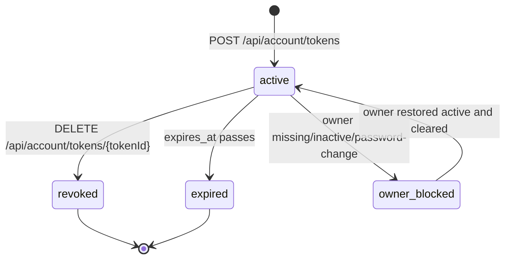
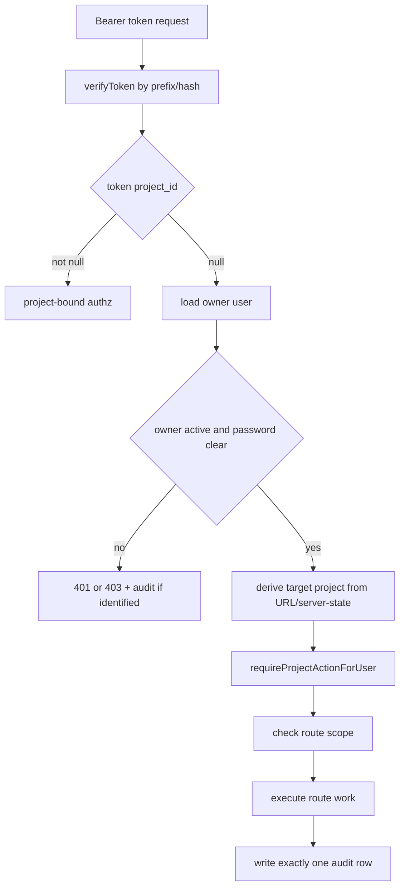
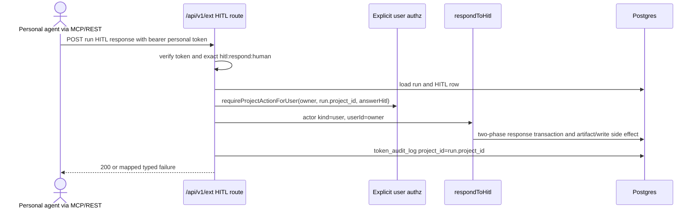

# Feature: User Access Tokens

## Status

Frozen SDD for implementation on 2026-06-23. Plan:
`.ai-factory/plans/feature-user-access-tokens.md`.

This file is the implementation source of truth for global personal API
tokens. If code, docs, OpenAPI, DB docs, or tests need to diverge from this
contract, update this spec first, then update the dependent artifact.

## Value

MAIster already has project-bound API tokens for CI, scripts, project agents,
and the MCP facade. A human user also needs a personal token that belongs to
their account rather than to one project, so a personal agent can work across
every project the user can currently access and can optionally answer eligible
human HITL gates.

## Goals

- Add account-level personal API tokens created from `/account`, not from a
  project Integrations page.
- Store personal tokens in the existing `project_tokens` table with
  `project_id IS NULL`.
- Authorize each personal-token external operation against the token owner's
  live user/account state and current project membership.
- Add cross-project HITL inbox access for personal tokens.
- Allow human HITL response through REST and MCP only when a personal token has
  the exact `hitl:respond:human` scope.
- Keep existing project tokens, project-scoped user tokens, agent tokens, and
  orchestrator run-bound tokens compatible.
- Keep token material server-only: plaintext appears exactly once after
  creation; token hash never leaves the server.

## Non-goals

- No platform-wide service account token.
- No new token table.
- No OAuth device flow or browserless login flow.
- No project-membership UI changes.
- No project Integrations rewrite beyond clarifying the global-token boundary.
- No token audit viewer in this slice.
- No new supervisor process, port, sidecar, or agent adapter behavior.

## Decisions

- Personal global token row shape:
  `token_kind='user'`, `owner_user_id NOT NULL`, `project_id IS NULL`.
- Project-scoped user tokens remain creatable from project Integrations for
  backward compatibility.
- Account token UI uses grouped capability clusters plus an advanced raw scope
  checklist. The high-risk human HITL capability is a separate toggle and is
  the only UI path that grants `hitl:respond:human`.
- `hitl:respond:human` is an exact critical scope. `*` never implies it.
- `hitl:inbox:read` is a normal read scope. `*` may imply it.
- A personal token is usable only while the owner user exists, has
  `account_status='active'`, and `must_change_password=false`.
- Global admins act as project owners for personal-token project authz, exactly
  like session auth.
- Existing `MAISTER_PROJECT_TOKEN` remains the first-precedence stdio token for
  the MCP facade. New `MAISTER_ACCESS_TOKEN` is a fallback alias.

## Domain Model

### Entities

- `project_tokens`: existing token table. This feature makes `project_id`
  nullable and tightens token-kind checks.
- `token_audit_log`: existing per external-call audit table. This feature makes
  `project_id` nullable so cross-project inbox calls can be audited with
  `project_id IS NULL`.
- `users`: token owner state source. Owner deletion leaves
  `project_tokens.owner_user_id` null through `ON DELETE SET NULL`; verification
  fails closed for those rows.
- `project_members`: current per-project role source for personal-token authz.
- `hitl_requests`: source for run-scoped and cross-project HITL lists and
  response authorization.
- MCP facade (`mcp/`): transport adapter that forwards bearer tokens to
  `/api/v1/ext`.

### Token Kinds

| Kind | `project_id` | `owner_user_id` | `agent_id` | Authority |
| --- | --- | --- | --- | --- |
| `project` | required | null | null | One project only; token scopes. |
| `user` project-scoped | required | required | null | One project only; user attribution. |
| `user` personal | null | required | null | Every currently visible project; user attribution. |
| `agent` | required | null | required | One project and optional bound run; agent attribution. |

## UI Contract

### `/account`

The existing Profile section remains first. A new "Personal API tokens" section
appears below it.

Layout:
- Compact header with "Personal API tokens" title and primary "New token"
  action.
- Table-first body; no marketing hero, no explanatory feature tour.
- Empty state in the table body when no personal tokens exist.
- Dense row layout matching `/settings` and existing account page tone.
- All visible labels, column headings, action labels, capability names, status
  badges, warnings, and API error labels come from stable i18n keys in
  `web/messages/{locale}.json`. Use nested `account.personalTokens.*` keys
  (for example `account.personalTokens.columns.name`) rather than component-local
  literals, matching existing key style such as `taskDetail.lcChecks`.

Table columns:
- Name.
- Prefix, displayed as the stored `prefix`; no plaintext token after creation.
- Capabilities summary, derived from scopes into stable groups.
- Human HITL, displayed as enabled only when `hitl:respond:human` is present.
- Created at.
- Last used at.
- Expires at.
- Revoked state.
- Actions: revoke.

Create modal:
- Fields: name, expiry, grouped capability checkboxes, advanced raw scope
  checklist, and separate human HITL toggle.
- The advanced raw scope checklist excludes `hitl:respond:human`; the toggle
  owns that scope.
- The human HITL toggle copy must warn that the token can act as the user on
  eligible human gates across accessible projects.
- Submit creates a token and transitions to once-only reveal state.

Once-only reveal:
- The response shows plaintext token exactly once with select/copy affordances.
- Closing the modal loses the plaintext forever.
- List and revoke responses never include `token`, `tokenHash`, or held raw
  secret material.

Revoke:
- Revoke opens a confirmation affordance.
- A first revoke and an already-revoked token both return success to the user.
- Revoked rows remain listed but visually disabled or marked as revoked.

Errors:
- Validation errors, account-state denials, and server failures use existing
  error tone.
- The UI never logs token plaintext, token hash, or full held scopes.
- EN/RU message catalogs must stay parity-checked; label-only tests are useful
  only as catalog parity or stateful UI behavior checks.

### Project Integrations Boundary

Project Integrations continues to manage only project-bound tokens:
`project_id IS NOT NULL`. It must not list or create global personal tokens. It
may link to `/account` for personal tokens.

## API Contracts

### Session-Auth Account Token Routes

All account token routes require `requireActiveSession()`. They never accept a
project id.

#### `GET /api/account/tokens`

Identifier labels:

| Identifier | Source | Trust |
| --- | --- | --- |
| owner user id | `auth-context` | trusted after DB-authoritative session load |

Response `200`:

```json
{
  "tokens": [
    {
      "id": "tok_123",
      "name": "Personal agent",
      "kind": "user",
      "ownerUserId": "user_123",
      "ownerLabel": "Alex",
      "scopes": ["tasks:read", "hitl:inbox:read"],
      "humanHitl": false,
      "prefix": "mai_abcd1234",
      "createdAt": "2026-06-23T12:00:00.000Z",
      "lastUsedAt": null,
      "expiresAt": null,
      "revokedAt": null
    }
  ]
}
```

Failure statuses: `401 UNAUTHENTICATED`, `403 PASSWORD_CHANGE_REQUIRED`,
`403 ACCOUNT_INACTIVE`.

#### `POST /api/account/tokens`

Identifier labels:

| Identifier | Source | Trust |
| --- | --- | --- |
| owner user id | `auth-context` | trusted after DB-authoritative session load |
| name | `body-controlled` | zod-validated |
| scopes | `body-controlled` | zod-validated against `TOKEN_SCOPE_VALUES` |
| humanHitl | `body-controlled` | zod boolean |
| expiresAt | `body-controlled` | zod datetime, optional |

Request:

```json
{
  "name": "Personal agent",
  "scopes": ["tasks:read", "hitl:inbox:read"],
  "humanHitl": false,
  "expiresAt": null
}
```

Rules:
- `scopes` must not contain `hitl:respond:human`; use `humanHitl=true`.
- `humanHitl=true` appends `hitl:respond:human` to the stored scopes.
- Empty or omitted `scopes` stores `["*"]` only when `humanHitl=false`.
- When `humanHitl=true` and `scopes` is empty or omitted, stored scopes are
  `["*", "hitl:respond:human"]`; `*` still does not imply the human scope.
- Response includes plaintext `token` exactly once.

Response `201`:

```json
{
  "id": "tok_123",
  "name": "Personal agent",
  "kind": "user",
  "ownerUserId": "user_123",
  "ownerLabel": "Alex",
  "scopes": ["tasks:read", "hitl:inbox:read"],
  "humanHitl": false,
  "prefix": "mai_abcd1234",
  "token": "mai_abcd1234...",
  "createdAt": "2026-06-23T12:00:00.000Z",
  "expiresAt": null
}
```

Failure statuses: `401`, `403`, `409 CONFLICT` for duplicate/race domain
conflicts, `422 CONFIG` for invalid body or unknown scope.

#### `DELETE /api/account/tokens/{tokenId}`

Identifier labels:

| Identifier | Source | Trust |
| --- | --- | --- |
| tokenId | `url-param` | locator only |
| owner user id | `auth-context` | trusted after DB-authoritative session load |

Delete predicate must include `id = tokenId`, `owner_user_id = session user`,
and `project_id IS NULL`.

Response statuses:
- `204` for newly revoked and already revoked.
- `404 NOT_FOUND` when no matching personal token belongs to this owner.
- `401`, `403` as above.

### External REST Routes with Personal Tokens

All `/api/v1/ext/*` routes keep bearer-token auth. A verified token produces a
`TokenActor` whose `projectId` is nullable.

Project-bound tokens:
- Require the addressed resource project to equal `actor.projectId`.
- Continue using route scope labels and wildcard behavior as today, except
  `hitl:respond:human`.

Personal tokens:
- Require `actor.tokenKind='user'`, `actor.ownerUserId IS NOT NULL`, and
  `actor.projectId IS NULL`.
- Load the owner from DB and deny when missing, inactive, or
  `must_change_password=true`.
- Resolve the target project from URL slug or server state, then call
  `requireProjectActionForUser(ownerUserId, targetProjectId, action)`.
- Never trust a body-provided project id to expand authority.

Route target-project labels:

| Route family | Target project derivation |
| --- | --- |
| `GET/POST /api/v1/ext/projects/{slug}/tasks*` | `url-param` slug -> `projects` row |
| `POST /api/v1/ext/runs` | request project/task locators -> server-loaded project/task rows |
| `GET /api/v1/ext/runs/{runId}*` | `url-param` runId -> `runs.project_id` |
| `POST /api/v1/ext/runs/{runId}/gates/{gateId}/report` | `url-param` runId -> `runs.project_id`; gate row must belong to run |
| `GET /api/v1/ext/runs/{runId}/hitl` | `url-param` runId -> `runs.project_id` |
| `POST /api/v1/ext/runs/{runId}/hitl/{hitlRequestId}/respond` | `url-param` runId -> `runs.project_id`; HITL row must belong to run |

Audit:
- Every identified token call writes exactly one `token_audit_log` row.
- `project_id` is the server-derived target project.
- Cross-project inbox uses `project_id IS NULL`.
- Unidentified invalid tokens still return `401` with no audit row.

### `GET /api/v1/ext/hitl`

Cross-project pending HITL inbox for global personal tokens only.

Identifier labels:

| Identifier | Source | Trust |
| --- | --- | --- |
| token owner | `auth-context` | verified bearer token row |
| visible projects | `server-state` | owner role/membership query |
| limit/offset | `query-controlled` | bounded numeric |

Authorization:
- Requires personal global user token.
- Requires `hitl:inbox:read`; `*` may satisfy this read scope.
- Project and agent tokens return `403 UNAUTHORIZED`.

Response `200`:

```json
{
  "items": [
    {
      "projectId": "project_123",
      "projectSlug": "demo",
      "runId": "run_123",
      "hitlRequestId": "hitl_123",
      "kind": "human",
      "title": "Review deployment plan",
      "createdAt": "2026-06-23T12:00:00.000Z"
    }
  ]
}
```

Audit success row: `scope_used='hitl:inbox:read'`, `project_id IS NULL`,
`endpoint='GET /api/v1/ext/hitl'`.

### HITL Response Semantics

Run-scoped response route:
`POST /api/v1/ext/runs/{runId}/hitl/{hitlRequestId}/respond`.

Permission/form HITL:
- Project, project-scoped user, agent, and personal user tokens may respond
  when they satisfy `hitl:respond` and project/run authorization.
- The service actor remains `api_token` for non-human token responses.

Human, `infra_recovery`, and `budget_breach` HITL:
- Only a personal global user token may respond.
- The token must have exact `hitl:respond:human`.
- `*` alone is insufficient.
- The service actor is `HitlActor.kind='user'` with `userId=ownerUserId`.
- The user must currently have `answerHitl` on the run project.

## MCP Contract

Transport auth:
- Streamable-HTTP keeps forwarding inbound `Authorization` unchanged.
- Stdio resolves auth in order:
  1. `MAISTER_PROJECT_TOKEN`
  2. `MAISTER_ACCESS_TOKEN`
- Empty strings are ignored.
- Token values are never logged.

Tools:
- Existing `hitl_list(runId)` remains run-scoped and maps to
  `GET /api/v1/ext/runs/{runId}/hitl`.
- New `hitl_inbox()` maps to `GET /api/v1/ext/hitl`.
- `hitl_respond(...)` description must state that human HITL requires a global
  personal token with exact `hitl:respond:human`.

## DB Migration Definition

Migration allocation: `0063_*`, generated with Drizzle.

Schema changes:
- `project_tokens.project_id`: nullable FK to `projects.id`,
  `ON DELETE CASCADE`.
- `token_audit_log.project_id`: nullable FK to `projects.id`,
  `ON DELETE SET NULL`.
- Preserve `project_tokens_agent_idx`.
- Preserve `project_tokens_prefix_idx`, `project_tokens_project_idx`,
  `project_tokens_owner_idx`.
- Add a listing index for personal tokens, preferred:
  `(owner_user_id, created_at)` where supported by Drizzle/Postgres.
- Preserve `token_audit_token_idx`.
- Preserve `token_audit_project_created_idx`; nullable `project_id` is valid.
- Do not add a global audit index unless an account audit UI is introduced.

Required checks. Migration `0063` adds the first three checks; existing
`project_tokens_agent_kind_check` from migration `0049` already enforces the
fourth:

```sql
token_kind != 'project' OR project_id IS NOT NULL
token_kind != 'agent' OR project_id IS NOT NULL
token_kind != 'user' OR owner_user_id IS NOT NULL
(token_kind = 'agent') = (agent_id IS NOT NULL)
```

Compatibility:
- Existing project tokens remain valid.
- Existing project-scoped user tokens remain valid.
- Existing agent tokens remain valid.
- No backfill creates global tokens.

Rollback/crash windows:
- Nullable conversion is backward-compatible for old app code.
- Tightening checks must run after existing rows are known valid.
- If migration fails after FK change but before checks, app startup must fail;
  no silent partial acceptance.
- Token verification must fail closed for ownerless global user tokens.

## State Machines

### Personal Token Lifecycle



`owner_blocked` is evaluated at verification time; it is not a stored token
state.

### External Authorization for Personal Token



### Human HITL Response with Personal Token



## Logging Contract

No log may contain plaintext token, token hash, full authorization header, or
held scope list.

Required structured fields:

| Event | Level | Fields |
| --- | --- | --- |
| personal token created | INFO | `tokenId`, `ownerUserId`, `scopeCount`, `global:true`, `expiresAtPresent`, `humanHitl` |
| personal token revoked | INFO | `tokenId`, `ownerUserId`, `outcome` |
| owner-state denial | WARN | `tokenId`, `ownerUserId`, `reason` |
| project authz denial | WARN | `tokenId`, `ownerUserId`, `targetProjectId`, `action`, `statusCode` |
| scope denial | WARN | `tokenId`, `scopeUsed`, `endpoint`, `method`, `statusCode` |
| audit write failure | ERROR | `tokenId`, `projectId`, `endpoint`, `method`, `scopeUsed`, `result`, `statusCode` |
| cross-project inbox success | INFO or DEBUG | `tokenId`, `ownerUserId`, `visibleProjectCount`, `resultCount` |
| human HITL accepted | INFO | `tokenId`, `ownerUserId`, `runId`, `hitlRequestId`, `hitlKind`, `status` |

## Edge Cases

- Missing bearer token -> `401 UNAUTHENTICATED`, no audit row.
- Invalid unidentifiable token -> `401 UNAUTHENTICATED`, no audit row.
- Revoked/expired identified token -> `401 UNAUTHENTICATED`, failure audit row
  with token id and token row project id/null target per auth stage.
- Personal token owner deleted -> fail closed, failure audit row when token is
  identifiable.
- Personal token owner disabled or forced to change password -> `403`, failure
  audit row.
- Project hidden from owner -> existence-hidden `404` where the existing route
  family hides resource existence; otherwise `403` only where already specified
  by the route family.
- Body-provided project mismatch -> request cannot expand authority; route
  resolves server state and returns `404`, `403`, or `422` per route contract.
- `hitl:respond:human` missing but `*` present -> human HITL response is `403`.
- Project or agent token calls `GET /api/v1/ext/hitl` -> `403`.
- Token audit write fails for an identified call -> route fails closed by
  rethrowing the audit error.
- Duplicate revoke races -> both callers observe successful idempotent revoke
  semantics; only one sets `revoked_at`.

## Acceptance Criteria

- AC1: `.ai-factory/specs/feature-user-access-tokens.md` is created before
  production code changes.
- AC2: `/account` documents and implements personal-token list/create/reveal/
  revoke without exposing token material after creation.
- AC3: Personal tokens persist as `project_tokens` rows with `project_id IS NULL`
  and never appear in project token lists.
- AC4: Project tokens, project-scoped user tokens, agent tokens, and
  orchestrator run-bound tokens keep current behavior.
- AC5: Global personal tokens authorize each project operation from the token
  owner's current role/membership, not from a stored project id.
- AC6: Body-controlled project ids never expand authority.
- AC7: Cross-project HITL inbox is available through REST and MCP for personal
  tokens with `hitl:inbox:read`.
- AC8: Human HITL response through REST/MCP requires live owner,
  `answerHitl`, and exact `hitl:respond:human`.
- AC9: `*` never implies `hitl:respond:human`.
- AC10: Every identified external token call writes exactly one audit row with
  server-derived `project_id` or null for global inbox.
- AC11: Docs, system analytics, screens, OpenAPI, DB docs, MCP docs, i18n,
  tests, and source stay consistent with this spec.

## Spec-To-Test Matrix

| AC | RED coverage artifact | New or migrated assertions | Runner | Command |
| --- | --- | --- | --- | --- |
| AC1 | `.ai-factory/specs/feature-user-access-tokens.md` phase gate | Docs/process gate; no production-code RED test is allowed before Phase 0 exits. Verify spec exists and all Phase 0 artifacts validate. | root/docs | `pnpm validate:docs:all` and `pnpm validate:docs:adr:all` |
| AC2 | `web/app/api/account/tokens/__tests__/route.integration.test.ts` | New route tests: list/create/revoke, once-only plaintext response, no token material after creation, validation errors. | maister-web integration | `pnpm --filter maister-web test:integration -- app/api/account/tokens` |
| AC2 | `web/e2e/account-tokens.spec.ts` | Optional new browser smoke only if the existing auth harness can create a stable signed-in user without brittle selectors. | Playwright | `pnpm --filter maister-web test:e2e -- account-tokens` |
| AC3 | `web/lib/db/__tests__/migration-0064-user-access-tokens.integration.test.ts` | New DB invariant tests: nullable `project_id`, nullable audit target, FK actions, check constraints, owner listing index presence. | maister-web integration | `pnpm --filter maister-web test:integration -- lib/db/__tests__/migration-0064-user-access-tokens.integration.test.ts` |
| AC3 | `web/lib/tokens/__tests__/tokens.integration.test.ts` | Extend existing token tests: `issueUserAccessToken()` stores `project_id NULL`; ownerless global token fails closed. | maister-web integration | `pnpm --filter maister-web test:integration -- lib/tokens/__tests__/tokens.integration.test.ts` |
| AC3 | `web/app/api/projects/[slug]/tokens/__tests__/route.integration.test.ts` | Extend existing project-token route tests: global personal tokens never list/revoke through project Integrations. | maister-web integration | `pnpm --filter maister-web test:integration -- app/api/projects/[slug]/tokens` |
| AC4 | `web/lib/tokens/__tests__/tokens.integration.test.ts`; `web/lib/agents/__tests__/launch.test.ts` | Migrate existing assertions in place for project, project-scoped user, agent, and orchestrator tokens; unchanged behavior is the assertion. | maister-web integration/unit | `pnpm --filter maister-web test:integration -- lib/tokens` and `pnpm --filter maister-web test:unit -- lib/agents` |
| AC5 | `web/lib/__tests__/authz.integration.test.ts`; `web/lib/tokens/__tests__/ext-handler.test.ts` | New/extended tests for explicit owner authz, inactive/password-change denial, global-admin/project-member grants, and nullable actor project handling. | maister-web integration/unit | `pnpm --filter maister-web test:integration -- authz` and `pnpm --filter maister-web test:unit -- lib/tokens/__tests__/ext-handler.test.ts` |
| AC6 | `web/app/api/v1/ext/runs/__tests__/star-routing.integration.test.ts`; project task ext route tests | Extend existing ext route tests: body-controlled project ids cannot broaden authority; server-derived project wins. | maister-web integration | `pnpm --filter maister-web test:integration -- app/api/v1/ext` |
| AC7 | `web/app/api/v1/ext/hitl/__tests__/route.integration.test.ts` | New cross-project HITL inbox tests: global personal token succeeds, bound tokens 403, inaccessible projects hidden, audit `project_id NULL`. | maister-web integration | `pnpm --filter maister-web test:integration -- app/api/v1/ext/hitl` |
| AC7 | `mcp/src/__tests__/tools.test.ts`; `mcp/src/__tests__/auth.test.ts` | Extend existing MCP tests for `MAISTER_PROJECT_TOKEN` precedence, `MAISTER_ACCESS_TOKEN` fallback, and `hitl_inbox` mapping. | @maister/mcp unit/integration | `pnpm --filter @maister/mcp test` |
| AC8 | `web/lib/services/__tests__/hitl.integration.test.ts`; `web/app/api/v1/ext/runs/[runId]/hitl/__tests__/route.integration.test.ts` | Extend existing HITL tests for explicit-user actor path, human/infra/budget exact scope, inactive owner, and session-route parity. | maister-web integration | `pnpm --filter maister-web test:integration -- hitl` |
| AC8 | `mcp/src/__tests__/tools.test.ts` | Extend MCP tool tests so `hitl_respond` description and request path preserve human exact-scope semantics. | @maister/mcp unit | `pnpm --filter @maister/mcp test:unit -- src/__tests__/tools.test.ts` |
| AC9 | `web/lib/tokens/__tests__/tokens.integration.test.ts`; ext HITL route tests | Extend scope tests: `*` satisfies normal scopes but not `hitl:respond:human`. | maister-web integration | `pnpm --filter maister-web test:integration -- tokens hitl` |
| AC10 | `web/lib/tokens/__tests__/audit-list.integration.test.ts`; ext route tests; HITL inbox route tests | Extend audit tests: exactly one identified-call row, target `project_id` for resource routes, NULL for global inbox, no row for unidentified invalid tokens. | maister-web integration | `pnpm --filter maister-web test:integration -- lib/tokens app/api/v1/ext` |
| AC11 | docs and API contract validators | Docs validators plus YAML parse for touched OpenAPI files; no source phase starts while these disagree. | root/docs | `pnpm validate:docs:all`; `pnpm validate:docs:adr:all`; `node -e "const fs=require('fs'); const YAML=require('./web/node_modules/yaml'); for (const f of ['docs/api/web.openapi.yaml','docs/api/external/operations.openapi.yaml']) YAML.parse(fs.readFileSync(f,'utf8'))"` |

Every committed test file must be proven matched by at least one focused runner
before the matching phase is marked complete. Existing assertions migrate in
place only where the same behavior surface already has coverage; otherwise use
the new files named above.

## Artifact Update Map

- Screen docs: `docs/screens/account.md`, `docs/screens/README.md`,
  `docs/screens/projects/project-board.md`.
- System analytics: `docs/system-analytics/external-operations.md`,
  `docs/system-analytics/hitl.md`,
  `docs/system-analytics/identity-access.md`.
- DB docs: `docs/database-schema.md`, `docs/db/integrations-domain.md`,
  `docs/db/erd.md`.
- API specs: `docs/api/web.openapi.yaml`,
  `docs/api/external/operations.openapi.yaml`.
- ADR: `docs/decisions.md#adr-104`.
- Config/MCP docs: `.env.example`, `docs/configuration.md`, MCP README/docs.
- Source: `web/lib/tokens/*`, `web/lib/authz.ts`,
  `web/app/api/account/tokens/*`, external route handlers,
  `web/app/(app)/account/*`, `mcp/src/*`, i18n catalogs.
