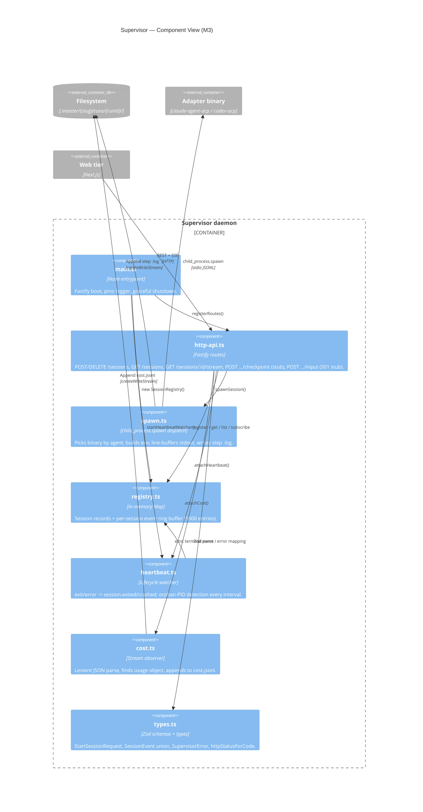
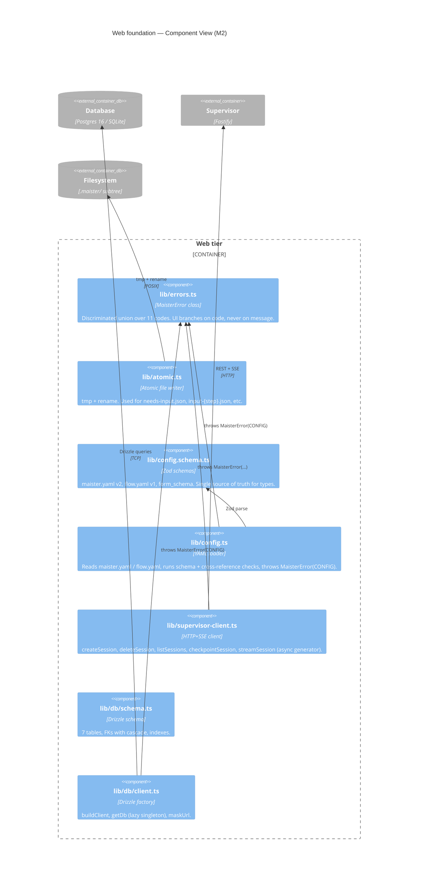
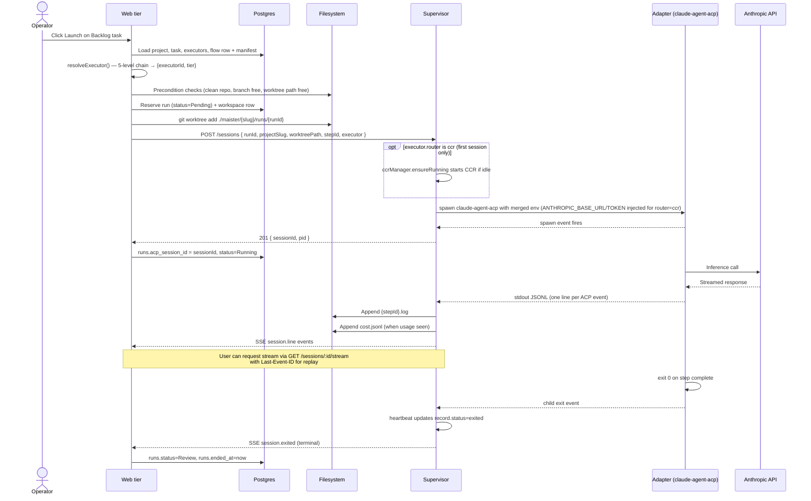
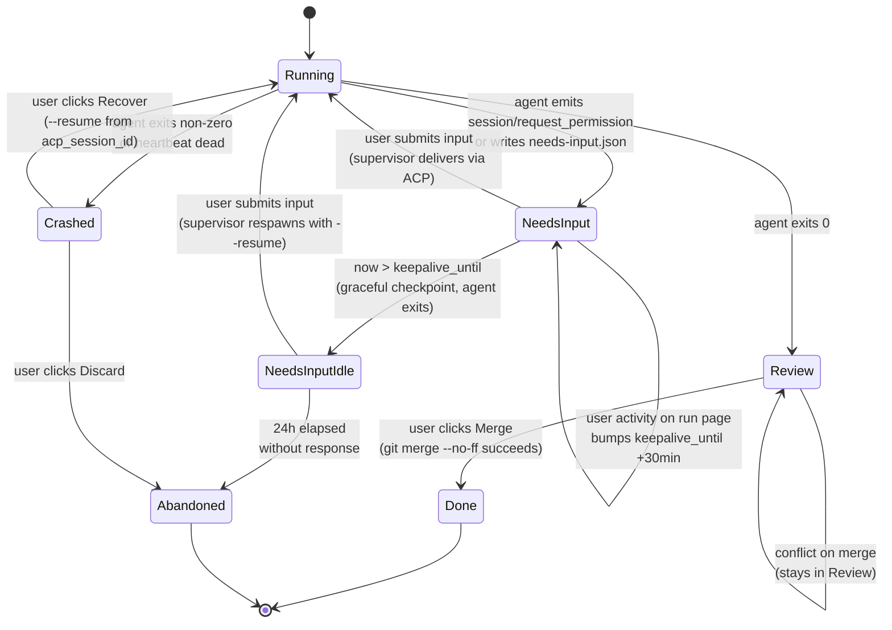
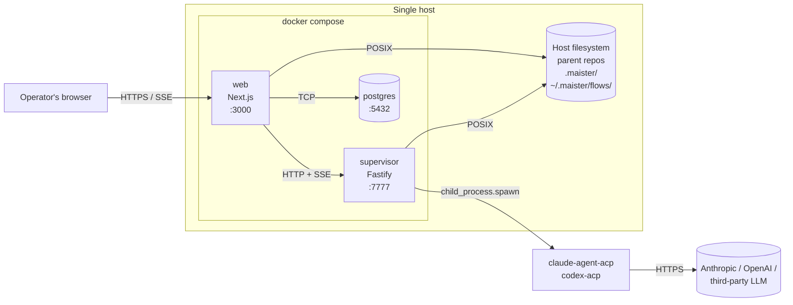

# Architecture

> Read [`VISION.md`](VISION.md) for the product spine and
> [`decisions.md`](decisions.md) for the why behind every locked
> choice. This file is the **how**: C4 diagrams, components, and
> their contracts.

Implementation status legend: **(Implemented Mx)** in `main` at
milestone Mx · **(Designed Mx)** locked, not yet coded · **(Phase 2)**
out of POC scope.

Current state: **M3** — supervisor daemon + foundation libs in `web/`.
No Next.js Route Handlers yet (web routes are template stubs).

## C4 Context — system and its world

The control plane MAIster runs on a single host, talks to a relational
database, spawns coding-agent CLIs as subprocesses, and routes their
LLM calls to one of several providers.

**Personas.**

- **Operator** — primary persona. One human running several projects.
  No teammates, no auth, no RBAC on POC.
- *(Phase 2)* Small-team member — receives HITL items via the same UI.

**External systems.**

- **Anthropic API** — default LLM. Reached by `claude-agent-acp` over
  HTTPS using `ANTHROPIC_API_KEY` (or `ANTHROPIC_AUTH_TOKEN` when
  routed).
- **OpenAI Codex API** — backing for the codex executor, reached by
  `codex-acp`.
- **Third-party LLM provider** — any Anthropic-API-compatible endpoint
  (z.ai GLM, OpenRouter, anyscale) configured per-executor via
  `executor.env` (env-router) or via CCR.
- **Git host** — GitHub or self-hosted. Read-only for Flow plugin
  install. Push semantics for merged branches are operator-controlled.
- **Host filesystem** — parent repos at `executors[].repo_path`,
  per-run worktrees at `.maister/<slug>/runs/<run-id>/`, system Flow
  cache at `~/.maister/flows/<id>@<tag>/`.

## C4 Container — deployable units

MAIster ships as two long-running Node processes plus a Postgres
instance. The supervisor MAY run on a different host than the web tier
(only HTTP+SSE between them).

**Containers.**

| Container | Status | Tech | Purpose |
| --------- | ------ | ---- | ------- |
| Web tier | Implemented M0 (scaffold) | Next.js 16 + React 19 + HeroUI v3 + Tailwind 4 | UI, Route Handlers, server actions, Drizzle access. SSE bridge to supervisor. |
| Supervisor daemon | Implemented M3 | Node 24 + Fastify + pino + Zod | Owns ACP sessions, spawns adapters, heartbeat watcher, cost accounting. |
| Database | Implemented M2 | Postgres 16 (SQLite dev) | All persistent state for projects, executors, flows, tasks, runs, workspaces, HITL. |
| `claude-agent-acp` | Implemented M3 (spawn-only) | `@agentclientprotocol/claude-agent-acp@0.37.0` | ACP adapter wrapping Claude Agent SDK. One process per session. |
| `codex-acp` | Implemented M3 (spawn-only) | `@agentclientprotocol/codex-acp@0.0.44` | ACP adapter bundling Codex. One process per session. |
| CCR daemon | Implemented M6 | `@musistudio/claude-code-router@2.0.0` (MIT) | Multi-provider Anthropic-API-compatible proxy. Supervisor-owned: lazy `ensureRunning()` on first `router=ccr` spawn, graceful shutdown on supervisor SIGTERM/SIGINT, exactly one daemon per supervisor process. Host+port read from `~/.claude-code-router/config.json`. |

**Inter-container contracts.**

- **Web ↔ Supervisor** — HTTP + SSE.
  Contract: [`api/supervisor.openapi.yaml`](api/supervisor.openapi.yaml) (REST routes)
  + [`api/async/supervisor-sse.asyncapi.yaml`](api/async/supervisor-sse.asyncapi.yaml) (SSE event stream).
  Client: `web/lib/supervisor-client.ts`.
- **Web ↔ Database** — Drizzle ORM over `postgres` driver.
  Contract: [`database-schema.md`](database-schema.md) + [`db/erd.md`](db/erd.md).
- **Supervisor ↔ Adapter** — stdio JSONL (Adapter binary speaks ACP
  on stdin/stdout). One child per session, spawned with
  `cwd = worktreePath` and merged env. M3 ships opaque JSONL
  passthrough; structured ACP `session/update` parsing lands in M7.

## C4 Component — Supervisor (Implemented M3)

The supervisor is the only fully-implemented container at M3. Its
internal structure:

**Component table — Supervisor.**

| Name | File | Purpose | Responsibilities | Dependencies |
| ---- | ---- | ------- | ---------------- | ------------ |
| `main` | `supervisor/src/main.ts` | Process entrypoint. | Read env, build Fastify + pino, wire components, listen, graceful shutdown. | `http-api`, `registry`, `heartbeat`. |
| `http-api` | `supervisor/src/http-api.ts` | HTTP surface. | 6 routes, Zod request validation, SSE pipe with `Last-Event-ID` replay from ring buffer, error handler maps `SupervisorError`/`ZodError` to status. | `spawn`, `registry`, `heartbeat`, `cost`, `types`. |
| `spawn` | `supervisor/src/spawn.ts` | Process launcher. | Pick binary by `executor.agent`, append `--resume <id>` when present, merge env, line-buffer stdout, write `<stepId>.log`, emit `session.line` events. When `executor.router === "ccr"`, await `ccr-manager.ensureRunning()` and inject `ANTHROPIC_BASE_URL` + `ANTHROPIC_AUTH_TOKEN` into childEnv beneath the explicit `executor.env` overlay. | `registry` (channel constant), `ccr-manager`, `types`. |
| `ccr-manager` | `supervisor/src/ccr-manager.ts` | CCR daemon lifecycle controller. **Implemented M6.** | Singleton state machine (`idle | starting | ready | failed | stopping`). Lazy-start the bundled CCR proxy on demand. Parse host+port from `~/.claude-code-router/config.json` (defaults `127.0.0.1:3456`). Exponential-backoff `GET /` health check ≤10 s. Graceful shutdown on SIGTERM/SIGINT via existing `main.ts` handler. | `node:child_process`, `node:fs/promises`, `types`. |
| `registry` | `supervisor/src/registry.ts` | In-memory session table. | Register, get, list, subscribe, snapshotEvents (1000-entry ring), markIntentionalShutdown. | `types`. |
| `heartbeat` | `supervisor/src/heartbeat.ts` | Lifecycle watcher. | exit/error → `session.exited`/`session.crashed`, orphan-PID polling via `process.kill(pid, 0)`. | `registry`, `types`. |
| `cost` | `supervisor/src/cost.ts` | Cost accounting. | Lenient JSON parse on every line, traverse for `usage` (depth ≤ 8), append record to `cost.jsonl`. | `registry` (channel constant). |
| `types` | `supervisor/src/types.ts` | Schemas + error. | Zod request/event schemas, `SessionEvent` union, `SupervisorError` class, `httpStatusForCode()`. | `zod`. |

## C4 Component — Web foundation (Implemented M2)

The web tier's library layer (no Route Handlers yet at M3 — those land
in M4/M5+).

**Component table — Web foundation.**

| Name | File | Purpose | Dependencies |
| ---- | ---- | ------- | ------------ |
| `lib/errors` | `web/lib/errors.ts` | `MaisterError` + `isMaisterError` type guard. | (none) |
| `lib/atomic` | `web/lib/atomic.ts` | `atomicWriteJson(path, data)` — tmp + rename. | `node:fs/promises`, `node:crypto`, `pino`. |
| `lib/config.schema` | `web/lib/config.schema.ts` | Zod schemas for `maister.yaml` v2, `flow.yaml` v1, `form_schema`. | `zod`. |
| `lib/config` | `web/lib/config.ts` | `loadProjectConfig`, `loadFlowManifest`, `validateFormSchemaVersion`. | `lib/config.schema`, `lib/errors`, `yaml`, `pino`. |
| `lib/supervisor-client` | `web/lib/supervisor-client.ts` | `createSession`, `deleteSession`, `listSessions`, `checkpointSession`, `streamSession`. | `lib/errors`, `pino`. |
| `lib/db/schema` | `web/lib/db/schema.ts` | Drizzle table definitions for the 7 tables. | `drizzle-orm/pg-core`. |
| `lib/db/client` | `web/lib/db/client.ts` | Drizzle client factory + lazy singleton. | `drizzle-orm`, `lib/errors`. |

## Component map — Designed but not yet implemented

These components have a locked design (in CLAUDE.md / ADRs) and will be
added as M4+ milestones land. Stubs and naming live in `web/CLAUDE.md`.

| Component | File (planned) | Purpose | Status |
| --------- | -------------- | ------- | ------ |
| `lib/projects` | `web/lib/projects.ts` | Registry CRUD, slug derivation, slug + repo_path uniqueness, recursive `MAISTER_PROJECTS_DIR` discovery, Flow plugin install on register. | Designed M4 |
| `lib/flows` | `web/lib/flows.ts` | Flow plugin loader: `git clone --branch <tag>`, symlink into project subtree, manifest validation. | Designed M5 |
| `lib/executors` | `web/lib/executors.ts` | Pure `resolveExecutor()` 5-level chain (launcher → task → flow override → project default → flow recommended) + `upsertExecutorsFromConfig()` helper (writes `executors` + `flows.executor_override_id` in one transaction). CCR env construction lives in `supervisor/src/spawn.ts`, not here. | Implemented M6 |
| `lib/worktree` | `web/lib/worktree.ts` | `git worktree add/remove/list` wrapper, project-scoped paths. | Designed M6 |
| `lib/scheduler` | `web/lib/scheduler.ts` | Global concurrency cap, Pending queue, auto-promote on slot free. | Designed M6 |
| `lib/reconcile` | `web/lib/reconcile.ts` | Startup reconciliation: `runs` vs `git worktree list` vs supervisor live sessions. | Designed M6 |
| `app/api/projects/route.ts` | Route Handler | Register / archive projects. | Designed M4 |
| `app/api/projects/[slug]/tasks/route.ts` | Route Handler | Create tasks → `Backlog`. | Designed M4 |
| `app/api/runs/route.ts` | Route Handler | Precondition + executor resolution (delegates to `lib/executors:resolveExecutor`, logs `resolvedFromTier`) + worktree add + supervisor `POST /sessions`. | Implemented M5 (M6 extended override chain) |
| `app/api/runs/[id]/stream/route.ts` | Route Handler | SSE bridge tailing the per-step log file. | Designed M7 |
| `app/api/runs/[id]/hitl-response/route.ts` | Route Handler | Atomic write `input-<step-id>.json` → supervisor `POST /sessions/:id/input`. | Designed M7 |
| `app/api/runs/[id]/activity/route.ts` | Route Handler | Bump `keepalive_until` by 30 min while user on the page. | Designed M8 |
| `app/api/runs/[id]/diff/route.ts` | Route Handler | Raw `git diff` rendered in `<pre>`. | Designed M9 |
| `app/api/runs/[id]/merge/route.ts` | Route Handler | `git merge --no-ff`; conflict → abort + Review. | Designed M9 |

## Dependency rules

Enforced informally on POC; CI gate is Phase 2. The current rules:

1. **`web/lib/` is server-only.** Every module in `web/lib/` imports
   `"server-only"` at the top. No Client Component may import from
   `lib/`.
2. **`supervisor/src/` may not import from `web/`.** They are separate
   workspaces; the only contract is the HTTP+SSE wire.
3. **`MaisterError` is thrown at the boundary, not above.** Validate
   user input, external APIs, subprocess exits, file reads. Trust
   internal invariants (no defensive `MaisterError` on impossible
   states).
4. **No `chokidar` / `fs.watch` / polling for state transitions.**
   Live path: supervisor ACP notifications → SSE. Recovery path:
   supervisor heartbeat + reconcile on startup.
5. **`drizzle-orm/pg-core` is the only DB driver shape.** SQLite uses
   the same schema via dialect switch — no parallel SQLite types.
6. **No re-exports of `pino` / `zod` / `yaml`.** Components import from
   the dep directly.

## Data flow — happy path Launch (Designed M6+)

This is the end-to-end flow once M6/M7 land. M3 ships only the
supervisor part of it.

## Data flow — HITL keep-alive + resume (Designed M7/M8)

## Deployment

POC ships as Docker Compose on a single host. The two services
(`web`, `supervisor`) plus Postgres are defined in `compose.yml`, with
dev overrides in `compose.override.yml` and a hardened production
overlay in `compose.production.yml`.

The supervisor MAY run on a different host than the web tier — the
only coupling surface is the HTTP+SSE wire described in
[`api/supervisor.openapi.yaml`](api/supervisor.openapi.yaml). For
multi-host the operator sets `MAISTER_SUPERVISOR_URL` on the web tier
to the supervisor's external address.

## Where to read next

- API contracts: [`api/supervisor.openapi.yaml`](api/supervisor.openapi.yaml),
  [`api/async/supervisor-sse.asyncapi.yaml`](api/async/supervisor-sse.asyncapi.yaml).
- Database: [`db/erd.md`](db/erd.md), [`database-schema.md`](database-schema.md).
- Why each piece is shaped this way: [`decisions.md`](decisions.md).
- Per-domain process flows, state machines, edge cases:
  [`system-analytics/`](system-analytics/).
- Local dev: [`getting-started.md`](getting-started.md).
- Supervisor prose reference: [`supervisor.md`](supervisor.md).
