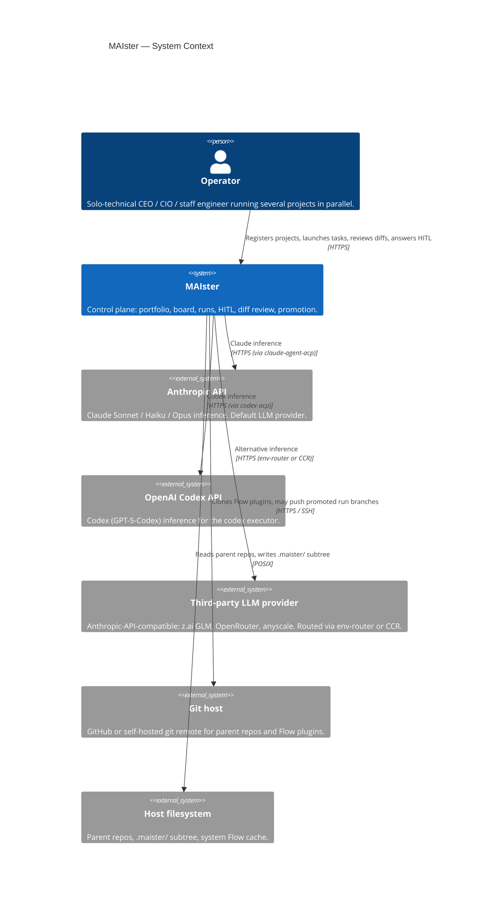
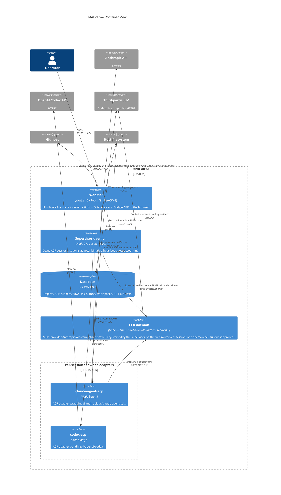
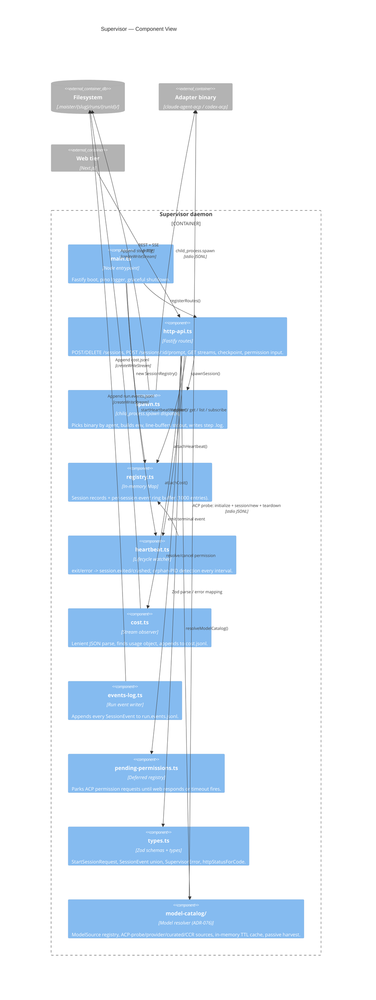
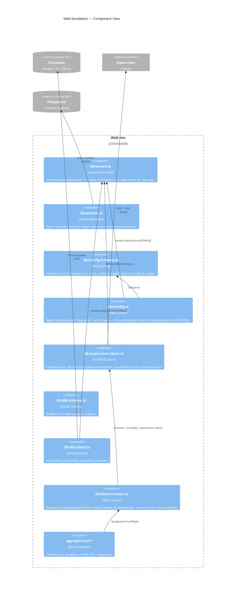
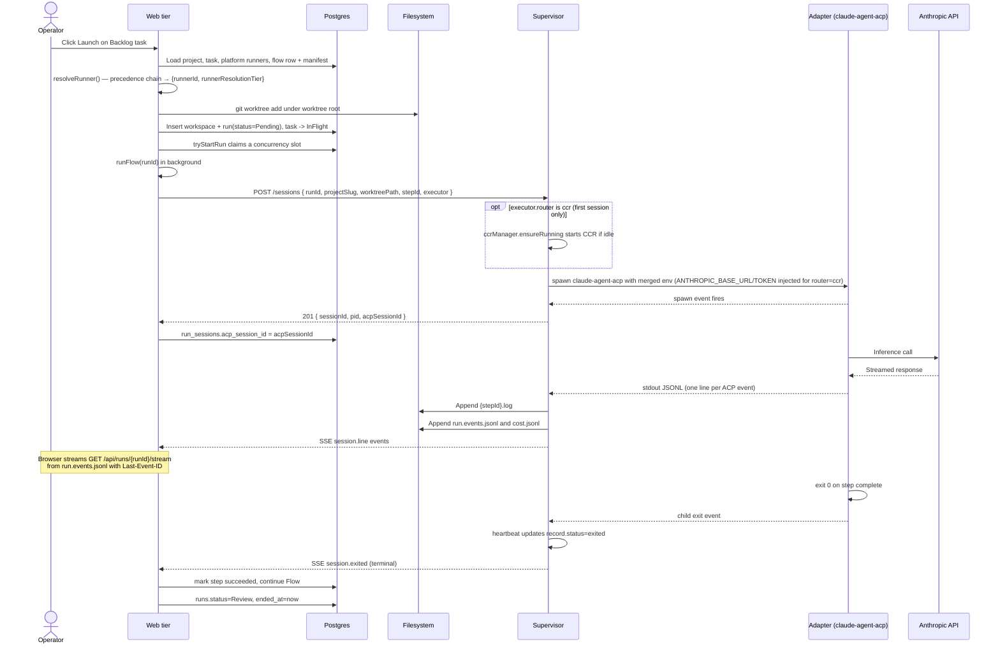
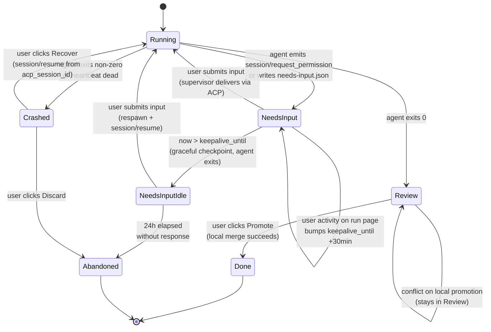
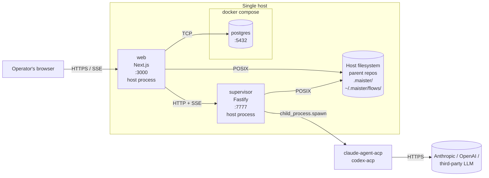

# Architecture

> Read [`VISION.md`](VISION.md) for the product spine and
> [`decisions.md`](decisions.md) for the why behind every locked
> choice. This file is the **how**: C4 diagrams, components, and
> their contracts.

Implementation status legend: **Implemented** present in the current branch ·
**Designed** accepted contract, not yet coded · **Phase 2** later scope.

Current state: web foundation, DB schema, Flow installer/runner, executor
resolution, scheduler, `POST /api/runs`, durable run SSE, HITL response
delivery, project registration, diff/promotion routes, keep-alive
checkpoint/resume, and scratch-run recovery are implemented. GC remains
designed.

## C4 Context — system and its world

The control plane MAIster runs on a single host, talks to a relational
database, spawns coding-agent CLIs as subprocesses, and routes their
LLM calls to one of several providers.

**Personas.**

- **Operator** — primary persona. One human running several projects.
  Credentials auth + global/project RBAC shipped in M9 (`web/lib/authz.ts`);
  still effectively single-operator (no team invites yet).
- *(Phase 2)* Small-team member — receives HITL items via the same UI.

**External systems.**

- **Anthropic API** — default LLM. Reached by `claude-agent-acp` over
  HTTPS using `ANTHROPIC_API_KEY` (or `ANTHROPIC_AUTH_TOKEN` when
  routed).
- **OpenAI Codex API** — backing for the codex executor, reached by
  `codex-acp`.
- **Third-party LLM provider** — any Anthropic-API-compatible endpoint
  (z.ai GLM, OpenRouter, anyscale) configured per-executor via
  `executor.env` (env-router) or via CCR.
- **Git host** — GitHub or self-hosted. Read-only for Flow plugin
  install. Push semantics for promoted run branches are operator-controlled.
- **Host filesystem** — parent repos at `projects.repo_path`,
  per-run worktrees at `.maister/<slug>/runs/<run-id>/`, system Flow
  cache at `~/.maister/flows/<id>@<tag>/`.

## C4 Container — deployable units

MAIster ships as two long-running Node processes plus a Postgres
instance. The supervisor MAY run on a different host than the web tier
(only HTTP+SSE between them).

**Containers.**

| Container | Status | Tech | Purpose |
| --------- | ------ | ---- | ------- |
| Web tier | Implemented | Next.js 16 + React 19 + HeroUI v3 + Tailwind 4 | Route Handlers for run launch, HITL response, and durable run SSE; Drizzle access; Flow runner. |
| Supervisor daemon | Implemented | Node 24 + Fastify + pino + Zod | Owns ACP sessions, spawns adapters, heartbeat watcher, cost accounting, permission deferreds, run event log. |
| Database | Implemented | Postgres 16 (SQLite dev) | Persistent state for projects, ACP runners, router sidecars, flows, tasks, runs, workspaces, step runs, HITL. |
| `claude-agent-acp` | Implemented | `@agentclientprotocol/claude-agent-acp@0.37.0` | ACP adapter wrapping Claude Agent SDK. One process per session. |
| `codex-acp` | Implemented | `@agentclientprotocol/codex-acp@0.0.44` | ACP adapter bundling Codex. One process per session. |
| CCR daemon | Implemented | `@musistudio/claude-code-router@2.0.0` (MIT) | Multi-provider Anthropic-compatible proxy. Supervisor-owned: lazy `ensureRunning()` on first `router=ccr` spawn, graceful shutdown on supervisor SIGTERM/SIGINT, one daemon per supervisor process. |
| MCP facade (`mcp/`) | Implemented | `@maister/mcp` — `@modelcontextprotocol/sdk`, Node | Standalone workspace package exposing external MCP tools as a thin REST client of `/api/v1/ext`, incl. `hitl_inbox`, `hitl_list`, and `hitl_respond` (M17/M39, ADR-055). Streamable-HTTP (default, remote): forwards per-request inbound bearer to the REST layer; no ambient token. stdio (local): reads `MAISTER_PROJECT_TOKEN`, then `MAISTER_ACCESS_TOKEN` as fallback. Zero DB/web coupling. See ADR-047. |

**Inter-container contracts.**

- **Web ↔ Supervisor** — HTTP + SSE.
  Contract: [`api/supervisor.openapi.yaml`](api/supervisor.openapi.yaml) (REST routes)
  + [`api/async/supervisor-sse.asyncapi.yaml`](api/async/supervisor-sse.asyncapi.yaml) (SSE event stream).
  Client: `web/lib/supervisor-client.ts`.
- **Web ↔ Database** — Drizzle ORM over `postgres` driver.
  Contract: [`database-schema.md`](database-schema.md) + [`db/erd.md`](db/erd.md).
- **Supervisor ↔ Adapter** — stdio JSONL (Adapter binary speaks ACP
  on stdin/stdout). One child per session, spawned with
  `cwd = worktreePath` and merged env. The supervisor emits raw
  `session.line`, parsed `session.update`, `session.permission_request`,
  and terminal events.

## C4 Component — Supervisor (Implemented)

The supervisor owns process lifecycle and the ACP boundary:

**Component table — Supervisor.**

| Name | File | Purpose | Responsibilities | Dependencies |
| ---- | ---- | ------- | ---------------- | ------------ |
| `main` | `supervisor/src/main.ts` | Process entrypoint. | Read env, build Fastify + pino, wire components, listen, graceful shutdown. | `http-api`, `registry`, `heartbeat`. |
| `http-api` | `supervisor/src/http-api.ts` | HTTP surface. | Session lifecycle routes, prompt route, permission input route, checkpoint route, SSE pipe with `Last-Event-ID` replay, error mapping. | `spawn`, `registry`, `heartbeat`, `cost`, `pending-permissions`, `types`. |
| `spawn` | `supervisor/src/spawn.ts` | Process launcher. | Pick binary by `executor.agent`, merge env, line-buffer stdout, write `<stepId>.log`, emit `session.line` events. (Resume is NOT a spawn arg — it is the ACP `session/resume` call in `acp-client.ts`; the adapters ignore `--resume` on argv.) When `executor.router === "ccr"`, await `ccr-manager.ensureRunning()` and inject `ANTHROPIC_BASE_URL` + `ANTHROPIC_AUTH_TOKEN` into childEnv beneath the explicit `executor.env` overlay. | `registry` (channel constant), `ccr-manager`, `types`. |
| `ccr-manager` | `supervisor/src/ccr-manager.ts` | CCR daemon lifecycle controller. **Implemented.** | Singleton state machine (`idle | starting | ready | failed | stopping`). Lazy-start the bundled CCR proxy on demand. Parse host+port from `~/.claude-code-router/config.json` (defaults `127.0.0.1:3456`). Exponential-backoff `GET /` health check ≤10 s. Graceful shutdown on SIGTERM/SIGINT via existing `main.ts` handler. | `node:child_process`, `node:fs/promises`, `types`. |
| `registry` | `supervisor/src/registry.ts` | In-memory session table. | Register, get, list, subscribe, snapshotEvents (1000-entry ring), markIntentionalShutdown. | `types`. |
| `heartbeat` | `supervisor/src/heartbeat.ts` | Lifecycle watcher. | exit/error → `session.exited`/`session.crashed`, orphan-PID polling via `process.kill(pid, 0)`. | `registry`, `types`. |
| `cost` | `supervisor/src/cost.ts` | Cost accounting. | Lenient JSON parse on every line, traverse for `usage` (depth ≤ 8), append record to `cost.jsonl`. | `registry` (channel constant). |
| `events-log` | `supervisor/src/events-log.ts` | Durable run events. | Append every `SessionEvent` to `.maister/<slug>/runs/<runId>/run.events.jsonl`. | `node:fs`. |
| `pending-permissions` | `supervisor/src/pending-permissions.ts` | Permission deferreds. | Resolve or cancel ACP `requestPermission` handles by `(sessionId, requestId)`. | `types`. |
| `types` | `supervisor/src/types.ts` | Schemas + error. | Zod request/event schemas, `SessionEvent` union, `SupervisorError` class, `httpStatusForCode()`. | `zod`. |
| `model-catalog` | `supervisor/src/model-catalog/*` | Model discovery resolver (ADR-076). **Implemented.** | `ModelSource` registry keyed by `(adapter, provider.kind, router)`; ACP-probe/provider/curated/CCR sources; in-memory TTL cache; passive harvest. Serves `POST /model-catalog/resolve`; resolves `env:NAME` secrets supervisor-side only, never returns them. | `spawn` (`buildChildEnv`), `runner-provisioner`, `acp-client`, `ccr-manager`, `types`. |

The `model-catalog` resolver (Implemented, ADR-076) is the supervisor's
model-discovery surface: `POST /model-catalog/resolve` fans a runner draft across
pluggable `ModelSource`s and caches the merged result in memory. The web tier
reaches it via `web/lib/supervisor-client.ts` `resolveModelSuggestions()`, proxied
through the admin-gated `POST /api/admin/acp-runners/model-suggestions`. See
[`system-analytics/model-catalog.md`](system-analytics/model-catalog.md).

## C4 Component — Web foundation (Implemented)

The web tier owns persistence, Flow execution, and the browser-facing routes.

**Component table — Web foundation.**

| Name | File | Purpose | Dependencies |
| ---- | ---- | ------- | ------------ |
| `lib/errors` | `web/lib/errors.ts` | `MaisterError` + `isMaisterError` type guard. | (none) |
| `lib/atomic` | `web/lib/atomic.ts` | `atomicWriteJson(path, data)` — tmp + rename. | `node:fs/promises`, `node:crypto`, `pino`. |
| `lib/config.schema` | `web/lib/config.schema.ts` | Zod schemas for `maister.yaml` v2, `flow.yaml` v1, `form_schema`. | `zod`. |
| `lib/config` | `web/lib/config.ts` | `loadProjectConfig`, `loadFlowManifest`, `validateFormSchemaVersion`. | `lib/config.schema`, `lib/errors`, `yaml`, `pino`. |
| `lib/supervisor-client` | `web/lib/supervisor-client.ts` | `createSession`, `sendPrompt`, `deliverPermission`, `cancelPermission`, `deleteSession`, `listSessions`, `checkpointSession`, `streamSession`, `resolveModelSuggestions` (ADR-076). | `lib/errors`, `pino`. |
| `lib/db/schema` | `web/lib/db/schema.ts` | Drizzle table definitions for the 8 tables. | `drizzle-orm/pg-core`. |
| `lib/db/client` | `web/lib/db/client.ts` | Drizzle client factory + lazy singleton. | `drizzle-orm`, `lib/errors`. |
| `lib/flows/runner` | `web/lib/flows/runner.ts` | Flow step execution and resume gate. | `flows/*`, `db/schema`, `scheduler`, `supervisor-client`. |
| `app/api/runs` | `web/app/api/runs/route.ts` | Launch a run from a Backlog task. | `db`, `worktree`, `scheduler`, `flows/runner`. |
| `app/api/runs/[runId]/stream` | `web/app/api/runs/[runId]/stream/route.ts` | Browser-facing durable run SSE. | `db`, `run.events.jsonl`. |
| `app/api/runs/[runId]/hitl/[hitlRequestId]/respond` | Route Handler | HITL response two-phase claim, permission delivery or atomic artifact write, runner wake-up. | `db`, `atomic`, `supervisor-client`, `flows/runner`. |

## Component map — remaining pieces

These components are implemented unless the status column says otherwise:

| Component | File (planned) | Purpose | Status |
| --------- | -------------- | ------- | ------ |
| `app/api/projects/route.ts` | Route Handler | Register projects from a local path or repo source, slug derivation, slug + repo_path uniqueness, Flow plugin install on register, owner membership. | Implemented |
| `lib/flows` | `web/lib/flows.ts` | Flow plugin loader: `git clone --branch <tag>`, symlink into project subtree, manifest validation. | Implemented |
| `lib/acp-runners` | `web/lib/acp-runners/*` | Platform runner catalog, sidecar references, usage checks, Flow remaps, and `resolveRunner()` precedence (launch override → step target → project Flow default → platform Flow default → project default → platform default). | Implemented |
| `lib/worktree` | `web/lib/worktree.ts` | `git worktree add/remove/list` wrapper, project-scoped paths. | Implemented |
| `lib/scheduler` | `web/lib/scheduler.ts` | Global concurrency cap, Pending queue, auto-promote on slot free. | Implemented |
| `app/api/projects/[slug]/tasks/route.ts` | Route Handler | Create tasks → `Backlog`. | Designed |
| `app/api/runs/route.ts` | Route Handler | Precondition + ACP runner resolution (delegates to `lib/acp-runners/resolve`, snapshots runner identity) + worktree add + supervisor `POST /sessions`. | Implemented |
| `app/api/runs/[runId]/stream/route.ts` | Route Handler | SSE bridge tailing `run.events.jsonl`. | Implemented |
| `app/api/runs/[runId]/hitl/[hitlRequestId]/respond/route.ts` | Route Handler | Two-phase HITL response, permission delivery, atomic input artifact, runner wake-up. | Implemented |
| `app/api/runs/[id]/activity/route.ts` | Route Handler | Bump `keepalive_until` by 30 min while user on the page. | Implemented |
| `app/api/runs/[id]/diff/route.ts` | Route Handler | Raw `git diff` rendered in `<pre>`. | Implemented |
| `app/api/runs/[id]/promote/route.ts` | Route Handler | Promote run branch to target branch by implemented `local_merge`; `pull_request` returns `CONFIG` until repository-hosting integration is wired. Local merge conflict → abort + Review/manual resolution. | Implemented |
| `app/api/scratch-runs/[runId]/recover/route.ts` | Route Handler | Recover a crashed scratch session through the stored ACP session id. | Implemented |
| Projector | `web/lib/projector/artifact-projector.ts` | Web-side. Derives event-stream evidence — the tool-call activity log + preview — from the per-run `run.events.jsonl`. Pull-based at runner sync points + startup catch-up. **Never drives run state.** | Implemented |
| ArtifactStore | `web/lib/flows/graph/artifact-store.ts` | Web-side. CRUD + lifecycle (record / supersede / stale / fail) over the `artifact_instances` evidence index. | Implemented |
| MCP facade | `mcp/src/` | Standalone `@maister/mcp` package. Registers external MCP tools (task/run/readiness/gate/HITL/comment/triage/relation operations), each a thin REST client of `/api/v1/ext` (M17/M39, ADR-055). Transport-scoped auth: Streamable-HTTP forwards inbound bearer; stdio reads `MAISTER_PROJECT_TOKEN`, then `MAISTER_ACCESS_TOKEN` as fallback. See ADR-042 and [`configuration.md`](configuration.md#environment-variables-server-tier). | Implemented |
| Cross-project HITL inbox | `web/lib/queries/portfolio.ts` + `app/(app)/page.tsx` | Portfolio-home block listing every pending HITL across visible projects (membership-scoped `getCrossProjectHitlInbox`), absorbing the one-per-project `NeedsYouStrip`; renders the inline response component + a numeric "Needs you (N)" badge. See ADR-057. | Implemented |

## Dependency rules

Enforced by review today; a CI gate is Phase 2. The current rules:

1. **`web/lib/` is server-only.** Every module in `web/lib/` imports
   `"server-only"` at the top. No Client Component may import from
   `lib/`.
2. **`supervisor/src/` may not import from `web/`.** They are separate
   workspaces; the only contract is the HTTP+SSE wire.
3. **`MaisterError` is thrown at the boundary, not above.** Validate
   user input, external APIs, subprocess exits, file reads. Trust
   internal invariants (no defensive `MaisterError` on impossible
   states).
4. **No `chokidar` / `fs.watch` / polling for state transitions.**
   Live path: supervisor ACP notifications → SSE. Recovery path:
   supervisor heartbeat + reconcile on startup.
5. **`drizzle-orm/pg-core` is the only DB driver shape.** SQLite uses
   the same schema via dialect switch — no parallel SQLite types.
6. **No re-exports of `pino` / `zod` / `yaml`.** Components import from
   the dep directly.

## Data flow — Launch to Review (Implemented)

`POST /api/runs` creates the workspace and DB rows. `runFlow()` owns step
execution and moves the run to `Review` on success.

## Data flow — HITL keep-alive + resume (Implemented)

Permission HITL, form/human rows, atomic response artifacts, and runner-owned
resume from `NeedsInput` are implemented. Keep-alive checkpoint to
`NeedsInputIdle` is implemented through the web sweeper and supervisor
checkpoint endpoint.

## Deployment

Current deployment runs `web` and `supervisor` on the host and uses Docker
Compose only for Postgres. `compose.yml` defines the local Postgres service;
`compose.production.yml` is the hardened production overlay.

The supervisor MAY run on a different host than the web tier — the
only coupling surface is the HTTP+SSE wire described in
[`api/supervisor.openapi.yaml`](api/supervisor.openapi.yaml). For
multi-host the operator sets `MAISTER_SUPERVISOR_URL` on the web tier
to the supervisor's external address.

## Where to read next

- API contracts: [`api/supervisor.openapi.yaml`](api/supervisor.openapi.yaml),
  [`api/async/supervisor-sse.asyncapi.yaml`](api/async/supervisor-sse.asyncapi.yaml).
- Database: [`db/erd.md`](db/erd.md), [`database-schema.md`](database-schema.md).
- Why each piece is shaped this way: [`decisions.md`](decisions.md).
- Per-domain process flows, state machines, edge cases:
  [`system-analytics/`](system-analytics/).
- Local dev: [`getting-started.md`](getting-started.md).
- Supervisor prose reference: [`supervisor.md`](supervisor.md).
