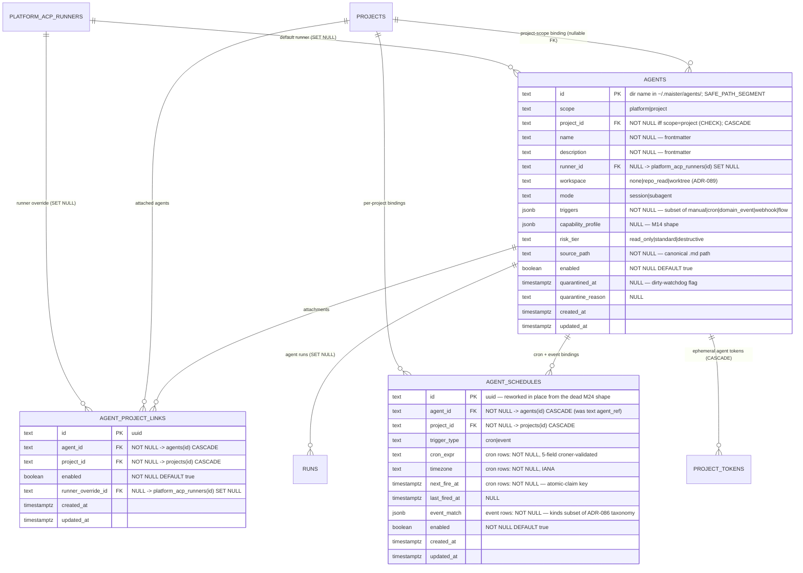

# Platform agents ERD

Tables for the M33 platform-agent substrate (ADR-088/ADR-089): the agent
catalog index, project attachments, trigger bindings, plus the agent-shaped
columns added to `runs`, `tasks`, and `project_tokens`. See
[`../system-analytics/agents.md`](../system-analytics/agents.md) for process
flows and [`../database-schema.md`](../database-schema.md) for the
column-level narrative.

> **Status: Implemented.** Migration `0048_platform_agents.sql` adds `agents` +
> `agent_project_links`, reworks the dead M24 `agent_schedules` shape in
> place, and alters `runs` / `tasks` / `project_tokens`.



Dropped from the M24 shape (zero readers/writers existed): `agent_ref`
(text), `scheduler_job_id` (per-schedule job bridge — replaced by the seeded
singleton `agent_tick.dispatcher`), `desired_state` (`continuous` is the
future Mγ stage).

## Sibling-table alters (same migration)

| Table | Change |
| ----- | ------ |
| `runs` | `run_kind` gains `'agent'`; new `agent_id` (FK `agents` SET NULL), `trigger_source` (`manual\|cron\|domain_event\|webhook\|flow`, NULL), `trigger_event_id` (bigint, NULL), `trigger_payload` (jsonb, NULL). |
| `tasks` | `flow_id` → NULLABLE; new `triage_status` (`'triaged'` \| NULL), `runner_id` (FK SET NULL), `target_branch` (text NULL), `promotion_mode` (`local_merge\|pull_request`, NULL). |
| `project_tokens` | `token_kind` gains `'agent'`; new `agent_id` (FK `agents` CASCADE, NULL; CHECK `token_kind='agent'` ⇔ `agent_id IS NOT NULL`). |

## Keys and constraints

| Table | Constraint | Columns | Purpose |
| ----- | ---------- | ------- | ------- |
| `agents` | `CHECK` | `(scope='project') = (project_id IS NOT NULL)` | Project scope is exactly a project binding. |
| `agent_project_links` | `UNIQUE` | `(agent_id, project_id)` | One attachment per pair. |
| `agent_schedules` | `CHECK` | cron rows: `cron_expr/timezone/next_fire_at NOT NULL`; event rows: `event_match NOT NULL` | Row shape per `trigger_type`. |
| `runs` | partial `UNIQUE` | `(agent_id, trigger_event_id) WHERE trigger_event_id IS NOT NULL` | Outbox→spawn no-dup claim (at-least-once redelivery converges to one run). |
| `project_tokens` | `CHECK` | `(token_kind='agent') = (agent_id IS NOT NULL)` | Agent tokens always carry the agent identity. |

## Indexes

| Table | Index | Columns | Purpose |
| ----- | ----- | ------- | ------- |
| `agents` | `agents_project_idx` | `(project_id)` | Project-scope lookups. |
| `agent_project_links` | `agent_project_links_project_idx` | `(project_id)` | Attached-agents-per-project reads. |
| `agent_schedules` | `agent_schedules_project_agent_idx` | `(project_id, agent_id)` | Binding lookups. |
| `agent_schedules` | `agent_schedules_due_cron_idx` | `(trigger_type, enabled, next_fire_at)` | Due-cron scan on the `agent_tick.dispatcher` tick. |

## Cascade chain

```
agents
  ├── agent_project_links  (FK agent_id,  ON DELETE CASCADE)
  ├── agent_schedules      (FK agent_id,  ON DELETE CASCADE)
  ├── project_tokens       (FK agent_id,  ON DELETE CASCADE — ephemeral agent tokens)
  └── runs.agent_id        (ON DELETE SET NULL — run history survives catalog deletes)

projects
  ├── agents               (FK project_id, ON DELETE CASCADE — project-scope only)
  ├── agent_project_links  (FK project_id, ON DELETE CASCADE)
  └── agent_schedules      (FK project_id, ON DELETE CASCADE)
```

Catalog deletes are usage-guarded at the route layer (refused while live
agent runs exist), so the `runs.agent_id` SET NULL only ever detaches
terminal history.

## Linked artifacts

- Process flows: [`../system-analytics/agents.md`](../system-analytics/agents.md).
- Global ERD: [`erd.md`](erd.md); run columns also in [`runs-domain.md`](runs-domain.md).
- Narrative: [`../database-schema.md`](../database-schema.md).
- Decision records: ADR-088, ADR-089 in [`../decisions.md`](../decisions.md).
- Source (Implemented): `web/lib/db/schema.ts` (migration `0048_platform_agents.sql`).
