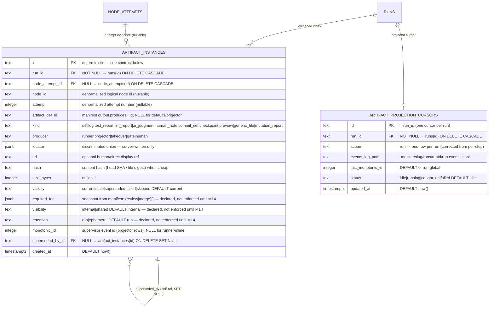

# Artifacts domain ERD

Tables for the typed evidence index and ADR-022 projector cursor introduced by
M12. See [`../system-analytics/artifacts.md`](../system-analytics/artifacts.md)
for behavior and the validity FSM, and
[`../database-schema.md`](../database-schema.md) for the column-level narrative.

> **Status: Implemented (M12).** Migration `0015_m12_artifacts_evidence.sql`
> (additive, forward-only, no down-migration) adds both tables.



## Deterministic-id contract

Every `artifact_instances` row has a deterministic `id` so that re-execution
and projector replay **upsert** idempotently (`onConflictDoUpdate`).

| Origin | PK format | Example |
| ------ | --------- | ------- |
| Runner-inline declared output | `run:<nodeAttemptId>:<artifactDefId>` | `run:na_abc123:impl-diff` |
| Runner-inline default (kind-scoped) | `run:<nodeAttemptId>:default:<kind>` | `run:na_abc123:default:log` |
| Projector-derived | `proj:<runId>:<monotonicId>` | `proj:run_xyz789:42` |
| Gate mutation report, undeclared output (M29) | `run:<nodeAttemptId>:mutation:<gateId>` | `run:na_abc123:mutation:impl-mutation` |

`monotonicId` is **run-global** in the durable `run.events.jsonl` log (see
ADR-038 Phase-0 re-confirmation correction). A single projector `id` is unique
across the entire run's event stream because `monotonicId` is strictly
increasing across the whole file.

## Locator immutability (git refs)

For runner-recorded and takeover-recorded git artifacts (`git-range` diffs,
`git-log` commit sets), `locator.headRef` holds an **immutable 40-char commit
SHA** — resolved with `git rev-parse` (`resolveRefSha`) at record time — never
a mutable branch name (PR2/F3). The payload route renders against the stored
`headRef`, so advancing the branch after recording never changes an old
artifact's payload. A branch-name fallback is used only when git is unavailable
(synthetic-flow test environments with no real repo).

## Cursor scope (corrected)

**Phase-0 re-confirmation correction (ADR-038):** The plan §11.1 assumed a
per-step cursor (`PK = <runId>::<stepId>`). The real supervisor code writes one
`run.events.jsonl` per run with a run-global `monotonicId`. The cursor is
therefore **one row per run**:

- `artifact_projection_cursors.id = runId` (not `runId::stepId`).
- `scope = "run"` (not a stepId string).
- `last_monotonic_id` is run-global — it advances past every event in the
  single file, regardless of which session or step emitted it.

The `UNIQUE (run_id, scope)` constraint allows future per-scope rows (e.g. a
secondary scope for a different projection) without a schema change.

## Cascade chain

```
runs
  ├── artifact_instances      (FK run_id,          ON DELETE CASCADE)
  │     └── artifact_instances.superseded_by_id    (self-ref, ON DELETE SET NULL)
  └── artifact_projection_cursors  (FK run_id,     ON DELETE CASCADE)

node_attempts
  └── artifact_instances      (FK node_attempt_id, ON DELETE CASCADE)
```

Deleting a run drops all its `artifact_instances` and the projection cursor in
one statement. Deleting a `node_attempts` row cascades to its node-attempt-scoped
`artifact_instances` rows (those that referenced it via `node_attempt_id`). The
self-referential `superseded_by_id` is `ON DELETE SET NULL`: deleting a
superseding row leaves the superseded row as-is, with a null `superseded_by_id`
— a history pointer that never blocks deletion.

## Indexes

| Table | Index | Columns | Purpose |
| ----- | ----- | ------- | ------- |
| `artifact_instances` | `artifact_instances_run_idx` | `(run_id)` | Evidence index for a run. |
| `artifact_instances` | `artifact_instances_node_attempt_idx` | `(node_attempt_id)` | All artifacts for a node attempt. |
| `artifact_instances` | `artifact_instances_run_kind_idx` | `(run_id, kind)` | Filter by kind. |
| `artifact_instances` | `artifact_instances_run_validity_idx` | `(run_id, validity)` | Filter by validity (e.g. all stale artifacts for a run). |
| `artifact_projection_cursors` | implicit UNIQUE | `(run_id, scope)` | One cursor row per (run, scope). |

## Linked artifacts

- Process flows: [`../system-analytics/artifacts.md`](../system-analytics/artifacts.md).
- Global ERD: [`erd.md`](erd.md).
- Narrative: [`../database-schema.md`](../database-schema.md).
- Source (Implemented): `web/lib/db/schema.ts` (new tables, migration `0015`).
