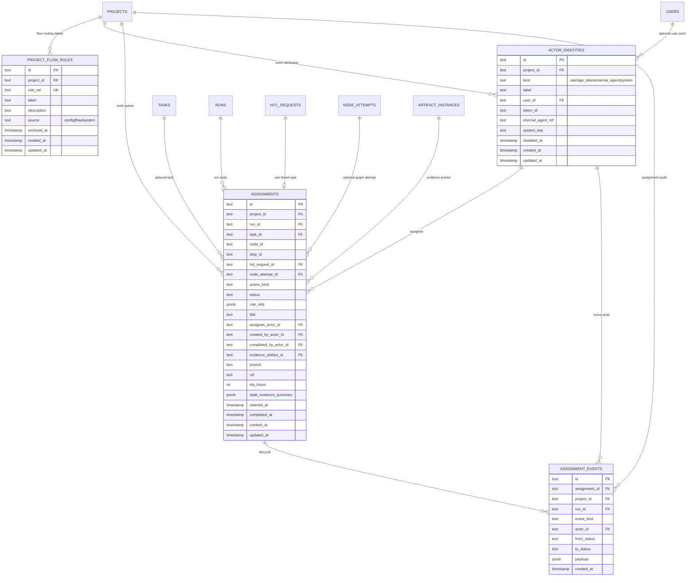

# Assignments Domain

M13 introduces a work-ownership layer over existing HITL and manual takeover
flows. The database tables are implemented in migration `0018`; runtime
assignment creation, claim/release/take-over APIs, board/run-detail surfaces,
and run-detail assignment ledger history are wired for the implemented wait
classes.

Flow roles are routing labels. They do not authorize users. Authorization stays
with `project_members.role` and `requireProjectAction()`.

## Invariants

- `actor_identities` is attribution, not authentication. M13 writes only
  `kind = "user"` from Auth.js-backed API/UI actions. API-token and internal
  actors are schema-supported for future ingress and read-only historical data.
- **(M17 — Implemented, migration `0026`; expanded by migration `0031`.)**
  A partial UNIQUE on `(project_id, token_id) WHERE kind = 'api_token'` gives
  exactly one api-token actor per `(project, token)`, backing the
  `ensureApiTokenActor` upsert that M17's HITL-over-MCP path uses for
  attribution. The `(project_id, user_id)` uniqueness is partial to
  `kind = 'user'`, so user-owned API-token actors can keep owner `user_id`
  attribution without colliding with the owner human actor.
- One `(project_id, role_ref)` row represents a Flow role. Removing the role
  from `maister.yaml` sets `archived_at`; re-adding the same ref reactivates the
  row.
- `assignments.status` never drives scheduler caps. `runs.status` remains the
  lifecycle and concurrency source of truth.
- Assignment lifecycle changes append exactly one `assignment_events` row in
  the same transaction as the implemented state change.
- `hitl_request_id` is UNIQUE when present, so one HITL wait maps to one
  assignment row.

## Indexes

| Table                | Index                                   | Columns                         | Purpose                       |
| -------------------- | --------------------------------------- | ------------------------------- | ----------------------------- |
| `project_flow_roles` | `project_flow_roles_project_key_uq`     | `(project_id, role_ref)` UNIQUE | One role ref per project.     |
| `project_flow_roles` | `project_flow_roles_project_idx`        | `(project_id)`                  | Project registry lookup.      |
| `actor_identities`   | `actor_identities_project_user_uq`      | `(project_id, user_id)` UNIQUE, PARTIAL `WHERE kind='user'` | One human actor per project/user. |
| `actor_identities`   | `actor_identities_project_token_uq`     | `(project_id, token_id)` UNIQUE, PARTIAL `WHERE kind='api_token'` | **(M17 — Implemented, `0026`)** One api-token actor per (project, token). |
| `actor_identities`   | `actor_identities_project_idx`          | `(project_id)`                  | Project actor lookup.         |
| `assignments`        | `assignments_hitl_request_uq`           | `(hitl_request_id)` UNIQUE      | One assignment per HITL wait. |
| `assignments`        | `assignments_project_status_idx`        | `(project_id, status)`          | Project work queue.           |
| `assignments`        | `assignments_run_status_idx`            | `(run_id, status)`              | Run-detail work queue.        |
| `assignments`        | `assignments_current_actor_idx`         | `(assignee_actor_id)`           | Actor-owned work lookup.      |
| `assignments`        | `assignments_hitl_request_idx`          | `(hitl_request_id)`             | HITL lookup.                  |
| `assignment_events`  | `assignment_events_assignment_idx`      | `(assignment_id)`               | Event history.                |
| `assignment_events`  | `assignment_events_project_created_idx` | `(project_id, created_at)`      | Project audit stream.         |

Source: `web/lib/db/schema.ts`.
