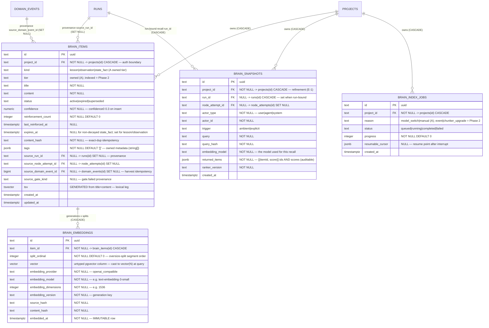

# Project Brain ERD (Sub-project A)

Tables for the Project Brain owned tier (ADR-122, Sub-project A): the knowledge
item store, immutable per-generation embeddings, consumption-time recall
snapshots, and reindex jobs — plus the embedding-provider / enablement columns
added to `platform_runtime_settings`, `projects`, `agent_project_links`, and
`runs`. See [`../system-analytics/project-brain.md`](../system-analytics/project-brain.md)
for process flows and [`../database-schema.md`](../database-schema.md) for the
column-level narrative.

> **Status: Designed** (flips to Implemented at T6.2). Migrations: shared-table
> ALTERs land in the **main** lineage `0088`; `brain_*` CREATEs + `CREATE EXTENSION
> vector` land in the **separate brain lineage** `web/lib/db/brain-migrations/0001`
> (own `_journal.json`, own ledger `__drizzle_brain_migrations`). The brain lineage
> is provisioned only on Postgres (SQLite → Brain disabled, D3).
>
> **Refinement over the design-spec §4 conceptual shape:** `brain_snapshots` carries
> a first-class `project_id` (FK CASCADE, NOT NULL) — required by E-1 ("every
> `brain_*` row MUST carry `project_id`") and to CASCADE actor-only (non-run-bound)
> explicit-recall snapshots on project delete. `brain_embeddings` stays
> project-scoped transitively via `item_id` (per plan T1.3).



## Sibling-table alters (main lineage, migration `0088`)

| Table | Change |
| ----- | ------ |
| `platform_runtime_settings` | += `embedding_base_url` (text, NULL), `embedding_model` (text, NULL), `embedding_dimensions` (integer, NULL), `embedding_api_key_ref` (text, NULL — `env:NAME` ref only), `distill_model` (text, NULL). Singleton row. |
| `projects` | += `brain_enabled` (boolean, NOT NULL DEFAULT false). Enable-gate refuses `CONFIG` unless platform embedding + `distill_model` are set. |
| `agent_project_links` | += `can_read_brain` (boolean, NOT NULL DEFAULT false — gates recall), `can_write_brain` (boolean, NOT NULL DEFAULT false — gates retain, separate write axis). `can_propose_brain` = Sub-project C. |
| `runs` | += `brain_context` (boolean, NULL — null = inherit flow/agent config; the persisted launch-time decision. `runs.runner_snapshot` no longer exists post-M42, so a dedicated column is required). |

## Keys and constraints

| Table | Constraint | Columns | Purpose |
| ----- | ---------- | ------- | ------- |
| `brain_items` | partial `UNIQUE` | `(project_id, source_domain_event_id) WHERE source_domain_event_id IS NOT NULL` | Harvest at-least-once idempotency at the DB (one item per consumed event). |
| `brain_items` | partial `UNIQUE` | `(project_id, content_hash) WHERE status = 'active'` | Exact-dup race guard — collapses a concurrent duplicate to `CONFLICT`. |
| `brain_items` | `CHECK` | `confidence BETWEEN 0 AND 1` | Confidence stays a probability. |
| `brain_embeddings` | (immutable) | — | No UPDATE/DELETE app path except cascade; a re-embed inserts a new generation row. |

## Indexes

| Table | Index | Columns / definition | Purpose |
| ----- | ----- | -------------------- | ------- |
| `brain_items` | `brain_items_tsv_gin` | GIN `(tsv)` | Lexical leg of hybrid recall. |
| `brain_items` | `brain_items_recall_idx` | btree `(project_id, status, expires_at)` | Project-scoped active-item scan + decay sweep. |
| `brain_embeddings` | `brain_embeddings_item_idx` | btree `(item_id, embedding_model, embedding_dimensions)` | Generation lookup + FK. |
| `brain_embeddings` | `brain_embeddings_hnsw_<modelslug>_<N>` | `USING hnsw ((vector::vector(N)) vector_cosine_ops) WHERE embedding_model = M AND embedding_dimensions = N` | **Per-generation expression HNSW** — created by `ensureEmbeddingIndex(model, N)` at configure/reindex time, NOT in the migration. A model/dimension switch adds a new one; old ones persist. |
| `brain_snapshots` | `brain_snapshots_run_idx` | btree `(run_id)` | Run-scoped snapshot reads. |
| `brain_index_jobs` | `brain_index_jobs_claim_idx` | btree `(status, created_at)` | Reindex-worker claim scan. |

## Cascade chain

```
projects
  ├── brain_items          (FK project_id, ON DELETE CASCADE)
  │     └── brain_embeddings (FK item_id,   ON DELETE CASCADE)
  ├── brain_snapshots      (FK project_id, ON DELETE CASCADE)
  └── brain_index_jobs     (FK project_id, ON DELETE CASCADE)

runs
  ├── brain_items.source_run_id      (ON DELETE SET NULL — item survives run delete)
  └── brain_snapshots.run_id         (ON DELETE CASCADE — run-bound snapshot dies with the run)

domain_events
  └── brain_items.source_domain_event_id (ON DELETE SET NULL — item survives event prune)
```

Every `brain_*` FK to `projects` is `ON DELETE CASCADE` — deleting a project removes
its entire Brain by construction (the auth boundary is also the deletion boundary).
Provenance FKs (`source_run_id`, `source_domain_event_id`) are `SET NULL` so a
harvested lesson survives the deletion of the run/event it was distilled from.

## Retention

- **Embeddings are immutable and append-only per generation.** A model or dimension
  switch writes a NEW `embedding_version` generation (a new set of rows + a new
  expression index); old generation rows and their indexes stay intact. Index/row GC
  across dead generations is out of scope for Sub-project A.
- **Items decay.** `lesson`/`observation` carry `expires_at`; the throttled decay
  sweep sets `status='expired'` past `expires_at` (excluded from recall). `state_fact`
  is not decayed — it is superseded on change. Reinforcement pushes `expires_at` out.
- **Snapshots are audit records** — never mutated; pruned only via project/run cascade.

## Linked artifacts

- Process flows: [`../system-analytics/project-brain.md`](../system-analytics/project-brain.md).
- Global ERD: [`erd.md`](erd.md).
- Narrative: [`../database-schema.md`](../database-schema.md).
- Decision record: [ADR-122](../decisions.md#adr-122-project-brain-per-project-memory-substrate).
- Design spec: [`../plans/2026-07-01-project-brain-architecture.md`](../plans/2026-07-01-project-brain-architecture.md) §4.
- Source (Designed): `web/lib/brain/schema.ts`, `web/lib/db/brain-migrations/0001_*.sql`,
  `web/lib/db/migrations/0088_*.sql`, `web/lib/brain/embedding-index.ts`.
