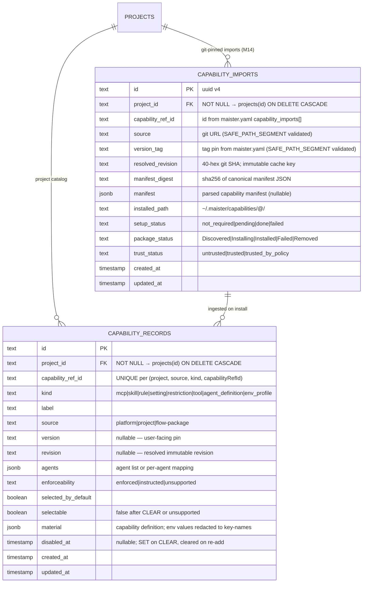

# Capabilities domain ERD

Tables for the capability registry, git-pinned capability imports, and the
per-node-attempt materialization plan introduced by M14. See
[`../system-analytics/capabilities.md`](../system-analytics/capabilities.md)
for behavior and the import lifecycle FSM, and
[`../database-schema.md`](../database-schema.md) for the column-level narrative.

> **Status: Designed (M14, Phase 0 spec).** Migration `0019_m14_capability_materialization`
> (additive, forward-only, no down-migration) adds `capability_imports` and
> `node_attempts.materialization_plan`. `capability_records` is Implemented (migration `0012`).
> See ADR-040, ADR-041, ADR-042 in [`../decisions.md`](../decisions.md).

The diagram below covers three entities:

- **`CAPABILITY_RECORDS`** — the existing project-visible registry catalog
  (Implemented, migration `0012`).
- **`CAPABILITY_IMPORTS`** — the new git-pinned import ledger, one row per
  `(project, capabilityRefId, resolvedRevision)` (Designed, M14).
- **`NODE_ATTEMPTS.materialization_plan`** — the new nullable jsonb column on
  the existing `node_attempts` table that stores the per-node resolved and
  materialized profile snapshot (Designed, M14). The column itself belongs to
  [`runs-domain.md`](runs-domain.md); it is drawn here because its content is
  the capability domain's primary output.



The `node_attempts.materialization_plan` column is not a table and therefore
not drawn in the ERD. Its jsonb shape is described in the narrative below and
in [`../database-schema.md`](../database-schema.md#node_attempts).

## Column notes — `capability_records`

`capability_records` is the **Implemented (migration `0012`)** project-visible catalog. Every
capability that a scratch launch-options panel or a Flow node settings block may
reference exists here. Rows are upserted with SET/CLEAR semantics during project
registration (`upsertCapabilitiesFromConfig`).

- `capability_ref_id` — the stable id used in `maister.yaml` capability arrays
  and in node `settings.mcps[]`, `settings.skills[]`, etc. Unique within
  `(project_id, source, kind)`.
- `kind` — discriminates the record shape. `agent_definition` and `env_profile`
  are **Designed (M14)** kinds ingested from the new `capability_imports[]` and
  the `capabilities.agent_definitions[]` / `capabilities.env_profiles[]` blocks
  in `maister.yaml`. The other kinds are Implemented.
- `material` — the jsonb capability body. Secret values (env-profile credentials,
  MCP server tokens) are **never stored here**; `material` keeps only env-var
  names (keys), never values.
- `selectable` — set to `false` when the CLEAR pass removes an entry; re-enabled
  when re-added. Historic profile snapshots (e.g. `scratch_capability_profiles`)
  retain their snapshot and are not retroactively invalidated.
- `enforceability` — `enforced | instructed | unsupported` for the selected
  executor agent. M14 begins flipping cells from `instructed` to `enforced` as
  native materialization is spike-verified (see ADR-041).

## Column notes — `capability_imports` (Designed, M14)

`capability_imports` mirrors `flow_revisions` (migration `0010`). It is the
durable ledger for each git-pinned capability package fetched from a
`capability_imports[]` entry in `maister.yaml`.

- `capability_ref_id` — the `id` from `maister.yaml capability_imports[].id`.
  Validated against `SAFE_PATH_SEGMENT` (`/^[A-Za-z0-9._-]+$/`, no `.` or `..`)
  at the Zod schema layer AND inside `systemCapabilityCachePath` (defence in
  depth; see ADR-042 and R-PATH).
- `version_tag` — the `version` tag pin from `maister.yaml`. Validated against
  the same `SAFE_PATH_SEGMENT` regex. Passed verbatim to `git clone --branch`.
- `resolved_revision` — the 40-hex commit SHA captured by `gitRevParseHead`
  after the clone. Immutable once recorded. Two-phase install writes the row at
  `package_status='Installing'` with the SHA, then flips to `Installed` or
  `Failed`.
- `manifest_digest` — sha256 of the canonical manifest JSON (for content
  integrity + cache keying).
- `manifest` — the parsed capability manifest (nullable). May be absent for
  imports whose source does not ship a structured manifest.
- `installed_path` — `~/.maister/capabilities/<capabilityRefId>@<sha12>/`.
  The `sha12` is the first 12 hex chars of `resolved_revision`.
- `setup_status` — the two-phase install sub-state:
  - `not_required` — no `setup.sh` in the package.
  - `pending` — `setup.sh` present; not yet run (untrusted, or not yet called).
  - `done` — `setup.sh` completed successfully (AFTER-side marker).
  - `failed` — `setup.sh` ran and failed; retryable (re-POST `/trust` re-runs it).
- `package_status` — the GLOBAL package lifecycle: `Discovered → Installing →
  Installed → Failed → Removed`. An `Installing` row that dies without updating
  is treated as `Failed` on the next startup reconcile.
- `trust_status` — `untrusted | trusted | trusted_by_policy`. The `setup.sh`
  entrypoint is NEVER executed on an `untrusted` source (see ADR-042 and R-TRUST).
  `trusted_by_policy` is granted automatically by `MAISTER_TRUSTED_CAPABILITY_SOURCE_PREFIXES`
  (mirrors `MAISTER_TRUSTED_FLOW_SOURCE_PREFIXES`).

## Unique key and indexes — `capability_imports`

| Constraint / Index | Columns | Purpose |
| ------------------ | ------- | ------- |
| `capability_imports_project_ref_revision_uq` UNIQUE | `(project_id, capability_ref_id, resolved_revision)` | One row per (project, import id, resolved git SHA). Content-addressable: the same SHA from two different tags shares one row. |
| `capability_imports_project_ref_idx` | `(project_id, capability_ref_id)` | Look up all revisions for an import within a project (used by the trust route and the catalog upsert). |
| `capability_imports_package_status_idx` | `(package_status)` | Startup reconcile finds all `Installing` rows to flip `Failed`. |

## `node_attempts.materialization_plan` jsonb (Designed, M14)

This nullable jsonb column on the **existing** `node_attempts` table (Designed,
migration `0019`) records the complete resolved and materialized capability
profile for one node attempt. It is written inside the same DB transaction that
marks the node `Running`. **Write-once / mutable `cleanup` carve-out (ADR-040):**
the profile body (`profileDigest`, `resolvedRevisions`, `materializedFiles`,
`enforcedClasses`, `instructedClasses`, `refusedClasses`) is written once (seeded
with `cleanup.status = 'pending'`). The `cleanup` sub-object is the mutable
exception: it is updated `pending → done → failed` by the cleanup state machine
(normal finish, abandon route, crash reconciler) without re-writing the body. This
preserves the snapshot guarantee while recording cleanup outcomes.

Shape:

```jsonc
{
  "profileDigest":        "<sha256 of canonical resolved profile>",
  "resolvedRevisions": [
    { "refId": "<capability_ref_id>", "kind": "<capability kind>", "sha": "<40-hex git SHA>" }
  ],
  "materializedFiles":    ["<worktree-relative path>", …],
  "enforcedClasses":      ["<capabilityClass>", …],
  "instructedClasses":    ["<capabilityClass>", …],
  "refusedClasses":       ["<capabilityClass>", …],
  "cleanup": {
    "status": "pending|done|failed",
    "error":  "<message if failed, else absent>",
    "at":     "<ISO-8601 timestamp of last status change>"
  }
}
```

- `profileDigest` — deterministic SHA of the resolved profile; stable across
  re-materializations from the same snapshot. Used for long-living session
  consistency checks (AC #5, #9).
- `resolvedRevisions` — snapshot of the `(refId, kind, sha)` tuples that were
  active when this attempt materialized. Subsequent catalog changes do NOT affect
  in-flight runs; re-materialization (e.g. after `NeedsInputIdle` resume) uses
  THIS snapshot rather than a fresh catalog read (AC #10).
- `materializedFiles` — worktree-relative paths of the non-secret config files
  written by the materializer (e.g. `settings.json`, `.mcp.json`, skill dirs).
  Secret values are NEVER listed here; they ride only in `adapterLaunch.env`.
- `enforcedClasses / instructedClasses / refusedClasses` — the per-class verdict
  summary for the run-detail capability view (T6.1). Duplicates `enforcement_snapshot`
  at the profile level for display convenience; `enforcement_snapshot` remains
  the authoritative per-class audit record.
- `cleanup.status` — recoverable cleanup substate. `pending` while the
  materialized dir exists and cleanup has not been attempted; `done` after the
  node-scoped dir is removed; `failed` when removal failed (recorded, surfaced in
  the run-detail panel, swept by the backstop GC). Cleanup failure does NOT crash
  the run once secrets are out of the worktree (see ADR-040 and R-DEFER).

## Cascade chain

```
projects
  └── capability_imports    (FK project_id, ON DELETE CASCADE)

projects
  └── capability_records    (FK project_id, ON DELETE CASCADE)

capability_imports
  └── capability_records    (ingested on install via upsertCapabilitiesFromConfig;
                             capability_records carry no direct FK to
                             capability_imports — they are linked by
                             (project_id, capability_ref_id) and a source tag)

runs
  └── node_attempts         (FK run_id, ON DELETE CASCADE)
        └── materialization_plan  (jsonb column; dropped with the node_attempts row)
```

The `materialization_plan` cleanup substate is reclaimed with the worktree by the
M19 workspace GC (ADR-035/036) as a backstop when the in-flow cleanup seams miss.

## Linked artifacts

- Process flows: [`../system-analytics/capabilities.md`](../system-analytics/capabilities.md).
- Global ERD: [`erd.md`](erd.md).
- Narrative: [`../database-schema.md`](../database-schema.md).
- Config: [`../configuration.md`](../configuration.md) §`capability_imports[]`.
- ADRs: [ADR-040](../decisions.md), [ADR-041](../decisions.md), [ADR-042](../decisions.md).
- Source (Designed, M14): migration `0019_m14_capability_materialization`.
