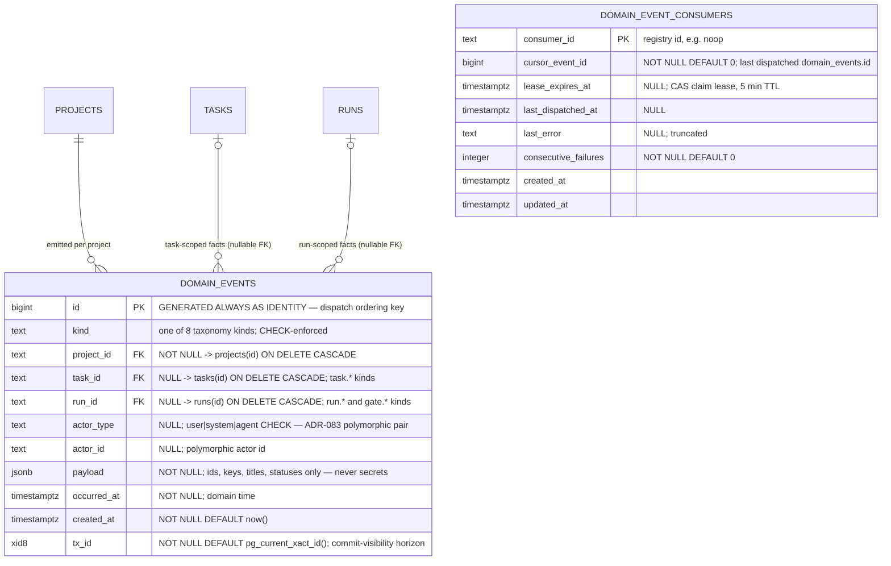

# Domain-event outbox ERD

Tables for the shared domain-event trigger bus introduced by ADR-086.
See [`../system-analytics/domain-events.md`](../system-analytics/domain-events.md)
for the dispatch mechanics, the kind taxonomy, and the consumer contract, and
[`../database-schema.md`](../database-schema.md) for the column-level narrative.

> **Status: Implemented.** Migration `0046_domain_events.sql` (additive,
> forward-only, no down-migration) adds both tables.



`domain_event_consumers` has no FK edges — `consumer_id` keys the code-owned
registry (`DOMAIN_EVENT_CONSUMERS` in `web/lib/domain-events/consumers.ts`),
not a table.

## Keys and constraints

| Table | Constraint | Columns | Purpose |
| ----- | ---------- | ------- | ------- |
| `domain_events` | `CHECK` | `kind` | Taxonomy allow-list (8 kinds, ADR-086). |
| `domain_events` | `CHECK` | `actor_type` | `user \| system \| agent` (NULL allowed). |
| `domain_event_consumers` | `PK` | `consumer_id` | One cursor row per registered consumer. |

## Indexes

No secondary indexes by design: dispatch reads are PK-range scans
(`id > cursor ORDER BY id`), the table is append-only, and events are trigger
material rather than a query surface (the `webhook_events` precedent also
carries no FK indexes). Revisit only when a real consumer needs a
kind-filtered scan.

## Cursor and claim model

- **Failure backoff** — a consumer with `consecutive_failures > 0` is deferred
  (no writes) until `updated_at + min(60s · 2^consecutive_failures, 1h)`;
  `updated_at` carries the failure timestamp for the whole window because the
  deferral never touches the row.
- **Claim** — `UPDATE domain_event_consumers SET lease_expires_at = now() +
  5min WHERE consumer_id = $1 AND (lease_expires_at IS NULL OR
  lease_expires_at < now()) AND consecutive_failures = $preRead RETURNING
  cursor_event_id`. Zero rows ⇒ another dispatcher holds the lease, or it
  recorded a fresh failure after the backoff check ⇒ skip (no double-claim
  under concurrent ticks, no retry inside a freshly opened backoff window).
- **Read window** — `id > cursor_event_id AND tx_id <
  pg_snapshot_xmin(pg_current_snapshot()) ORDER BY id LIMIT 100`. The xid8
  horizon holds back events past the oldest active transaction so a
  late-committing lower `id` can never be skipped.
- **Advance** — CAS fenced on the cursor value read at claim; a zombie
  dispatcher returning after lease reap + reclaim no-ops. At-least-once
  overall; consumers are idempotent.

## Cascade chain

```
projects
  └── domain_events  (FK project_id, ON DELETE CASCADE)

tasks
  └── domain_events  (FK task_id,    ON DELETE CASCADE, nullable)

runs
  └── domain_events  (FK run_id,     ON DELETE CASCADE, nullable)
```

Events are trigger material, not the audit log — `task_activity` (ADR-083) and
the run ledgers keep the durable audit role, so cascade-on-delete is correct
here (matching `webhook_events`).

## Retention

None in this stage: `domain_events` is unbounded append-only (volume ≈ a few
rows per run/task interaction). Pruning lands with the first real consumer and
MUST honor `min(cursor_event_id)` across registered consumers.

## Linked artifacts

- Process flows: [`../system-analytics/domain-events.md`](../system-analytics/domain-events.md).
- Global ERD: [`erd.md`](erd.md).
- Narrative: [`../database-schema.md`](../database-schema.md).
- Decision record: ADR-086 in [`../decisions.md`](../decisions.md).
- Source (Implemented): `web/lib/db/schema.ts` (migration `0046_domain_events.sql`).
