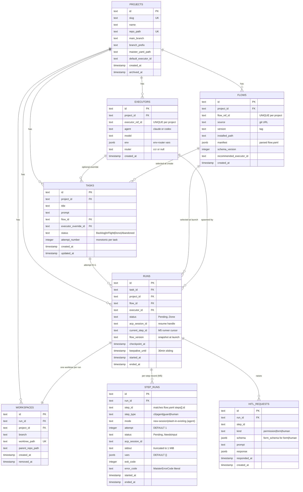

# Full database ERD

All 8 tables in one diagram. For partial views by domain, see
[`projects-domain.md`](projects-domain.md), [`runs-domain.md`](runs-domain.md),
[`hitl-domain.md`](hitl-domain.md).

## Indexes

| Table | Index | Columns | Purpose |
| ----- | ----- | ------- | ------- |
| `tasks` | `tasks_project_status_idx` | `(project_id, status)` | Board queries. |
| `tasks` | `tasks_id_attempt_uq` | `(id, attempt_number)` UNIQUE | Guard against duplicate attempts. |
| `runs` | `runs_project_status_idx` | `(project_id, status)` | Portfolio + per-project queries. |
| `runs` | `runs_task_idx` | `(task_id)` | Latest-attempt lookups. |
| `hitl_requests` | `hitl_requests_run_idx` | `(run_id)` | Pending HITL panel. |
| `projects` | implicit | `slug`, `repo_path` UNIQUE | Registration collisions. |
| `executors` | `executors_project_ref_uq` | `(project_id, executor_ref_id)` UNIQUE | Per-project namespace. |
| `flows` | `flows_project_ref_uq` | `(project_id, flow_ref_id)` UNIQUE | Per-project namespace. |
| `workspaces` | implicit | `worktree_path` UNIQUE | Globally unique worktree path. |

Source: `web/lib/db/schema.ts`.
