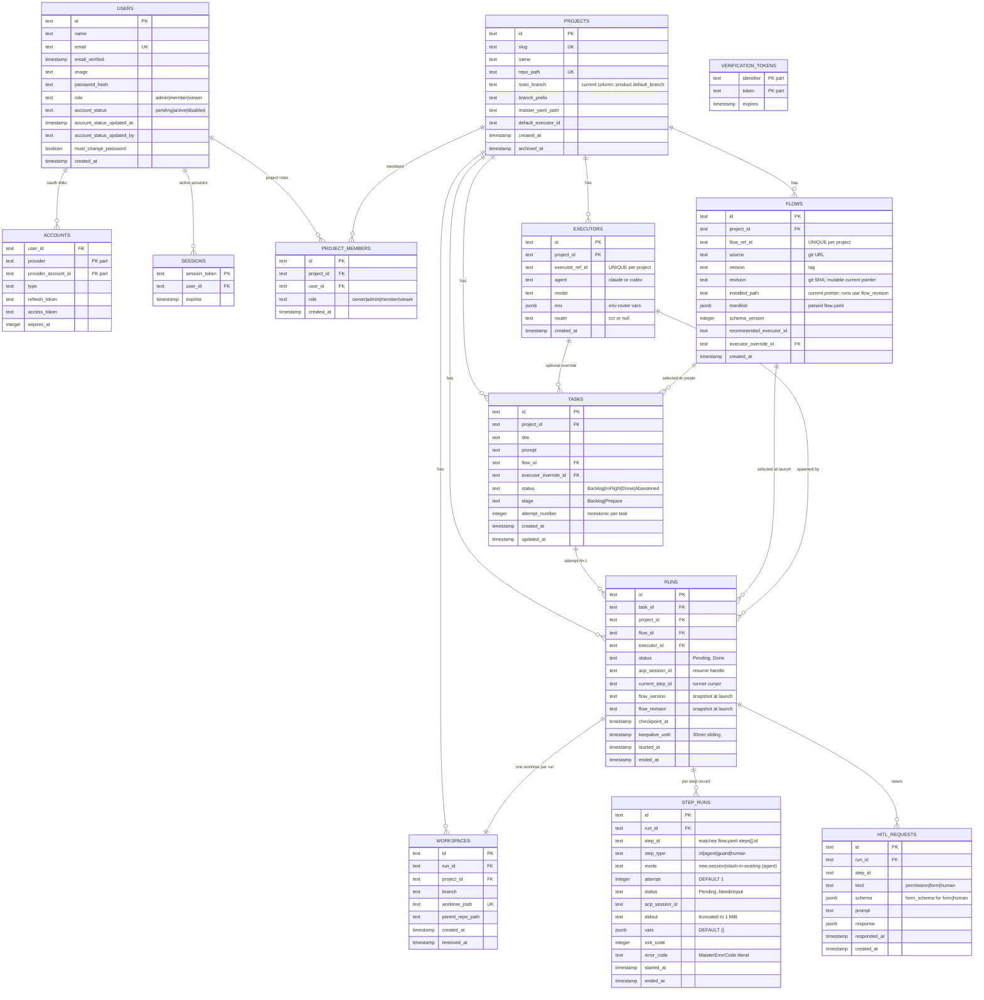

# Full database ERD

All 13 tables in one diagram (M9 added `USERS`, `ACCOUNTS`, `SESSIONS`,
`VERIFICATION_TOKENS`, `PROJECT_MEMBERS`).
For partial views by domain, see
[`projects-domain.md`](projects-domain.md), [`runs-domain.md`](runs-domain.md),
[`hitl-domain.md`](hitl-domain.md).

## Planned roadmap extensions

The current ERD intentionally shows only implemented tables. Roadmap M10-M18
adds additive persistence for Flow package revisions and project enablement,
graph node attempts, artifacts and artifact edges, gate results, assignments,
capability records, API tokens, external operation events, and branch promotion
metadata. See [`../database-schema.md#planned-roadmap-persistence`](../database-schema.md#planned-roadmap-persistence).

## Indexes

| Table | Index | Columns | Purpose |
| ----- | ----- | ------- | ------- |
| `users` | implicit | `email` UNIQUE | Auth lookup by email. |
| `users` | `users_account_status_idx` | `(account_status)` | Admin approval queue and status filtering. |
| `accounts` | implicit PK | `(provider, provider_account_id)` | Auth.js adapter dedup. |
| `sessions` | implicit PK | `session_token` | Session lookup. |
| `verification_tokens` | implicit PK | `(identifier, token)` | Token lookup. |
| `project_members` | `project_members_project_user_uq` | `(project_id, user_id)` UNIQUE | One membership per user/project. |
| `project_members` | `project_members_user_idx` | `(user_id)` | Per-user project listing / authz. |
| `tasks` | `tasks_project_status_idx` | `(project_id, status)` | Board queries. |
| `tasks` | `tasks_id_attempt_uq` | `(id, attempt_number)` UNIQUE | Vacuous today (PK already covers `id`); the designed per-attempt guard is `UNIQUE (task_id, attempt_number)` on `runs`. |
| `runs` | `runs_project_status_idx` | `(project_id, status)` | Portfolio + per-project queries. |
| `runs` | `runs_task_idx` | `(task_id)` | Latest-attempt lookups. |
| `step_runs` | `step_runs_run_idx` | `(run_id)` | Per-run step lookups. |
| `hitl_requests` | `hitl_requests_run_idx` | `(run_id)` | Pending HITL panel. |
| `projects` | implicit | `slug`, `repo_path` UNIQUE | Registration collisions. |
| `executors` | `executors_project_ref_uq` | `(project_id, executor_ref_id)` UNIQUE | Per-project namespace. |
| `flows` | `flows_project_ref_uq` | `(project_id, flow_ref_id)` UNIQUE | Per-project namespace. |
| `workspaces` | implicit | `worktree_path` UNIQUE | Globally unique worktree path. |

Source: `web/lib/db/schema.ts`.
