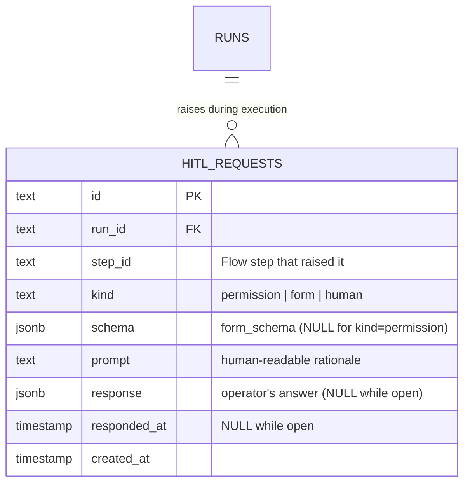
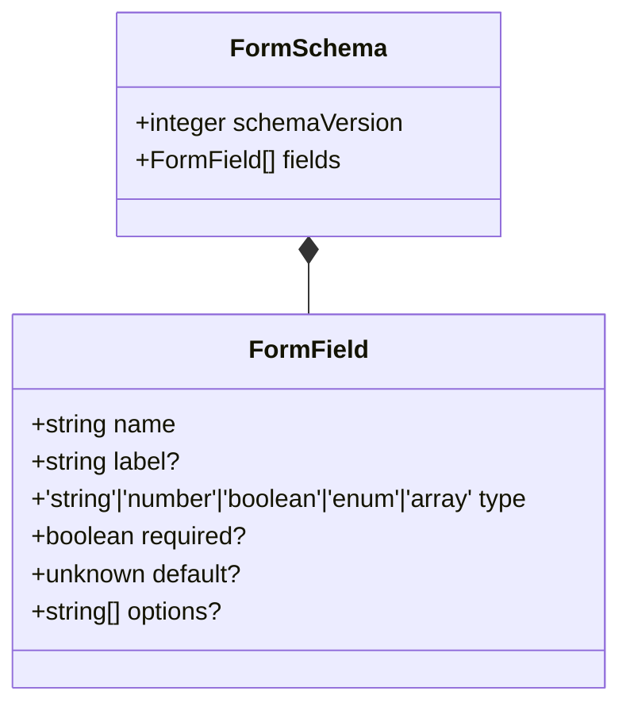

# HITL domain ERD

Single table — `hitl_requests` — plus the in-jsonb shape of the
`schema` (form schema) and `response` payload. See
[`../system-analytics/hitl.md`](../system-analytics/hitl.md) for
process flows.



## In-jsonb shape — `schema` column

Present when `kind` is `form` or `human`. Validated by
`formSchemaSchema` in `web/lib/config.schema.ts`.



The `schemaVersion` integer is mandatory. Mismatched versions throw
`MaisterError("CONFIG")` via `validateFormSchemaVersion`.

## In-jsonb shape — `response` column

Shape varies by kind:

| Kind | Response shape |
| ---- | -------------- |
| `permission` | `{ granted: boolean, comment?: string }` |
| `form` | An object whose keys match `schema.fields[].name`, with the matching `type`. |
| `human` | Either a `form`-shaped object OR `{ rejected: true, comments: string, goto_step: string }` for the loopback path. |

Free-form `additionalProperties` are tolerated (forward-compat).

## Constraints

- `hitl_requests_run_idx` on `(run_id)` — pending HITL panel queries.
- No UNIQUE on `(run_id, step_id)` — one step can raise multiple HITL
  asks over a run's lifetime.

## Lifecycle

```
created (responded_at IS NULL)
  -> responded (responded_at IS NOT NULL, response populated)
  -> expired (run -> Abandoned via HITL_TIMEOUT after 24h)
```

The row is never deleted (cascades from `runs` and `projects` only).

## Linked artifacts

- Process flows: [`../system-analytics/hitl.md`](../system-analytics/hitl.md).
- Config: [`../configuration.md`](../configuration.md) §`form_schema versioning`.
- Source: `web/lib/db/schema.ts` (`hitl_requests` table),
  `web/lib/config.schema.ts` (`formSchemaSchema`),
  `web/lib/config.ts` (`validateFormSchemaVersion`).
