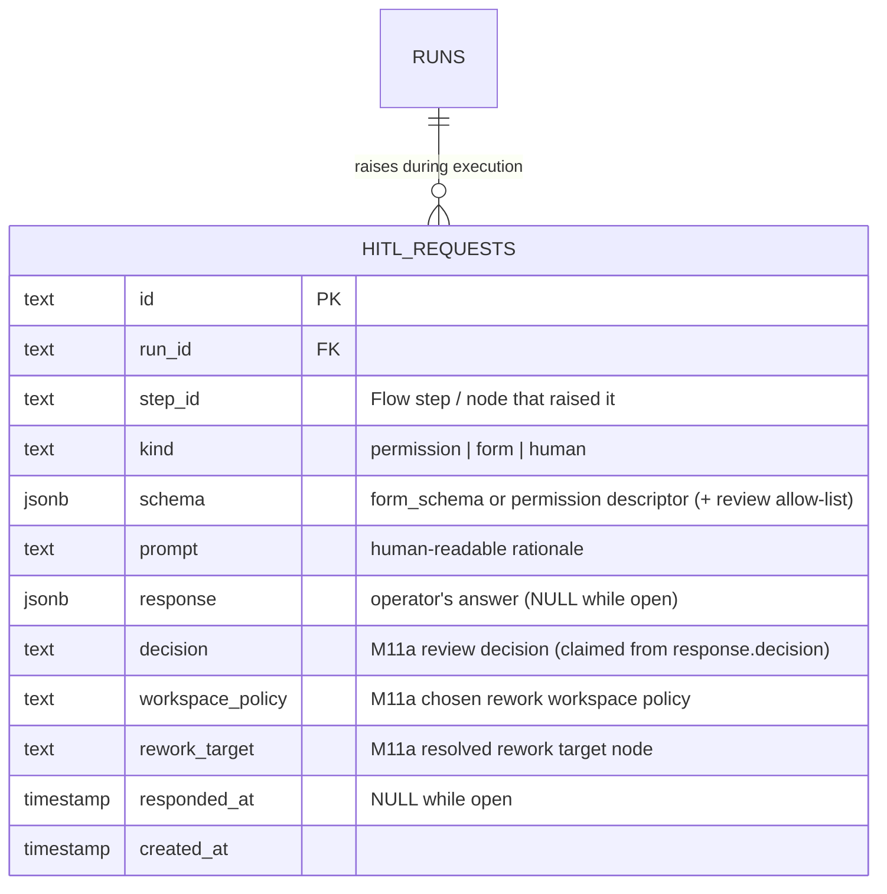
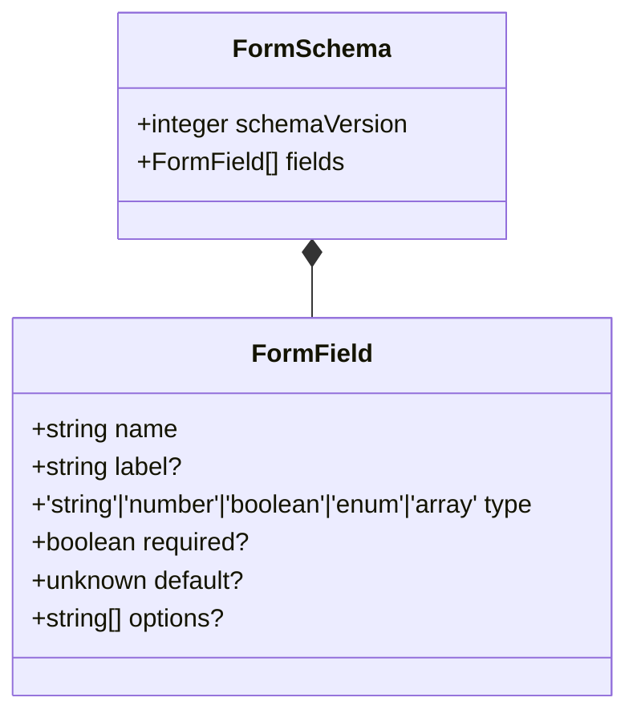

# HITL domain ERD

Single table — `hitl_requests` — plus the in-jsonb shape of the
`schema` (form schema) and `response` payload. See
[`../system-analytics/hitl.md`](../system-analytics/hitl.md) for
process flows.



> **(M11a — Designed, migration `0008`.)** The `decision`, `workspace_policy`,
> and `rework_target` columns are populated only for a graph `human_review`
> HITL. The reviewer's choice rides inside the `response` form payload; the
> respond route validates it against the manifest-derived allow-list stored in
> `schema` at creation and copies the resolved values into these columns at claim
> time. See [`../system-analytics/flow-graph.md`](../system-analytics/flow-graph.md).

## In-jsonb shape — `schema` column

For `kind=form` and `kind=human`, `schema` stores the form schema and
is validated by `formSchemaSchema` in `web/lib/config.schema.ts`. For
`kind=permission`, `schema` stores `{ requestId, options, toolCall,
supervisorSessionId }`.



The `schemaVersion` integer is mandatory. Mismatched versions throw
`MaisterError("CONFIG")` via `validateFormSchemaVersion`.

## In-jsonb shape — `response` column

Shape varies by kind:

| Kind | Response shape |
| ---- | -------------- |
| `permission` | `{ optionId: string }` |
| `form` | An object whose keys match `schema.fields[].name`, with the matching `type`. |
| `human` | Form-shaped object, optionally including review fields such as `{ rejected?: boolean, comments?: string }`. **(M11a — Designed)** a graph `human_review` payload carries `{ decision, comments?, workspacePolicy? }` validated against the row's `schema` allow-list and mirrored into the `decision`/`workspace_policy`/`rework_target` columns. |

Free-form `additionalProperties` are tolerated (forward-compat).

## Constraints

- `hitl_requests_run_idx` on `(run_id)` — pending HITL panel queries.
- No UNIQUE on `(run_id, step_id)` — one step can raise multiple HITL
  asks over a run's lifetime.

## Lifecycle

```
open (response IS NULL, responded_at IS NULL)
  -> claimed (response populated, responded_at IS NULL)
  -> delivered (response populated, responded_at IS NOT NULL)
  -> timed out (permission deferred -> Failed; designed idle timeout -> Abandoned)
```

The row is never deleted (cascades from `runs` and `projects` only).

## Linked artifacts

- Process flows: [`../system-analytics/hitl.md`](../system-analytics/hitl.md).
- Config: [`../configuration.md`](../configuration.md) §`form_schema versioning`.
- Source: `web/lib/db/schema.ts` (`hitl_requests` table),
  `web/lib/config.schema.ts` (`formSchemaSchema`),
  `web/lib/config.ts` (`validateFormSchemaVersion`).
