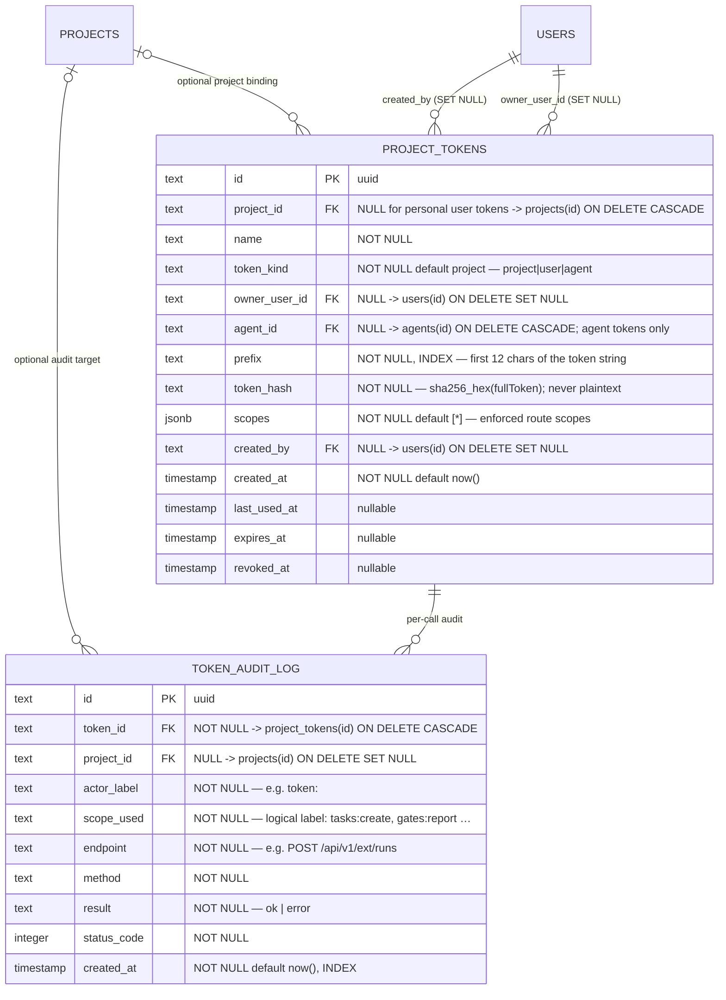

# Integrations domain ERD

Tables for project API tokens and the token audit log introduced by M16.
See [`../system-analytics/external-operations.md`](../system-analytics/external-operations.md)
for the token lifecycle FSM, gate-report flows, and the MCP facade auth model,
and [`../database-schema.md`](../database-schema.md) for the column-level
narrative.

> **Status: Implemented (M16), as of 2026-06-02; expanded by
> `0031_token_actor_scope_support.sql`; global personal tokens Implemented by
> migration `0063`.** Migration `0020_m16_api_tokens.sql` (additive,
> forward-only) adds both tables. ADRs:
> [ADR-046](../decisions.md#adr-041) (token model),
> [ADR-047](../decisions.md#adr-042) (MCP facade).



## Cascade chain

```
projects
  ├── project_tokens     (nullable FK project_id, ON DELETE CASCADE)
  │     └── token_audit_log  (FK token_id, ON DELETE CASCADE)
  └── token_audit_log    (nullable FK project_id, ON DELETE SET NULL)

users
  ├── project_tokens.created_by      (FK users.id, ON DELETE SET NULL)
  └── project_tokens.owner_user_id   (FK users.id, ON DELETE SET NULL)
```

Deleting a project drops project-bound `project_tokens` and their
`token_audit_log` rows in one statement. Global personal tokens keep
`project_id = NULL` and are not removed by project deletion; they are usable
only through projects the owner can currently access. Direct audit rows keep
their token lineage and set `project_id` to NULL when the target project is
deleted. Deleting a `project_tokens` row cascades to its audit rows.
`created_by` and `owner_user_id` are `SET NULL` on user deletion; verification
fails closed for personal tokens whose owner is absent, inactive, or flagged for
password change.

## Designed migration `0063`

`0063` extends the M16 tables for account-level personal tokens:

- `project_tokens.project_id` becomes nullable while retaining
  `ON DELETE CASCADE`.
- `token_audit_log.project_id` becomes nullable and changes the FK action to
  `ON DELETE SET NULL`.
- New `project_tokens_owner_created_idx` on `(owner_user_id, created_at)`
  supports the `/account` token list.
- `0063` adds the first three check constraints below; existing
  `project_tokens_agent_kind_check` from migration `0049` continues to enforce
  the fourth:
  - `token_kind != 'project' OR project_id IS NOT NULL`
  - `token_kind != 'agent' OR project_id IS NOT NULL`
  - `token_kind != 'user' OR owner_user_id IS NOT NULL`
  - `(token_kind = 'agent') = (agent_id IS NOT NULL)`

Existing rows remain valid; no data backfill is required.

## Indexes

| Table | Index | Columns | Purpose |
| ----- | ----- | ------- | ------- |
| `project_tokens` | `project_tokens_prefix_idx` | `(prefix)` | Fast prefix lookup during token verification. |
| `project_tokens` | `project_tokens_project_idx` | `(project_id)` | List project-bound tokens for a project (token-management UI). |
| `project_tokens` | `project_tokens_owner_idx` | `(owner_user_id)` | Join user-owned tokens to their owner for audit display. |
| `project_tokens` | `project_tokens_owner_created_idx` | `(owner_user_id, created_at)` | List global personal tokens on the account page. |
| `token_audit_log` | `token_audit_token_idx` | `(token_id)` | Per-token audit trail. |
| `token_audit_log` | `token_audit_project_created_idx` | `(project_id, created_at)` | Chronological audit log per project; NULL rows come from global inbox or deleted targets. |

## Linked artifacts

- Process flows: [`../system-analytics/external-operations.md`](../system-analytics/external-operations.md).
- Global ERD: [`erd.md`](erd.md).
- Narrative: [`../database-schema.md`](../database-schema.md)
  (`project_tokens`, `token_audit_log` sections).
- SDD spec: [`../../.ai-factory/specs/feature-user-access-tokens.md`](../../.ai-factory/specs/feature-user-access-tokens.md).
- Source (Implemented): `web/lib/db/schema.ts` (migrations
  `0020_m16_api_tokens.sql`, `0031_token_actor_scope_support.sql`).
- Source targets (Designed): `web/lib/db/migrations/0064_user_access_tokens.sql`,
  `web/lib/db/schema.ts`.
