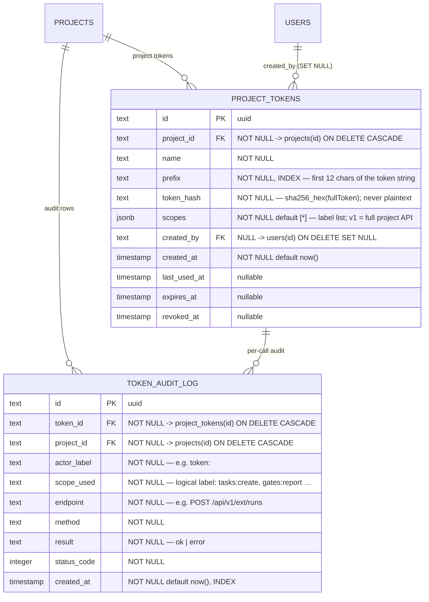

# Integrations domain ERD

Tables for project API tokens and the token audit log introduced by M16.
See [`../system-analytics/external-operations.md`](../system-analytics/external-operations.md)
for the token lifecycle FSM, gate-report flows, and the MCP facade auth model,
and [`../database-schema.md`](../database-schema.md) for the column-level
narrative.

> **Status: Implemented (M16), as of 2026-06-02.** Migration `0018_m16_api_tokens.sql` (additive,
> forward-only) adds both tables. ADRs:
> [ADR-046](../decisions.md#adr-041) (token model),
> [ADR-047](../decisions.md#adr-042) (MCP facade).



## Cascade chain

```
projects
  ├── project_tokens     (FK project_id, ON DELETE CASCADE)
  │     └── token_audit_log  (FK token_id, ON DELETE CASCADE)
  └── token_audit_log    (FK project_id, ON DELETE CASCADE)

users
  └── project_tokens.created_by  (FK users.id, ON DELETE SET NULL)
```

Deleting a project drops all its `project_tokens` and `token_audit_log` rows in
one statement. Deleting a `project_tokens` row cascades to its audit rows.
`created_by` is `SET NULL` on user deletion — token rows survive user removal
for audit integrity.

## Indexes

| Table | Index | Columns | Purpose |
| ----- | ----- | ------- | ------- |
| `project_tokens` | `project_tokens_prefix_idx` | `(prefix)` | Fast prefix lookup during token verification. |
| `project_tokens` | `project_tokens_project_idx` | `(project_id)` | List tokens for a project (token-management UI). |
| `token_audit_log` | `token_audit_token_idx` | `(token_id)` | Per-token audit trail. |
| `token_audit_log` | `token_audit_project_created_idx` | `(project_id, created_at)` | Chronological audit log per project. |

## Linked artifacts

- Process flows: [`../system-analytics/external-operations.md`](../system-analytics/external-operations.md).
- Global ERD: [`erd.md`](erd.md).
- Narrative: [`../database-schema.md`](../database-schema.md)
  (`project_tokens`, `token_audit_log` sections).
- Source (Implemented): `web/lib/db/schema.ts` (migration `0018_m16_api_tokens.sql`).
