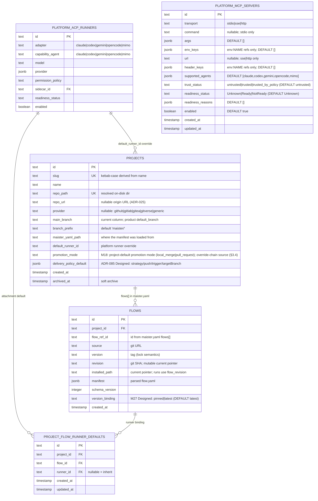

# Projects domain ERD

Tables for project registration and the immediate fanout. See
[`../system-analytics/projects.md`](../system-analytics/projects.md) for
process flows and [`../system-analytics/executors.md`](../system-analytics/executors.md)
and [`../system-analytics/flows.md`](../system-analytics/flows.md) for
each entity's behavior.

> **Note (ADR-064):** `FLOW_GRAPH_LAYOUTS` (M22) was dropped in migration `0030`.
> Authored flow-graph node positions now live in the `flow.yaml` `presentation`
> section, not a DB table.

## Constraints

- `projects.slug` UNIQUE — kebab-case slug derivation collisions
  rejected at register time.
- `projects.repo_path` UNIQUE — one repo, one project. Archived
  projects' `repo_path` stays reserved.
- `flows_project_ref_uq` on `(project_id, flow_ref_id)` — same shape
  as project Flow ids.
- `project_flow_runner_defaults_project_flow_uq` on `(project_id, flow_id)` —
  one project Flow runner binding per attachment.

## Notes

- `projects.repo_url` and `projects.provider` are nullable metadata
  captured at register time ([ADR-025](../decisions.md#adr-025-project-repo-onboarding--url-clone-or-local-path-host-credential-auth-configurable-roots)):
  the clone source / existing `origin`, and the auto-detected host tag.
  `repo_path` is the resolved on-disk dir, not read from `maister.yaml`.
- `projects.default_runner_id` references a platform runner override; null means
  inherit the platform default.
- `projects.delivery_policy_default` **(Designed, ADR-085, migration `0045`)**
  stores the project default `DeliveryPolicy`. Null rows map from the legacy
  `promotion_mode` value, and project settings writes use one aggregate PATCH so
  partial settings updates cannot apply after another sub-section fails.
- `flows.manifest` stores the **parsed** `flow.yaml` — full step DSL,
  portable runner profiles, etc. Source of truth for the runtime step
  loader; the on-disk `flow.yaml` is only read on install / refresh.
- `flows.version_binding` **(Designed, M27)**: `pinned` resolves `flows.enabled_revision_id`; `latest` picks the newest published `flow_revisions` row for the `flow_ref_id`, never a draft.
- Project Flow runner defaults live in `project_flow_runner_defaults`.
- Planned M10 splits immutable Flow package revisions from project Flow
  enablement. Until that lands, `flows` is still the mutable current pointer;
  run safety comes from `runs.flow_revision`.
- `flow_revisions.exec_trust` **(Designed, M27)**: second independent trust axis. `untrusted | trusted`. Gates `runRevisionSetup` (setup.sh) and MCP stdio command spawn. Default `untrusted`; requires an explicit operator flip. Drawn in the narrative; `FLOW_REVISIONS` is not included in this partial ERD.
- `platform_mcp_servers` **(Designed, M27)**: platform-admin-managed MCP server catalog. No FK to other tables in this diagram — secret values are stored only as `env:NAME` references. Mirrors `platform_acp_runners` in admin CRUD surface.
- ADR-084 DB audit: runner adapter/capability-agent columns are SQL `text`
  without CHECK/enum constraints, so adding `gemini`, `opencode`, and `mimo` is a
  TypeScript/schema contract change, not a SQL DDL migration for runner rows.
  Migrations `0044_mcp_supported_agents_all_adapters.sql` and
  `0045_mcp_supported_agents_mimo.sql` change the MCP `supported_agents`
  default for new rows to all five adapter families; `0045` only backfills
  rows that exactly matched the previous all-adapter default.

## Linked artifacts

- Process flows: [`../system-analytics/projects.md`](../system-analytics/projects.md).
- Config: [`../configuration.md`](../configuration.md) §`maister.yaml v2`.
- Source: `web/lib/db/schema.ts`.
