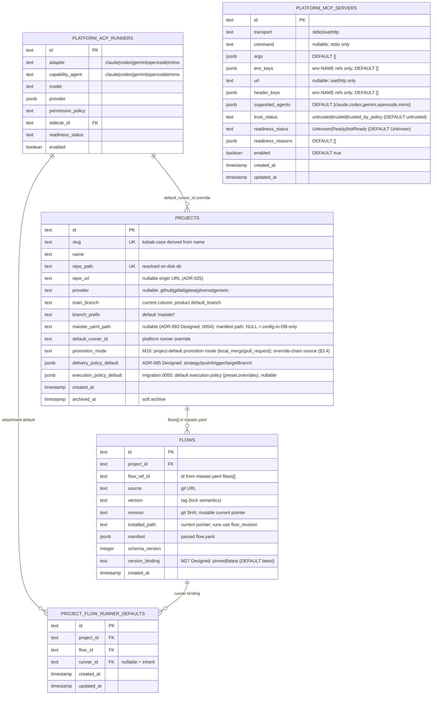
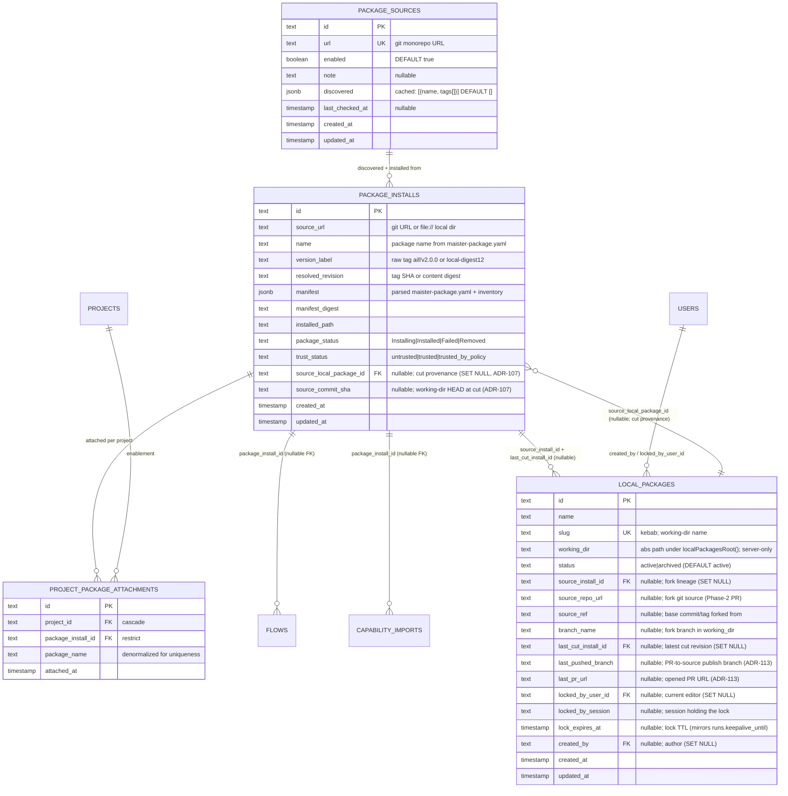

# Projects domain ERD

Tables for project registration and the immediate fanout. See
[`../system-analytics/projects.md`](../system-analytics/projects.md) for
process flows and [`../system-analytics/executors.md`](../system-analytics/executors.md)
and [`../system-analytics/flows.md`](../system-analytics/flows.md) for
each entity's behavior.

> **Note (ADR-064):** `FLOW_GRAPH_LAYOUTS` (M22) was dropped in migration `0030`.
> Authored flow-graph node positions now live in the `flow.yaml` `presentation`
> section, not a DB table.

Package management **(Implemented, ADR-088)** groups several flows + a capability
bundle under one platform-installed package attached per project; member
`flows` / `capability_imports` rows join the group via nullable
`package_install_id` FKs:

Editable **local packages** **(Designed, ADR-096 — Phase C)** add a platform-scoped,
git-backed working directory you author/fork artifacts in and **cut versions** from
(the cut exports the dir cleanly and calls the same installer →
a `local-<digest>` `package_installs` revision, which a project `member` then
attaches). `working_dir` is server-only; the `locked_*`/`lock_expires_at` columns
mirror `runs.keepalive_until` for a session-scoped edit lock; `source_*` +
`branch_name` capture fork lineage for the Phase-2 PR-back.

## Constraints

- `projects.slug` UNIQUE — kebab-case slug derivation collisions
  rejected at register time.
- `projects.repo_path` UNIQUE — one repo, one project. Archived
  projects' `repo_path` stays reserved.
- `flows_project_ref_uq` on `(project_id, flow_ref_id)` — same shape
  as project Flow ids.
- `project_flow_runner_defaults_project_flow_uq` on `(project_id, flow_id)` —
  one project Flow runner binding per attachment.
- **(Implemented, ADR-088)** `package_installs` UNIQUE on
  `(source_url, name, resolved_revision)` — installed package revisions are
  immutable and content-addressed.
- **(Implemented, ADR-088)** `project_package_attachments` UNIQUE on
  `(project_id, package_name)` — at most one attached version of a package per
  project.
- **(Designed, ADR-096)** `local_packages.slug` UNIQUE — platform-scoped
  working-package identity; the working-dir name derives from it. `working_dir`
  is never exposed to the client; `source_install_id` / `last_cut_install_id`
  FKs are `SET NULL` on install delete (lineage is advisory, not load-bearing).
- **(M36, migration `0058`)** `local_packages_default_per_project` — a
  **partial-unique** index on `(project_id) WHERE is_default` enforcing at most
  one default "virtual" local package per project. `project_id` (FK `projects`,
  CASCADE) is **nullable**: NULL for named, platform-scoped local packages; set
  only on the per-project default that element-level forks land in.

## Notes

- `projects.repo_url` and `projects.provider` are nullable metadata
  captured at register time ([ADR-025](../decisions.md#adr-025-project-repo-onboarding--url-clone-or-local-path-host-credential-auth-configurable-roots)):
  the clone source / existing `origin`, and the auto-detected host tag.
  `repo_path` is the resolved on-disk dir, not read from `maister.yaml`.
- `projects.maister_yaml_path` **(Designed, ADR-093, migration `0054`)** is
  **nullable** (drop `NOT NULL`); `NULL` is the "config lives only in the DB"
  signal — the project registered without a `maister.yaml`, repo untouched. No
  backfill, so existing rows keep their path. See
  [`../system-analytics/projects.md`](../system-analytics/projects.md).
- `projects.default_runner_id` references a platform runner override; null means
  inherit the platform default.
- `projects.delivery_policy_default` **(Designed, ADR-085, migration `0047`)**
  stores the project default `DeliveryPolicy`. Null rows map from the legacy
  `promotion_mode` value, and project settings writes use one aggregate PATCH so
  partial settings updates cannot apply after another sub-section fails.
- `projects.execution_policy_default` **(Implemented, migration `0055`)** stores
  the project default execution-control policy (`{preset, overrides?}`). Null
  resolves through launch override → task → project → `supervised`; the resolved
  policy is snapshotted on `runs.execution_policy` at launch.
- `flows.manifest` stores the **parsed** `flow.yaml` — full step DSL,
  portable runner profiles, etc. Source of truth for the runtime step
  loader; the on-disk `flow.yaml` is only read on install / refresh.
- `flows.version_binding` **(Designed, M27)**: `pinned` resolves `flows.enabled_revision_id`; `latest` picks the newest published `flow_revisions` row for the `flow_ref_id`, never a draft.
- Project Flow runner defaults live in `project_flow_runner_defaults`.
- Planned M10 splits immutable Flow package revisions from project Flow
  enablement. Until that lands, `flows` is still the mutable current pointer;
  run safety comes from `runs.flow_revision`.
- `flow_revisions.exec_trust` **(Designed, M27)**: second independent trust axis. `untrusted | trusted`. Gates `runRevisionSetup` (setup.sh) and MCP stdio command spawn. Default `untrusted`; requires an explicit operator flip. Drawn in the narrative; `FLOW_REVISIONS` is not included in this partial ERD.
- `platform_mcp_servers` **(Designed, M27)**: platform-admin-managed MCP server catalog. No FK to other tables in this diagram — secret values are stored only as `env:NAME` references. Mirrors `platform_acp_runners` in admin CRUD surface.
- ADR-084 DB audit: runner adapter/capability-agent columns are SQL `text`
  without CHECK/enum constraints, so adding `gemini`, `opencode`, and `mimo` is a
  TypeScript/schema contract change, not a SQL DDL migration for runner rows.
  Migrations `0044_mcp_supported_agents_all_adapters.sql` and
  `0045_mcp_supported_agents_mimo.sql` change the MCP `supported_agents`
  default for new rows to all five adapter families; `0045` only backfills
  rows that exactly matched the previous all-adapter default.

- **(Implemented, ADR-088)** `flows.package_install_id` and
  `capability_imports.package_install_id` are nullable FKs (`ON DELETE SET
  NULL` is NOT used — group removal happens through the detach transaction;
  the FK exists for grouping/joins). Standalone flows keep the column null.

## Linked artifacts

- Process flows: [`../system-analytics/projects.md`](../system-analytics/projects.md),
  [`../system-analytics/packages.md`](../system-analytics/packages.md) (Implemented, ADR-088).
- Config: [`../configuration.md`](../configuration.md) §`maister.yaml v2`.
- Source: `web/lib/db/schema.ts`.
