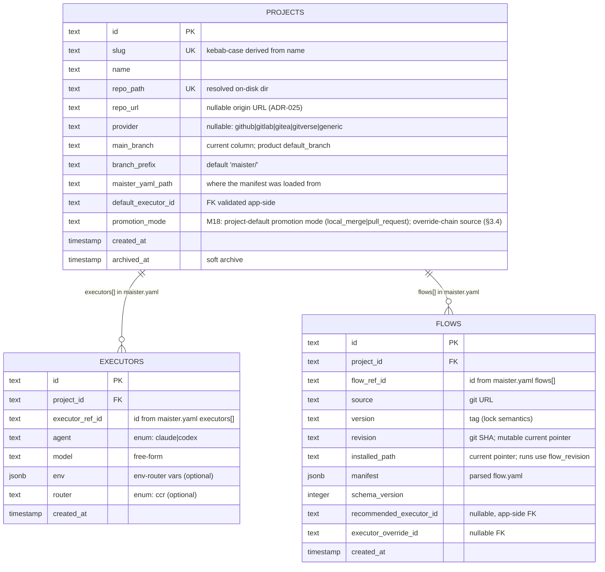

# Projects domain ERD

Tables for project registration and the immediate fanout. See
[`../system-analytics/projects.md`](../system-analytics/projects.md) for
process flows and [`../system-analytics/executors.md`](../system-analytics/executors.md)
and [`../system-analytics/flows.md`](../system-analytics/flows.md) for
each entity's behavior.

## Constraints

- `projects.slug` UNIQUE — kebab-case slug derivation collisions
  rejected at register time.
- `projects.repo_path` UNIQUE — one repo, one project. Archived
  projects' `repo_path` stays reserved.
- `executors_project_ref_uq` on `(project_id, executor_ref_id)` — each
  executor id is unique within its project namespace, never
  cross-project.
- `flows_project_ref_uq` on `(project_id, flow_ref_id)` — same shape
  as executors.

## Notes

- `projects.repo_url` and `projects.provider` are nullable metadata
  captured at register time ([ADR-025](../decisions.md#adr-025-project-repo-onboarding--url-clone-or-local-path-host-credential-auth-configurable-roots)):
  the clone source / existing `origin`, and the auto-detected host tag.
  `repo_path` is the resolved on-disk dir, not read from `maister.yaml`.
- `projects.default_executor_id` is a deferred FK validated at the app
  layer (it references `executors.id` from the same project, which
  doesn't exist yet at INSERT time of `projects`).
- `flows.manifest` stores the **parsed** `flow.yaml` — full step DSL,
  recommended executor, etc. Source of truth for the runtime step
  loader; the on-disk `flow.yaml` is only read on install / refresh.
- `flows.recommended_executor_id` is also app-side FK because the
  manifest's `recommended_executor` references an executor id by ref
  string (not by row id).
- `flows.executor_override_id` stores the per-flow override from
  `maister.yaml flows[].executor_override`.
- Planned M10 splits immutable Flow package revisions from project Flow
  enablement. Until that lands, `flows` is still the mutable current pointer;
  run safety comes from `runs.flow_revision`.

## Linked artifacts

- Process flows: [`../system-analytics/projects.md`](../system-analytics/projects.md).
- Config: [`../configuration.md`](../configuration.md) §`maister.yaml v2`.
- Source: `web/lib/db/schema.ts`.
