# Runs domain ERD

Tables for the execution lifecycle: tasks (board), runs (Flow attempts and
scratch sessions), workspaces (worktrees), scratch dialog metadata, messages,
attachments, and capability snapshots, plus the **ADR-078 (Implemented,
migration `0041`)** social-board tables around tasks (`task_relations`,
`task_comments`, `task_activity`, `task_subscribers`, `inbox_items` — each
also FK-cascading from `projects`, edges omitted here for readability; the
full edge set is in [`erd.md`](erd.md)). See
[`../system-analytics/tasks.md`](../system-analytics/tasks.md),
[`../system-analytics/social-board.md`](../system-analytics/social-board.md),
[`../system-analytics/runs.md`](../system-analytics/runs.md),
[`../system-analytics/workspaces.md`](../system-analytics/workspaces.md), and
[`../system-analytics/scratch-runs.md`](../system-analytics/scratch-runs.md)
for behavior.

```mermaid
erDiagram
    PROJECTS ||--o{ TASKS : "owns"
    PROJECTS ||--o{ RUNS : "owns"
    PROJECTS ||--o{ WORKSPACES : "owns"
    FLOWS ||--o{ TASKS : "selected at create"
    FLOWS ||--o{ RUNS : "selected at launch"
    PLATFORM_ACP_RUNNERS ||--o{ RUNS : "launch runner"
    TASKS ||--o{ RUNS : "1:N retry loop"
    RUNS ||--|| WORKSPACES : "one worktree per run"
    RUNS ||--o{ STEP_RUNS : "per-step record (legacy)"
    RUNS ||--o{ NODE_ATTEMPTS : "per-node attempt (M11a)"
    RUNS ||--o{ GATE_RESULTS : "per-run gates (M11a)"
    NODE_ATTEMPTS ||--o{ GATE_RESULTS : "gate verdicts (M11a)"
    USERS ||--o{ NODE_ATTEMPTS : "takeover owner (M11b, SET NULL)"
    USERS ||--o{ WORKSPACES : "promotion owner (M18, nullable)"
    RUNS ||--o| SCRATCH_RUNS : "scratch metadata"
    TASKS ||--o{ SCRATCH_RUNS : "optional link"
    SCRATCH_RUNS ||--o{ SCRATCH_MESSAGES : "dialog ledger"
    SCRATCH_RUNS ||--o{ SCRATCH_ATTACHMENTS : "run attachments"
    SCRATCH_MESSAGES ||--o{ SCRATCH_ATTACHMENTS : "message attachments"
    SCRATCH_RUNS ||--|| SCRATCH_CAPABILITY_PROFILES : "launch snapshot"
    TASKS ||--o{ TASK_RELATIONS : "from-end (ADR-078)"
    TASKS ||--o{ TASK_RELATIONS : "to-end (ADR-078)"
    TASKS ||--o{ TASK_COMMENTS : "discussion (ADR-078)"
    TASKS ||--o{ TASK_ACTIVITY : "event log (ADR-078)"
    TASKS ||--o{ TASK_SUBSCRIBERS : "subscriber set (ADR-078)"
    TASKS ||--o{ INBOX_ITEMS : "inbox fanout (ADR-078)"

    TASKS {
        text id PK
        text project_id FK
        integer number "ADR-078 Implemented: per-project, UNIQUE (project_id, number)"
        text title
        text prompt
        text flow_id FK
        text status "Backlog|InFlight|Done|Abandoned"
        integer attempt_number "starts at 1"
        timestamp created_at
        timestamp updated_at
    }

    RUNS {
        text id PK
        text run_kind "flow|scratch (DEFAULT flow)"
        text task_id FK "nullable for scratch"
        text project_id FK
        text flow_id FK "nullable for scratch"
        text runner_id FK
        text runner_resolution_tier
        text capability_agent
        jsonb runner_snapshot
        text status "Pending|Running|NeedsInput|NeedsInputIdle|HumanWorking|Review|Crashed|Done|Abandoned|Failed"
        text acp_session_id "resume handle (ACP session/resume)"
        text current_step_id "runner cursor"
        text flow_version "tag snapshot; scratch sentinel"
        text flow_revision "git SHA snapshot; manual sentinel"
        text flow_revision_id FK "nullable for scratch"
        text created_by_user_id FK "nullable launch/audit owner"
        timestamp checkpoint_at "when graceful checkpoint happened"
        timestamp keepalive_until "30min sliding window in NeedsInput"
        timestamp resume_started_at "Recover in-flight marker + reconcile grace anchor (M19)"
        text resume_target_step_id "node id retained at crash time for Recover; current_step_id is nulled on crash (M19, 0016)"
        jsonb resolved_capability_set "M27 Designed: frozen capability snapshot at launch; runner reads this, never live catalog"
        timestamp started_at
        timestamp ended_at
    }

    WORKSPACES {
        text id PK
        text run_id FK
        text project_id FK
        text branch
        text worktree_path UK "globally unique"
        text parent_repo_path
        timestamp created_at
        timestamp removed_at
        timestamp scheduled_removal_at "GC prune deadline (M19)"
        text archived_branch "preserved archive ref name (M19)"
        timestamp archived_at "when archive branch created (M19)"
        text base_branch "M18 0021 run base branch (null pre-M18)"
        text base_commit "M18 0021 base commit forked from (null pre-M18)"
        text target_branch "M18 0021 promotion target branch"
        text promotion_mode "M18 0021 local_merge|pull_request"
        text pr_url "M18 0021 populated on PR-mode promotion"
        integer pr_number "M18 0021"
        timestamp promoted_at "M18 0021"
        text promotion_state "M18 0021 none|claiming|done|failed (NOT NULL DEFAULT none)"
        timestamp promotion_claimed_at "M18 0021 durable-claim timestamp"
        text promotion_owner_user_id FK "M18 0021 users.id, nullable"
        text promotion_attempt_id "M18 0021 per-attempt CAS-identity token"
        text lifecycle_operation_state "M27 0032 none|claiming|failed (NOT NULL DEFAULT none)"
        timestamp lifecycle_operation_claimed_at "M27 0032 durable lifecycle claim timestamp"
        text lifecycle_operation_attempt_id "M27 0032 per-attempt CAS token"
        text lifecycle_operation_name "M27 0032 archive|drop|exportBranch|snapshotCommit|handoffBranch"
    }

    STEP_RUNS {
        text id PK
        text run_id FK
        text step_id "matches flow.yaml steps[].id"
        text step_type "cli|agent|guard|human"
        text mode "new-session|slash-in-existing (agent only)"
        integer attempt "DEFAULT 1"
        text status "Pending|Running|Succeeded|Failed|Skipped|NeedsInput"
        text acp_session_id "set on agent step success"
        text stdout "truncated to 1 MiB"
        jsonb vars "DEFAULT {}"
        integer exit_code
        text error_code "MaisterErrorCode literal"
        timestamp started_at
        timestamp ended_at
    }

    NODE_ATTEMPTS {
        text id PK
        text run_id FK
        text node_id "node id in compiled FlowGraph"
        text node_type "ai_coding|cli|check|judge|human"
        integer attempt "auto-increment per (run,node)"
        text status "Pending|Running|Succeeded|Failed|NeedsInput|Reworked|Stale"
        text decision "human decision on finish"
        text workspace_policy "keep|rewind-to-node-checkpoint|fresh-attempt"
        text checkpoint_ref "M30 0040: node checkpoint ref, rewind base is the checkpoint parent"
        boolean auto_retry "M30 0040: DEFAULT false; true when this attempt is an auto-retry (retry_policy)"
        text session_policy "M30 0040: effective rework session policy snapshot resume|new_session"
        boolean session_fallback "M30 0040: DEFAULT false; true when resume fell back to new_session"
        text rework_from_node "origin node on rework re-entry"
        text owner_user_id FK "M11b 0011 takeover owner (users.id SET NULL)"
        text base_ref "M11b 0011 merge-base SHA for returned range"
        text returned_commits "M11b 0011 raw git log base..branch"
        text returned_diff "M11b 0011 raw git diff base..branch"
        jsonb enforcement_snapshot "M11c 0013 append-only verdict audit"
        jsonb materialization_plan "M14 0019 Implemented: resolved profile snapshot + cleanup substate"
        text acp_session_id
        text stdout "truncated to 1 MiB"
        jsonb vars "DEFAULT {}"
        integer exit_code
        text error_code "MaisterErrorCode literal"
        timestamp started_at
        timestamp ended_at
    }

    GATE_RESULTS {
        text id PK
        text run_id FK
        text node_attempt_id FK
        text gate_id "gate id within the node"
        text kind "command_check|skill_check|ai_judgment|artifact_required|external_check|human_review"
        text mode "blocking|advisory"
        text status "pending|running|passed|failed|stale|skipped|overridden"
        jsonb verdict "verdict|confidence|reasons|recommendedAction"
        jsonb input_artifact_refs "M12 artifact ids"
        text output_artifact_ref "M12 artifact id"
        jsonb stale_from "node ids whose rework stales this"
        text overridden_by "hitl_requests.id of override"
        timestamp created_at
        timestamp ended_at
    }

    SCRATCH_RUNS {
        text run_id PK
        text project_id FK
        text name
        text initial_prompt
        text work_mode "auto|plan_first|manual_approval"
        text reasoning_effort "low|high|extra|ultra"
        text plan_mode "off|plan-first"
        text linked_task_id FK
        text linked_issue_url
        text base_branch
        text base_commit
        text target_branch
        text dialog_status "Starting|WaitingForUser|Running|NeedsInput|Review|Crashed|Done|Abandoned"
        text supervisor_session_id
        text error_code
        text error_message
        jsonb error_metadata
        text created_by_user_id FK
        timestamp last_user_message_at
        timestamp last_agent_message_at
        timestamp created_at
        timestamp updated_at
    }

    SCRATCH_MESSAGES {
        text id PK
        text run_id FK
        integer sequence "UNIQUE per run"
        text role "user|assistant|tool|system"
        text content
        text supervisor_event_id
        timestamp created_at
    }

    SCRATCH_ATTACHMENTS {
        text id PK
        text run_id FK
        text message_id FK
        text kind "issue_url|file_path|text_note|uploaded_file"
        text label
        text value "metadata value or rootless artifact ref"
        text file_name
        text mime_type
        integer byte_size
        text sha256
        text storage_path "server-local path, never public DTO"
        timestamp created_at
    }

    SCRATCH_CAPABILITY_PROFILES {
        text id PK
        text run_id FK
        text profile_digest
        text materialized_path
        jsonb selected_mcp_ids
        jsonb selected_skill_ids
        jsonb selected_rule_ids
        jsonb restrictions
        jsonb adapter_launch
        jsonb downgrade_notes
        timestamp created_at
    }

    TASK_RELATIONS {
        text id PK
        text project_id FK
        text from_task_id FK
        text kind "blocks|depends_on|parent_of"
        text to_task_id FK
        text actor_type "user|agent|system"
        text actor_id "NULL iff actor_type=system"
        timestamp created_at
    }

    TASK_COMMENTS {
        text id PK
        text task_id FK
        text project_id FK
        text actor_type "user|agent|system"
        text actor_id "NULL iff actor_type=system"
        text body "markdown, mentions stored expanded"
        timestamp created_at
    }

    TASK_ACTIVITY {
        text id PK
        text task_id FK
        text project_id FK
        text actor_type "user|agent|system"
        text actor_id "NULL iff actor_type=system"
        text event_kind "task_created|comment_added|task_mentioned|relation_added|relation_removed|run_launched"
        jsonb payload "DEFAULT {}"
        timestamp created_at
    }

    TASK_SUBSCRIBERS {
        text id PK
        text task_id FK
        text subscriber_type "user|agent"
        text subscriber_id
        text reason "creator|commenter|mentioned|manual"
        timestamp created_at
    }

    INBOX_ITEMS {
        text id PK
        text recipient_type "user|agent"
        text recipient_id
        text project_id FK
        text task_id FK
        text event_kind "comment_added|task_mentioned in Stage 1"
        jsonb source_ref "kind, taskId, commentId, activityId"
        timestamp read_at "NULL = unread"
        timestamp created_at
    }
```



> **(M11a — Implemented, migration `0010`.)** `NODE_ATTEMPTS` and `GATE_RESULTS`
> shipped on the `feature/m11a-flow-graph-lifecycle` branch.
> `node_attempts` is append-only (`step_runs` retained for
> legacy reads). See
> [`../system-analytics/flow-graph.md`](../system-analytics/flow-graph.md) and
> [ADR-027](../decisions.md#adr-027-append-only-node_attempts-run-ledger) /
> [ADR-028](../decisions.md#adr-028-full-featured-gate-execution-in-m11a-m15-re-scoped).

> **(M11b — migration `0011`, additive.)** The
> `RUNS.status` enum gains `HumanWorking` (manual takeover claim), and
> `NODE_ATTEMPTS` gains four nullable takeover columns — `owner_user_id`
> (FK → `users.id`, `ON DELETE SET NULL`), `base_ref`, `returned_commits`,
> `returned_diff` — populated ONLY on the takeover attempt of a `human_review`
> node. Raw `git log`/`git diff` text is stored minimally; typed `commit_set`/
> `diff` artifact instances are **M12**. See
> [`../system-analytics/manual-takeover.md`](../system-analytics/manual-takeover.md)
> and [ADR-030](../decisions.md#adr-030-manual-takeover-as-a-local-worktree-handoff-humanworking-status).

> **(ADR-078 — Implemented, migration `0041`.)** `TASKS` gains `number`
> (per-project, backfilled by `(created_at, id)` order); the five social
> tables carry the polymorphic actor pair (`actor_type CHECK IN
> ('user','agent','system')`, `(actor_type = 'system') = (actor_id IS NULL)`,
> no FK to `users`). All five also FK `projects` with cascade (edges in
> [`erd.md`](erd.md)). `task_activity` is written only by the domain layer.
> See [`../system-analytics/social-board.md`](../system-analytics/social-board.md)
> and [ADR-078](../decisions.md#adr-078-social-board-substrate--per-project-task-numbering-typed-relations-polymorphic-actor).

## Constraints

- `tasks_id_attempt_uq` on `(id, attempt_number)` — **vacuous**:
  `tasks.id` is already the PK, so this composite UNIQUE guards
  nothing. Shipped for historical reasons; the designed per-attempt
  uniqueness is `UNIQUE (task_id,
  attempt_number)` on `runs`.
- `tasks_project_status_idx` on `(project_id, status)` — board queries.
- `runs_project_status_idx` on `(project_id, status)` — portfolio
  queries and per-project In-Flight filters.
- `runs_project_status_kind_idx` on
  `(project_id, status, run_kind)` — active workspace queries that include both
  Flow and scratch runs while preserving kind filters.
- `runs_task_idx` on `(task_id)` — latest-attempt lookups (`ORDER
BY started_at DESC LIMIT 1`; designed run-attempt schema switches to
`ORDER BY attempt_number DESC LIMIT 1` once `runs.attempt_number` lands).
- `runs_kind_task_idx` on `(run_kind, task_id)` — board/latest
  attempt queries that explicitly filter `run_kind = 'flow'` and exclude
  scratch rows with nullable `task_id`.
- `scratch_runs_project_status_idx` on `(project_id, dialog_status)` — active
  scratch workspace lists. The primary key on `run_id` covers detail joins.
- `scratch_messages_run_sequence_uq` on `(run_id, sequence)` UNIQUE —
  deterministic dialog replay.
- Attachment indexes on `(run_id)` and `(message_id)` — run and
  message attachment lookups.
- `scratch_capability_profiles.run_id` UNIQUE — run-scoped capability snapshot
  lookup.
- `workspaces.worktree_path` UNIQUE — globally unique across the host.
- `step_runs_run_step_attempt_uq` on `(run_id, step_id, attempt)` —
  one row per (run, step, attempt); guards future per-step retry.
- `step_runs_run_idx` on `(run_id)` — runner's getStepRunsForRun lookups
  to build `FlowContext.steps.<id>.*` for Mustache templating across
  steps.
- **(M11a)** `node_attempts_run_step_attempt_uq` on `(run_id, node_id,
  attempt)` — append-only one row per (run, node, attempt); rework never
  mutates a prior row.
- **(M11a)** `node_attempts_run_idx` on `(run_id)` — templating
  highest-attempt-wins union (`node_attempts` first, `step_runs` fallback).
- **(M11a)** `gate_results_run_idx` on `(run_id)` and
  `gate_results_node_attempt_idx` on `(node_attempt_id)` — per-run and
  per-node-attempt gate lookups.
- **(ADR-078, Implemented)** `tasks_project_number_uq` on `(project_id,
  number)` UNIQUE — numbering backstop; allocation itself is serialized by
  the `projects.next_task_number` row lock.
- **(ADR-078, Implemented)** `task_relations_from_kind_to_uq` on
  `(from_task_id, kind, to_task_id)` UNIQUE + CHECK `from_task_id <>
  to_task_id`; `task_relations_to_task_idx` on `(to_task_id)` for inverse
  lookups.
- **(ADR-078, Implemented)** `task_comments_task_created_idx` on
  `(task_id, created_at)`; `task_activity_task_created_idx` on
  `(task_id, created_at)` + `task_activity_project_created_idx` on
  `(project_id, created_at)`.
- **(ADR-078, Implemented)** `task_subscribers_task_pair_uq` on
  `(task_id, subscriber_type, subscriber_id)` UNIQUE — first subscription
  reason wins.
- **(ADR-078, Implemented)** `inbox_items_recipient_idx` on
  `(recipient_type, recipient_id, read_at, created_at DESC)` — unread badge
  and inbox panel.

## Status enum reference

**Tasks** (board axis):

```
Backlog -> InFlight -> Done
       \-> Abandoned
```

Auto-return: a terminal `Failed | Crashed | Abandoned` *run* sends the
task back to `Backlog`. Only explicit user `Discard` sends a task to
`Abandoned`.

**Runs** (execution axis):

```
Pending -> Running -> Review -> Done (promotion succeeds)
                  \-> NeedsInput <-> NeedsInputIdle -> Abandoned
                  \-> NeedsInput -> HumanWorking -> Running (return, M11b)
                                                \-> NeedsInput (release)
                                                \-> Abandoned (abandon)
                  \-> Crashed -> Running (Recover)
                              \-> Abandoned (Discard)
                  \-> Failed
```

See [`../system-analytics/runs.md`](../system-analytics/runs.md) for the
full state diagram.

**Scratch dialog status** (manual dialog axis):

```
Starting -> WaitingForUser <-> Running -> Review -> Done
                         \-> NeedsInput <-> Running
                         \-> Crashed -> Running (Recover)
                         \-> Abandoned
```

`WaitingForUser` exists only on `scratch_runs.dialog_status`. It maps to
`runs.status = 'Running'` so idle live scratch sessions keep counting against
the shared live-session cap. `NeedsInput` maps to `runs.status = 'NeedsInput'`
only for explicit HITL or permission waits.

## Notes on cardinality

- `RUNS ||--|| WORKSPACES` is one-to-one *at most* — the workspace
  row may be missing while the run is still `Pending` (worktree not
  yet created) or after GC (`workspaces.removed_at IS NOT NULL` and
  the row is purged). Drawn as `||--||` because every active run has
  exactly one workspace.
- `TASKS ||--o{ RUNS` — 1:N attempts. The "latest" run on a card is
  the row with `MAX(started_at)` for the task today; the designed
  run-attempt schema switches to `MAX(runs.attempt_number)` once that
  column lands. Board queries must filter `RUNS.run_kind = 'flow'`; scratch
  runs are not task attempts.
- `RUNS ||--o| SCRATCH_RUNS` — only `run_kind = 'scratch'` rows have scratch
  metadata.
- `RUNS.created_by_user_id` is nullable for legacy rows and records launched-by
  display/audit ownership for new Flow and scratch launches. Scratch v1
  authorization remains project-role based.
- `RUNS.resolved_capability_set` **(Designed, M27)**: frozen at launch by `launchRun`; the runner reads this snapshot, never the live catalog. Shape: `{ flowRevisionId, flowOrigin, capabilities: {refId,kind,sha}[], mcps: {refId,sha,scope}[] }`. An edit or publish during a run must NOT mutate this field.
- `SCRATCH_RUNS ||--o{ SCRATCH_MESSAGES` — append-only dialog ledger with
  monotonic sequence per run.
- `SCRATCH_RUNS ||--|| SCRATCH_CAPABILITY_PROFILES` — exactly one launch-time
  profile snapshot per scratch run.
- Scratch-run v1 stores branch-target metadata on `scratch_runs`: base branch,
  base commit, and target branch.
- `SCRATCH_RUNS.plan_mode` is retained for compatibility and derived from
  `work_mode`: `plan_first` maps to `plan-first`; `auto` and
  `manual_approval` map to `off`.
- `SCRATCH_ATTACHMENTS.storage_path` is server-internal. Public APIs expose
  uploaded-file display metadata and the rootless artifact reference stored in
  `value`, never absolute filesystem roots.
- **(M11a — Designed)** `node_attempts` and `gate_results` are now drawn above
  (migration `0010`). The remaining graph-maturity tables — artifacts, artifact
  edges, assignments, external operation events — are still future work and not
  drawn until their migrations exist.

> **(M14 — Implemented, migration `0019`, additive.)** `NODE_ATTEMPTS` gains
> `materialization_plan` (jsonb, nullable) — the resolved capability profile
> snapshot written once at the time the node transitions to `Running`. The
> column holds `{ profileDigest, resolvedRevisions, materializedFiles,
> enforcedClasses, instructedClasses, refusedClasses, cleanup }`. Write-once
> (mirrors `enforcement_snapshot`); the `cleanup` sub-object carries a
> recoverable `status: pending|done|failed` + optional `error` + `at` timestamp.
> See [`capabilities-domain.md`](capabilities-domain.md) for the full
> jsonb shape and [`../database-schema.md`](../database-schema.md#node_attempts)
> for the narrative. ADR-041 in [`../decisions.md`](../decisions.md).

## Linked artifacts

- Process flows: [`../system-analytics/tasks.md`](../system-analytics/tasks.md),
  [`../system-analytics/runs.md`](../system-analytics/runs.md).
- Capabilities: [`capabilities-domain.md`](capabilities-domain.md).
- Source: `web/lib/db/schema.ts`.
