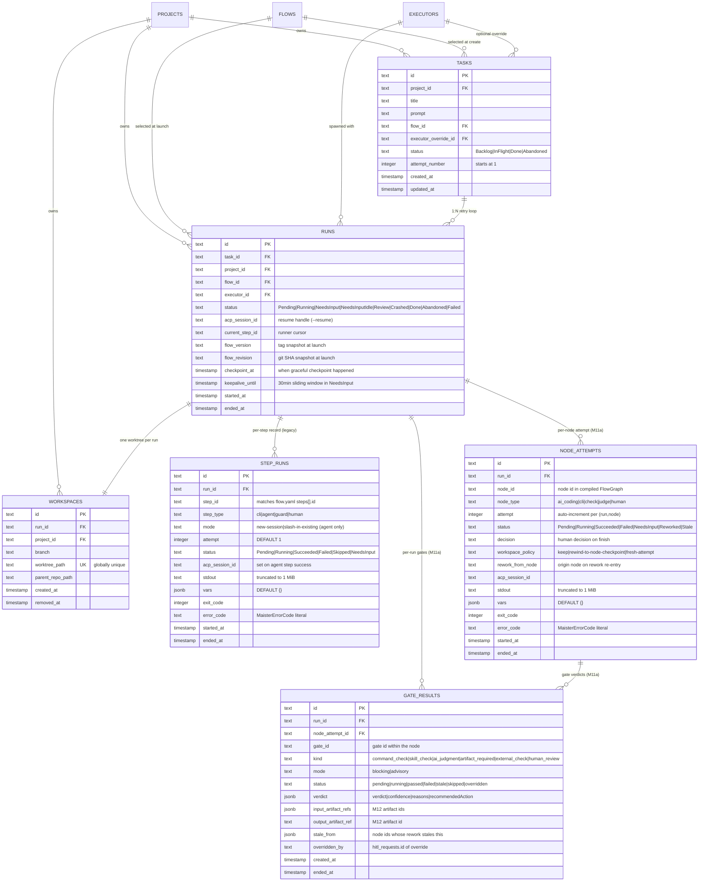

# Runs domain ERD

Tables for the execution lifecycle: tasks (board), runs (attempts),
workspaces (worktrees). See [`../system-analytics/tasks.md`](../system-analytics/tasks.md),
[`../system-analytics/runs.md`](../system-analytics/runs.md), and
[`../system-analytics/workspaces.md`](../system-analytics/workspaces.md)
for behavior.



> **(M11a — Implemented, migration `0010`.)** `NODE_ATTEMPTS` and `GATE_RESULTS`
> shipped on the `feature/m11a-flow-graph-lifecycle` branch.
> `node_attempts` is append-only (`step_runs` retained for
> legacy reads). See
> [`../system-analytics/flow-graph.md`](../system-analytics/flow-graph.md) and
> [ADR-027](../decisions.md#adr-027-append-only-node_attempts-run-ledger) /
> [ADR-028](../decisions.md#adr-028-full-featured-gate-execution-in-m11a-m15-re-scoped).

## Constraints

- `tasks_id_attempt_uq` on `(id, attempt_number)` — **vacuous**:
  `tasks.id` is already the PK, so this composite UNIQUE guards
  nothing. Shipped for historical reasons; the designed per-attempt
  uniqueness is `UNIQUE (task_id,
  attempt_number)` on `runs`.
- `tasks_project_status_idx` on `(project_id, status)` — board queries.
- `runs_project_status_idx` on `(project_id, status)` — portfolio
  queries and per-project In-Flight filters.
- `runs_task_idx` on `(task_id)` — latest-attempt lookups (`ORDER
BY started_at DESC LIMIT 1`; designed run-attempt schema switches to
`ORDER BY attempt_number DESC LIMIT 1` once `runs.attempt_number` lands).
- `workspaces.worktree_path` UNIQUE — globally unique across the host.
- `step_runs_run_step_attempt_uq` on `(run_id, step_id, attempt)` —
  one row per (run, step, attempt); guards future per-step retry.
- `step_runs_run_idx` on `(run_id)` — runner's getStepRunsForRun lookups
  to build `FlowContext.steps.<id>.*` for Mustache templating across
  steps.
- **(M11a)** `node_attempts_run_step_attempt_uq` on `(run_id, node_id,
  attempt)` — append-only one row per (run, node, attempt); rework never
  mutates a prior row.
- **(M11a)** `node_attempts_run_idx` on `(run_id)` — templating
  highest-attempt-wins union (`node_attempts` first, `step_runs` fallback).
- **(M11a)** `gate_results_run_idx` on `(run_id)` and
  `gate_results_node_attempt_idx` on `(node_attempt_id)` — per-run and
  per-node-attempt gate lookups.

## Status enum reference

**Tasks** (board axis):

```
Backlog -> InFlight -> Done
       \-> Abandoned
```

Auto-return: a terminal `Failed | Crashed | Abandoned` *run* sends the
task back to `Backlog`. Only explicit user `Discard` sends a task to
`Abandoned`.

**Runs** (execution axis):

```
Pending -> Running -> Review -> Done (promotion succeeds)
                  \-> NeedsInput <-> NeedsInputIdle -> Abandoned
                  \-> Crashed -> Running (Recover)
                              \-> Abandoned (Discard)
                  \-> Failed
```

See [`../system-analytics/runs.md`](../system-analytics/runs.md) for the
full state diagram.

## Notes on cardinality

- `RUNS ||--|| WORKSPACES` is one-to-one *at most* — the workspace
  row may be missing while the run is still `Pending` (worktree not
  yet created) or after GC (`workspaces.removed_at IS NOT NULL` and
  the row is purged). Drawn as `||--||` because every active run has
  exactly one workspace.
- `TASKS ||--o{ RUNS` — 1:N attempts. The "latest" run on a card is
  the row with `MAX(started_at)` for the task today; the designed
  run-attempt schema switches to `MAX(runs.attempt_number)` once that
  column lands.
- Planned M18 adds branch-target metadata to `workspaces` or the run ledger:
  base branch, base commit, target branch, and promotion mode.
- **(M11a — Designed)** `node_attempts` and `gate_results` are now drawn above
  (migration `0010`). The remaining graph-maturity tables — artifacts, artifact
  edges, assignments, external operation events — are still future work and not
  drawn until their migrations exist.

## Linked artifacts

- Process flows: [`../system-analytics/tasks.md`](../system-analytics/tasks.md),
  [`../system-analytics/runs.md`](../system-analytics/runs.md).
- Source: `web/lib/db/schema.ts`.
