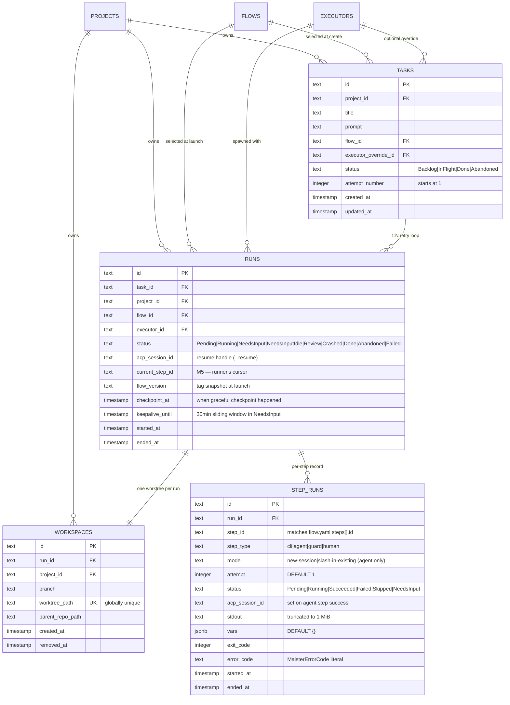

# Runs domain ERD

Tables for the execution lifecycle: tasks (board), runs (attempts),
workspaces (worktrees). See [`../system-analytics/tasks.md`](../system-analytics/tasks.md),
[`../system-analytics/runs.md`](../system-analytics/runs.md), and
[`../system-analytics/workspaces.md`](../system-analytics/workspaces.md)
for behavior.



## Constraints

- `tasks_id_attempt_uq` on `(id, attempt_number)` — **vacuous**:
  `tasks.id` is already the PK, so this composite UNIQUE guards
  nothing. Shipped for historical reasons; the real per-attempt
  uniqueness arrives at **(Designed M8)** as `UNIQUE (task_id,
  attempt_number)` on `runs`.
- `tasks_project_status_idx` on `(project_id, status)` — board queries.
- `runs_project_status_idx` on `(project_id, status)` — portfolio
  queries and per-project In-Flight filters.
- `runs_task_idx` on `(task_id)` — latest-attempt lookups (M5: `ORDER
BY started_at DESC LIMIT 1`; **(Designed M8)** switches to `ORDER BY
attempt_number DESC LIMIT 1` once `runs.attempt_number` lands).
- `workspaces.worktree_path` UNIQUE — globally unique across the host.
- `step_runs_run_step_attempt_uq` on `(run_id, step_id, attempt)` —
  one row per (run, step, attempt); guards future per-step retry.
- `step_runs_run_idx` on `(run_id)` — runner's getStepRunsForRun lookups
  to build `FlowContext.steps.<id>.*` for Mustache templating across
  steps.

## Status enum reference

**Tasks** (board axis):

```
Backlog -> InFlight -> Done
       \-> Abandoned
```

Auto-return: a terminal `Failed | Crashed | Abandoned` *run* sends the
task back to `Backlog`. Only explicit user `Discard` sends a task to
`Abandoned`.

**Runs** (execution axis):

```
Pending -> Running -> Review -> Done
                  \-> NeedsInput <-> NeedsInputIdle -> Abandoned
                  \-> Crashed -> Running (Recover)
                              \-> Abandoned (Discard)
                  \-> Failed
```

See [`../system-analytics/runs.md`](../system-analytics/runs.md) for the
full state diagram.

## Notes on cardinality

- `RUNS ||--|| WORKSPACES` is one-to-one *at most* — the workspace
  row may be missing while the run is still `Pending` (worktree not
  yet created) or after GC (`workspaces.removed_at IS NOT NULL` and
  the row is purged). Drawn as `||--||` because every active run has
  exactly one workspace.
- `TASKS ||--o{ RUNS` — 1:N attempts. The "latest" run on a card is
  the row with `MAX(started_at)` for the task in M5; **(Designed M8)**
  switches to `MAX(runs.attempt_number)` once that column lands.

## Linked artifacts

- Process flows: [`../system-analytics/tasks.md`](../system-analytics/tasks.md),
  [`../system-analytics/runs.md`](../system-analytics/runs.md).
- Source: `web/lib/db/schema.ts`.
