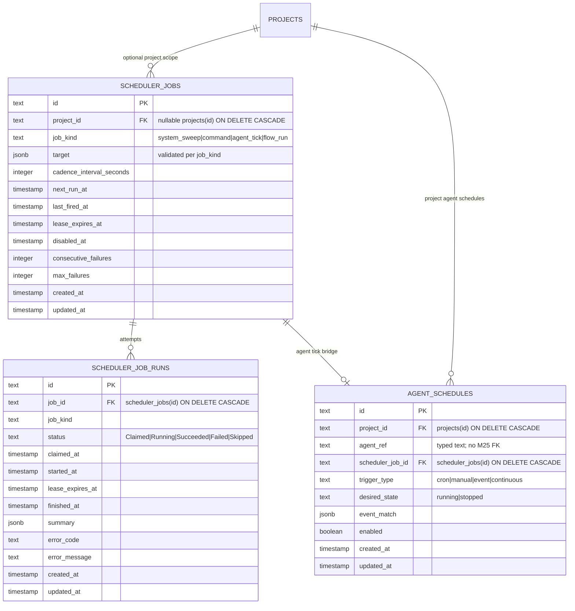

# Scheduler domain ERD

Tables for the unified scheduler clock introduced by M24. See
[`../system-analytics/scheduler.md`](../system-analytics/scheduler.md) for the
job lifecycle, tick route, and catch-up policy.

> **Status: Implemented (M24).** Migration `0027_m24_scheduler_service` adds these
> tables and indexes.

## Indexes

| Constraint / Index                  | Columns                      | Purpose                                |
| ----------------------------------- | ---------------------------- | -------------------------------------- |
| `scheduler_jobs_due_idx`            | `(disabled_at, next_run_at)` | Due-job scan                           |
| `scheduler_jobs_kind_due_idx`       | `(job_kind, next_run_at)`    | `jobKind` filtered ticks               |
| `scheduler_jobs_project_kind_idx`   | `(project_id, job_kind)`     | Project-scoped job read model          |
| `scheduler_job_runs_job_idx`        | `(job_id)`                   | Job attempt history                    |
| `scheduler_job_runs_lease_idx`      | `(status, lease_expires_at)` | Stuck-attempt reaper                   |
| `agent_schedules_project_agent_idx` | `(project_id, agent_ref)`    | Project agent schedule lookup          |
| `agent_schedules_scheduler_job_idx` | `(scheduler_job_id)`         | Agent schedule to scheduler job bridge |

## Linked artifacts

- Process flows: [`../system-analytics/scheduler.md`](../system-analytics/scheduler.md).
- Global ERD: [`erd.md`](erd.md).
- Narrative: [`../database-schema.md`](../database-schema.md).
- ADR: [ADR-060](../decisions.md#adr-060-unified-scheduler-clock-and-polymorphic-job-budgets).
