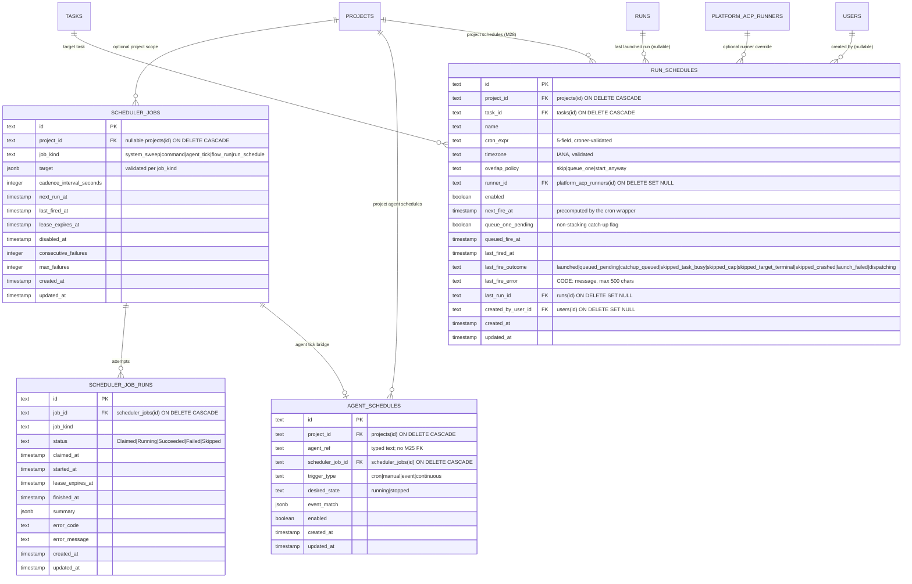

# Scheduler domain ERD

Tables for the unified scheduler clock introduced by M24. See
[`../system-analytics/scheduler.md`](../system-analytics/scheduler.md) for the
job lifecycle, tick route, and catch-up policy.

> **Status: Implemented (M24).** Migration `0027_m24_scheduler_service` adds these
> tables and indexes.
>
> **`run_schedules`: Implemented (M28).** Migration `0038_run_schedules` adds the
> user-facing cron schedule table fired by the seeded `run_schedule.dispatcher`
> job — see [`../system-analytics/run-schedules.md`](../system-analytics/run-schedules.md)
> and [ADR-071](../decisions.md#adr-071-user-facing-run-schedules-on-the-m24-clock).
> Cron expressions live ONLY here; `scheduler_jobs` stays fixed-interval.

## Indexes

| Constraint / Index                  | Columns                      | Purpose                                |
| ----------------------------------- | ---------------------------- | -------------------------------------- |
| `scheduler_jobs_due_idx`            | `(disabled_at, next_run_at)` | Due-job scan                           |
| `scheduler_jobs_kind_due_idx`       | `(job_kind, next_run_at)`    | `jobKind` filtered ticks               |
| `scheduler_jobs_project_kind_idx`   | `(project_id, job_kind)`     | Project-scoped job read model          |
| `scheduler_job_runs_job_idx`        | `(job_id)`                   | Job attempt history                    |
| `scheduler_job_runs_lease_idx`      | `(status, lease_expires_at)` | Stuck-attempt reaper                   |
| `agent_schedules_project_agent_idx` | `(project_id, agent_ref)`    | Project agent schedule lookup          |
| `agent_schedules_scheduler_job_idx` | `(scheduler_job_id)`         | Agent schedule to scheduler job bridge |
| `run_schedules_project_idx` (M28)   | `(project_id)`               | Project schedules list                 |
| `run_schedules_task_idx` (M28)      | `(task_id)`                  | Per-task schedule lookup               |
| `run_schedules_due_idx` (M28)       | `(enabled, next_fire_at)`    | Dispatcher due-scan                    |
| `run_schedules_last_run_idx` (M28)  | `(last_run_id)`              | FK SET NULL + last-run status join     |

## Linked artifacts

- Process flows: [`../system-analytics/scheduler.md`](../system-analytics/scheduler.md).
- Global ERD: [`erd.md`](erd.md).
- Narrative: [`../database-schema.md`](../database-schema.md).
- ADR: [ADR-060](../decisions.md#adr-060-unified-scheduler-clock-and-polymorphic-job-budgets).
