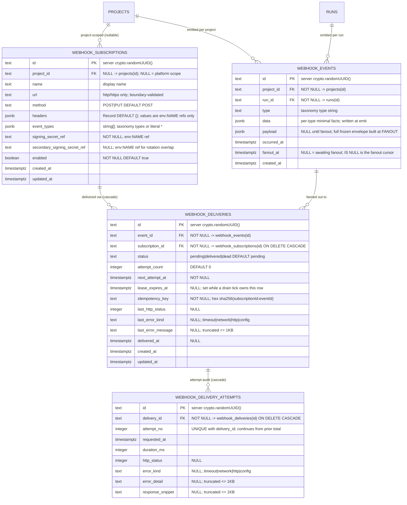

# Webhooks domain ERD

Tables for the outbound webhook delivery primitive introduced by ADR-077.
See [`../system-analytics/outbound-webhooks.md`](../system-analytics/outbound-webhooks.md)
for behavior, the delivery FSM, and the event taxonomy, and
[`../database-schema.md`](../database-schema.md) for the column-level narrative.

> **Status: Implemented.** Migration `0040_outbound_webhooks.sql` (additive,
> forward-only, no down-migration) adds all four tables and the
> `platform_runtime_settings.webhooks_enabled` column.

The diagram below also notes that `platform_runtime_settings` gains a
`webhooks_enabled boolean NOT NULL DEFAULT true` global kill-switch column
(not drawn as a full entity here — only the additive column is new).



## Keys and unique constraints

| Table | Constraint | Columns | Purpose |
| ----- | ---------- | ------- | ------- |
| `webhook_deliveries` | `UNIQUE` | `(subscription_id, event_id)` | Fanout dedupe invariant — `ON CONFLICT DO NOTHING` on insert. |
| `webhook_delivery_attempts` | `UNIQUE` | `(delivery_id, attempt_no)` | One row per attempt number per delivery. |

## Partial indexes

| Table | Index | Predicate | Purpose |
| ----- | ----- | --------- | ------- |
| `webhook_events` | `webhook_events_pending_fanout_idx` | `WHERE fanout_at IS NULL` | Fanout-pass claim — only unprocessed outbox events. |
| `webhook_deliveries` | `webhook_deliveries_due_idx` | `WHERE status = 'pending'` | Drain-pass claim — due deliveries only. |

## Regular indexes

| Table | Index | Columns | Purpose |
| ----- | ----- | ------- | ------- |
| `webhook_subscriptions` | `webhook_subscriptions_project_idx` | `(project_id)` | Project-scope subscription lookup (NULL rows are the platform scope). |
| `webhook_events` | `webhook_events_pending_fanout_idx` | `(created_at)` + partial predicate above | Ordered fanout scan. |
| `webhook_deliveries` | `webhook_deliveries_due_idx` | `(next_attempt_at)` + partial predicate above | Ordered drain scan. |
| `webhook_deliveries` | `webhook_deliveries_subscription_log_idx` | `(subscription_id, created_at DESC)` | Deliveries-drawer log UI. |
| `webhook_delivery_attempts` | `webhook_delivery_attempts_delivery_idx` | `(delivery_id)` | Attempt history for a delivery. |

## Cascade chain

```
projects
  ├── webhook_subscriptions  (FK project_id,      nullable; ON DELETE CASCADE)
  │     └── webhook_deliveries  (FK subscription_id, ON DELETE CASCADE)
  │           └── webhook_delivery_attempts  (FK delivery_id, ON DELETE CASCADE)
  └── webhook_events  (FK project_id,      ON DELETE CASCADE)
        └── webhook_deliveries  (FK event_id,        ON DELETE CASCADE)

runs
  └── webhook_events  (FK run_id,          ON DELETE CASCADE)
```

Deleting a project drops all its `webhook_subscriptions`, `webhook_events`,
and all `webhook_deliveries` / `webhook_delivery_attempts` that hang off them.
Deleting a run drops its `webhook_events` rows and — because
`webhook_deliveries.event_id` cascades too — every delivery and attempt
recorded for those events. Delivery-history longevity is therefore guaranteed
by the retention pass, not the FK: the prune deletes only zero-delivery
events, so an event referenced by any delivery (and the audit under it) is
never removed by the system itself. Deleting a `webhook_subscriptions` row
cascades to its `webhook_deliveries` and their `webhook_delivery_attempts`.

## Fanout cursor model

`webhook_events.fanout_at IS NULL` is the **entire** fanout cursor — no
separate cursor table is needed. The drain worker claims rows with
`fanout_at IS NULL FOR UPDATE SKIP LOCKED`, freezes the envelope into
`payload`, inserts `webhook_deliveries` rows (`ON CONFLICT DO NOTHING` for
the unique `(subscription_id, event_id)`), and sets `fanout_at` in the same
transaction.

## Retention

Zero-delivery events (events where `fanout_at` has been set and no
`webhook_deliveries` rows reference the event row) are pruned after 7 days
by the `webhook_delivery` scheduler job's tail pass. Events referenced by
any `webhook_deliveries` row are kept indefinitely for replay and audit.

## Linked artifacts

- Process flows: [`../system-analytics/outbound-webhooks.md`](../system-analytics/outbound-webhooks.md).
- Global ERD: [`erd.md`](erd.md).
- Narrative: [`../database-schema.md`](../database-schema.md).
- Decision record: ADR-077 in [`../decisions.md`](../decisions.md).
- Source (Implemented): `web/lib/db/schema.ts` (migration `0040_outbound_webhooks.sql`).
