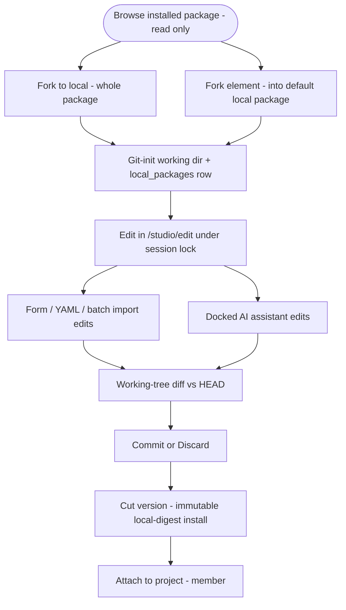

# Flow Package Viewer + Local Editing — Design

> **Status: Designed (brainstorm, 2026-06-20).** Extends and *completes* the
> half-built Flow Studio **Phase C** (editable local packages). Owner-approved
> direction; this doc is the spec the implementation plan is written from.
> When this disagrees with code after build, code wins — update this doc.

## 1. Context

The Flow Studio package surfaces today are weak at *browsing*:

- `/studio/packages/{ref}` (platform-wide) renders a header, tiny read-only flow
  canvases, and **flat "chip" lists** for the bill of materials — every skill /
  agent / mcp / rule is just an id chip with no detail and no action. "Rework"
  is a disabled placeholder.
- `/projects/{slug}/packages/{flowRefId}` (project-scoped) is richer (static
  graph + `flow.yaml` + file browser + a real **Fork** button) but it is
  **per-flow**, project-scoped, and ungrouped.

Two structural truths shape everything below:

1. **Installed packages are immutable** (content-addressed git installs). You
   cannot edit them in place; the only edit path is **Fork to local** → a mutable
   working directory.
2. A **half-built substrate already exists** on the unmerged branch
   `feature/flow-studio-phase-c-local-packages` (`e65e2364`): a `local_packages`
   table pointing at a git-backed working dir, working-dir CRUD, a per-editor
   session lock, `manageLocalPackages` RBAC, and docs/OpenAPI/ERD. Its UI
   (`/studio/local`, `/studio/edit`), per-kind editors, fork-to-local, and
   cut-version are **not** built. `main` has since diverged, so its
   `migration 0053` and `ADR-093` now collide.

This design delivers a mature read-only viewer **and** finishes the editable
local-package layer, so a user can browse a package's flows/skills/agents in
full, then fork-and-edit any element — manually or with a docked AI assistant.

## 2. Goals

- Replace chip lists with a **grouped, navigable viewer** (Flows · Skills ·
  Agents · MCPs · Rules) that exposes the **full configuration** of every
  element (a flow's nodes/routes/prompts/gates, a skill's bundle, an agent's
  capabilities and when-to-call metadata).
- Make **all** package element kinds **forkable and editable** through git-backed
  local packages, not just flows.
- Support **multilevel skill bundles** (subfolders, references, binary assets)
  and **batch import** of file/folder packs.
- Give the local-package editor a first-class **git-backed diff + Commit/Discard**
  surface, independent of any AI.
- Embed a **docked AI authoring assistant** in the editor that edits the working
  dir directly through the existing ACP substrate.

## 3. Non-goals (explicit)

- **Agent bundles / agent subdirectories.** Agents stay a single
  `agents/<stem>.md`; reference material belongs in a **skill** (the existing
  bundling primitive). Adapters consume only single-file subagents.
- **Editable on-canvas node popup.** The read-only **node inspector** (reused
  editor properties panel) covers the "see node properties on the canvas" want;
  an editable floating popup is out of scope.
- **PR / git write-back to an upstream source** from a local package — stays
  Phase C's own "Phase 2".
- **A structured AI-routing engine** that auto-selects agents. We surface the
  agent's *what-it-does + when-to-call* metadata so a future router can use it;
  the router itself is later work.
- No new `runs.status`, no engine bump for the viewer; the AI assistant reuses
  the scratch-run substrate.

## 4. Decisions captured (brainstorm)

| Topic | Decision |
| --- | --- |
| Phase C work | **Salvage**: rebase its 2 commits onto a fresh branch from `main`, renumber migration + ADR, rebuild snapshot. |
| Package screen layout | **Tabbed groups** (Flows/Skills/Agents/MCPs/Rules). |
| Collection view (per tab) | **Cards grid + paging**; click → detail. |
| Flow detail | **Canvas + read-only node inspector** (reuse `NodeSideForm`). |
| Skill detail | **Bundle browser**: file tree + rendered SKILL.md + asset preview. |
| Agent detail | **What-it-does + when-to-call** metadata + prompt; **no runner**. |
| Routing / edit gate | Read-only detail page + **Fork to local**; local packages open the real editor. |
| Agent storage | **Single-file** (no bundles). |
| Skill bundles | Subfolders + references + binary assets supported. |
| Batch import | **Folder** drop/pick **and** **zip/tar.gz**. |
| Editor + AI | **Right panel, Properties ⇆ AI tabs**. |
| Diff | **First-class, git-backed**, works without AI. |
| AI mechanism | ACP session rooted in the git-backed working dir + a flow-authoring skill; edits land as working-tree changes. |
| Fork granularity | **Both** — package-level fork (full editable copy) **and** element-level fork (into the default "virtual" local package). |

## 5. Surfaces

### 5.1 Package screen — tabbed groups

`/studio/packages/{ref}` becomes: header (name · version · trust · **Fork to
local** · Attach) + a **tab bar** `Flows (n) · Skills (n) · Agents (n) · MCPs
(n) · Rules (n)`. Each tab body is the collection view (§5.2). The flat BoM chip
list is removed.

**Acceptance**
- A package with ≥1 element of a kind shows that kind's tab with a correct count;
  kinds with 0 elements show a disabled/absent tab.
- The active tab is reflected in the URL (`?tab=skills`) and survives refresh /
  back-forward.
- No element is rendered as a bare id chip anywhere on the screen.

### 5.2 Collection view — cards grid + paging

Per tab: a responsive **card grid**. Each card shows the element name, a
one-line description, a kind-specific meta line, and **View** + **Fork** actions.
Large collections page via **Load more** (or numbered pages); page state is in
the URL. An **⤓ Import** affordance appears only on editable (local) packages.

- Flow card meta: `N nodes · M gates · graph <engine>`.
- Skill card meta: `K files · S subfolders`.
- Agent card meta: **when-to-call** (triggers) + `risk_tier · workspace` — **no
  runner**.

**Acceptance**
- Cards render for every element of the active tab; clicking a card opens that
  element's detail (§5.3–5.5).
- Paging shows at most the page size; "Load more"/page navigation reveals the
  rest; the count in the tab equals the total across pages.
- The Import affordance is **absent** on installed (immutable) packages and
  **present** on local packages.

### 5.3 Flow detail — canvas + read-only node inspector

Dedicated read-only page. Read-only **graph canvas** (existing static
`FlowGraphView`, presentation honored) + a **node inspector** that reuses the
editor's `NodeSideForm` in a read-only mode. Selecting a node shows its full
config: prompt text, runner-intent, gates (kind · blocking/advisory · config),
transitions/routes, declared settings + enforcement, and typed input/output
artifacts. A banner marks `installed · read-only` with **Fork to local**.

**Acceptance**
- The inspector renders the **full** prompt text and every gate/route for the
  selected node — nothing truncated to a chip.
- The canvas renders with no run context: no SSE subscription, no
  `/graph-status` fetch, no status ring (read-only contract).
- A flow whose stored manifest fails to compile degrades to a YAML/raw view with
  a notice and never 500s.
- `NodeSideForm` in read-only mode emits **no** mutation controls and no save.

### 5.4 Skill detail — bundle browser

Master–detail: a **file tree** of the skill bundle (`SKILL.md`, `references/`,
`assets/`, arbitrary subfolders) + a content pane. Markdown renders; code
highlights; **images/binary assets preview** (or show a typed placeholder). The
SKILL.md frontmatter (name, description, when-to-use) renders as a metadata
header. Banner `read-only` + **Fork to local**.

**Acceptance**
- Nested subfolders and files are all listed; selecting any file renders it by
  type (md / code / image / binary-placeholder).
- A bundle missing on disk degrades to metadata-only and never throws.
- Every file read is path-confined to the bundle root before any fs call; no
  `installed_path` appears in any client payload.

### 5.5 Agent detail — what-it-does + when-to-call + prompt

A **metadata panel** keyed on routing-relevant facts — description (what it
does), **triggers / when-to-call**, `risk_tier`, `workspace` (+ `workspace_ref`),
`mode`, declared capability profile (MCPs/skills), and **recommended** bindings
(cron/events) — followed by the **rendered prompt body**. **Runner is not
shown** (resolved per-project at launch). Banner `read-only` + **Fork to local**.

**Acceptance**
- The panel surfaces description + triggers + recommended bindings + risk +
  workspace; it **never** displays a runner as an agent property.
- The full prompt body renders.

## 6. Local editing

### 6.1 Local packages (git-backed working dir) — from Phase C

A `local_packages` row points at a **git-initialized** mutable working dir under
`MAISTER_LOCAL_PACKAGES_ROOT` (default `~/.maister/local`). The dir holds the
package layout (`flows/ skills/ agents/ mcps/ rules/ schemas/`, `flow.yaml`s,
`maister-package.yaml`). `working_dir` is **server-only** (never in a client
payload). A per-editor-tab **session lock** (`locked_by_session`,
`lock_expires_at`, lazy stale-takeover, no sweeper) serializes writers; a second
tab is read-only with a "locked by" banner. (All already built in Phase C
substrate — this design *finishes the UI and the actions on top*.)

### 6.2 Fork to local — both grains

- **Package-level "Fork to local"** (on the package screen): create a **new
  local package** (auto-named `<source>-local`) seeded from the whole installed
  package — every flow, skill, agent, mcp, rule copied into a fresh git-init'd
  working dir — then open `/studio/edit/{localPackageId}`. Records fork lineage
  (`source_package_install_id` / source ref).
- **Element-level "Fork"** (on a detail page / card): copy **just that element**
  (a flow + its files, or a skill bundle, or an agent `.md`) into the
  **project's default "virtual" local package** (one per project, created on
  first use), then open it. Reuses Phase C's loose-artifact +
  move-between-packages model.

**Acceptance**
- Package fork produces a local package whose working dir contains all source
  elements; opening it lists them under the right kinds.
- Element fork lands exactly that element in the default local package without
  copying the rest of the source package.
- Fork executes **nothing** (no setup.sh, no MCP spawn); a missing/unreadable
  source bundle fails with `CONFIG` and persists nothing; a name collision is
  classified (`CONFLICT`) or auto-suffixed per the chosen slug rules.
- Forking requires an authenticated session (`requireSession`); it does **not**
  require project membership (Studio authoring is member-accessible).

### 6.3 Editor surface

`/studio/edit/{localPackageId}/{...path}` mounts the existing Phase B
`FlowEditorTabs` via its injectable `saveAction`/`publishAction`/`filesDrawer`
seam, with a **working-dir save action** (writes files under the lock; no
draft-version CAS — the lock + git are the concurrency model). The right panel
carries **Properties ⇆ AI** tabs (§7). Per-kind editors
(`FrontmatterArtifactEditor` for skill/agent/rule, `ScriptArtifactEditor`,
`FormSchemaBuilder`, + a new **MCP-template editor** sourcing from
`platform_mcp_servers`) edit working-dir files. YAML stays a hidden-by-default
drawer.

**Acceptance**
- Saving writes the file(s) to the working dir only while the caller holds a
  live lock; otherwise `CONFLICT`.
- Every write path is confined to the working dir (reject abs / `..` / symlink
  escape / `.git`).
- A second editor tab on the same package is read-only with a "locked by"
  banner; lock refresh extends the hold; stale locks are taken over lazily on
  acquire.

### 6.4 Cut version + attach

A top-bar **Cut version** action clean-exports the working dir (excluding
`.git`) and runs the existing installer
(`installPackageRevision({ version: "local" })`) → an immutable
`local-<digest>` `package_installs` revision + member `flow_revisions`; then
optional **attach** to a project (`attachPackage`, member-gated). The local
source is `trusted_by_policy` (operator-authored) — no instance trust gap.

**Acceptance**
- Cut version yields an immutable `local-<digest>` install reflecting the
  working dir at cut time; subsequent working-dir edits do **not** mutate it.
- Attach is gated by the new `manageLocalPackages: member` action; git-package
  install/attach/trust gates stay admin (unchanged).
- A crash between export and install leaves no half-registered revision (existing
  two-phase intent rows).

### 6.5 Git-backed diff + Commit / Discard

The working dir is git-backed, so **every** edit (form, raw YAML, batch import,
or AI) is a working-tree change. The editor top bar shows `⎇ N changed`; the
**existing `[Diff]` drawer is extended** to show the unified
working-tree-vs-`HEAD` diff in local-package mode (no separate drawer);
**Commit** = `git commit` (optional message), **Discard** =
`git checkout -- <paths>`.

**Acceptance**
- The changed-file count and Diff drawer reflect the real `git status` /
  `git diff` of the working dir.
- Commit produces a working-dir commit and resets the changed count to 0;
  Discard restores the selected files to `HEAD`.
- Diff/Commit/Discard work for **manual** edits with **no** AI session present.

### 6.6 Batch import — folder + archive

An **⤓ Import** action on a local package accepts a **folder** (drag-drop /
directory picker, preserving subfolders + binary assets) **and** a **zip /
tar.gz** archive (extracted server-side). Imported entries land under the
working dir; a pre-write **preview tree** is shown; each entry is path-confined
and per-kind validated; archive extraction guards against zip-slip and enforces
a cap — **default: reject an archive > 50 MB or > 2000 entries, or any single
file > 10 MB (tunable)**.

**Acceptance**
- A folder import preserves the full subfolder tree and binary asset bytes.
- An archive import extracts the same tree; a zip-slip / absolute / `..` /
  oversize entry is rejected before any write, persisting nothing.
- The import is confined to the working dir and requires a live lock.

## 7. Docked AI assistant

The **AI tab** launches an ACP session (scratch-run substrate, `run_kind`
reused) **rooted at the local-package working dir**, pre-seeded with a new
**flow-authoring skill** (guidance for `flow.yaml`, the node/route DSL, package
layout) and the currently-open artifact as context. The agent edits working-dir
files directly; the canvas/files **live-refresh**; permission/HITL prompts
stream **inline** in the chat. The run operates **under the editor's working-dir
lock** (the editor is the lock holder; the assistant writes as that holder;
turn-based, so no concurrent-writer conflict), and its edits surface through the
same §6.5 git diff → **Commit / Discard**. Counts against the scratch
concurrency cap. **One ACP run per editor tab** (lives while the tab is open); a
later "clear / refresh session" control is deferred.

**Acceptance**
- Sending a message starts/continues an ACP session whose cwd is the working
  dir; agent file writes appear in the editor without a manual reload.
- Permission requests render inline and resolve through the existing HITL path;
  secrets never reach the client.
- While the assistant holds a turn the human editor is in an "AI working" state;
  control returns when the turn ends; all assistant edits are ordinary
  working-tree changes the user can Commit or Discard.
- No assistant session can write outside the working dir or run with a stale
  lock.

## 8. Data model deltas

Most structure is the Phase C substrate (`local_packages` + working-dir CRUD +
lock + RBAC). New/confirmed deltas (exact columns fixed in the plan):

- **Salvage renumber:** Phase C `migration 0053 → next free (≈0055)`,
  `ADR-093 → next free`, snapshot rebuilt (journal `when` monotonic).
- **Default/virtual local package:** designate each **project's** default
  loose-artifact package (`local_packages.is_default`, scoped per project) for
  element-level forks.
- **Fork lineage:** record source on the local package (and/or per element):
  `source_package_install_id`, source flow-ref / element path.
- **MCP-template provenance (optional):** `platform_mcp_server_id` on
  materialized MCP templates when the MCP editor sources from the catalog.
- No change to the `agents` storage contract (single-file); no new
  `MaisterError` code (reuse `PRECONDITION | CONFIG | CONFLICT`); no engine bump.

## 9. Fork → edit → cut → attach lifecycle

## 10. Build order (one plan, internal milestones)

Each milestone is independently green (tsc 0, unit + integration, eslint, docs
validators) and ships standalone value.

0. **Salvage** — fresh branch off `main`; replay Phase C's 2 commits; renumber
   migration + ADR; rebuild snapshot; gates green.
1. **Read-only mature viewer** — tabbed package screen, cards+paging
   collections, flow/skill/agent detail. Reuses existing data; no new backend.
2. **Local-package editing** — `/studio/local`, `/studio/edit`, working-dir file
   routes under the lock, read-only banner, per-kind editors (+ MCP-template
   editor), **Fork to local** (both grains), **cut version** + attach.
3. **Batch import** — folder + zip/tar.gz, confined + validated.
4. **Git-backed diff + Commit/Discard** in the local editor.
5. **Docked AI assistant** — ACP session in the working dir + flow-authoring
   skill + right-panel Properties⇆AI tabs + live refresh + HITL + lock
   coordination (builds on milestone 4's diff/commit).

## 11. Resolved decisions

- Default "virtual" local package: **one per project**.
- Package-fork auto-names the new local package `<source>-local`.
- AI assistant: **one ACP run per editor tab**; a clear/refresh-session control
  is deferred.
- Batch import cap (default, tunable): reject an archive **> 50 MB** or
  **> 2000 entries**, or any single file **> 10 MB**.
- Diff: **reuse** the existing `[Diff]` drawer (extended to render git
  working-tree diffs in local-package mode), not a separate drawer.
- Local-package deletion + its working dir: **manual, no GC** (Phase C model).
