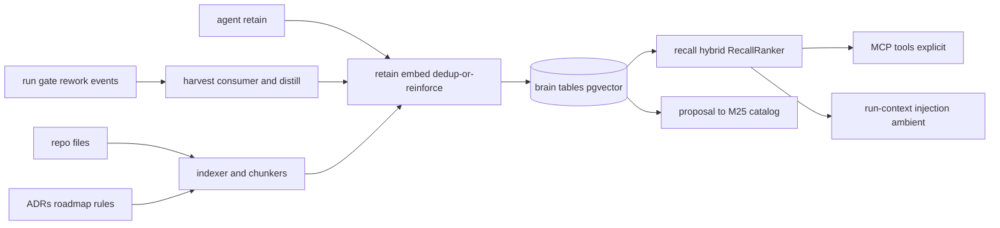

# Project Brain — Target Architecture & Requirements (design spec)

> Status: **Design spec** (pre-implementation). Not an ADR, changes no locked
> decision. Feeds the planning feature (`/aif-plan` / writing-plans). When this
> is pulled into delivery, the load-bearing choices below graduate to ADRs.
> Relates to `docs/pv/improvement-roadmap.md` **E3 — Knowledge lifecycle / moat**
> ("Project memory") and PRODUCT_VIEW §Phase 2.2 (Curated project knowledge).

## 1. Purpose & scope

The **Project Brain** is a per-project knowledge substrate for MAIster: a
self-improving, project-scoped, vectorized memory that platform agents use
natively. It is **not** only a run-log accumulator. It serves six jobs:

1. **Run/gate/rework lessons** — auto-harvested from run outcomes.
2. **Current project state** — durable facts about how the project is right now.
3. **Roadmap vector** — the project's direction/intent.
4. **Architect/consultant** — agents (and humans) query decisions, conventions,
   constraints.
5. **Review/dev accumulator** — knowledge from reviews and dev sessions.
6. **Improvement evidence base** — the source the self-improvement loop reads to
   propose skill/flow/rule changes.

**Bounded context.** The Brain is its own domain (own module, own tables),
**not** sprinkled into run tables. It **suggests and contextualizes**; accepted
catalog artifacts (rules/skills/flows in the M25 authored catalog) remain the
**source of truth**. The Brain never becomes a second, drifting copy of canon.

## 2. Locked decisions (from design dialogue)

| # | Decision | Rationale |
|---|---|---|
| D1 | **Build-thin on existing Postgres 16 + pgvector**, not Hindsight/GBrain | The target's defining needs — real multi-project auth isolation, native domain provenance (FKs), transactional coupling to the M25 catalog + readiness/HITL — are exactly where off-the-shelf stores fail, and they grow with scope. The one buy-advantage (recall quality) is isolable behind a seam. |
| D2 | **Same Postgres instance, separate bounded context via `brain_*` table prefixes** (not a separate DB, not a separate PG schema) | Same instance keeps joins to `projects`/`runs`/`tasks`/`artifact_instances`/`agents`, one transaction with `domain_events`, one backup. Table prefixes over PG schemas avoid multiplying the Drizzle journal/ordering hazards already hit. Boundary enforced in code (`web/lib/brain/*`). |
| D3 | **SQLite mode → Brain disabled** | pgvector is Postgres-only; SQLite is ultra-light dev only. |
| D4 | **Embedding provider registry, `openai_compatible` default** (`local` = special case), immutable embedding rows, reindex-on-model/dimension-switch | Never hardcode a model; a model or dimension change creates a new embedding generation (per-generation HNSW expression indexes), never mutates old rows, never needs a schema migration. |
| D5 | **`ChunkerRegistry` — built-in typed chunkers wrapping existing libraries; package-extensible** | The AST/parse work is a dependency; only the MAIster-specific slicing is ours. |
| D6 | **Brain code-indexing = AST chunking (`code-chunk`/tree-sitter), NOT LSP.** Serena/LSP is an optional agent capability + a Phase-C edge connector | AST chunking is the embeddable memory primitive (in-process, stateless). LSP is a live stateful server (the Python sidecar we rejected) — belongs in the Hands layer, not the memory core. |
| D7 | **Two-tier substrate; ownership resolved per-project** | *Owned/volatile* tier (lessons/observations/state-facts) + *indexed/referenced* tier (ADRs/roadmap/rules/Observatory). If a project has docs-as-code → index it; if not → the Brain owns it, and can **project it back out** to docs-as-code. |
| D8 | **Calibrated autonomy** — harvested lessons auto-write with decay; canon (roadmap/architecture) changes go through proposal→human-accept, graduating to auto by confidence × blast-radius | Auto-writing lessons is safe (decay is the valve); auto-rewriting strategy is not — it is earned per category. |
| D9 | **`RecallRanker` / `BrainEngine` seam** | Keeps the one thing "buy" does better (recall ranking) swappable without moving the system-of-record off Postgres. Escape hatch to an embedded reranker or Hindsight-as-recall-service later. |
| D10 | **best-effort re-anchor** of edges/proposals across re-chunking (map old→new by symbol; keep un-mappable as degraded, not dropped) | Durable graph across chunker-version bumps. |

## 3. Knowledge model

### 3.1 Kinds (closed set, per-kind lifecycle)

| kind | Tier | Lifecycle | Primary write source |
|---|---|---|---|
| `lesson` | owned | **decay** (TTL, promoted by recurrence) | harvest consumer |
| `observation` | owned | decay (slower) | agent `retain`, review/dev bridge |
| `state_fact` | owned | **supersede-on-change** (not decayed) | harvest / agent / indexer |
| `decision` | indexed **or** owned | index-refresh **or** durable | indexer (if docs-as-code) / authored |
| `direction` | indexed **or** owned | index-refresh **or** durable | indexer (roadmap) / authored |

Not an open bag — new kinds require a design change.

### 3.2 Two-tier ownership (per-project resolution)

- **Project has a canonical home** (ADRs/roadmap/rules in repo): Brain **indexes**
  it — embeds + returns a **pointer to canonical truth**, re-embeds on source
  change. No fork.
- **Project has none**: Brain **owns** the kind (home-of-record), and may
  **project it out** to docs-as-code (`ADR-NNN.md`, roadmap file) via the
  proposal→accept path.

## 4. Data model (`brain_*` tables)

Conceptual shape (final columns settled at implementation). All rows carry
`project_id` FK — the **auth boundary**.

- `brain_items` — one knowledge item: `id, project_id, kind, tier, title,
  content, status(active|expired|superseded|proposed), confidence,
  reinforcement_count, last_reinforced_at, expires_at, content_hash,
  source_ref(canonical pointer for indexed tier), created_at, updated_at`.
- `brain_sources` — an indexed/owned source: `id, project_id, kind(repo_file|
  openapi|asyncapi|sql|flow_yaml|agent_md|markdown|html|run_summary|review|…),
  path, source_hash, chunker_id, chunker_version, last_indexed_at`. `html`
  sources normalize to markdown before chunking (`chunker_id=markdown`).
- `brain_chunks` — structured chunk: `id, source_id, stable_id, kind, title,
  path, symbol, content, metadata(jsonb), source_range, content_hash`.
  `stable_id = f(source stable id, symbol/path, ordinal)` — survives re-chunk.
- `brain_embeddings` — **immutable** per (chunk|item, embedding generation):
  `id, chunk_id?, item_id?, vector (dimension-untyped), embedding_provider,
  embedding_model, embedding_dimensions, embedding_version, chunker_id,
  chunker_version, source_hash, content_hash, embedded_at`. One **active**
  generation at read; a model OR dimension switch writes a new generation
  (reindex), never mutates rows. HNSW rides per-generation expression
  indexes (`(vector::vector(N)) … WHERE embedding_model = M AND
  embedding_dimensions = N`) managed at configure/reindex time — a
  dimension change needs no schema migration.
- `brain_edges` — light graph: `id, project_id, from_ref, to_ref,
  relation(supports|contradicts|derived_from|refines|references),
  confidence, created_at`. Recursive-CTE traversal (same pattern as the task
  graph). **best-effort re-anchor** on reindex.
- `brain_proposals` — bridge to the M25 catalog: `id, project_id, kind(rule|
  skill|flow|adr|roadmap|state), evidence_item_ids(jsonb), draft(jsonb),
  status(pending|accepted|rejected|applied), blast_radius, autonomy_decision,
  created_at, resolved_at`. Accepted proposals write into the **authored
  catalog lineage**, which stays canonical.
- `brain_snapshots` — recall snapshot written at **consumption** (ambient
  inject or explicit recall) for reproducibility/audit: `id, run_id?,
  node_attempt_id?, actor_type, actor_id, trigger(ambient|explicit), query,
  query_hash, embedding_model, returned_items(jsonb: [{itemId, score}]),
  ranker_version, created_at`. The launch-time *decision* to include Brain
  context persists on the run row (`runs.brain_context`), not here.
- `brain_index_jobs` — indexing/reindex work: `id, project_id, source_id?,
  reason(event|manual|model_switch|chunker_upgrade), status, progress,
  resumable_cursor, created_at`.

Indexes: per-generation HNSW expression indexes over
`brain_embeddings.vector` (see above), GIN on a generated `tsvector` over
`brain_chunks.content`/`brain_items.content`, btree on `(project_id, status,
expires_at)`.

## 5. Pipelines

### 5.1 Write / harvest (the self-improving engine)

- A **`memory_harvest` consumer** on the existing `domain_events` bus (ADR-086,
  per-consumer cursor on the M24 clock, at-least-once). v1 triggers:
  `RUN_TERMINAL_EVENT_KINDS` (esp. with rework) + `gate.failed` — an **explicit
  per-kind harvest predicate** over `(kind, payload)`. `run.review` is NOT
  harvested (orchestrator child-settled signal, different payload; the child's
  eventual terminal event is the lesson source).
- **Distillation step**: gather run summary / rework comments / gate verdict /
  diff paths → structured-output LLM call (schema-validated `{content, kind,
  tags, confidence_hint}`, P1 discipline) → `retain(...)`.
- **`retain(projectId, item, provenance)`**: embed → **dedup-or-reinforce**
  (if cosine-sim to an active item > τ, reinforce: bump confidence +
  reinforcement_count, push `expires_at` out) else insert with low confidence +
  TTL. This one rule gives dedup + recurrence-promotion + the decay valve.
- **Decay sweep**: a job on the existing scheduler (`system_sweep`/M24 tick)
  expires items past `expires_at` and ages confidence down. No human gate.

### 5.2 Indexing (owned + indexed tiers)

- **Event-driven, never polling** (house rule: no `fs.watch`/chokidar).
  (Re)index triggers off `domain_events` (`run.terminal`, promotion, package
  install/version) + explicit admin reindex → `brain_index_jobs`.
- **Incremental**: `source_hash`-gated — unchanged sources are skipped.
- **`ChunkerRegistry`** dispatches a source to a typed chunker (see §7); chunks
  → embeddings; first full-index of a large repo is a resumable, progress-
  tracked job.

### 5.3 Recall (dual mode)

- **`recall(projectId, query, {k, kinds, minConfidence})`** → hybrid rank via
  `RecallRanker` (D9): pgvector cosine + `tsvector` lexical + recency/confidence
  boost; cross-tier; **no LLM at read**. Indexed-tier hits return a canonical
  pointer.
- **Explicit** → `memory_recall` (+ `memory_retain`) MCP tools on the existing
  project MCP facade, attached to agent capability profiles (M34). Project
  resolved from the agent's **project-scoped ephemeral token** → real isolation.
- **Ambient** → runner injects top-K into the **P7 run-context file**
  (config-driven per flow/agent; explicit default, opt-in ambient). P7 is
  **live** (`writeRunContext` → `.maister/run.json`); ambient rides it — no
  prompt-prepend fallback. Flow runs only; agent runs use the explicit tools.

### 5.4 Promotion (calibrated autonomy)

`evidence → brain_proposals → [auto-apply if low blast-radius × high confidence ×
recurrence | human accept] → authored catalog revision (canonical)`. Roadmap/
architecture changes stay human-gated longer; graduate categories to auto as
correction-rate proves the Brain trustworthy.

## 6. Enablement (4 layers)

1. **Platform (admin)** — Brain available? embedding provider configured;
   allowed source kinds. (`platform_runtime_settings`-style.)
2. **Project** — Brain on for this repo? selected indexed sources; retention.
3. **Agent / project-link** — can this actor read / project-write / propose?
4. **Run launch** — include Brain context for this run/node? → `brain_snapshots`.

Admin answers "is it available?", project "does this repo use it?", agent "what
can this actor access?".

## 7. Dependencies & ready solutions

**Core (built into MAIster):** Brain DB/domain, index jobs, embedding provider
config, MCP tools, launch snapshots, proposal lifecycle, `RecallRanker`.

**Reused libraries (do NOT hand-roll):**

| Concern | Library | Notes |
|---|---|---|
| Vector storage/search | **pgvector** | Per-generation HNSW expression indexes; model/dimension switch → new generation reindex (D4). Requires a pgvector-enabled PG image (`pgvector/pgvector:pg16`). |
| Code AST chunking (default) | **`code-chunk`** (`supermemoryai/code-chunk`, npm, tree-sitter) | Emits `contextualizedText` (scope/imports/signatures). Backed by the cAST paper. TS/JS/Py/Rust/Go/Java. |
| General/text/semantic chunking | **`chonkie`** (chonkie-ts, npm) | Recursive/Semantic/Token/Table; also has an AST `CodeChunker` (fallback). 505KB. |
| **Markdown (`.md`) — dedicated** | `unified`/`remark` (mdast) or **`@langchain/textsplitters`** `MarkdownTextSplitter` | First-class typed chunker: heading-tree slicing, code-fence/table aware. Preferred substrate — other doc formats normalize INTO it. |
| **HTML → Markdown, then the `.md` chunker** | **`turndown`** (standalone) or unified `rehype-parse` + `rehype-remark` + `remark-stringify` | Convert HTML→md first, then run the markdown chunker (one toolchain). `source.kind=html`, `chunker_id=markdown`. Prefer the unified pipeline for AST consistency with the `.md` path. |
| OpenAPI parse | `@readme/openapi-parser` / `@apidevtools/swagger-parser` | Then slice by `operationId`/path+method (ours). |
| AsyncAPI parse | `@asyncapi/parser` | Slice by channel/operation (ours). |
| SQL / migrations parse | `node-sql-parser` / `pgsql-ast-parser` | Slice by statement/table (ours). |
| YAML / frontmatter | `yaml` + `gray-matter` | `flow.yaml`/`maister-package.yaml` by node/gate/transition; `agent.md` by frontmatter/body (ours). |
| Embeddings | any **OpenAI-compatible `/embeddings`** endpoint via the provider registry | `local` = special-case provider. |

**Typed chunkers = existing parser + a thin (~30-line) slicer** emitting the
structured chunk shape `{kind, title, path, symbol, content, metadata,
source_range, stable_id}`. Built-in defaults ship the table above; packages can
override/extend per source kind.

**Pluggable (package-delivered, same model as ADR-088 packages / ADR-089/106
agents):** additional chunkers, source connectors, memory policies, consultant
agents, improvement flows. A chunker/connector is just another capability a
package ships — resolved through a registry like the runner/MCP catalogs.

**Serena/LSP (D6):** *not* a Brain dependency. Register `serena` (oraios/serena,
MIT, Python MCP server wrapping LSP) as an **optional MCP server in the
capability catalog** for agents' run-time navigation/editing. Phase-C+: an
optional **LSP source connector** may feed `brain_edges` with high-fidelity
symbol relations.

**GBrain (garrytan/gbrain):** *not* adopted as a library (Bun app, not an
embeddable npm dep; generic-text chunkers + knowledge-app connectors = wrong
domain). Borrow two patterns only: contract-first operations→MCP/CLI/API
generation, and the `BrainEngine`/backend interface (= our `RecallRanker` seam).
MIT — attribute if copied.

## 8. Security / trust

- **Per-project auth boundary** = `project_id` FK + existing RBAC
  (`requireProjectAction`). Cross-project recall impossible by construction (no
  shared bearer opening all namespaces).
- **Chunkers/connectors are executable third-party code** → must ride the
  existing two-axis trust (`trust_status` + `exec_trust`) and the same sandbox
  contour as MCP stdio / `setup.sh`. "Pluggable chunkers" is **not** an
  unsandboxed code-exec hole.
- **Secrets**: embedding-provider keys stored as `env:NAME` refs only (mirror
  `web/lib/mcp/projection.ts` redaction); never logged/streamed/embedded.

## 9. Phasing

- **Sub-project A — Foundation** (keystone): `brain_*` context + kinds
  `lesson`/`observation`/`state_fact` (owned tier) + harvest consumer + distill
  + decay + `retain`/`recall` (`RecallRanker`) + MCP tools + ambient (P7) +
  embedding registry + one minimal recursive oversize splitter + 4-layer
  enablement + snapshots. Owned-tier items are short text embedded directly —
  no `ChunkerRegistry` in A.
- **Sub-project B — Consultant** (indexed tier): `ChunkerRegistry` +
  code/text/markdown chunkers (`code-chunk`/`chonkie`/mdast) + typed
  chunkers (OpenAPI/AsyncAPI/SQL/flow.yaml/agent.md) + indexer over per-project
  canonical sources + `decision`/`direction` kinds + cross-tier recall +
  reverse projection to docs-as-code.
- **Sub-project C — Self-improvement bridge**: `brain_proposals` → M25 catalog
  proposals + calibrated-autonomy dial + LSP edge connector (optional).

A is the gate; B and C build on it. Each gets its own spec → plan → build.

## 10. Non-goals (YAGNI)

Not a live code-intelligence platform (Sourcegraph/Glean); not an LSP server in
the core; not a second source of truth for decisions/roadmap/skills; no
multi-live-dimension embeddings in v1; no auto-editing of roadmap/architecture in
v1; no separate DB; no Python runtime in the Brain core.

## 11. Open items for planning (resolved 2026-07-02)

- Default embedding model — **resolved**: `text-embedding-3-small` @ 1536
  (`openai_compatible`). Dimension is per-generation (expression indexes),
  so a runtime model/dimension switch = reindex generation, never a schema
  migration.
- τ / confidence / TTL defaults — **resolved**: τ=0.85, confidence₀=0.3,
  TTL=30d, reinforce +0.1 confidence / +30d, ambient K=5 — constants in
  `web/lib/brain/policy.ts`, tune on real runs.
- P7 dependency — **resolved**: P7 run-context is live; ambient rides it
  (no interim prompt-prepend). Ambient applies to flow runs; agent runs use
  the explicit MCP tools.
- Distillation runner — **resolved**: direct `openai_compatible` completion
  call; `distill_model` is a nullable platform setting. Enabling a project's
  Brain **requires** embedding + distill config (`CONFIG` at the settings
  PATCH otherwise) — so harvest never runs unconfigured by construction. If
  distill config is cleared while projects are enabled, harvest treats it as
  **transient**: throw, cursor holds, retry next tick — no event is ever
  skipped-and-lost on missing config.

## 12. Jobs To Be Done (JTBD)

**Platform agent (in a run):**
- When I begin work on a task in a project, I want relevant prior lessons,
  conventions, current state, and direction surfaced (ambient) or queryable
  (explicit), so I avoid repeating known mistakes and stay aligned with the
  project's decisions and roadmap.
- When I learn a durable fact about the project, I want to retain it, so future
  runs benefit without me re-deriving it.

**Human operator / architect:**
- When I onboard or revisit a project, I want to ask the Brain about its
  architecture decisions, conventions, and direction and get a consultant answer
  grounded in canon (or a pointer to it), so I don't dig through code/docs.
- When the project has no docs-as-code, I want the Brain to be the home of that
  knowledge and optionally emit it back as docs, so knowledge isn't lost.

**Self-improvement loop:**
- When runs repeatedly rework the same artifact or fail the same gate, I want the
  Brain to distill that into a lesson and, when confident, propose a
  rule/skill/flow change, so capabilities improve without manual mining.

**Maintainer (ops):**
- When I add or switch an embedding model or a better chunker, I want an explicit,
  non-destructive reindex, so upgrades never corrupt existing memory.
- When I govern the Brain, I want layered enable/disable (platform · project ·
  agent · run), so availability, usage, and access are controlled separately.

## 13. Expectations (steady-state contract — testable)

- Every `brain_*` row MUST carry `project_id`; recall MUST NEVER return items
  across a `project_id` boundary.
- Embedding rows MUST be immutable; a model/chunker change MUST create a new
  embedding generation, NEVER mutate an existing row.
- `retain` MUST be idempotent on identical `content_hash` and MUST reinforce
  (not duplicate) a semantically-near active item above threshold τ.
- Harvested `lesson`/`observation` items MUST start below the auto-apply
  confidence and MUST expire at `expires_at` unless reinforced.
- Canon changes (rule/skill/flow/adr/roadmap) MUST pass through
  `brain_proposals`; accepted proposals MUST land in the M25 authored catalog,
  which remains the source of truth. The indexed tier is NEVER authoritative.
- Recall MUST perform no LLM call at read time.
- Indexing MUST be event-driven (`domain_events` + explicit job) and MUST NEVER
  use `fs.watch`/chokidar/polling.
- Indexing MUST be `source_hash`-gated (skip unchanged) and resumable via
  `brain_index_jobs`.
- Package-delivered chunker/connector code MUST run under the existing two-axis
  trust (`trust_status` + `exec_trust`); an untrusted chunker MUST NOT execute.
- Embedding-provider secrets MUST be stored as `env:NAME` refs and MUST NEVER be
  logged, streamed, or embedded in any payload.
- In SQLite mode the Brain MUST be disabled: Brain routes/services MUST refuse
  with `PRECONDITION` and MCP memory tools MUST fail closed. (The MCP facade
  registers `TOOL_SPECS` statically — tools stay *listed*; dynamic tool gating
  is out of scope.)
- Every run/node that consumes Brain context MUST record a `brain_snapshots` row.
- Cross-tier recall of an indexed item MUST return a canonical pointer, NEVER a
  forked copy.
- Edge/proposal re-anchoring on re-chunk MUST be best-effort by symbol;
  un-mappable edges MUST be marked degraded, NEVER silently dropped.

## 14. Acceptance criteria (per phase)

**Sub-project A — Foundation:**
- Given Brain enabled + an embedding provider **and distill model** configured,
  when a run terminates with rework, then a `lesson` item is created via the
  harvest cursor with provenance FKs to the run and `domain_event`.
- Given two semantically-near lessons, when the second is retained, then the
  first is reinforced (confidence↑, `expires_at` pushed) and no duplicate row is
  inserted.
- Given a lesson past `expires_at` without reinforcement, when the decay sweep
  runs, then its status becomes `expired` and it is excluded from recall.
- Given an agent with a project-scoped token, when it calls `memory_recall`, then
  only that project's active items return, ranked, with no LLM call, and a
  `brain_snapshots` row is written.
- Given ambient enabled on a flow, when a node runs, then top-K memories are
  present in the P7 run-context (`.maister/run.json`).
- Given a project in SQLite mode, the Brain is disabled: routes/services refuse
  `PRECONDITION`, MCP memory tools fail closed.
- Cross-project isolation: an agent token for project X can NEVER recall project
  Y items (authz test passes).

**Sub-project B — Consultant:**
- Given a file of each typed kind (openapi/asyncapi/sql/flow.yaml/agent.md/
  markdown/code), when indexed, then chunks carry correct `{kind,title,path,
  symbol,source_range,stable_id}`, and re-indexing an unchanged file is a no-op
  (`source_hash`).
- Given a project with docs-as-code ADRs/roadmap, when indexed, then
  `decision`/`direction` items are indexed-tier and recall returns canonical
  pointers; when the source changes, re-embedding occurs.
- Given a project without docs-as-code, when a `decision` is authored into the
  Brain, then it is owned-tier and can be projected out to an ADR file via a
  proposal.
- Given a chunker-version bump, when re-chunked, then edges re-anchor best-effort
  by symbol and un-mappable edges are marked degraded (not dropped).

**Sub-project C — Self-improvement bridge:**
- Given N recurring lessons implicating one artifact/instruction, when the
  improver runs, then a `brain_proposal` (rule/skill/flow) is created with
  evidence item ids and a `blast_radius`.
- Given a low-blast-radius, high-confidence, recurring proposal, when autonomy
  permits, then it auto-applies to the authored catalog with rollback; a
  high-blast-radius (roadmap/architecture) proposal stays human-gated.
- Given an optional LSP connector installed, when a repo is indexed, then
  `brain_edges` include LSP-derived symbol relations.

## 15. Data-flow diagram

## 16. Linked artifacts

- `docs/pv/improvement-roadmap.md` — E3 (project memory), P1/P7 primitives.
- `docs/system-analytics/domain-events.md` — harvest feed (ADR-086).
- `docs/system-analytics/agents.md` — capability-profile MCP path (ADR-089/106).
- `docs/system-analytics/flow-studio.md` / authored catalog (M25) — proposal target.
- `web/lib/mcp/projection.ts` — MCP catalog → capability projection (secret redaction).
