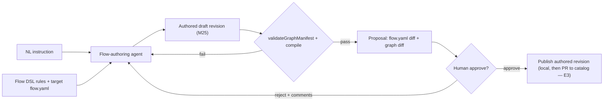

# Flow Authoring Assistant — feature request

> **Status:** Feature request / vision. Not a committed plan, changes no ADR,
> supersedes nothing. Captures the *what* and *why* of an agent-assisted Flow
> authoring surface so it can be fed into `/aif-plan` later. Lives in `docs/pv/`
> beside [`improvement-roadmap.md`](improvement-roadmap.md); it is the write-side
> companion to roadmap §6 (the Flow-graph editor).

## Problem

Flows are the product's control surface — typed `node` / `gate` / `settings`
graphs in `flow.yaml`. Today they are **hand-edited** YAML inside a tag-pinned
plugin bundle. The M22 workbench can *view* a flow graph but it is **read-only**
(layout authored in the `flow.yaml` presentation section, ADR-064; no write
action). So changing a flow means editing YAML by hand while knowing the DSL,
the gate kinds, the capability/settings schema, the transitions/rework rules,
and the engine-version compat — a high-friction, error-prone, expert-only loop.
That friction bites first during the M20 dogfood, where we want to build and
tune flows quickly.

## Goal

Let a user change a Flow **by describing the change in natural language** and
have a constrained coding agent produce a valid edit, surfaced as a reviewable
**proposal** that a human **approves** before anything is published. The agent
is the write engine behind roadmap §6; the human stays in control of what ships.

## Concept

1. **Instruction.** The user describes a change ("add a `security-review`
   `human_review` gate after `implement`", "split `review` into `review` + `qa`").
2. **Context.** The agent is given the Flow DSL contract — the `flow.yaml`
   schema, node/gate kinds, settings schema, transitions/rework rules, the
   presentation section, the validation rules, and the target flow's current
   manifest — as a curated authoring skill/reference pack.
3. **Edit.** The agent emits a modified `flow.yaml` (or a patch) against an
   **authored draft revision**, never against the pinned plugin.
4. **Validate (hard gate).** The edit must pass the same `validateGraphManifest`
   + compile pipeline the runtime uses. Invalid → the agent iterates; an invalid
   manifest can never become a proposal.
5. **Propose.** A proposal shows the `flow.yaml` diff and a before/after **graph
   diff** (reusing the M22 view).
6. **Approve.** A human with the right role approves (→ publish the authored
   revision) or rejects with comments (→ back to the agent). **Nothing
   auto-publishes.**

## Why now / how it fits

- **Resolves the roadmap §6 write-target decision (owner):** edits land in the
  **authoring/override layer** from the start — authored catalog revisions
  (M25 `authored_capabilities`, draft→publish), not mutations of immutable
  tag-pinned plugin `flow.yaml`. This makes editing work for installed flows,
  not only your own.
- **The substrate already exists.** M25 shipped the authored-capability catalog
  (draft optimistic concurrency, local publish/archive, authored flow
  catalog-only publication). Proposal ≈ draft revision; approve ≈ publish.
- **The view already exists.** M22 gives the flow-graph view for the
  before/after diff.
- **Publication path is E3.** Local publish now; PR-to-catalog-repo + the
  proposal→approve review is the E3 authoring→publication track.

## Scope

**In:**
- NL instruction → agent-edited `flow.yaml` against an authored draft.
- Mandatory validation hard-gate (manifest validate + compile) before propose.
- Proposal with `flow.yaml` diff + graph diff.
- Human approve / reject-with-comments → publish / iterate.
- A curated "Flow authoring" context pack (DSL docs + schema + examples).

**Out (for this feature):**
- Auto-publish / auto-apply of any kind.
- Editing pinned plugin bundles in place.
- Full PR-to-catalog two-way sync (that is E3).
- The human-direct visual canvas editor (that is roadmap §6 proper; this is its
  agent-assisted sibling — they share the authoring/override layer and the
  graph-diff surface).

## Safety & constraints (non-negotiable)

- **The approve gate is the safety boundary.** An agent editing flows is an
  agent editing what governs *other* agents' capabilities, gates, and HITL. A
  bad edit could weaken a gate, broaden a capability, or delete a human step.
  Human approve is therefore **mandatory and never bypassable** — consistent
  with the roadmap E3 "nothing auto-applies" rule.
- **Validation is a hard gate, not advisory.** No invalid manifest is
  proposable.
- **Capability / gate / HITL edits are high-scrutiny.** Edits that touch
  `settings` capability classes, gate `mode: blocking`, or remove human nodes
  must be flagged distinctly in the proposal for the approver.
- **Immutability preserved.** Pinned revisions are never mutated; the agent
  works on an authored override.
- **Constrained agent.** The authoring agent runs with a narrow capability
  profile (read the DSL pack + the target flow; write only the draft
  `flow.yaml`; run validate) — not a general coding session over the repo.

## Open questions (for planning)

- **Actor identity:** does the authoring agent run as an `internal_agent` actor
  (ties to E4 agents-as-actors), a scratch-run-like session, or a dedicated
  narrow session kind?
- **Edit depth in v1:** structural only (nodes/transitions/gates) vs also
  settings/capabilities? (Risk rises with depth.)
- **Context delivery:** ship the DSL contract as one authoring skill/reference
  pack — what is in it, and how is it kept in sync with `config.schema.ts`?
- **Approve UX & roles:** which M13 role approves; does reject-with-comments
  reuse the review-driven-rework machinery?
- **Graph diff:** added/removed/changed nodes & gates on top of the M22 view —
  how much is net-new rendering?
- **Relation to the §6 canvas:** do the canvas editor and the agent share one
  authored-draft model and one approve flow (recommended), or diverge?

## Relationship to existing docs

- Write-side companion to [`improvement-roadmap.md`](improvement-roadmap.md) §6
  (Flow-graph editor) and E3 (authoring→publication).
- Builds on M22 (workbench view, ADR-064/053), M25 (authored catalog), the
  `flow.yaml` validation pipeline, and M13 roles.
- Ready to feed into `/aif-plan` once the open questions above are settled.
