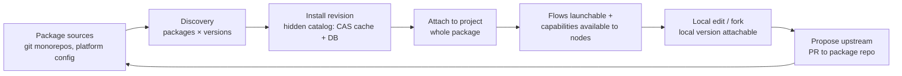

# Package management — package repos, platform catalog, local versions

> **Status:** P0–P2 SHIPPED (M33, `feature/package-management`, 2026-06-12 —
> ADR-087, migration `0047`); P3–P6 remain follow-up planning briefs in §8.
> As-built deltas: file-edit gates use vacuous-presence `artifact_required`
> on commit nodes (§6 note); the discovery staleness knob is
> `MAISTER_PACKAGE_DISCOVERY_STALE_HOURS` (env, default 24); compose stays
> untouched per ADR-023 (host-run web). This document supersedes the deferred
> single-import plan in `.ai-factory/PLAN.md` (its locked decisions are
> carried forward and amended here) and re-resolves design finding **F3**
> ("one `flow.yaml` per source") of
> [`../plans/2026-06-08-aif-flow-package-design.md`](../plans/2026-06-08-aif-flow-package-design.md).
> Lives in `docs/pv/` beside
> [`improvement-roadmap.md`](improvement-roadmap.md); ADR + migration numbers
> are assigned at implementation time (next-free; the M32 outbox plan
> currently claims ADR-085 / migration 0045).

## 1. Goal and end model

A **package** is the self-contained distribution unit for everything a Flow
needs to function: flow graphs, skills, agents, MCP server templates, and
(later) restriction path-sets and platform agents. AIF is the first package;
`superpowers`, `openspec`, `spec-kit` and a `core` package (platform agents:
task triager/router, GitHub intake) follow the same shape.

Target lifecycle:



- Package repos are **git monorepos** (`packages/<name>/…`); more than one
  repo can be configured as a source.
- Versions are **per-package git tags** `<name>/vX.Y.Z`. The tag is the
  user-facing pin; the resolved SHA is runtime truth (ADR-021 semantics).
- MAIster keeps a **platform catalog**: configured sources → discovered
  packages/versions → installed immutable revisions (content-addressed
  cache + DB rows) → per-project attachments.
- **Local versions are first-class**: a locally edited copy of a package
  (adapt-to-taste fork, or a fix under test) can be installed from a local
  directory and attached to a project for real runs, without publishing.
- Package edits travel upstream through **two channels**: (A) the package
  repo registered as a normal MAIster project — tasks/runs/promotion=PR
  (M18, zero new code); (B) Studio fork → full editing → "propose
  upstream" PR (P4, follow-up brief).

## 2. Decisions locked in this design

| # | Decision |
|---|----------|
| D1 | Monorepo layout `packages/<name>/`; per-package tags `<name>/vX.Y.Z`. |
| D2 | Package manifest = `maister-package.yaml` at the package root. No `version` field inside the manifest — the git tag is the only pin. |
| D3 | `maister.yaml` field is **`packages[]`** (renamed from the deferred plan's `flow_packages[]`): `{id, source, version, path?}`. Additive; `flows[]` / `capability_imports[]` keep working. |
| D4 | Source of truth for sources + attachments is **DB, managed from UI**; `maister.yaml packages[]` is the declarative bootstrap at registration AND receives a **write-back** of the pin on every attach/upgrade/detach, so a project can be re-raised on another MAIster instance from git alone. |
| D5 | Two-scope model (carried from 2026-06-09): install once at the **platform instance**, attach/enable **per project**. |
| D6 | Both PR-back channels, phased: repo-as-project now (no code), Studio propose-upstream later (P4). Local-edit protocol: feature branch → fix → PR. |
| D7 | First implementation plan = **P0–P2**. P3–P6 get standalone planning briefs (§8). |
| D8 | AIF bump at extraction (`aif/v2.0.0`): engine 1.4.0 + M30 policies + `must_touch` file-edit gates + frontmatter audit. `must_not_touch` waits for P2 typed ingestion (restriction capabilities) → `aif/v2.1.0`. |
| D9 | Extraction is a plain copy (no git-history surgery); provenance recorded in the package README. |
| D10 | Trust: no new mechanisms — source-prefix policy + per-revision `trust_status`/`exec_trust`, but the decision applies to the **package revision as a whole** (one decision per group). |

## 3. Package repo layout (`maister-plugins`)

```
maister-plugins/
  README.md                      # what this is, tag conventions, how MAIster consumes it
  packages/
    aif/
      maister-package.yaml       # package manifest (§4)
      README.md                  # provenance: extracted from maister@<sha>; upstream ai-factory@2.x
      flows/
        dev/flow.yaml  (+ schemas/*.json)
        bugfix/flow.yaml
        evolve/flow.yaml
        roadmap/flow.yaml
        init/flow.yaml
      capability/
        skills/aif-*/…           # 27 skills, vendored
        agents/*.md              # 19 agents
      config/ai-factory.config.yaml
      setup.sh                   # inert no-op (capability materialization delivers content)
    # core/ — reserved for P6 (triager/intake platform agents); NOT created now
```

No CI in the package repo for now — MAIster's installer validates manifests
at install time (and the repo-as-project channel runs MAIster's own flows
against it later).

## 4. `maister-package.yaml` v1

```yaml
schemaVersion: 1
name: aif
metadata:                        # package-level frontmatter, same shape as flow metadata
  title: "AI Factory"
  summary: "Spec-driven delivery flows + vendored AIF skills/agents."
  links:
    - { kind: framework, title: "AI Factory 2.x", url: "https://github.com/lee-to/ai-factory/tree/2.x" }
  sources:
    - { component: "skills/aif-*, agents/*", origin: "github.com/lee-to/ai-factory@2.x" }
flows:
  - { id: aif-dev,     path: flows/dev }
  - { id: aif-bugfix,  path: flows/bugfix }
  - { id: aif-evolve,  path: flows/evolve }
  - { id: aif-roadmap, path: flows/roadmap }
  - { id: aif-init,    path: flows/init }
capabilities:
  - { id: aif-bundle, path: capability }
mcps: []                         # MCP server templates: {id, transport, command|url, env (env:NAME refs only), description}
```

Contract rules (enforced by the loader, P1):

- `flows[].id` MUST equal the referenced `flow.yaml` `name` (CONFIG on
  mismatch); ids unique within the manifest; `path` is a confined relative
  subpath (no `..`/absolute).
- `mcps[]` ships **templates**, never secrets: env values are `env:NAME`
  references only (existing provider-config convention).
- New content kinds (e.g. `platform_agents`, restriction sets) arrive via a
  `schemaVersion` bump when their consuming milestone lands — nothing is
  reserved speculatively.

## 5. MAIster changes

### P1 — single-import backend

- `maister.yaml` v2 gains `packages[] = {id, source, version, path?}`
  (additive; zod-validated; id collisions checked across
  `packages[] ∪ flows[] ∪ capability_imports[]`).
- `installPackage(...)`: resolve the package root **once** — local dir for
  `file://`/absolute sources, otherwise `git clone --branch <name>/vX.Y.Z
  --depth 1` to a temp — then `loadMaisterPackageManifest`, then sub-install
  every manifest flow via `installFlowPlugin` and every capability bundle
  via the existing capability import, from local subpaths. One clone for a
  5-flow + bundle package.
- **Revision inheritance (critical):** sub-installs MUST record the package
  repo's resolved SHA as their revision (not the `"unknown"` local-source
  sentinel) so `runs.flow_revision` pinning and the content-addressed cache
  keep their immutability contract for git-sourced packages.
- Registration expansion: project registration installs `packages[]`
  alongside the existing loops, with the same slug-scoped compensation on
  failure.

### P2 — platform catalog, discovery, attach

- **Migration** (number = next-free at merge): `package_sources`
  (platform: url, enabled, last_checked_at), `package_installs` (installed
  package revision: source, name, version tag, resolved SHA, manifest,
  digest, install path, trust/setup state), `project_package_attachments`
  (project ↔ package install, pinned version). Existing `flows` and
  `capability_imports` rows gain a nullable `package_install_id` FK so a
  package's parts are managed as one group; standalone flows keep working
  with the FK null.
- **/settings → Package sources**: admin CRUD, same pattern as the platform
  ACP-runner catalog.
- **Discovery**: on-demand (refresh button) + debounced on web startup.
  `git ls-remote --tags <source>` + a shallow default-branch scan of
  `packages/*/maister-package.yaml` → available packages × versions, cached
  in DB with `last_checked_at`. Attached packages with a newer matching tag
  surface an **UpdateAvailable** badge.
- **Attach / detach / upgrade (UI, project scope)**: attach installs the
  revision platform-wide if missing, creates the flow rows + capability
  import as a group, and **writes the pin back** to the project's
  `maister.yaml packages[]` (atomic write; the dirty file is the user's to
  commit). Detach removes the group behind a live-run guard; upgrade
  installs the new revision beside and flips the group pointer (existing
  enablement semantics), then write-back.
- **Local versions (first-class)**: a package install whose source is a
  local directory gets a `local-*` version label and a content-digest
  revision; it appears in the catalog marked **local** and attaches like
  any other version. This is the "fork it, adapt it, run it" loop — and
  later the landing spot for Studio forks (P4).
- **Typed ingestion**: replace the opaque single `agent_definition` record
  with a manifest-driven inventory — skills/agents enumerated in
  `package_installs.manifest`; `mcps[]` templates ingested into the
  project MCP catalog as package-provided entries (removed on detach);
  **restriction path-sets** ingested as flow-package-scoped restriction
  capabilities (this is what unlocks `must_not_touch` for package flows).
- **Viewer**: extend the installed-package viewer (ADR-075) from one flow
  to the whole package — flows, skills, agents, MCP templates, files,
  metadata, version/revision — reachable from both the platform catalog
  and the project packages tab.
- **Trust**: source-prefix policy (`MAISTER_TRUSTED_FLOW_SOURCE_PREFIXES`)
  + per-revision `trust_status`/`exec_trust`, decided once per package
  revision (D10). `setup.sh` still never runs before trust.

## 6. AIF `aif/v2.0.0` bump (applied at extraction, P0)

All five flows:

- `compat.engine_min: 1.4.0`; explicit `defaults: { session_policy: resume }`.
- `retry_policy` on every `ai_coding` node:
  `{ attempts: 2, on_errors: [SPAWN, EXECUTOR_UNAVAILABLE, CHECKPOINT, ACP_PROTOCOL], workspace: rewind-to-node-checkpoint }`.
- Review-driven fix loops (`aif-dev`, `aif-bugfix` `review` nodes):
  `rework.workspacePolicies: [keep, rewind-to-node-checkpoint]` — the
  reviewer chooses. `plan_review → plan` stays `[keep]`.
- **File-edit gates (`must_touch`)** on the meta-flows whose write zones
  are project-agnostic: `aif-evolve`/`aif-init` runs must touch
  `.ai-factory/**` or `.claude/**`; `aif-roadmap` must touch
  `.ai-factory/**`. Mechanism (constrained by two engine facts discovered
  during this design): `pre_finish` gates run BEFORE `output.produces`
  recording, so a node cannot gate on its own produced artifact; and
  mutation ranges are committed-only (`git diff base..head`), while AIF
  defers all committing to the final `/aif-commit` node. Therefore the
  gate lands on the **`commit` node** — a blocking `artifact_required`
  gate with NO `inputArtifacts` (presence check passes vacuously),
  `must_touch` globs, and a declared `mutation_report` output. The commit
  node's node-range (its start HEAD → tip after `/aif-commit`) is exactly
  the flow's full changeset. `aif-dev`/`aif-bugfix` keep their existing
  `impl-diff` gates (a generic package cannot know a host project's code
  layout, and `must_touch: ["**"]` is a tautology).
- **`must_not_touch` is deliberately NOT in v2.0.0**: it resolves through
  restriction capability records, which packages cannot ship until P2
  typed ingestion. Enabling it earlier would be a silent no-op
  ("unmatchable" in the mutation report) — security theater. Ships as
  `aif/v2.1.0` after P2.
- Frontmatter audit: all five flows already carry complete `metadata`
  blocks (title/summary/labels/route_when/links/sources) — verified, no
  gaps; the package manifest adds the package-level frontmatter (§4).

## 7. P0 — extraction mechanics

1. **Fill `maister-plugins`** (repo exists, empty): layout per §3, content
   copied from `plugins/aif` with the §6 bump applied; initial commit; tag
   `aif/v2.0.0`. Manifests are validated by parsing each `flow.yaml`
   through the maister loader before committing.
2. **maister repo cleanup** (lands with the implementation plan): delete
   `plugins/aif`; rewire the root dogfood `maister.yaml` to
   `file:///…/maister-plugins/packages/aif/flows/*` (this also fixes the
   current wiring, which points at a deleted worktree
   `peaceful-mclean-6a799f`); keep the 6-entry wiring until P1, then
   collapse to one `packages[]` entry; update `docs/flow-aif-plugin.md`,
   `aif-flows` tests, and cross-references.
3. **After P1**: the dogfood `packages[]` entry can use the real git URL +
   `aif/v2.0.0` tag (registration-time pull). **After P2**: the same repo
   is added as a platform package source and version pulls happen from the
   UI (discovery → install → attach).

## 8. Follow-up planning briefs (out of this plan's scope)

Standalone, ready-to-fire planning requests. Each carries enough context to
be planned cold; pointers: this doc, `docs/system-analytics/flow-packages.md`,
`docs/system-analytics/flow-studio.md`, `web/lib/runs/pr-adapter.ts`.

- **P3 — Package development via repo-as-project.** Register
  `maister-plugins` as a normal MAIster project; package changes ride
  tasks → runs → promotion `pull_request` (M18). Deliverable is a
  documented workflow (+ optionally a maister.yaml for that repo), zero
  platform code. Unblocked immediately after P0.
- **P4 — Studio package editing + propose-upstream.** Extend authored
  catalog + Flow Studio from single-flow to package granularity: fork an
  installed package revision into an editable draft set (per-kind editors
  exist since M29), edit flows/skills/agents/mcps, validate, then a baked
  feature-branch protocol: export package bytes → clone package repo →
  branch → commit → push (`pushBranch`) → PR (`PrAdapter`). "Fix a
  version" = the PR proposes the bump; the maintainer tags on merge.
  Studio forks should also be installable as **local versions** (P2
  primitive) for test runs before proposing.
- **P5 — Agent-assisted package editing.** Natural-language package
  editing ("remove X from node Y, add a gate Z") driven by an agent that
  edits the Studio draft set; review stays human. Builds on P4's draft
  granularity; likely a scratch-run variant with a package-editing
  toolset.
- **P6 — `core` package content.** Platform agents shipped as a package:
  task **triager/router** (clarifies a task, picks flow via
  `metadata.labels`/`route_when`, picks runner + delivery policy) and
  **GitHub intake** (reads issues, creates internal tasks + relations).
  Depends on the platform-agents direction (M32 outbox,
  `agent_tick` scheduler job, MCP facade actor model;
  see [`agents-as-environment-actors.md`](agents-as-environment-actors.md)).
  The package manifest grows a `platform_agents` section via
  `schemaVersion` bump.
- **Open note — package capability materialization into the consuming
  repo.** Today bundle skills/agents materialize into the **run worktree**
  (repo-local copies win). Open direction: an optional script/command to
  materialize package skills/agents into the project repo itself (so
  developers use them outside MAIster runs), or keep worktree-only.
  Decide later; owner explicitly deferred.

## 9. Verification

- **P0**: every new `flow.yaml` parses through the maister loader at
  engine 1.4.0; `aif-flows` tests pass against the new location; a
  dogfood `aif-dev` run launches on the rewired `file://` wiring.
- **P1**: unit + integration per the carried-over deferred plan — manifest
  loader rejects (`..` paths, dup ids, name↔id mismatch), single-clone
  contract, **SHA inheritance** of sub-installs, registration expansion +
  compensation.
- **P2**: integration/e2e — source CRUD, discovery smoke (tag listing +
  manifest scan), attach/detach/upgrade group semantics, maister.yaml
  write-back, MCP template ingestion + removal on detach, local-version
  install + attach, viewer renders whole package; migration tests.
- Repo gates: `tsc`, scoped eslint, vitest unit/integration, e2e where
  touched, `pnpm validate:docs`.

## 10. Risks and caveats

- **ADR/migration numbering is contested** (M32 plan claims ADR-085 /
  migration 0045; several feature branches in flight) — assign next-free
  at merge, expect renumber obligations.
- **Cache semantics for monorepo sub-installs**: without §5/P1 revision
  inheritance, git-sourced package flows would land at `@unknown`,
  breaking immutability for in-flight runs. This is the one place P1 must
  touch installer internals rather than just orchestrate.
- **`maister.yaml` write-back** mutates a user repo's working tree by
  design (the file is MAIster's own config in that repo); the write is
  atomic and the user commits when ready. Conflicts are possible if the
  user edits the same block concurrently — last write wins, registration
  re-sync is the recovery path.
- **Discovery cost**: `ls-remote` + shallow manifest scan per source is
  cheap, but per-source failures must degrade to stale-cache with a
  warning, never block the catalog page.
- **GC**: package installs join the existing revision-GC story (M19
  preserve-then-prune); a `Removed` package revision sweeps only when no
  run pins it and no project attaches it.
- **Engine feedback (found here, candidate later work)**: mutation
  assertions are commit-range sensors and `pre_finish` gates run before
  `produces` recording — together this forces commit-at-end flows to
  carry mutation gates on the commit node and makes mid-flow `diff`
  artifacts empty until something commits. Candidate engine work:
  working-tree-aware mutation ranges and/or recording `produces` before
  gate execution. Not in P0–P2 scope.
