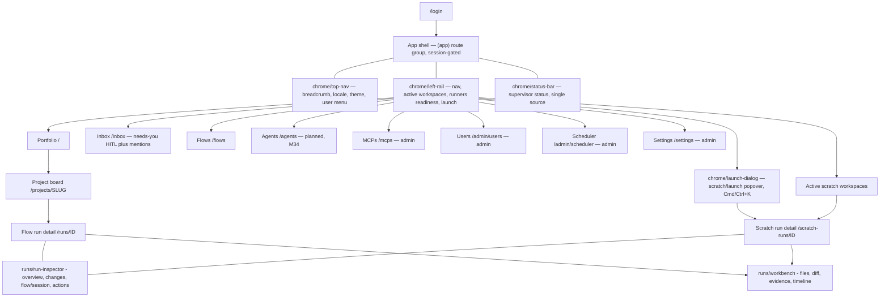

# Screens reference (`docs/screens/`)

> A maintained, **screenshot-free** reference of MAIster's user-facing screens
> and the shared chrome that frames them. It answers "what is this screen for,
> who can use it, how do you get here, and what does it show" — without a single
> image. Behavior lives in [`system-analytics/`](../system-analytics); this
> reference describes the **surface**, and links to the behavior docs for the
> "why".

This folder follows the `docs/` contract in [`../CLAUDE.md`](../CLAUDE.md):
Markdown + Mermaid only (no screenshots — R1), English only (R8), Mermaid for
every diagram (R2). `pnpm validate:docs` must pass.

## What belongs here — classification rule

One file per:

- **screen** — a route the user navigates to (`/inbox`, `/mcps`, a board).
- **block** — a self-contained panel reused across screens (the HITL inbox
  block, the active-workspaces list).
- **chrome** — persistent shell present on every screen (left rail, status bar,
  top nav, launch dialog).

Keep the tree **flat plus `chrome/`** while small. Once an IA area reaches **≥ 3
files**, group it into an area subdirectory (`project/`, `admin/`, `flows/`, …).
Cross-cutting chrome always stays under `chrome/`.

```
docs/screens/
  README.md          # this file — index + IA map + template + classification rule
  chrome/            # cross-cutting shell present on every screen
    left-rail.md     # nav sections + runners-readiness + launch button + Needs-you badge
    active-workspaces.md # per-project live-run rows inside the rail (block)
    status-bar.md    # footer supervisor status (single source)
    top-nav.md       # breadcrumb + locale/theme/user menu
    launch-dialog.md # scratch/launch popover + Cmd/Ctrl+K
  runs/              # run detail area (flow, scratch, shared blocks)
    flow-run.md      # /runs/:runId flow/agent run landing surface
    scratch-run.md   # /scratch-runs/:runId conversation-first surface
    run-inspector.md # shared right sidebar for run info + actions
    workbench.md     # shared Files/Diff/Evidence/Timeline workbench
  inbox.md           # /inbox
  mcps.md            # /mcps (admin)
```

## Per-doc template

Every screen/block/chrome doc follows this section order. Omit a section only
when it genuinely does not apply (say so in one line rather than leaving it
blank).

1. **Header** — name · route(s) · status `(Implemented Mxx | Planned)` · source
   component path.
2. **JTBD** — the job(s) the screen is hired for, phrased
   "When ⟨situation⟩ … I want … so I can …".
3. **Roles & capabilities** — a table of role (global `viewer/member/admin`;
   project `viewer/member/admin/owner`) × what they can see and do here, tied to
   `requireProjectAction` / `requireGlobalRole`.
4. **Navigation** — entry points (how you arrive) and exits (where each action
   leads) as links to other `screens/*` docs; a small Mermaid `flowchart` for
   non-trivial flows.
5. **Layout & regions** — prose walkthrough of the regions/blocks/components,
   linking to their block docs.
6. **States** — a Mermaid `stateDiagram-v2` for meaningful states (empty /
   loading / error / role-gated / live) when the screen has them.
7. **Data & APIs** — the feeding routes/queries/SSE; link to
   `system-analytics/*` for behavior, do not restate it (R7).
8. **i18n** — the `web/messages` namespace(s) the screen reads.
9. **Linked artifacts** — ADRs (cited as bare `#adr-NNN`),
   `system-analytics/*`, and source paths.

## Global navigation & IA map

The persistent chrome (top nav, left rail, status bar, launch dialog) frames
every `(app)` screen. The left rail is the primary navigation spine; admin-only
destinations appear only for global admins.



## Index

| Doc | Screen / chrome | Route | Status |
| --- | --- | --- | --- |
| [`chrome/left-rail.md`](chrome/left-rail.md) | Left rail (nav + workspaces + runners readiness + launch) | shell | Implemented (WI-3); Inbox badge WI-1 |
| [`chrome/active-workspaces.md`](chrome/active-workspaces.md) | Active-workspaces block (per-project live-run rows in the rail) | shell | Implemented (grouping/TTL/actions); compact-row redesign Designed |
| [`chrome/status-bar.md`](chrome/status-bar.md) | Footer status bar (supervisor, single source) | shell | Implemented (WI-3) |
| [`chrome/top-nav.md`](chrome/top-nav.md) | Top nav (breadcrumb, locale, theme, user) | shell | Implemented (WI-3) |
| [`chrome/launch-dialog.md`](chrome/launch-dialog.md) | Launch dialog (scratch/launch popover + Cmd/Ctrl+K) | shell | Implemented (WI-4/WI-5) |
| [`inbox.md`](inbox.md) | Unified inbox | `/inbox` | Implemented (WI-1) |
| [`mcps.md`](mcps.md) | Platform MCP catalog (admin) | `/mcps` | Implemented (WI-2) |
| [`studio/README.md`](studio/README.md) | Flow Studio redesign (area design: overview · sources · packages · package detail · editor · local workspace) | `/studio/*` | Implemented (Phase A: overview · sources · packages · detail); B/C Planned |
| [`runs/flow-run.md`](runs/flow-run.md) | Flow run detail | `/runs/{runId}` | Planned rework |
| [`runs/scratch-run.md`](runs/scratch-run.md) | Scratch run detail | `/scratch-runs/{runId}` | Planned rework |
| [`runs/run-inspector.md`](runs/run-inspector.md) | Run inspector block | shared | Planned |
| [`runs/workbench.md`](runs/workbench.md) | Run workbench block | shared | Planned rework |

Going forward, **each screen work-item updates its screens doc** in the same
phase that ships the screen. New screens add a row here and a file following the
template above.
