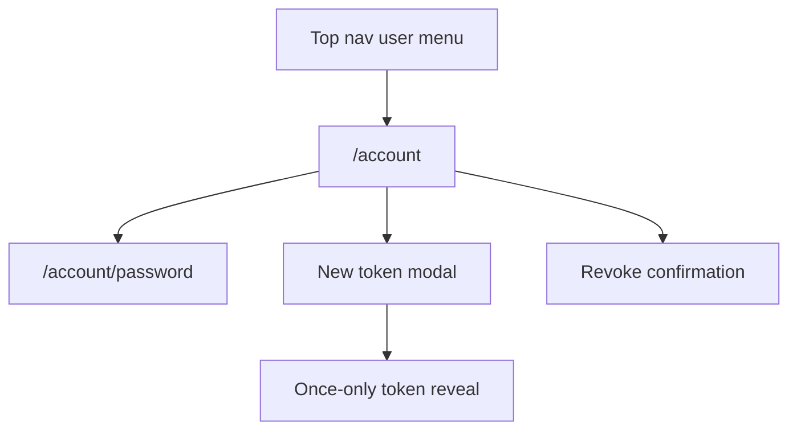
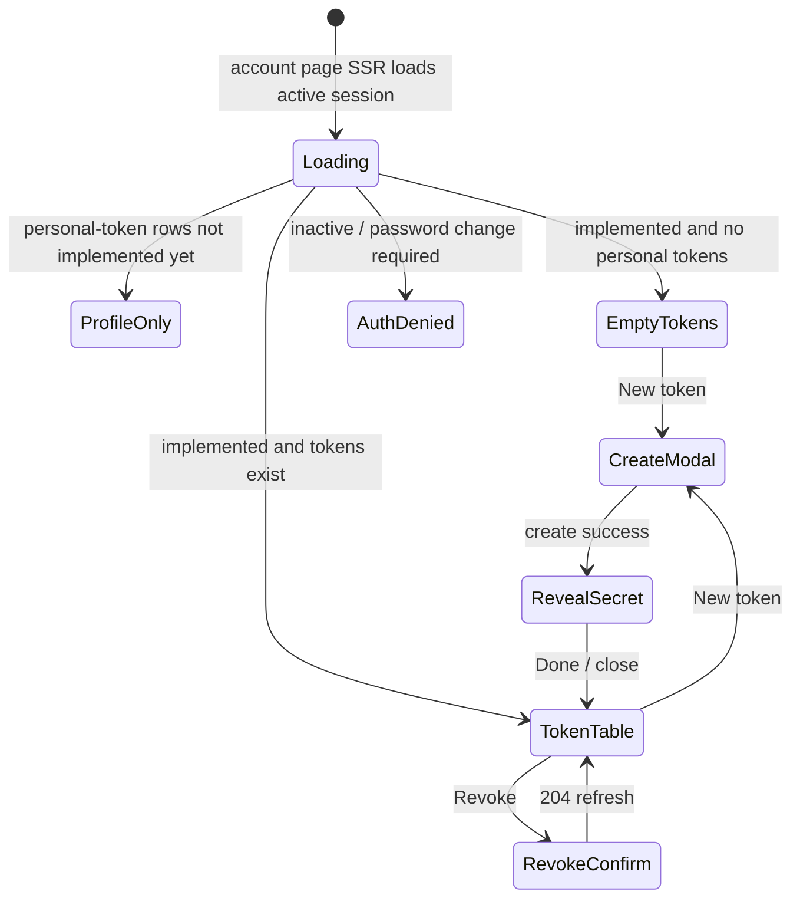

# Account

- **Route:** `/account`; password sub-screen `/account/password`.
- **Status:** Implemented for profile/password and personal API tokens.
- **Source:** `web/app/(app)/account/page.tsx`,
  `web/app/(app)/account/actions.ts`,
  `web/app/(app)/account/password/page.tsx`,
  `web/app/(app)/account/password/actions.ts`,
  `web/components/account/profile-form.tsx`,
  `web/components/account/password-form.tsx`.
  Personal-token source:
  `web/components/account/personal-tokens-panel.tsx`.

## JTBD

When I manage my MAIster account, I want one place for profile, password, and
personal API-token controls so I can keep my identity current and give my own
agents narrowly scoped access without opening a project settings screen.

When I create a personal API token, I want the secret shown once with explicit
capability boundaries so I can connect a local personal agent and understand
whether it can answer human HITL gates.

## Roles & capabilities

| Role | Can see | Can do |
| --- | --- | --- |
| Signed-in active user | Own profile, own password link, own personal API tokens | Edit display name, change password, create/list/revoke own personal tokens |
| User with `must_change_password=true` | Redirected to `/change-password`; cannot use `/account` actions except password clearing flow | Clear forced password change |
| Disabled or pending user | No account screen access | None |
| Global admin | Same as signed-in user for their own account | Admin powers live in `/admin/users`, not here |

Profile and token actions use `requireActiveSession()`. Personal-token routes
must scope every query by `owner_user_id = session.user.id` and
`project_id IS NULL`.

## Navigation

- **Entry:** top-nav user menu -> Account.
- **Within:** "Change password" opens `/account/password`; "New token" opens
  the personal-token create modal; revoke opens a confirmation affordance.
- **Exit:** done/close returns to `/account`; left rail and breadcrumbs keep
  the normal shell navigation.

## Layout & regions

- **Header**: compact account eyebrow, title, short description, and
  "Change password" action.
- **Profile section**: existing display-name form, read-only email, and global
  role badge. This remains first.
- **Personal API tokens section**: appears below Profile. It has a compact
  header, primary "New token" action, table-first body, and no marketing copy.
  The table columns are name, prefix, capability summary, human HITL capability,
  created at, last used at, expires at, revoked state, and actions.
- **Create token modal**: name, expiry, grouped capabilities, advanced raw scope
  checklist, and a separate human HITL toggle. The raw checklist excludes
  `hitl:respond:human`; the toggle owns that high-risk scope.
- **Once-only reveal**: after create succeeds, the modal shows the plaintext
  token exactly once with copy/select controls and a warning that closing loses
  the secret.
- **Revoke confirmation**: row action asks for confirmation, then refreshes the
  table. First revoke and already-revoked both surface success.

The project Integrations screen keeps project-bound tokens only; it may link
here for personal tokens but must not duplicate the global token table.

## States

## Data & APIs

- Profile update: `web/app/(app)/account/actions.ts`.
- Password update: `web/app/(app)/account/password/actions.ts`.
- Personal token list/create: `GET/POST /api/account/tokens`.
- Personal token revoke: `DELETE /api/account/tokens/{tokenId}`.
- Token behavior and authz:
  [`../system-analytics/identity-access.md`](../system-analytics/identity-access.md),
  [`../system-analytics/external-operations.md`](../system-analytics/external-operations.md),
  and `.ai-factory/specs/feature-user-access-tokens.md`.
- Wire contract: [`../api/web.openapi.yaml`](../api/web.openapi.yaml).

The browser receives plaintext token only in the create response. It is never
logged, never stored in local storage, and never returned by list/revoke routes.

## i18n

Uses the `account` namespace from `web/messages/{locale}.json`. The personal
token section adds stable nested keys under `account.personalTokens` for titles,
columns, capability groups, modal copy, once-only reveal, revoke, status badges,
and API error labels. Components must call these keys directly, following the
existing explicit-key style such as `taskDetail.lcChecks`; no visible token UI
label is hardcoded in component-local literals. EN and RU must stay in parity.

## Linked artifacts

- SDD:
  [`.ai-factory/specs/feature-user-access-tokens.md`](../../.ai-factory/specs/feature-user-access-tokens.md).
- Behavior:
  [`../system-analytics/identity-access.md`](../system-analytics/identity-access.md),
  [`../system-analytics/external-operations.md`](../system-analytics/external-operations.md),
  [`../system-analytics/hitl.md`](../system-analytics/hitl.md).
- API: [`../api/web.openapi.yaml`](../api/web.openapi.yaml).
- DB: [`../database-schema.md#project_tokens`](../database-schema.md#project_tokens),
  [`../db/integrations-domain.md`](../db/integrations-domain.md).
- Source: `web/app/(app)/account/page.tsx`,
  `web/components/account/profile-form.tsx`,
  `web/components/account/personal-tokens-panel.tsx`,
  `web/app/api/account/tokens/route.ts`,
  `web/app/api/account/tokens/[tokenId]/route.ts`.
