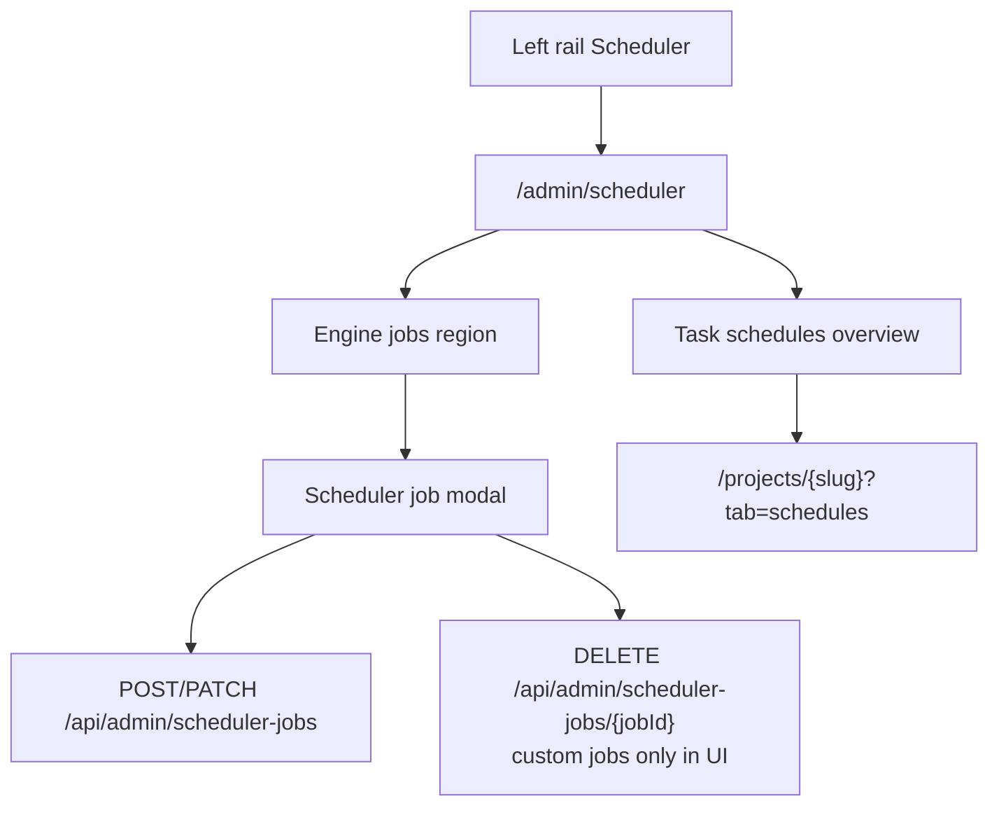
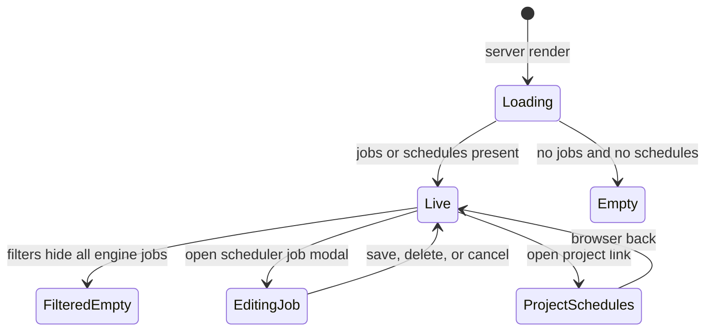
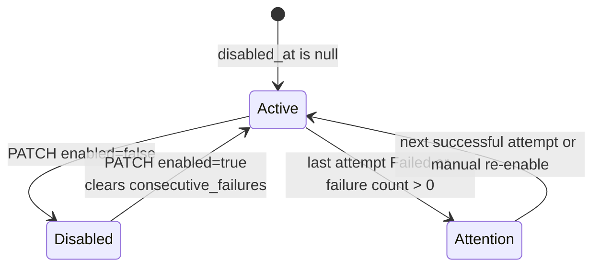

# Scheduler

- **Type:** screen (admin).
- **Route:** `/admin/scheduler` (global admin only).
- **Status:** Implemented (M24 scheduler admin; M28 cockpit, typed target
  editor, and Task schedules overview).
- **Source:** `web/app/(app)/admin/scheduler/page.tsx`,
  `web/components/admin/scheduler-jobs-table.tsx`,
  `web/components/admin/scheduler-job-edit-modal.tsx`,
  `web/components/admin/scheduler-run-schedules-overview.tsx`.

## JTBD

When I administer the MAIster host, I want to understand which background clock
jobs are active, what each job targets, and which user-facing task schedules are
waiting to fire — so I can pause, repair, or inspect scheduler behavior without
guessing what raw JSON means.

## Roles & capabilities

| Role | Access |
| --- | --- |
| Global admin | Full scheduler page access; list Engine jobs, create custom jobs, edit allowed fields, pause/resume jobs, and open project schedule links. |
| Everyone else | No nav item; the route and API return `UNAUTHORIZED` through `requireGlobalRole("admin")`. |

The hidden nav item is convenience only. The route and
`/api/admin/scheduler-jobs` family are the authorization boundaries.

## Navigation

- **Entry:** the admin block of the [left rail](chrome/left-rail.md), alongside
  Users, MCPs, and Settings.
- **Within:** Engine job filters stay URL-synchronized; "New job" and per-row
  edit open the scheduler job modal.
- **Exit:** Task schedule rows link to the owning project schedule tab
  (`/projects/{slug}?tab=schedules`) for project-scoped edits.

## Layout & regions

- **Header** — admin eyebrow, page title, and concise scheduler purpose.
- **Engine jobs** — full-width view-only table over `scheduler_jobs` plus last
  `scheduler_job_runs` attempt. The table shows job id, kind, target summary,
  cadence, next run, enabled/disabled state, failure count, last attempt
  status/error, and row actions. Filters cover every DB-supported job kind,
  including seeded-only dispatchers.
- **Scheduler job modal** — create/edit surface for allowed Engine jobs. The
  primary target editor is typed: command jobs use HTTP/host ping fields,
  `flow_run` jobs use task id plus optional runner/base/target branches, and
  seeded singleton rows show no target fields. A read-only advanced target
  preview may appear for diagnostics.
- **Task schedules overview** — read-only cross-project table over
  `run_schedules`, joined to project, task, and last run. It shows schedule
  name, project link, task number/title, enabled state, cron/timezone, next
  fire, catch-up flag, last outcome/error, and last run status/link when
  available. It does not create global schedule CRUD.

## States

Row state is derived from persisted scheduler fields:

## Data & APIs

- Engine jobs: `listSchedulerStatusRows()` selects `scheduler_jobs` and the
  latest attempt from `scheduler_job_runs`.
- Engine job mutations: `GET`, `POST`, `PATCH`, and `DELETE`
  `/api/admin/scheduler-jobs[/{jobId}]`; per-kind `target` shapes are described
  in [`../api/web.openapi.yaml`](../api/web.openapi.yaml).
- Task schedules overview: read-only query over `run_schedules` joined to
  `projects`, `tasks`, and `runs`. Edits stay in the project schedule surface.
- Behavior lives in
  [`../system-analytics/scheduler.md`](../system-analytics/scheduler.md) and
  [`../system-analytics/run-schedules.md`](../system-analytics/run-schedules.md).

## i18n

`adminScheduler` (page, table, filters, typed target editor),
`projectSchedules` (schedule labels/outcomes reused in the overview),
`apiErrors` (mutation failures), and `common` where shared buttons are reused.

## Linked artifacts

- API: [`../api/web.openapi.yaml`](../api/web.openapi.yaml).
- Behavior:
  [`../system-analytics/scheduler.md`](../system-analytics/scheduler.md),
  [`../system-analytics/run-schedules.md`](../system-analytics/run-schedules.md).
- DB: [`../database-schema.md`](../database-schema.md),
  [`../db/scheduler-domain.md`](../db/scheduler-domain.md).
- ADR: [ADR-060](../decisions.md#adr-060-unified-scheduler-clock-and-polymorphic-job-budgets),
  [ADR-071](../decisions.md#adr-071-user-facing-run-schedules-on-the-m24-clock),
  [ADR-086](../decisions.md#adr-086-domain-event-outbox-as-the-shared-trigger-bus),
  [ADR-089](../decisions.md#adr-089-platform-agent-catalog-with-per-agent-runner-and-a-five-source-trigger-model).
- Source: `web/app/(app)/admin/scheduler/page.tsx`,
  `web/lib/queries/scheduler.ts`, `web/lib/scheduler/job-admin.ts`,
  `web/lib/scheduler/job-admin-schema.ts`,
  `web/components/admin/scheduler-jobs-table.tsx`,
  `web/components/admin/scheduler-job-edit-modal.tsx`,
  `web/components/admin/scheduler-run-schedules-overview.tsx`.
