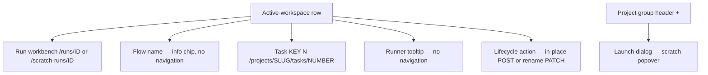
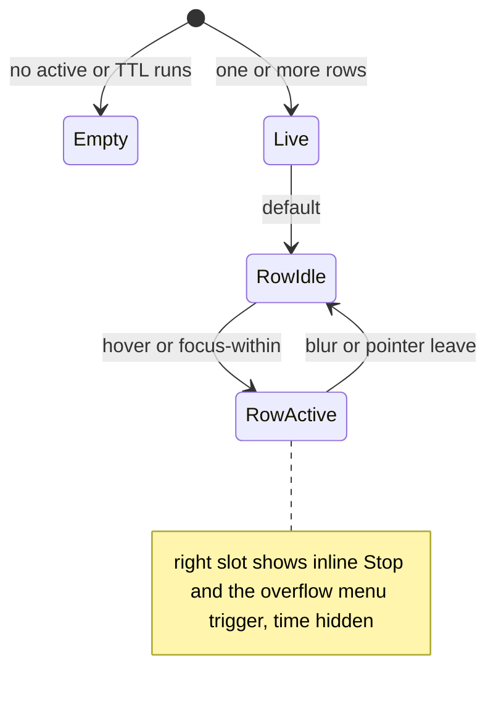

# Active workspaces (left-rail block)

- **Type:** block — the per-project list of live runs inside the left rail
  chrome (present on every `(app)` screen). Not a standalone route; the rail
  hosts it.
- **Status:** **Implemented** (active-workspaces compact redesign): the compact
  two-line row, the single colour-coded state dot (waiting-for-human states use
  the warm `--attention` token), ticket-derived names + scratch rename
  (`PATCH /api/scratch-runs/{runId}`), linked flow/issue chips, the non-linking
  runner info chip, the per-project grouping, RBAC scoping, TTL/archived badges,
  and per-run workbench-lifecycle actions (M27). Repeated UI glyphs use packaged
  Heroicons instead of local one-off SVG paths. **Implemented (row-actions
  redesign):** the fixed-height row (no hover jump), the reserved right slot that
  keeps the name always clickable, the inline `Stop` (live only) beside a single
  `⋯` overflow that opens a modal **action-sheet**, the live combined `Stop &
  archive` / `Stop & drop` actions, and the rename **modal** (replacing the
  inline rename input). Snapshot / push / handoff are dropped from the rail
  surface (they stay in the run card).
- **Source:** `web/components/chrome/left-rail.tsx` (rail host) +
  `web/components/chrome/active-workspace-row.tsx` (the extracted client row,
  new), fed by `getRailWorkspaceGroups` in `web/lib/queries/portfolio.ts`.

## JTBD

When I am working across projects, I want every live run visible at a glance —
its state, which flow and ticket it belongs to, and which runner it runs on —
and I want to act on it (open, stop, rename, archive, export) in place, so I can
triage and steer work without leaving the current screen or scrolling past
full-width buttons.

## Roles & capabilities

| Role | Sees | Acts |
| --- | --- | --- |
| Global viewer / member | Active runs in projects they are a member of (the rail query is membership-scoped) | Opens a run; lifecycle actions and rename are gated per-route by `requireProjectAction` on the target project — a viewer cannot stop/archive/drop/export/rename |
| Global admin | Active runs across **all** non-archived projects | All actions, every project |

The rail never relaxes a project's authorization: visibility is membership- or
admin-scoped in `getRailWorkspaceGroups`, and every action re-checks its own
project action server-side. Rename is a project action on the scratch run's
project, not a creator-only check.

## Navigation

Entry points / exits for one row:

- **Row body (name)** → the run workbench: `/runs/[id]` (flow / agent) or
  `/scratch-runs/[id]` (scratch).
- **Flow chip** → no navigation. There is no installed-flow detail page — the
  `/flows/[projectSlug]/[capId]` route is Flow Studio's *authored-capability*
  editor, keyed by an authored `cap_id`, not the installed `flow_ref_id` a flow
  run references. The flow chip is an information chip (name + tooltip); the
  flow's live graph is reached by opening the run itself.
- **Issue chip `KEY-N`** → the task detail `/projects/[slug]/tasks/[number]`
  (present when the run resolves a task — `runs.task_id` for flow/agent, or
  `scratch_runs.linked_task_id` for a scratch run; hidden otherwise).
- **Runner chip** → no navigation. It is an information chip; the full runner
  description lives in its tooltip.
- **Row actions** → an inline `Stop` (live only) plus a `⋯` overflow that opens
  a modal **action-sheet**. The sheet's items are in-place `POST`s
  (`stop-archive` / `stop-drop` while live; `archive` / `drop` while parked) and
  open the rename **modal** (scratch only, `PATCH /api/scratch-runs/{runId}`).
  Snapshot / push / handoff are not on the rail (run card only). See
  [workbench-lifecycle](../../system-analytics/workbench-lifecycle.md).
- **Group `+`** → the [launch dialog](launch-dialog.md) scratch popover, scoped
  to that project.

## Layout & regions

The block is a stack of per-project groups, each with a header
(`project name` · active count · `+` scratch launch) followed by its run rows.
In the expanded rail the block is inline; in the collapsed rail the same block is
hosted inside the Active workspaces flyout, without duplicating narrow text rows
in the icon rail.
A row is two lines:

1. **Line 1 — identity + slot.** A single **state dot** (the only state
   indicator), then the **name**, then the **right slot**. Line 1 has a fixed
   `min-height` equal to the action-button height, so swapping the resting time
   for the hover actions never changes the row height (no vertical jump).
   - **State dot** — colour encodes the run state; the running tone pulses
     gently. For attention states the dot is followed by a compact **status
     word**; for calm states the word lives only in the dot's `title` /
     `aria-label`. See the tone table under [States](#states). Running vs
     waiting-for-human are deliberately distinct hues — waiting uses a new warm
     `--attention` token (the only warm accent besides `--danger`).
   - **Name** — scratch runs show their editable `name` (renamed through the `⋯`
     menu's rename **modal**, not an inline field); flow / agent runs show a
     **ticket-derived** name (`KEY-N` + task title), falling back to the branch
     when there is no task. The name is a `Link` that keeps the remaining width
     at rest and on hover and is never covered by the right slot, so it stays
     clickable.
   - **Right slot** — a **fixed-width** slot sized for at most two buttons
     (`Stop` + `⋯`). It shows the relative time by default; on row **hover** or
     keyboard **focus-within** the time is replaced by the inline `Stop` (only
     while the run is live) and the `⋯` overflow trigger. The buttons are
     focusable siblings of the row link (never nested inside the anchor), so
     keyboard users reach them and the row stays a single link target.
2. **Line 2 — meta chips.** A non-linking **flow** info chip (Heroicon + flow name;
   tooltip carries the `flow_ref_id` + pinned version), a non-linking **runner**
   info chip (Heroicon + `runner-ref`; tooltip carries
   `agent · model · adapter · provider · sidecars`), and a linked **issue**
   `KEY-N` chip (only when the run resolves a task). TTL warning/due and archived
   badges render here when the GC projection or archive flag is set.

**The `⋯` action-sheet** is a compact modal (the shared `DialogShell` — focus
trap, Escape, scroll lock) titled "Run actions", with the run identity in the
header (a linked-task `KEY-N` chip when present + the name). Its body is a
vertical action list whose set depends on run state (the same `lifecycleActions`
policy as the run card):

- **Live** (`Running` / `NeedsInput` / `NeedsInputIdle`): `Open run` ·
  `Rename` (scratch only) · `Stop & archive` · `Stop & drop`. Plain `Stop` is
  the inline primary, so it is not duplicated in the list.
- **Terminal with a live worktree** (`Review` / `Crashed` / `Done` /
  `Abandoned` / `Failed`): `Open run` · `Rename` (scratch only) · `Archive` ·
  `Drop`.

Destructive items (`Drop`, `Stop & drop`) use the danger tone. Selecting an item
that needs confirmation or input swaps the sheet body to that action's existing
confirm/input panel (the rename field, the archive/drop confirm) — the sheet is
the root of the existing lifecycle dialog state machine
([lifecycle-actions](../../system-analytics/workbench-lifecycle.md)). A muted
footer notes `snapshot · push · handoff → in run card`. The rail action-sheet is
a modal (not an anchored dropdown) because the rail body is `overflow-y-auto`
and would clip an absolute popover.

## States

The block's own meaningful states are the empty/live split and the per-row
right-slot micro-interaction:

State-dot tone mapping (colour is the at-a-glance language; the word is shown in
the row only when attention is required):

| Run state | Dot tone | Pulse | Status word in row |
| --- | --- | --- | --- |
| Running | green (`--accent-2`) | yes | no — tooltip only |
| NeedsInput / NeedsInputIdle | amber (`--attention`, new) | no | yes |
| Review | teal (`--accent-3`) | no | yes |
| Crashed | red (`--danger`) | no | yes |
| HumanWorking | neutral (`--ink-2`) | no | no — tooltip only |
| Done / Abandoned (TTL) | dim (`--mute-2`) | no | no — tooltip only |

## Data & APIs

- `getRailWorkspaceGroups(userId, role)`
  (`web/lib/queries/portfolio.ts`) — membership/admin-scoped active runs plus
  terminal runs still carrying a GC deadline. The redesign extends its select
  with joins: `tasks` (`number`, `title`) + `projects.task_key` → the `KEY-N`
  label and the ticket-derived name (for scratch runs the task is reached via
  `scratch_runs.linked_task_id`), and `flows` (`flow_ref_id` + pinned version) →
  the flow chip name + tooltip (no link — see Navigation). Runner detail for the
  tooltip comes from the existing `runs.runner_snapshot` (agent / model /
  adapter / provider / sidecar) — no new column.
- **Rename** — `PATCH /api/scratch-runs/[runId]` writes `scratch_runs.name`
  (atomic, project-action gated, scratch runs only); the contract is unchanged.
  The redesign moves the editor out of the row into a `DialogShell` **modal**
  whose header shows the linked-task `KEY-N` chip when `linked_task_id` resolves
  — reusing the same `tasks` (`number`) + `projects.task_key` fields already
  joined for the issue chip, so no new query. Flow / agent runs are renamed by
  editing their task, not here.
- **Lifecycle actions** — the parked `archive` / `drop` and the plain `stop`
  endpoints are unchanged. The redesign adds the combined live actions
  `POST /api/runs/{runId}/stop-archive` and `POST /api/runs/{runId}/stop-drop`
  (scratch `Stop & drop` reuses `POST /api/scratch-runs/{runId}/discard`) and
  generalizes `POST /api/runs/{runId}/stop` so a live agent row's `Stop`
  terminates the agent instead of erroring. The rail surface drops snapshot /
  push / handoff (run card only). See
  [workbench-lifecycle](../../system-analytics/workbench-lifecycle.md).
- **TTL / archived badges** — the `deriveTtlInfo` projection already on the row
  ([reconciliation-gc](../../system-analytics/reconciliation-gc.md)).

## i18n

`portfolio` (active-workspaces labels, the per-state status words, runner
tooltip field labels, and the reused `rename` keys now driving the rename
modal), `workbenchLifecycle` (existing action labels / tooltips / dialogs plus
the new action-sheet keys: the `menu` title + footer, `openRun`, `stopArchive`,
`stopDrop`, and their confirm bodies), `gc` (TTL / archived badges). EN + RU
both required.

## Linked artifacts

- ADRs: [ADR-065](../../decisions.md#adr-065) (platform ACP runner catalog —
  runner identity in the snapshot), ADR-083 (social board — `KEY-N` task
  identity).
- Behaviour: [workbench-lifecycle](../../system-analytics/workbench-lifecycle.md)
  (actions), [social-board](../../system-analytics/social-board.md) (tasks),
  [reconciliation-gc](../../system-analytics/reconciliation-gc.md) (TTL),
  [runs](../../system-analytics/runs.md) (run state machine behind the dot tone).
- Source: `web/components/chrome/left-rail.tsx`,
  `web/components/chrome/active-workspace-row.tsx` (new),
  `web/components/workbench/lifecycle-actions.tsx`,
  `web/lib/queries/portfolio.ts`, `web/app/api/scratch-runs/[runId]/route.ts`
  (rename `PATCH`, new).
