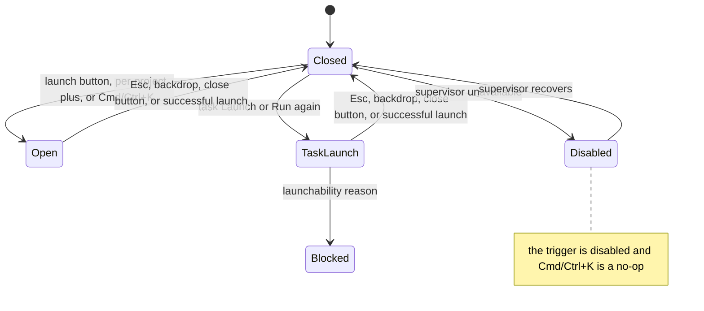

# Launch dialog

- **Type:** chrome (launch surface reachable from the rail and a global
  shortcut).
- **Status:** Implemented (WI-4 restyle, WI-5 Cmd/Ctrl+K shortcut).
- **Source:** `web/components/chrome/scratch-launch-popover.tsx`,
  `web/components/scratch/scratch-launcher.tsx`,
  `web/components/chrome/launch-hotkey-hint.tsx`,
  `web/components/board/launch-popover.tsx`.

## JTBD

When I want to start a scratch session, I want to open a focused launcher from
anywhere with one keystroke and pick the project, runner, and mode — so starting
exploratory work never requires hunting for a button. When I am on a task card
or task detail page, I want a task-scoped launch dialog that shows the resolved
Flow, runner/model, branches, delivery policy, execution controls, and optional
budget limits before a run is created.

## Roles & capabilities

Any authenticated user can open the dialog. Whether a launch can proceed is
gated downstream (project selection + supervisor availability); the trigger
button is disabled while the supervisor is unavailable, and the Cmd/Ctrl+K
shortcut respects that same disabled state.

## Navigation

- **Open:** the rail's primary **Launch run** button, a per-project **+** icon,
  or **Cmd/Ctrl+K** (primary launcher only). Task cards and task detail pages
  open the task-scoped run launch popover from their **Launch** / **Run again**
  action.
- **Close:** Esc, a backdrop click, or the top-right **✕** — the shared
  bare-crossmark close ([popup conventions](../README.md#shared-popup--density-conventions),
  no text label).
- **Submit:** a successful launch routes to the run / scratch detail page.

## Layout & regions

The global scratch launcher uses a trigger button (the primary one carries the
OS-aware
[`LaunchHotkeyHint`](launch-dialog.md) `⌘K` / `Ctrl K` label), then a modal:
a dimmed `bg-paper-warm` backdrop and a panel with a header (title, hint, close)
over the `ScratchLauncher` composer. After WI-4 the composer's field card is
`bg-paper-warm` (flush with the backdrop, no `shadow-inner`) and the control-bar
controls (runner / mode / priority / icon buttons) read as subtly raised
(`border-line` + `bg-ivory` + a top inset highlight + a hover step). Tokens are
theme-aware, so the treatment holds in light and dark.

The task-scoped run launch popover is portal-rendered above the board and left
rail. It preloads launch options from the selected task and shows:

- a human-readable launchability banner for states such as active run,
  relation blocker, missing Flow revision, or installed-but-not-enabled Flow;
- Flow, runner/model, base branch, and target branch selects;
- delivery-policy controls for strategy, push, and trigger;
- execution preset controls plus advanced checks, human-gate, and promotion
  selectors;
- budget inputs for run/task/tree token, failure, warning-percent, and
  wall-clock ceilings. Empty budget fields mean unlimited, and the budget fields
  are visible by default rather than hidden behind a generic advanced toggle.

## States

The shortcut never fires while focus is in an `input` / `textarea` /
`contenteditable`, nor when another `aria-modal` dialog is already open.

## Data & APIs

The `ScratchLauncher` composer owns scratch submission and routing; task-scoped
run launch uses `GET /api/runs/launch-options?taskId=...` followed by
`POST /api/runs` with server-validated overrides. Behavior and the run substrate
live in
[`../../system-analytics/scratch-runs.md`](../../system-analytics/scratch-runs.md).
Task run behavior lives in
[`../../system-analytics/runs.md`](../../system-analytics/runs.md).

## i18n

`scratch` (composer + dialog labels), `portfolio` (`launchRun`, `launchHint`,
`launchUnavailableHint`, `esTip1`), and `launch` (task-scoped run launch
dialog). The shortcut glyph is OS-derived, not translated.

## Linked artifacts

- Behavior: [`../../system-analytics/scratch-runs.md`](../../system-analytics/scratch-runs.md).
- Task run behavior: [`../../system-analytics/runs.md`](../../system-analytics/runs.md).
- Source: `web/components/chrome/scratch-launch-popover.tsx`,
  `web/components/scratch/scratch-launcher.tsx`,
  `web/components/chrome/launch-hotkey-hint.tsx`,
  `web/components/board/launch-popover.tsx`.
