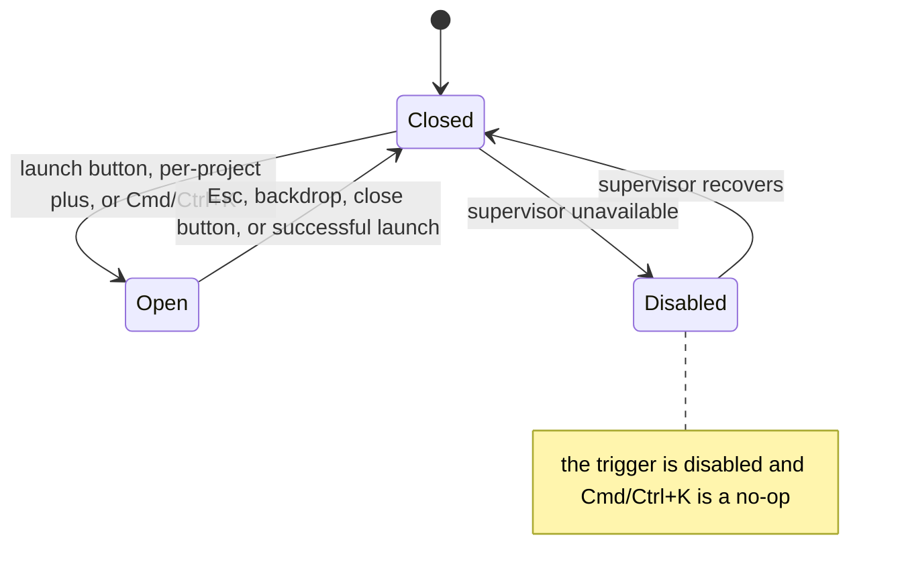

# Launch dialog

- **Type:** chrome (launch surface reachable from the rail and a global
  shortcut).
- **Status:** Implemented (WI-4 restyle, WI-5 Cmd/Ctrl+K shortcut).
- **Source:** `web/components/chrome/scratch-launch-popover.tsx`,
  `web/components/scratch/scratch-launcher.tsx`,
  `web/components/chrome/launch-hotkey-hint.tsx`.

## JTBD

When I want to start a run or a scratch session, I want to open a focused launch
dialog from anywhere with one keystroke and pick the project, runner, and mode —
so starting work never requires hunting for a button.

## Roles & capabilities

Any authenticated user can open the dialog. Whether a launch can proceed is
gated downstream (project selection + supervisor availability); the trigger
button is disabled while the supervisor is unavailable, and the Cmd/Ctrl+K
shortcut respects that same disabled state.

## Navigation

- **Open:** the rail's primary **Launch run** button, a per-project **+** icon,
  or **Cmd/Ctrl+K** (primary launcher only).
- **Close:** Esc, a backdrop click, or the top-right **✕** — the shared
  bare-crossmark close ([popup conventions](../README.md#shared-popup--density-conventions),
  no text label).
- **Submit:** a successful launch routes to the run / scratch detail page.

## Layout & regions

A trigger button (the primary one carries the OS-aware
[`LaunchHotkeyHint`](launch-dialog.md) `⌘K` / `Ctrl K` label), then a modal:
a dimmed `bg-paper-warm` backdrop and a panel with a header (title, hint, close)
over the `ScratchLauncher` composer. After WI-4 the composer's field card is
`bg-paper-warm` (flush with the backdrop, no `shadow-inner`) and the control-bar
controls (runner / mode / priority / icon buttons) read as subtly raised
(`border-line` + `bg-ivory` + a top inset highlight + a hover step). Tokens are
theme-aware, so the treatment holds in light and dark.

## States

The shortcut never fires while focus is in an `input` / `textarea` /
`contenteditable`, nor when another `aria-modal` dialog is already open.

## Data & APIs

The `ScratchLauncher` composer owns launch submission and routing; behavior and
the run substrate live in
[`../../system-analytics/scratch-runs.md`](../../system-analytics/scratch-runs.md).
This screen adds no routes — WI-5 is a client-side `keydown` handler only.

## i18n

`scratch` (composer + dialog labels), `portfolio` (`launchRun`, `launchHint`,
`launchUnavailableHint`, `esTip1`). The shortcut glyph is OS-derived, not
translated.

## Linked artifacts

- Behavior: [`../../system-analytics/scratch-runs.md`](../../system-analytics/scratch-runs.md).
- Source: `web/components/chrome/scratch-launch-popover.tsx`,
  `web/components/scratch/scratch-launcher.tsx`,
  `web/components/chrome/launch-hotkey-hint.tsx`.
