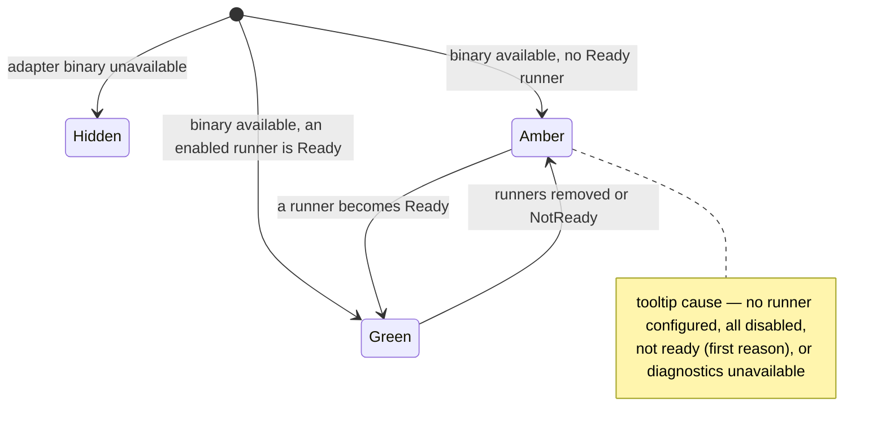

# Left rail

- **Type:** chrome (persistent shell, every `(app)` screen).
- **Status:** Implemented (WI-3 runners readiness). The Inbox badge count is
  unified by WI-1 — see [`../inbox.md`](../inbox.md). The section nav is
  route-aware and uses packaged Heroicons for destination and flyout icons.
- **Source:** `web/components/chrome/left-rail.tsx`,
  `web/components/chrome/left-rail-nav.tsx`,
  `web/components/chrome/left-rail-route.ts`, fed by
  `web/app/(app)/layout.tsx`.

## JTBD

When I am working across projects, I want one rail that shows where I can go,
what is running right now, whether my runner adapters are healthy, and a way to
launch — so I can navigate and start work without leaving the current screen.

## Roles & capabilities

| Role | Sees | Notes |
| --- | --- | --- |
| Global viewer / member | Projects, Inbox, Studio nav; active workspaces; runners readiness; launch | `Agents` renders disabled ("coming soon"); `MCPs` / `Users` / `Scheduler` / `Settings` are hidden |
| Global admin | All of the above plus `MCPs`, `Users`, `Scheduler`, `Settings` | Hidden nav is convenience only; `MCPs`/`Users`/`Scheduler` re-check `requireGlobalRole("admin")`, while `/settings` renders a forbidden panel and loads no admin data for non-admins |

The hidden admin nav is never the authorization boundary — the route enforces it.

## Navigation

The rail is the primary navigation spine. Entry points / exits:

- **Section nav** → `/` (portfolio), `/inbox` ([`../inbox.md`](../inbox.md)),
  `/studio` ([`../studio/README.md`](../studio/README.md)), `/mcps`
  ([`../mcps.md`](../mcps.md), admin), `/admin/users`, `/admin/scheduler`,
  `/settings`. The active section is resolved from the current pathname, so
  `/settings` selects Settings, `/inbox` selects Inbox, and `/runs/*` /
  `/scratch-runs/*` stay under Projects.
- **Active workspaces** → each row links to its run/workbench (`/runs/[id]`).
- **Launch** → opens the [launch dialog](launch-dialog.md).
- **Collapsed rail** → section icons keep direct navigation; active workspaces
  and runners readiness open right-side flyouts from their rail icons.

See [`../README.md`](../README.md) for the global IA map.

## Layout & regions

Expanded mode, top to bottom:

1. **Section nav** — Projects, Inbox (badge), Studio, Agents (disabled), then the
   admin block (MCPs, Users, Scheduler, Settings). The Inbox badge shows the
   canonical `needsYou` count (WI-1; see [`../inbox.md`](../inbox.md)). Section
   icons come from `@heroicons/react`; Settings uses the gear icon and the
   collapsed/expanded states share the same route-derived active marker.
2. **Active workspaces** — per-project groups of live runs. The block's surface
   (compact rows, single colour-coded state dot, ticket-derived names + scratch
   rename, linked flow/issue chips, runner info chip, hover/focus icon actions,
   TTL/archived badges) is documented in
   [`active-workspaces.md`](active-workspaces.md).
3. **Runners readiness** (WI-3) — one chip per available adapter (hidden /
   binary-unavailable adapters are omitted by design). Hovering or focusing a
   chip opens a popover listing that adapter's configured platform runners —
   identity (`model` / provider kind) as text, `enabled` + `readiness` as
   `aria-label`led icon/colour indicators, plus the first blocking reason for a
   not-ready runner, or a "no runners configured" empty state. Secret provider
   refs (`env:NAME`) are never projected to the client. For **admins** the chip
   links to `/settings` (the platform runner catalog) and the popover shows a
   "Configure in Settings" cue; for non-admins it is information-only (the
   `title` is the keyboard/SR fallback — non-admin chips are not focusable).
   Supervisor status is **not** here (it lives once in the footer,
   [`status-bar.md`](status-bar.md)).
4. **Launch** — primary launch button + hint, with a Cmd/Ctrl+K shortcut
   ([`launch-dialog.md`](launch-dialog.md)).

### Collapse / icon rail (Implemented — Phase B)

The rail is **collapsible** so wide canvases (the Flow editor,
[`../studio/editor.md`](../studio/editor.md)) can claim near-full width. A toggle
button switches between **expanded** (nav labels + active-workspaces + readiness +
launch) and **collapsed** (icon rail). Collapsed mode keeps all top-level
destination icons visible; the active-workspaces and runners-readiness regions
open as right-side flyout menus from their icons, and launch remains available
as the compact `+` control. The choice persists to `localStorage` (default
**expanded**); it is restored after hydration (a brief expanded flash on a
collapsed reload is accepted — no inline script, matching the script-free theme
convention). The toggle is a small client island; the rail's data fetch stays in
the async Server Component.

Collapsed mode order:

1. **Section icon stack** — Projects, Inbox (badge), Studio, Agents (disabled),
   then the admin icons when allowed. These packaged icons are the same
   destinations as expanded mode, not a separate compact menu.
2. **Active workspaces flyout** — one icon opens the same per-project live-run
   groups documented in [`active-workspaces.md`](active-workspaces.md). The rail
   itself shows only the affordance and count, not duplicate narrow text rows.
3. **Runners readiness flyout** — one icon opens the same adapter readiness rows
   as expanded mode.
4. **Compact launch** — the `+` control opens the existing
   [`launch-dialog.md`](launch-dialog.md).

## States

Per-adapter readiness verdict (WI-3), from
`summarizeAdapterReadiness`:

## Data & APIs

- `getRailWorkspaceGroups(userId, role)` — active workspaces, RBAC-scoped.
- `railSectionForPathname(pathname)` — maps app routes to the active rail
  section (`/settings` → Settings, `/inbox` → Inbox, run detail routes →
  Projects).
- `summarizeAdapterReadiness({ runners, diagnostics })`
  (`lib/acp-runners/readiness-summary.ts`) over `checkSupervisorDiagnostics()`
  `/diagnostics` × `platform_acp_runners` rows (`loadRunnerReadinessRows`, which
  also selects `id` / `capabilityAgent` / `model` / `provider`). Stored
  `readiness_status` is recomputed on each runner write; live availability gates
  visibility. Each summary carries a `runners: RailRunnerDTO[]` projection (safe
  fields only — `providerKind`, never the secret-bearing `provider`) that feeds
  the chip popover (`runners-readiness-rail.tsx`).
- Inbox badge count — see [`../inbox.md`](../inbox.md) and
  [`../../system-analytics/social-board.md`](../../system-analytics/social-board.md).

## i18n

`nav` (section labels, `comingSoon`), `portfolio` (`runnersReadiness`,
`runnerReady` / `runnerNoRunner` / `runnerAllDisabled` / `runnerNotReady` /
`runnerDiagnosticsUnavailable` / `runnersNone`; popover: `runnerNoneConfigured` /
`runnerEnabledShort` / `runnerDisabledShort` / `runnerConfigureCta` /
`runnerStatusNotReady` / `runnerStatusUnknown`; launch + active-workspace
labels), `gc` (TTL badges).

## Linked artifacts

- ADR: [ADR-065](../../decisions.md#adr-065) — platform ACP runner catalog +
  readiness recompute.
- Behavior: [`../../system-analytics/acp-runners.md`](../../system-analytics/acp-runners.md),
  [`../../system-analytics/social-board.md`](../../system-analytics/social-board.md)
  (Needs-you badge).
- Source: `web/components/chrome/left-rail.tsx`,
  `web/components/chrome/left-rail-nav.tsx`,
  `web/components/chrome/runners-readiness-rail.tsx`,
  `web/components/chrome/left-rail-route.ts`, `web/app/(app)/layout.tsx`,
  `web/lib/acp-runners/readiness-summary.ts`,
  `web/lib/acp-runners/runner-readiness-rows.ts`.
