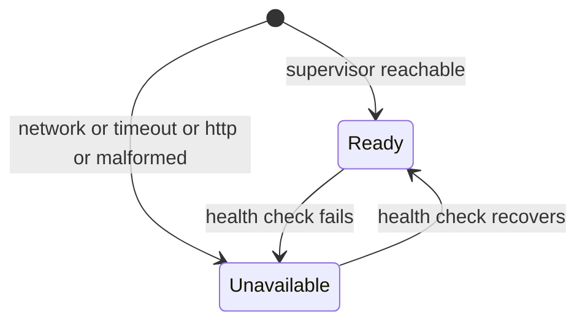

# Status bar

- **Type:** chrome (persistent footer, every `(app)` screen).
- **Status:** Implemented (WI-3 — the single supervisor-status source).
- **Source:** `web/components/chrome/status-bar.tsx`.

## JTBD

When I am anywhere in the app, I want a single always-visible indicator of
whether the supervisor is reachable — so I know at a glance whether launches and
live runs can proceed.

## Roles & capabilities

No role gate — the footer renders for every authenticated user. It shows status
only; it exposes no mutation.

## Navigation

Exits only: the **Docs** and **GitHub** links open external destinations in a
new tab. No in-app navigation originates here.

## Layout & regions

Left: the supervisor pill (`PlatformStatusPill`), the host origin
(`localhost:3000`), and the supervisor version when ready. Right: outbound Docs
and GitHub links. After WI-3 this is the **only** place supervisor status is
shown — it was removed from the top nav and the left rail.

## States

## Data & APIs

`getPlatformStatus()` (`lib/supervisor-client.ts`, a cached
`checkSupervisorHealth`) — the same value the layout passes to the rail launch
hint. No client polling.

## i18n

`status` namespace (`supervisorReady`, `supervisorUnavailable`, `supervisor`,
`docs`).

## Linked artifacts

- Behavior: [`../../supervisor.md`](../../supervisor.md) (supervisor daemon),
  [`../../system-analytics/instance-config.md`](../../system-analytics/instance-config.md).
- Source: `web/components/chrome/status-bar.tsx`,
  `web/components/chrome/platform-status.tsx`.
