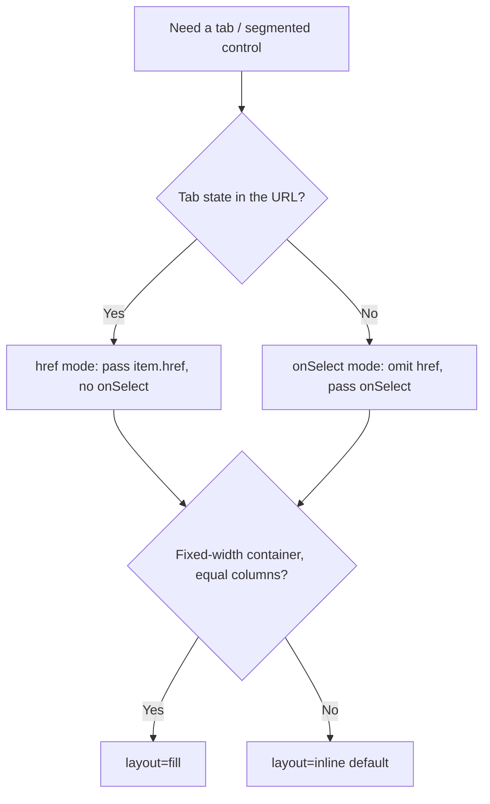

# Shared UI primitives (`components.md`)

- **Kind:** primitive (reusable building blocks shared across screens, blocks
  and chrome — not a route).
- **Status:** Implemented.
- **Source:** `web/components/navigation/tabs.tsx` and the token conventions
  documented below.

> This is the canonical reference for the small, cross-cutting UI building
> blocks that must look the **same everywhere**. When a screen needs a tab bar,
> a status/count chip, or a content card, use the pattern here instead of
> hand-rolling another variant — divergence here is exactly the drift this doc
> exists to prevent.

The app theme tokens (`--ink`, `--ink-2`, `--mute`, `--line`, `--paper`,
`--ivory`, `--amber`, `--amber-line`, `--amber-soft`, `--shadow-sm`, …) live in
`web/styles/globals.css` and are light/dark-tuned. Every primitive below is
expressed in those tokens — never raw hex.

## Tabs — the segmented control

`Tabs` (`web/components/navigation/tabs.tsx`) is the **one** tab/segmented-control
component. It is the rounded-full "pill track" look used by the project board
nav, the run workbench strip, the Flow Studio package viewer, the run inspector,
and the portfolio density toggle. There is no other tab style.

### Why one component renders both Server and Client tabs

`Tabs` has **no `"use client"` directive** and uses no hooks, so it adopts its
importer's environment:

- **href mode** — an item with `href` renders as a `next/link` `<Link>`. Used by
  URL-driven navigation in Server Components (project board, workbench, package
  viewer). Tab state lives in the URL and survives refresh / back-forward.
- **onSelect mode** — an item without `href` renders as a `<button>` that calls
  `onSelect(key)`. Used by state-driven controls in Client Components (run
  inspector, density toggle).

A single file therefore serves both worlds without a client/server split. Do not
fork it.

### API

```ts
interface TabItem {
  key: string;
  label: ReactNode;
  href?: string;     // present → <Link> (href mode); absent → <button> (onSelect mode)
  count?: number;    // optional trailing count badge (uses the chip styling below)
  icon?: ReactNode;  // optional leading glyph (e.g. density toggle)
  testId?: string;   // forwarded as data-testid on the tab
}

interface TabsProps {
  items: TabItem[];
  activeKey: string;
  onSelect?: (key: string) => void;  // required for href-less items
  layout?: "inline" | "fill";        // inline (default) = auto width; fill = full-width equal columns
  ariaLabel?: string;
  className?: string;                 // outer-margin utilities only (e.g. "mb-[22px]")
}
```

### Rules

- **Never restyle a tab inline.** Visual changes go into `Tabs` so every consumer
  moves together. Consumers pass data (`items`, `activeKey`), not classes — the
  only allowed `className` use is outer spacing.
- **`layout="fill"`** for tab bars that should span a fixed-width container with
  equal columns (the run-inspector sidebar). Everything else uses `inline`.
- **Counts** render through the shared chip (amber-tinted when active, neutral
  otherwise) — do not add a second count visual.
- **Active state** is `aria-selected` (`role="tablist"`/`role="tab"`). Tests pin
  the role + `aria-selected` + (for href mode) the `href`, so those are the
  stable contract.

### Choosing the mode



### Documented exceptions

Two controls are intentionally **not** `Tabs`, but share its tokens:

- **Flow Studio editor toolbar toggles** (`web/components/flows/editor/editor-top-bar.tsx`)
  — the Graph / Files / YAML / Diff drawer toggles sit inside a toolbar next to
  Save/Publish and read as `rounded-md` buttons, not a pill track. They use the
  same `line` / `amber-soft` / `amber` / `ivory` tokens. Treat them as a toolbar
  toggle group, not page navigation.

## Pill / Badge / count chip

A small inline chip used for statuses, counts, lifecycle labels and metadata
tags. Two tones cover almost every case:

- **Neutral** — `rounded-full border border-line bg-ivory` (or `bg-paper`),
  `text-mute`. The default for metadata and inactive counts.
- **Accent / active** — `rounded-full border border-amber-line bg-amber-soft
  text-amber`. Marks the active or attention-worthy state (e.g. the active tab's
  count, a draft lifecycle pill).

Sizing is `font-mono`, `~9.5–11px`, `uppercase tracking-[0.06em]` for label
chips; count chips drop the uppercase. `Tabs` renders its count badge with
exactly this chip, so a tab count and a standalone status chip read as the same
family. Reach for the neutral tone first; escalate to amber only to signal
"active / needs attention".

## Card

Content cards are a **token convention**, not yet a single component (≈14
hand-rolled card surfaces share the same shell). Keep them on the canonical
shell so they stay visually uniform:

- **Primary card** — `rounded-[14px] border border-line bg-paper`. The default
  for top-level cards (project cards, element cards, board flight cards).
- **Compact / nested card** — `rounded-[10px] border border-line bg-paper`. For
  denser lists and cards nested inside another surface.
- **Inset / muted panel** — swap `bg-paper` → `bg-ivory` for a recessed panel
  inside a card.

Interactive cards add `transition-colors hover:border-amber` and a focusable
wrapper. Do not introduce new corner radii or border colors for cards — pick the
nearest of the three shells above. (A shared `Card` component is a future
extraction; until then this convention is the contract.)

## Where this is used

- `Tabs` — `board/project-tabs.tsx`, `workbench/workbench-tabs.tsx`,
  `studio/package-tabs.tsx`, `runs/run-inspector.tsx`,
  `portfolio/density-toggle.tsx`.
- Chip + Card conventions — used app-wide; see the source list above for
  representative examples.
