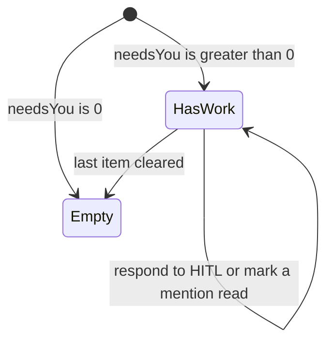

# Inbox

- **Type:** screen.
- **Route:** `/inbox` (session-required).
- **Status:** Implemented (WI-1).
- **Source:** `web/app/(app)/inbox/page.tsx`, reusing
  `components/portfolio/{hitl-inbox-block,inbox-respond,inbox-panel}.tsx`.

## JTBD

When several things across my projects are waiting on me, I want one
cross-project surface that lists what needs a decision and what I have been
mentioned in — so I can clear my queue from one place instead of hopping between
boards.

## Roles & capabilities

| Role | Sees |
| --- | --- |
| Global admin | Pending HITL and unread mentions across **all** non-archived projects |
| Global member / viewer | Pending HITL and unread mentions for projects they are a member of |

Scoping is inherited from `getCrossProjectHitlInbox` / `getInboxItems` /
`getUnreadInboxCount` (admin = all, member = own); a foreign run or inbox item is
never listed. Inline HITL responses go through the same authorization as the
board (`answerHitl`).

## Navigation

- **Entry:** the rail **Inbox** nav item; the home **"Needs you → See all"**
  summary card ([`chrome/left-rail.md`](chrome/left-rail.md)).
- **Within:** respond to a HITL item inline (no navigation); mark a mention
  read / read-all.
- **Exit:** an item links through to its run / task on the project board.

## Layout & regions

A page header (eyebrow, title, and the canonical `needsYou` count), then:

1. **Needs your action** — the reused `HitlInboxBlock` with `InboxRespond` per
   item (criticality-sorted pending HITL across visible projects).
2. **Mentions & comments** — the reused `InboxPanel` (unread `comment_added` /
   `task_mentioned`, with mark-read and read-all).

When `needsYou === 0` the page shows a single empty state instead of the blocks.

## States

## Data & APIs

- `getCrossProjectHitlInbox(userId, role)` → respondable HITL items + count.
- `getInboxItems(userId, role)` → unread mentions/comments.
- `getUnreadInboxCount(userId, role)` → unread count; `needsYou = HITL count +
  unread` (the canonical fan-out — see
  [`../system-analytics/social-board.md`](../system-analytics/social-board.md)).
- Mutations: `POST /api/runs/{runId}/hitl/{hitlRequestId}/respond` (inline
  respond), `PATCH /api/inbox/[itemId]/read`, `POST /api/inbox/read-all`. No new
  routes are added by this screen.

## i18n

`inbox` (page eyebrow/title/subtitle/empty) and `portfolio` (reused HITL +
notification block labels: `inboxTitle`, `notifTitle`, `notifKind.*`, …).

## Linked artifacts

- Behavior: [`../system-analytics/hitl.md`](../system-analytics/hitl.md)
  (cross-project inbox, respond two-phase commit),
  [`../system-analytics/social-board.md`](../system-analytics/social-board.md)
  (canonical `needsYou`, inbox fanout).
- ADRs: [ADR-057](../decisions.md#adr-057) (HITL hybrid surface),
  [ADR-083](../decisions.md#adr-083) (social board / inbox).
- Source: `web/app/(app)/inbox/page.tsx`, `web/lib/queries/needs-you.ts`,
  `web/lib/queries/portfolio.ts` (`getCrossProjectHitlInbox`),
  `web/lib/queries/inbox.ts`.
