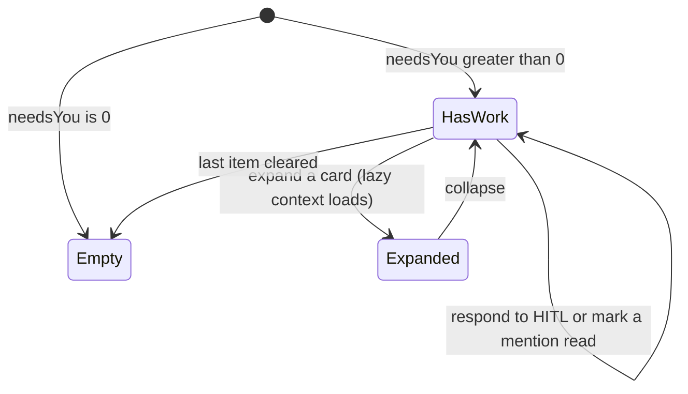

# Inbox

- **Type:** screen.
- **Route:** `/inbox` (session-required).
- **Status:** Implemented (WI-1 + the full-width, project-grouped, 3-tier HITL
  card redesign).
- **Source:** `web/app/(app)/inbox/page.tsx`; the unified
  `components/inbox/{hitl-card,hitl-inbox-list}.tsx` (shared with the
  per-project board); the unchanged `components/portfolio/inbox-panel.tsx`.

## JTBD

When several things across my projects are waiting on me, I want one full-width,
project-grouped surface where each card explains *what the question is about* —
not only its answer options — so I can clear most of my queue without opening a
run, and dive into the run only when I need the full task context.

When a consensus node cannot reach agreement, I want the inbox card to show the
draft options, disagreement summary, and safe decision controls — so I can pick a
draft, provide a resolution, rerun the round, or abort without reading raw
artifacts first.

## Roles & capabilities

| Role | Sees |
| --- | --- |
| Global admin | Pending HITL and unread mentions across **all** non-archived projects |
| Global member / viewer | Pending HITL and unread mentions for projects they are a member of |

Scoping is inherited from `getCrossProjectHitlInbox` / `getInboxItems` /
`getUnreadInboxCount` (admin = all, member = own); a foreign run or inbox item is
never listed. Inline HITL responses go through the same authorization as the
board (`answerHitl`); the lazy per-card expand payload (`inbox-context`) is gated
by `readBoard` on the run's project.

## Navigation

- **Entry:** the rail **Inbox** nav item; the home **"Needs you → See all"**
  summary card ([`chrome/left-rail.md`](chrome/left-rail.md)).
- **Within:** **expand a card in place** to load decision context; respond to a
  HITL item inline (no navigation); mark a mention read / read-all.
- **Exit:** **View run** links through to the run / task on the project board.

## Layout & regions

Full-bleed page (no centered max-width — `main` gutter provides air). A page
header (eyebrow, title, and the canonical `needsYou` count), then:

1. **Needs your action** — `HitlInboxList`: pending HITL across visible projects,
   **grouped by project** (a `project · N waiting` header per group); each group's
   cards render in a responsive grid that flows to **two columns on wide** screens
   and one otherwise, preserving the criticality-then-age order within a project.
2. **Mentions & comments** — the reused `InboxPanel` (unread `comment_added` /
   `task_mentioned`, with mark-read and read-all), unchanged.

When `needsYou === 0` the page shows a single empty state instead of the blocks.

### The HITL card

A unified `HitlCard` (shared with the per-project board, which renders it without
the project-group header) with three disclosure tiers:

- **Collapsed (scan):** agent avatar · task title · `KEY-N` · criticality pill ·
  **stage chip** (node label + type icon) · **branch chip** (the workspace) ·
  time · the prompt (1–2 lines) · a binary permission ask shows `Allow`/`Deny`
  inline (answerable without expanding) · `View run`. Form/human asks show a
  Respond affordance + `View run`.
- **Expanded (decide), lazy:** fetches `inbox-context` (`role="status"` while
  loading, `role="alert"` + retry on error) → **Gates & evidence** (per-gate
  chips, blocking-first, capped with "+k more") + a **separate neutral stale
  chip** · **Last agent message** · **stage progress** (`done/total`) · an optional
  **Changes** line (`N files · +X −Y`) · the respond controls
  (`hitl-decision-controls`) · `View run`.
- **Consensus HITL (expanded):** the same card chrome renders a `consensus`
  stage chip, draft count, current round, material-axis disagreement summary,
  and capped draft/debate excerpts from `inbox-context`. Decision controls are
  purpose-built buttons/inputs for `pick-draft-N`, `provide-resolution`,
  `re-run-round`, and `abort`; the card never exposes participant ids, child run
  ids, or unbounded draft bodies as editable fields.
- **Run (deep dive):** `View run` opens the full run page.

Per-card criticality accent (critical red / high amber / medium info / low
neutral); the prior block-level amber "alarm" chrome is removed.

## States

## Data & APIs

- `getCrossProjectHitlInbox(userId, role)` → respondable HITL items + count;
  each item additionally carries `taskTitle` and `stage {label, type}`
  alongside the existing project / branch / flow / criticality / assignment
  fields.
- `getInboxItems(userId, role)` → unread mentions/comments.
- `getUnreadInboxCount(userId, role)` → unread count; `needsYou = HITL count +
  unread` (the canonical fan-out — see
  [`../system-analytics/social-board.md`](../system-analytics/social-board.md)).
- `GET /api/runs/{runId}/inbox-context` — the lazy per-card
  expand payload `{ lastAgentMessage, gates[], diff, progress }` plus bounded
  consensus draft/debate refs when the HITL schema discriminator is
  `consensus_resolution`; `readBoard` on the run's project; read-only,
  partial-null on a missing peek. Behavior in
  [`../system-analytics/hitl.md`](../system-analytics/hitl.md).
- Mutations: `POST /api/runs/{runId}/hitl/{hitlRequestId}/respond` (inline
  respond), `PATCH /api/inbox/[itemId]/read`, `POST /api/inbox/read-all`.

## i18n

`inbox` (page eyebrow/title/subtitle/empty + the new card keys: `needsActionTitle`,
`waiting`, `respond`, `viewRun`, `contextLoading`, `contextError`, `retry`,
`gatesEvidence`, `lastAgentMessage`, `stageProgress`, `changes`, `changesSummary`,
`moreGates`, `staleEvidence`) and `portfolio` (reused notification block labels).
The card reuses `run.*` (criticality / HITL decision) and `board.*` (assignment)
labels; node-type and gate-status are shown by icon, not text, so no `stage.*` /
`gate.*` keys exist.

M41 adds consensus-specific keys under the existing card/control namespaces:
draft labels, round labels, disagreement summary, `pickDraft`, `provideResolution`,
`rerunRound`, `abortConsensus`, and validation text for required human
resolution. EN + RU parity is required.

## Consensus acceptance criteria

- A consensus HITL card is scannable while collapsed and shows the same project,
  criticality, stage, branch, and `View run` affordances as existing HITL cards.
- Expanding the card shows bounded draft/debate context and the four allowed
  consensus decisions without layout overflow on one-column and two-column grids.
- The response body is allow-list driven by stored HITL payload data; arbitrary
  draft ids, runner refs, participant ids, or child run ids from the browser are
  ignored or rejected server-side.
- Clearing the last consensus HITL updates `needsYou` through the existing inbox
  count path.

## Linked artifacts

- Behavior: [`../system-analytics/hitl.md`](../system-analytics/hitl.md)
  (cross-project inbox, respond two-phase commit, stage resolution +
  `inbox-context` reads),
  [`../system-analytics/consensus.md`](../system-analytics/consensus.md)
  (consensus no-agreement HITL decisions),
  [`../system-analytics/social-board.md`](../system-analytics/social-board.md)
  (canonical `needsYou`, inbox fanout).
- ADRs: [ADR-057](../decisions.md#adr-057) (HITL hybrid surface),
  [ADR-083](../decisions.md#adr-083) (social board / inbox).
- Plan: `.ai-factory/plans/feature-inbox-card-redesign.md`.
- Source: `web/app/(app)/inbox/page.tsx`, `web/lib/queries/needs-you.ts`,
  `web/lib/queries/portfolio.ts` (`getCrossProjectHitlInbox`),
  `web/lib/queries/inbox.ts`, `web/lib/queries/inbox-context.ts`.
