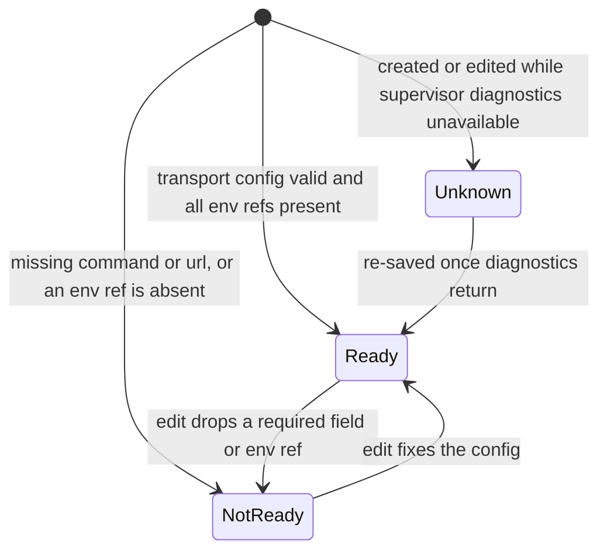

# MCP servers (platform)

- **Type:** screen (admin).
- **Route:** `/mcps` (global admin only).
- **Status:** Implemented (WI-2).
- **Source:** `web/app/(app)/mcps/page.tsx`, reusing
  `components/settings/{mcp-servers-panel,mcp-server-modal}.tsx`.

## JTBD

When I administer the platform, I want to see and manage every host-wide MCP
server and whether each is actually ready — so I can keep the shared tool
catalog healthy without digging through settings.

## Roles & capabilities

| Role | Access |
| --- | --- |
| Global admin | Full list / create / edit / delete of `platform_mcp_servers` |
| Everyone else | No nav item; the route returns `UNAUTHORIZED` (`requireGlobalRole("admin")`) |

The hidden nav item is convenience only — the route is the authorization
boundary. Project members continue to manage **project**-scoped MCPs on the
board's `?tab=mcps`; this screen is platform scope.

## Navigation

- **Entry:** the admin block of the [left rail](chrome/left-rail.md) (alongside
  Users / Scheduler / Settings).
- **Within:** "Add MCP server" and per-row edit open the `McpServerModal`
  (create / edit / delete); the table itself is view-only.

## Layout & regions

A page header, then the reused `McpServersPanel`: a full-width view-only table
(id, transport, target, agents, **readiness**, enabled, actions) plus the
create/edit/delete modal. Follows the data-management page bar from
`web/CLAUDE.md` (full-width, view-only table, modal edits).

## States

`readiness_status` per server, recomputed on every write (WI-2):

## Data & APIs

- Read: `db.select(...).from(platform_mcp_servers)` (admin-scoped page load).
- Mutations: `POST /api/admin/mcp-servers`,
  `PATCH /api/admin/mcp-servers/{id}`, `DELETE /api/admin/mcp-servers/{id}`.
  `readiness_status` / `readiness_reasons` are recomputed by
  `evaluateMcpReadiness(row, diagnostics)` on POST + PATCH (never DELETE) — see
  [`../system-analytics/mcp-management.md`](../system-analytics/mcp-management.md).
- No new routes are added by this screen (the catalog CRUD pre-dates it).

## i18n

`mcps` (page eyebrow/title/subtitle) and `settings` (reused panel + modal
labels: `mcpServersTitle`, `colReadiness`, `addMcp`, …).

## Linked artifacts

- ADR: [ADR-070](../decisions.md#adr-070) — platform MCP admin CRUD + delete
  guard.
- Behavior: [`../system-analytics/mcp-management.md`](../system-analytics/mcp-management.md).
- Source: `web/app/(app)/mcps/page.tsx`, `web/lib/mcp/readiness.ts`,
  `web/app/api/admin/mcp-servers/route.ts`,
  `web/app/api/admin/mcp-servers/[id]/route.ts`.
