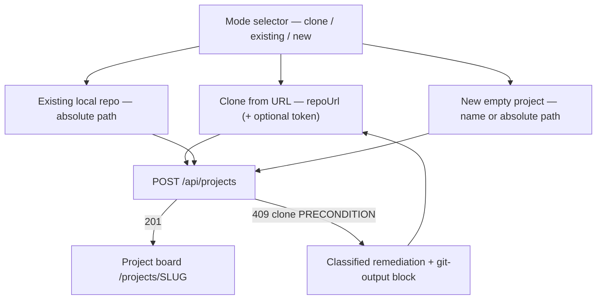
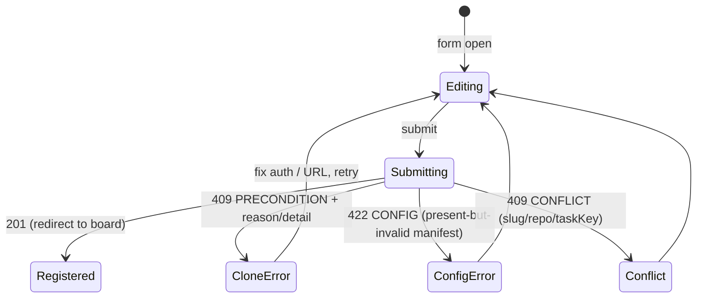

# Add project

- **Type:** screen (admin).
- **Route:** `/projects/new` (global admin only).
- **Status:** Implemented (M21 URL-clone) · onboarding modes + prefill + classified
  clone errors **Designed** ([ADR-093](../../decisions.md#adr-093-project-onboarding--optional-maisteryaml-host-ambient-git-auth-onboarding-modes-advisory-clone-reasons)).
- **Source:** `web/components/projects/new-project-form.tsx`, posting to
  `web/app/api/projects/route.ts`.

## JTBD

When I am onboarding a repository, I want to pick how the project enters MAIster
(clone a URL, register an existing local repo, or start an empty one), see the
project name and task key that will be used before I commit, and get a precise,
fixable message if a clone fails — so I can register the project in one pass
without a pre-existing `maister.yaml` or a guess-and-retry loop.

## Roles & capabilities

| Role | Access |
| --- | --- |
| Global admin | Full access — the form and `POST /api/projects` (`requireGlobalRole("admin")`). |
| Everyone else | No nav item; the route returns `UNAUTHORIZED`. The route is the authorization boundary. |

## Navigation

- **Entry:** the "Add project" button on `/projects` (admin) and the
  [left rail](../chrome/left-rail.md) projects section.
- **Exit:** a successful registration lands on the new project board
  (`/projects/{slug}`); when the repo had no `maister.yaml`, the
  [persist banner](project-settings-git.md) appears there.

## Layout & regions

- **Mode selector** (segmented control, **Designed**) — `clone | existing | new`,
  switching which fields show. `clone`/`existing` are inferred server-side when
  `mode` is omitted; `new` is always explicit (never inferred from a typo).
- **Location field** — relabeled "Local path or clone folder". For `clone` it
  overrides the on-disk folder name; for `existing` it is the absolute repo path;
  for `new` it is the directory to create (a bare name under `MAISTER_REPOS_ROOT`,
  or an absolute path that must not exist).
- **Git URL** (`clone` only) — the `repoUrl`. A URL containing inline
  credentials shows a nudge toward the token field.
- **Token** (`clone`, http(s) only, **Designed**) — optional one-off HTTPS
  credential (`type="password"`, `autoComplete="off"`); sent as `token`, injected
  via askpass for the single clone, never persisted.
- **Project name** (**Designed**) — explicit name, live-prefilled from the URL
  until edited; authoritative only when the repo has no `maister.yaml`.
- **Task key** — live-prefilled from the name/URL until edited; sent and wins
  server-side. An invalid derivation prefills empty rather than an invalid key.
- **Clone-error region** (**Designed**) — on a clone `PRECONDITION`, a
  reason-specific remediation (`SSH_AUTH` leads with `ssh-add`; `HTTPS_AUTH` on
  `github.com` surfaces the `gh` / token / SSH fork) plus a collapsible "git
  output" block showing the redacted `detail`.

## States

## Data & APIs

- Mutation: `POST /api/projects` — body gains `name?` / `mode?` / `token?`; the
  clone-failure `409` body gains advisory `reason?` / `detail?` (code stays
  `PRECONDITION`). See [`../../api/web.openapi.yaml`](../../api/web.openapi.yaml).
- Client-only prefill derives the name + task key from the URL; the server still
  validates and explicit values win. Behavior (DB-default registration, the three
  modes, the `maisterYamlPath == null` signal):
  [`../../system-analytics/projects.md`](../../system-analytics/projects.md).
  Clone-error classification + token / `gh` / SSH paths:
  [`../../system-analytics/git-integration.md`](../../system-analytics/git-integration.md).

## i18n

`projects` (mode labels, location/name/token/task-key labels + hints, per-reason
clone-error messages, `gh` login hint, submit/sub copy).

## Linked artifacts

- ADR: [#adr-093](../../decisions.md#adr-093-project-onboarding--optional-maisteryaml-host-ambient-git-auth-onboarding-modes-advisory-clone-reasons),
  [#adr-025](../../decisions.md#adr-025-project-repo-onboarding--url-clone-or-local-path-host-credential-auth-configurable-roots).
- Behavior: [`../../system-analytics/projects.md`](../../system-analytics/projects.md),
  [`../../system-analytics/git-integration.md`](../../system-analytics/git-integration.md).
- Source: `web/components/projects/new-project-form.tsx`,
  `web/app/api/projects/route.ts`, `web/lib/repo-source.ts`.
