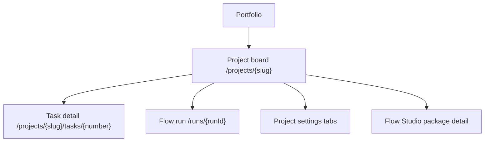
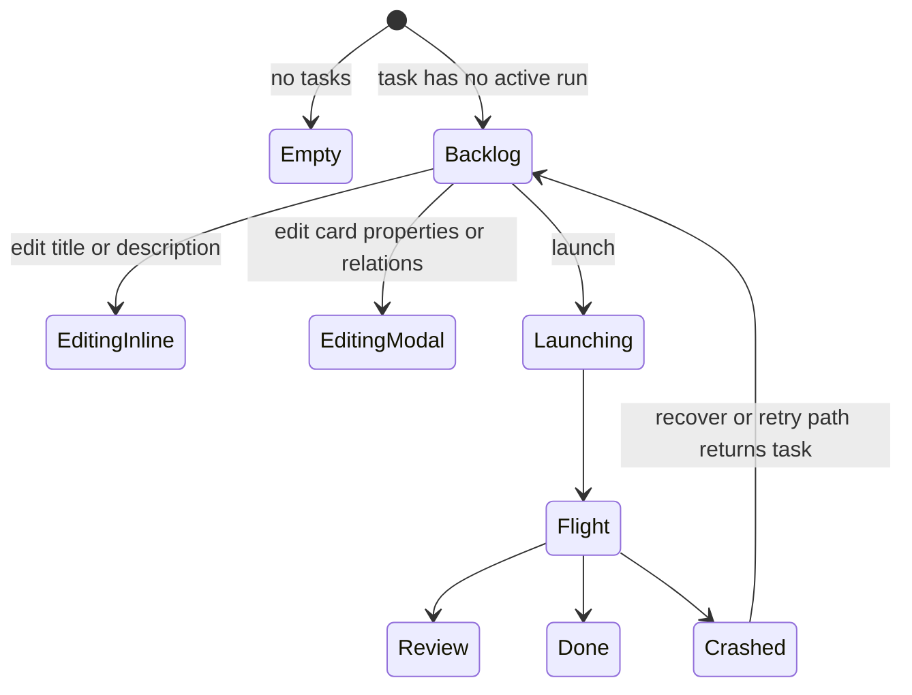

# Project board

- **Route:** `/projects/{slug}`
- **Status:** Implemented
- **Source:** `web/components/board/board.tsx`,
  `web/components/board/task-card.tsx`,
  `web/components/board/task-card-editing.tsx`,
  `web/components/social/markdown-body.tsx`,
  `web/components/social/task-detail-prompt-editor.tsx`,
  `web/app/(app)/projects/[slug]/tasks/[number]/page.tsx`

## JTBD

When I am operating a project, I want a dense task board with runnable backlog
cards and live work cards so I can decide what to launch, unblock, review, or
edit without leaving the project context.

## Roles & Capabilities

| Role | Can see | Can do |
| --- | --- | --- |
| Project viewer | Board columns, task cards, run cards, blockers, relations | Open task and run detail pages |
| Project member/admin/owner | Same | Create tasks, edit Backlog task fields, edit relations, launch allowed tasks |
| Global admin | Same as project role through implicit access | Same as an owner for every project |

Edits use `requireProjectAction(projectId, "editTask")`; relation mutations use
`requireProjectAction(projectId, "manageTaskRelations")`; launches use the run
launch capability gates.

## Navigation

- **Entry:** portfolio project card, active workspace group, runs ledger,
  launch dialog return path.
- **Exit:** task detail, flow run detail, project settings tabs, Flow Studio
  package detail links.

## Layout & Regions

The board is a horizontally scrollable set of columns:

- **Backlog cards** show a compact top metadata bar (`KEY-N`, flow tag, full
  edit action), then a full-width title row, run count, description, relation
  blockers, decomposition children, triage state, and the launch control.
  Backlog card title and description expose an inline edit icon on hover/focus;
  the displayed description renders Markdown in the card body, and description
  editing uses a rich Markdown editor with heading, list, quote, inline
  formatting, link, inline-code, code-block, and divider controls in a shared
  toolbar. The toolbar keeps the WYSIWYG/Markdown switch at the right edge.
  Markdown preview code blocks use a distinct block background and show a
  language badge when the fence declares one. The editor preserves the HTML/Word
  paste path where the browser provides rich clipboard content. The inline save uses
  `PATCH /api/projects/{slug}/tasks/{number}`.
- **Full card editor** opens from the card edit icon. It follows an issue-detail
  layout: title and description on the left; persisted first-level task
  properties on the right (`flowId`, `runnerId`, `baseBranch`,
  `targetBranch`, `promotionMode`, `executionPolicy`) plus editable relations.
  Flow options come from launch-options: launchable Flows are selectable, while
  non-launchable Flows remain disabled with a short reason. The full save uses
  `PUT /api/projects/{slug}/tasks/{number}` and is accepted only before work
  starts. Relation targets are picked with a compact search field that matches
  task number, title, and prompt text; the relation-kind select stays narrow so
  the target search has the primary width.
- **Task detail page** repeats the same inline title/description editing and
  full task editor so an operator can make issue-style changes without returning
  to the board. The header keeps breadcrumbs, status chips, and action buttons in
  a compact top strip, then gives the editable task title a full-width row before
  the prompt. The launch-configuration summary mirrors the editable properties
  form: inherited defaults are displayed as concrete effective values while still
  saving as inherited task fields unless the operator chooses an override. Its
  comments/activity timeline sits below the run history; a threaded hierarchy can
  be added later without changing the current read flow.
- **Flight cards** show active or latest runs, readiness, assignment/takeover
  state, HITL hints, and lifecycle actions.
- **Relation blockers** disable launch when a task is blocked by open
  `blocks`, `depends_on`, or success-gated `requires` edges.
- **Integrations panel** in the project settings area is project-bound. Its API
  tokens table lists only tokens with `project_id` set to this project; global
  personal API tokens live on [`../account.md`](../account.md) and are not
  created or listed here.

## States

## Data & APIs

- Board read model: `web/lib/queries/board.ts`.
- Inline/full task edit: `PATCH` and `PUT`
  `/api/projects/{slug}/tasks/{number}`.
- Relation add/remove: `POST` and `DELETE`
  `/api/projects/{slug}/tasks/{number}/relations`.
- Launch options for flow/runner/branch/policy selects:
  `GET /api/runs/launch-options?taskId=...`.
- Launch run: `POST /api/runs`.
- Project Integrations tokens: `GET/POST /api/projects/{slug}/tokens` and
  `DELETE /api/projects/{slug}/tokens/{tokenId}`. These routes remain scoped to
  `project_id = current project`; personal global tokens use
  `GET/POST /api/account/tokens` and
  `DELETE /api/account/tokens/{tokenId}`.

Behavior details live in
[`../../system-analytics/tasks.md`](../../system-analytics/tasks.md),
[`../../system-analytics/runs.md`](../../system-analytics/runs.md), and
[`../../system-analytics/social-board.md`](../../system-analytics/social-board.md).
External token behavior lives in
[`../../system-analytics/external-operations.md`](../../system-analytics/external-operations.md).

## i18n

Uses `board`, `common`, `launch`, `run`, `readiness`, `taskDetail`, and
`tokens` namespaces from `web/messages/{locale}.json`.

## Linked Artifacts

- ADRs: [#adr-018](../../decisions.md#adr-018-task--run-cardinality-is-1n),
  [#adr-083](../../decisions.md#adr-083-social-board-substrate--per-project-task-numbering-typed-relations-polymorphic-actor).
- Source: `web/components/board/board.tsx`,
  `web/components/board/task-card.tsx`,
  `web/components/board/task-card-editing.tsx`,
  `web/components/board/panels/integrations-panel.tsx`,
  `web/components/board/token-actions.tsx`,
  `web/components/social/markdown-body.tsx`,
  `web/components/social/task-detail-prompt-editor.tsx`,
  `web/lib/queries/board.ts`.
