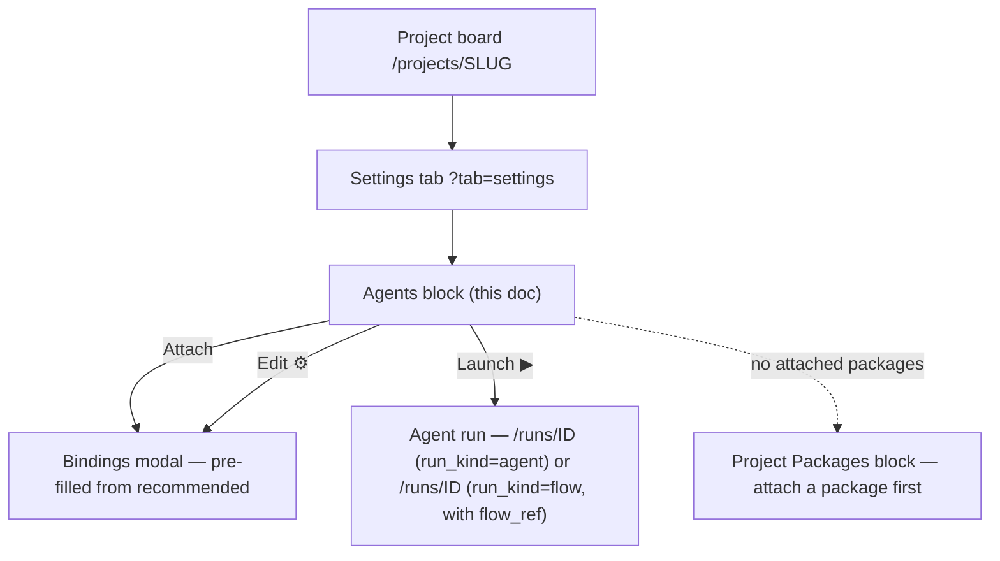
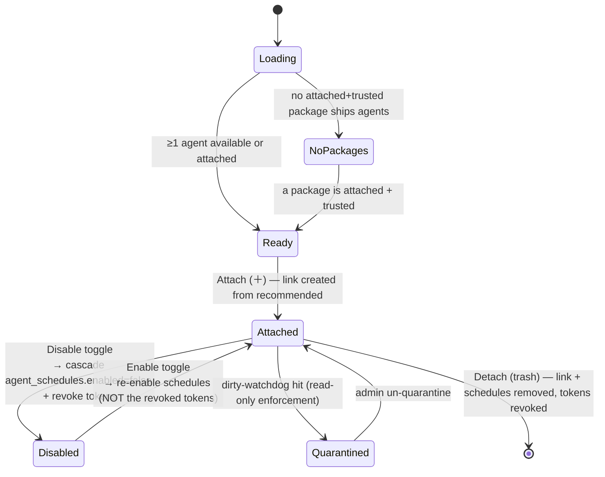

# Project Settings → Agents

- **Name / route:** Project Settings → **Agents** block · `/projects/{slug}?tab=settings` (Agents section)
- **Status:** Designed (M39, ADR-106)
- **Source:** `web/components/settings/project-agents-panel.tsx` (Designed) +
  `web/components/settings/project-agent-modal.tsx` (Designed) — a second instance
  of the data-management-page pattern (precedent: admin
  `web/components/settings/agents-panel.tsx`,
  `web/components/admin/users-table.tsx` + `user-edit-modal.tsx`).

## JTBD

> When I have attached a flow package that ships platform agents, I want to
> **enable specific agents in this project, bind their cron/event triggers, and
> tune their runner + autonomy policy**, so the agents run on this project's
> repo exactly the way I intend — autonomously where I allow it, paused where I
> don't.

## Roles & capabilities

| Role (project) | See | Do |
| --- | --- | --- |
| `viewer` | — (the Settings tab is `member`+) | — |
| `member` | the attached + available lists (read model, `getProjectAgents`) and **Launch** an enabled agent (`launchRun`) | launch a manual agent run |
| `admin` / `owner` | everything | attach/detach, enable/disable, edit the instance config (triggers, runner override, branch base, autoApply, onBudgetBreach) via `editSettings` |

The hidden nav/tab is convenience; the route still enforces
`requireProjectAction(projectId, 'editSettings'|'launchRun'|...)`. `projectId` is
always server-derived from the URL `slug`, never a body field.

## Navigation

Entry: project board → **Settings** tab → **Agents** block. Exit: **Launch** →
the run detail ([`../runs/flow-run.md`](../runs/flow-run.md)); attaching a package
is a prerequisite handled in the project **Packages** surface.

## Layout & regions

Full-width block (drop `mx-auto max-w`); the table sits in an `overflow-x-auto`
with a `min-w`. Forms (the modal) stay narrow (520–760px).

- **Attached agents — view-only table.** One row per attached agent. Columns:
  **Agent** (`packageName:stem` + name, the `flow_ref` shown as a small "drives
  *flowId*" chip when set), **State** (a green-check `✓` enabled / `—` disabled
  glyph + a quarantine warning glyph when `quarantined_at`), **Triggers** (chips:
  `cron`, `event` counts; `manual`/`webhook`/`flow` are capability badges from the
  definition), **Runner** (override or the resolved default), **Auto-apply**
  (`off` / `permissions` "с чел" / `full` "без чел"), **On budget breach**
  (`escalate` / `terminate` / `terminate_restorable`), **Branch base**. No inline
  editing — the row carries data only; an action cluster on the right reads
  left→right **Edit (⚙) · Launch (▶) · Disable/Enable (toggle) · Detach (trash,
  danger tone)**, all icon buttons with `aria-label`.
- **Available agents — list.** Agents projected from the project's **attached +
  trusted** packages that are not yet linked. Each shows `packageName:stem` + name
  + risk tier; an **Attach (＋)** icon button opens the bindings modal pre-filled
  from the definition's `recommended` block. Agents whose package is untrusted are
  not listed (attach requires trust).
- **Instance config modal** (`project-agent-modal.tsx`) — a single
  `create | edit` modal that also owns Detach. ONE aggregating `PATCH` (partial
  body, one transaction) on save — never a per-field fan-out. Fields, each seeded
  from `recommended` and overridable on the instance:
  - **Enabled** toggle (disabling cascades to the agent's triggers — see States).
  - **Triggers** — add/remove cron rows (`cronExpr` + IANA `timezone`) and event
    rows (kind multiselect over the ADR-086 taxonomy). Full-replacement on save.
  - **Runner override** — select from the enabled runner catalog (or "use
    default").
  - **Branch base** — text (default = the project main branch).
  - **Auto-apply** — a 3-way segmented control: **off** (normal HITL) ·
    **permissions** ("с чел" — auto-approve ACP tool permissions; human/form still
    pause) · **full** ("без чел" — also auto-pass human review). A helper line
    states `form`/`infra_recovery` always pause and `budget_breach` is never
    auto-applied.
  - **On budget breach** — a 3-way control: **escalate** (live pause, holds a
    slot) · **terminate** (Failed) · **terminate_restorable** (checkpoint → freed
    slot → recoverable `NeedsInputIdle`, restore by raising the budget).
  - Close affordance: top-right **✕** (+ Esc + backdrop), `createPortal` to body
    (shared popup convention).

## States

## Data & APIs

- **Read:** `GET /api/projects/{slug}/agents` → `{ attached: AttachedAgent[],
  available: AgentSummary[] }` (member+). `AttachedAgent` now carries
  `branchBase` + `executionPolicyOverride` (ADR-106).
- **Attach:** `POST /api/projects/{slug}/agents` `{ agentId, enabled?,
  runnerOverrideId? }` (admin) — `409 PRECONDITION` when the package is not
  attached+trusted.
- **Edit (one aggregating endpoint):** `PATCH /api/projects/{slug}/agents/{agentId}`
  — partial `{ enabled?, runnerOverrideId?, branchBase?, executionPolicyOverride?,
  schedules? }` in one transaction.
- **Detach:** `DELETE /api/projects/{slug}/agents/{agentId}` (revokes tokens).
- **Launch:** `POST /api/projects/{slug}/agents/{agentId}/launch` `{ taskId?,
  runnerId? }` (launchRun).

Behavior (gating allow-list, trigger-toggle cascade, run_kind discriminant,
runner policy) lives in
[`../../system-analytics/agents.md`](../../system-analytics/agents.md) — not
restated here (R7).

## i18n

`web/messages/{en,ru}.json` namespace `projectSettings.agents` (table headers,
the 3-way control labels incl. the **с чел / без чел** captions, trigger editor,
empty states, action `aria-label`s, modal). EN + RU parity required.

## Linked artifacts

- ADR: [#adr-106](../../decisions.md#adr-106-package-based-platform-agents--package-identity-attachment-gating-optional-flow-enrichment-and-per-agent-runner-policy).
- Behavior: [`../../system-analytics/agents.md`](../../system-analytics/agents.md),
  [`../../system-analytics/execution-policy.md`](../../system-analytics/execution-policy.md).
- API: [`../../api/web.openapi.yaml`](../../api/web.openapi.yaml)
  (`getProjectAgents`, `postProjectAgentLink`, `patchProjectAgentLink`,
  `deleteProjectAgentLink`, the agent launch route).
- Conventions: `web/CLAUDE.md` → "Data-management page patterns" + "UI affordance
  conventions" (view-only table, popup edits, icon buttons, green-check, one
  aggregating endpoint, accessible modal).
- Source (Designed): `web/components/settings/project-agents-panel.tsx`,
  `web/components/settings/project-agent-modal.tsx`.
