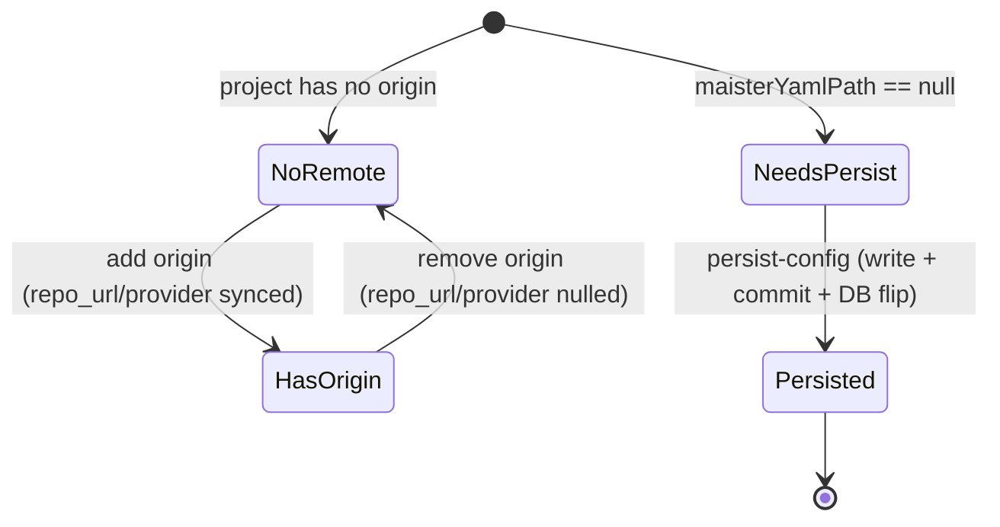

# Project Settings → Git

- **Type:** block (a section of the project Settings tab).
- **Route:** `/projects/{slug}?tab=settings` (project admin/owner section).
- **Status:** **Designed** ([ADR-093](../../decisions.md#adr-093-project-onboarding--optional-maisteryaml-host-ambient-git-auth-onboarding-modes-advisory-clone-reasons)).
- **Source:** `web/components/board/panels/settings-panel.tsx` (Git section),
  posting to `web/app/api/projects/[slug]/remotes/route.ts` and
  `web/app/api/projects/[slug]/persist-config/route.ts`.

## JTBD

When I manage a project, I want to attach and edit its git remotes and persist
the MAIster-held config back into the repo's `maister.yaml` — so a local-only or
greenfield project becomes promotion-capable (PR mode needs a remote) and its
configuration is reproducible from git alone.

## Roles & capabilities

| Role | Access |
| --- | --- |
| Project admin / owner (or global admin) | List/add/edit/remove remotes, push/fetch, and the persist action — all gated by `requireProjectAction(projectId, "editSettings")`. |
| Project member / viewer | Sees the project board but not the Git settings section's write controls; the route enforces `editSettings`. |

The persist CTA renders only while `maisterYamlPath == null` **and** the viewer
can `editSettings` — never a CTA that would 403.

## Navigation

- **Entry:** the project board's Settings tab (`?tab=settings`), alongside the
  existing runner/delivery-policy controls. It is also the **durable home** of the
  [persist banner](../README.md): dismissing the banner on home/board points here.
- **Within:** "Add remote" / per-row edit open a remote modal; the persist action
  opens a confirm dialog (target path + branch + commit message, with an opt-in
  "also push" toggle).

## Layout & regions

- **Remotes table** (view-only) — one row per remote: `name`, redacted `url`,
  and row actions (edit URL, remove, push, fetch). Follows the data-management
  table+modal pattern from `web/CLAUDE.md` and the acp-runners panel.
- **Add / edit remote modal** — name + URL; adding/setting `origin` syncs
  `projects.repo_url` + `provider`.
- **Persist config action** (shown while `maisterYamlPath == null`) — confirm
  dialog → `POST …/persist-config`; on success the action and any banner clear,
  and the toast surfaces `usedDefaultAuthor` / `pushWarning` when present.

## States

## Data & APIs

- Remotes: `GET/POST/PATCH/DELETE /api/projects/{slug}/remotes` (single
  collection route; `name` travels in the body for PATCH/DELETE so `/`-containing
  names work). `POST` also runs `push` / `fetch` / `set-upstream` actions via an
  `op` discriminator, reusing host-ambient auth.
- Persist: `POST /api/projects/{slug}/persist-config` (body `push?`; response
  `usedDefaultAuthor?` / `pushWarning?`).
- Contracts: [`../../api/web.openapi.yaml`](../../api/web.openapi.yaml). Behavior
  (remote management, redaction, origin sync, host-ambient push):
  [`../../system-analytics/git-integration.md`](../../system-analytics/git-integration.md);
  persist semantics + crash-window recovery:
  [`../../system-analytics/projects.md`](../../system-analytics/projects.md).

## i18n

`projects` / `settings` (Git section title, remotes table columns, add/edit/remove
+ push/fetch labels, persist dialog + banner strings).

## Linked artifacts

- ADR: [#adr-093](../../decisions.md#adr-093-project-onboarding--optional-maisteryaml-host-ambient-git-auth-onboarding-modes-advisory-clone-reasons).
- Behavior: [`../../system-analytics/git-integration.md`](../../system-analytics/git-integration.md),
  [`../../system-analytics/projects.md`](../../system-analytics/projects.md).
- Source: `web/components/board/panels/settings-panel.tsx`,
  `web/app/api/projects/[slug]/remotes/route.ts`,
  `web/app/api/projects/[slug]/persist-config/route.ts`,
  `web/components/projects/config-persist-banner.tsx`.
