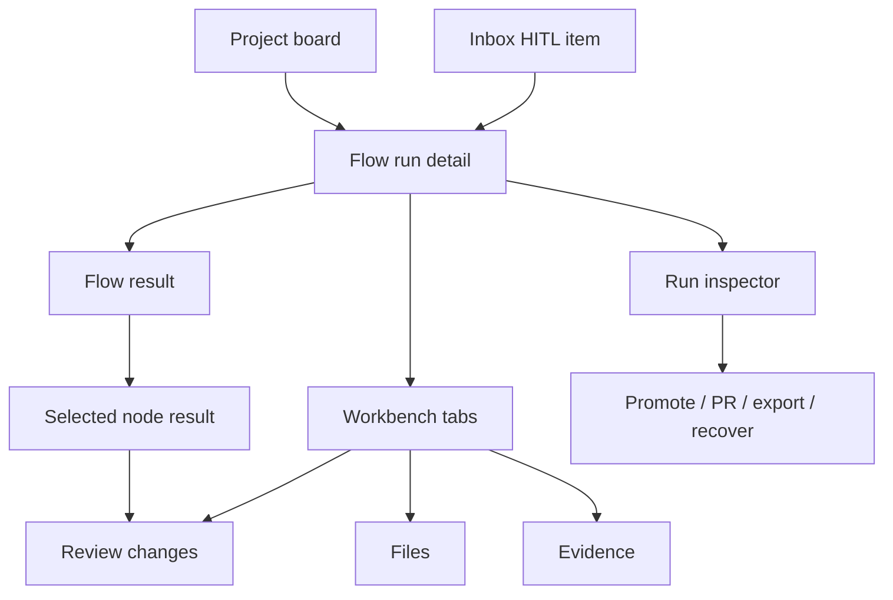
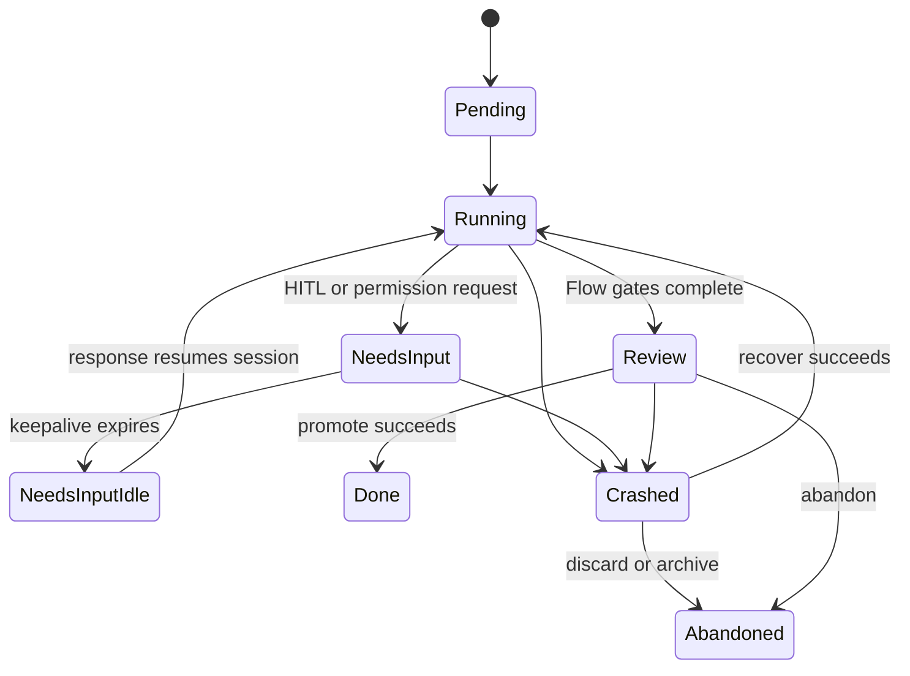

# Flow run detail

- **Type:** screen.
- **Route:** `/runs/{runId}` for `flow` and `agent` workspace-backed runs
  (session-required).
- **Status:** Planned rework. Current source exists, but the landing hierarchy
  should change.
- **Source:** current route `web/app/(app)/runs/[runId]/layout.tsx` and
  `web/app/(app)/runs/[runId]/page.tsx`; target components should reuse
  `web/components/board/flow-graph-view-section.tsx`,
  `web/components/board/run-timeline.tsx`,
  `web/components/board/evidence-graph-section.tsx`,
  `web/components/workbench/workbench-panel.tsx`, and planned
  [`run-inspector.md`](run-inspector.md).

## JTBD

When I open a structured Flow run, I want to see the Flow execution first -
current node, completed nodes, gate results, artifacts, timing, and token cost -
so I can understand what the automation did before I review files or promote a
branch.

When I open a standalone agent run, I want to see session activity, evidence,
review status, and branch context without a fake graph, so I can inspect what
the agent did even when no Flow manifest was involved.

When a run reaches review, I want the current review node to point me into the
change review surface without losing the Flow story, so I can judge code changes
in the context of the step that produced them.

## Roles & capabilities

| Role | Sees / does |
| --- | --- |
| Project viewer | Sees run status, Flow result, timeline, evidence, and run-scoped diff through `readBoard` semantics. |
| Project member | Adds repo file browsing through `readRepoFiles`, answers assigned HITL, and can use available lifecycle actions. |
| Project admin / owner | Has member capabilities plus project-level settings and promotion authority where the underlying action permits it. |
| Global admin | Bypasses project role checks as owner-equivalent. |

Source file browsing stays stricter than run-scoped diff: the file tree and
source viewer require `readRepoFiles`; the diff remains run-scoped review
evidence.

## Navigation

- **Entry:** project board run card, inbox HITL item, active workspace row,
  scheduler/assignment surfaces, and deep links from evidence or review
  comments.
- **Primary landing:** the Flow result surface, with the current node selected.
  Standalone agent runs land on an agent activity/result center.
- **Within:** node selection changes the result panel; workbench tabs open
  [`workbench.md`](workbench.md); the right inspector opens
  [`run-inspector.md`](run-inspector.md).
- **Deep links:** node, workbench, file, diff, inspector, and fullscreen Flow
  state follow the shared URL contract in [`workbench.md`](workbench.md).
- **Exit:** back to the project board, promote/open PR/export/handoff actions,
  or linked task details.

## Layout & regions

The page uses a two-column run shell on desktop and a stacked shell on mobile:

1. **Run header** - breadcrumb, task ref, run status, Flow name, executor,
   branch, current node, and compact `+/-` change size.
2. **Main result** - the default center for non-scratch runs. Flow runs combine
   a readable graph or node list with a selected-node result panel. The selected
   node shows status, attempts, duration, token/cost contribution, produced
   artifacts, gate verdicts, HITL prompt/response, and logs where relevant.
   Standalone agent runs instead show session status, latest activity, evidence,
   and review or diff entry points.
3. **Review entry point** - when the selected node is a review or human gate,
   the node result shows open threads, dirty-state warnings, readiness status,
   and a clear **Review changes** action that opens the Diff tab.
4. **Secondary workbench** - Files, Diff, Evidence, and Timeline remain one click
   away through [`workbench.md`](workbench.md). They support inspection but do
   not replace the Flow result as the landing view.
5. **Run inspector** - a collapsible right sidebar documented in
   [`run-inspector.md`](run-inspector.md). It stays available across Flow,
   Files, Diff, Evidence, and Timeline.

The Flow result should not render as a card inside another card. It owns the
page center; individual node summaries, artifact rows, and modal details may use
cards.

## States

The landing focus follows state:

| State | Main focus |
| --- | --- |
| `Pending` / `Running` | Flow result with current node selected, or agent activity center |
| `NeedsInput` / `NeedsInputIdle` | Flow result with the blocked HITL node selected, or agent prompt/activity center |
| `Review` | Review-producing node or agent result with a prominent review action |
| `Crashed` | Flow or agent result plus crash/recover panel |
| `Done` / `Failed` / `Abandoned` | Frozen result with Timeline and Evidence close at hand |

## Data & APIs

- `getRunDetail(runId)` supplies run, project, branch, workspace, HITL, and
  lifecycle metadata.
- `loadRunManifest(runId)`, `compileManifest`, `buildGraphTopology`, and
  `presentationLayout` build the Flow topology when a pinned manifest exists.
  Agent runs without a manifest use an agent result DTO instead of Flow
  topology.
- `getRunNodeStatuses(runId)` plus `GET /api/runs/{runId}/graph-status` keep
  node colors current via SSE-triggered refetch.
- `getRunTimeline(runId)`, `buildEvidenceGraph(runId)`,
  `getRunReadiness(runId, projectId)`, `getRunCostSummary(runId)`,
  `getRunSettings(runId)`, and capability profile queries feed the selected
  node result and inspector summaries.
- `GET /api/runs/{runId}/stream` supplies the SSE change trigger.
- Workbench routes are listed in [`workbench.md`](workbench.md).

Behavior belongs in [`../../system-analytics/runs.md`](../../system-analytics/runs.md),
[`../../system-analytics/flow-graph.md`](../../system-analytics/flow-graph.md),
and [`../../system-analytics/hitl.md`](../../system-analytics/hitl.md); this
screen doc describes the surface.

## i18n

`run`, `workbench`, `evidence`, and `readiness`.

## Linked artifacts

- Blocks: [`run-inspector.md`](run-inspector.md), [`workbench.md`](workbench.md).
- Behavior: [`../../system-analytics/runs.md`](../../system-analytics/runs.md),
  [`../../system-analytics/flow-graph.md`](../../system-analytics/flow-graph.md),
  [`../../system-analytics/hitl.md`](../../system-analytics/hitl.md).
- ADRs: [ADR-052](../../decisions.md#adr-052-live-node-status-coloring-via-sse-triggered-graph-status-refetch),
  [ADR-053](../../decisions.md#adr-053-workbench-file-tree-git-tracked-only-member-gated-reads),
  [ADR-066](../../decisions.md#adr-066-editor-and-diff-rendering-stack-shiki-git-diff-view-codemirror),
  [ADR-082](../../decisions.md#adr-082-review-diff-completeness-with-dirty-state-protocol-and-scope-switcher).
- Source: `web/app/(app)/runs/[runId]/layout.tsx`,
  `web/components/board/flow-graph-view-section.tsx`,
  `web/components/board/run-timeline.tsx`,
  `web/components/board/evidence-graph-section.tsx`,
  `web/components/runs/review-panel.tsx`.
