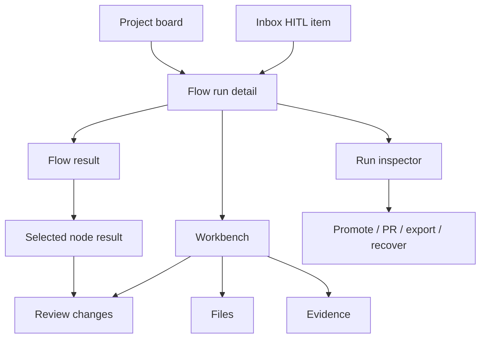
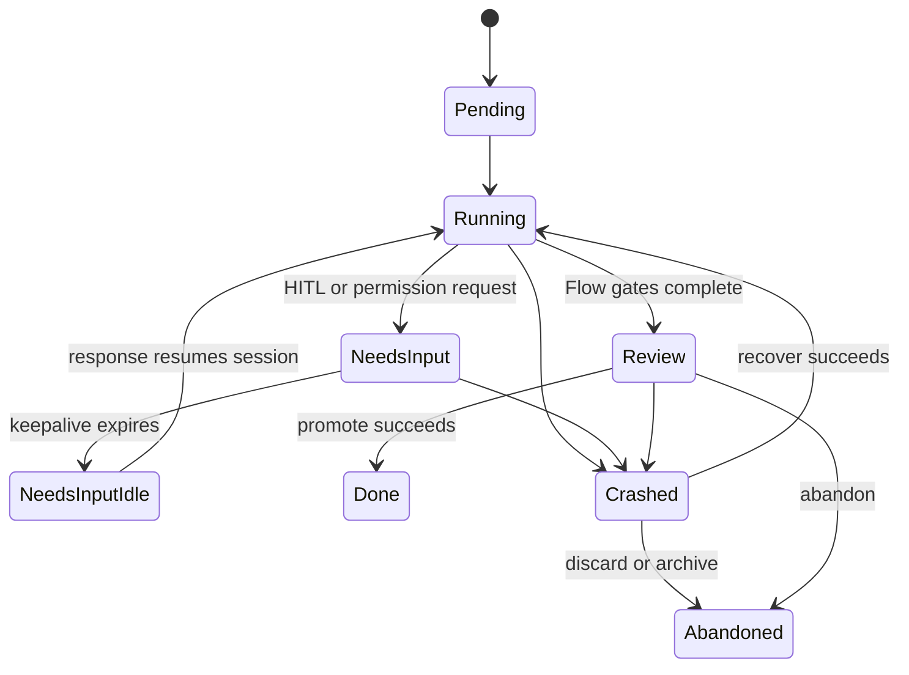

# Flow run detail

- **Type:** screen.
- **Route:** `/runs/{runId}` for `flow` and `agent` workspace-backed runs
  (session-required).
- **Status:** Implemented, with ongoing refinement of the workbench and
  inspector hierarchy.
- **Source:** current route `web/app/(app)/runs/[runId]/layout.tsx` and
  `web/app/(app)/runs/[runId]/page.tsx`; target components should reuse
  `web/components/board/flow-graph-view-section.tsx`,
  `web/components/board/run-timeline.tsx`,
  `web/components/board/evidence-graph-section.tsx`,
  `web/components/workbench/workbench-panel.tsx`, and planned
  [`run-inspector.md`](run-inspector.md).

## JTBD

When I open a structured Flow run, I want to see the Flow execution first -
current node, completed nodes, gate results, artifacts, timing, and token cost -
so I can understand what the automation did before I review files or promote a
branch.

When I open a standalone agent run, I want to see session activity, evidence,
review status, and branch context without a fake graph, so I can inspect what
the agent did even when no Flow manifest was involved.

When a run reaches review, I want the current review node to point me into the
change review surface without losing the Flow story, so I can judge code changes
in the context of the step that produced them.

When a consensus node is running or blocked, I want the selected node result to
show draft participants, round state, disagreements, HITL resolution state, and
the final plan artifact — so I can understand agreement work without leaving the
Flow run detail.

## Roles & capabilities

| Role                  | Sees / does                                                                                                         |
| --------------------- | ------------------------------------------------------------------------------------------------------------------- |
| Project viewer        | Sees run status, Flow result, timeline, evidence, and run-scoped diff through `readBoard` semantics.                |
| Project member        | Adds repo file browsing through `readRepoFiles`, answers assigned HITL, and can use available lifecycle actions.    |
| Project admin / owner | Has member capabilities plus project-level settings and promotion authority where the underlying action permits it. |
| Global admin          | Bypasses project role checks as owner-equivalent.                                                                   |

Source file browsing stays stricter than run-scoped diff: the file tree and
source viewer require `readRepoFiles`; the diff remains run-scoped review
evidence.

## Navigation

- **Entry:** project board run card, inbox HITL item, active workspace row,
  scheduler/assignment surfaces, and deep links from evidence or review
  comments.
- **Primary landing:** the Flow result surface, with the current node selected.
  Standalone agent runs land on an agent activity/result center.
- **Within:** node selection changes the result panel; Timeline/Evidence
  workbench tabs and the collapsed Files/Diff disclosure open
  [`workbench.md`](workbench.md); the right inspector opens
  [`run-inspector.md`](run-inspector.md).
- **Deep links:** node, workbench, file, diff, inspector, and fullscreen Flow
  state follow the shared URL contract in [`workbench.md`](workbench.md).
- **Exit:** back to the project board, promote/open PR/export/handoff actions,
  or linked task details.

## Layout & regions

The page uses a full-width two-column run shell on desktop, with a minimum
1000px work surface and a 380px right inspector. Narrow/mobile presentation is
still a later responsive pass.

1. **Run header** - the **task title** as the H1, a `KEY-N` chip beside the run
   status, an eyebrow reading `Flow › current node`, the worktree branch on its
   own line, the executor, compact `+/-` change size, and a collapsible **Task**
   block rendering the task prompt (Markdown). This replaces the prior
   `"<KEY-N> <branch>"` heading so the page answers "what is this run about".
2. **Main result** - the default center for non-scratch runs. Flow runs combine
   a readable graph or node list with a selected-node result panel. The selected
   node shows status, attempts, duration, token/cost contribution, produced
   artifacts, gate verdicts, HITL prompt/response, the **resolved agent prompt**
   per attempt (collapsible; a manifest-template fallback is shown for runs
   captured before `node_attempts.resolved_prompt` shipped), and logs where
   relevant. The selected node also carries an expandable **agent transcript**
   panel (assistant text, thinking, tool calls, usage) rendered from
   `GET /api/runs/{runId}/transcript?node=`; the active node auto-expands and
   appends live while the agent streams. Per-node status renders as a localized
   icon + tooltip (not raw status text) in the node list, the canvas chip, and
   the selected-node status field. → [`runs.md`](../../system-analytics/runs.md)
   "Run transparency".
   For a `consensus` node, the selected result additionally shows participant
   draft rows, current round, verifier rotation, material-axis agreement chips,
   disagreement excerpts, child draft run links, and the required
   `consensus_plan` / `debate_log` artifacts. Draft and debate bodies are
   capped; full payloads open through Evidence/Workbench artifact routes.
   Standalone agent runs instead show session status, latest activity, evidence,
   and review or diff entry points.
3. **Review entry point** - when the selected node is a review or human gate,
   the node result shows open threads, dirty-state warnings, readiness status,
   and a clear **Review changes** action that opens the Diff tab.
4. **Secondary workbench** - Timeline and Evidence remain one click away through
   [`workbench.md`](workbench.md). Files and Diff are available in a single
   collapsed-by-default **Files / Diff** disclosure below the Flow result; deep
   links open it directly. They support inspection but do not replace the Flow
   result as the landing view.
5. **Run inspector** - a collapsible right sidebar documented in
   [`run-inspector.md`](run-inspector.md). It stays available across Flow,
   Files, Diff, Evidence, and Timeline. Its **Flow** tab now also hosts the
   node-settings, capability-profile, and resolved-capability-set blocks
   (relocated out of the center to keep the transcript the focus).

The Flow result should not render as a card inside another card. It owns the
page center; individual node summaries, artifact rows, and modal details may use
cards.

## States

The landing focus follows state:

| State                           | Main focus                                                                                                                 |
| ------------------------------- | -------------------------------------------------------------------------------------------------------------------------- |
| `Pending` / `Running`           | Flow result with current node selected, or agent activity center                                                           |
| `WaitingOnChildren`             | Flow result with the parked orchestrator or consensus node selected; consensus shows draft child status and round progress |
| `NeedsInput` / `NeedsInputIdle` | Flow result with the blocked HITL node selected; consensus no-agreement HITL shows the four resolution decisions           |
| `Review`                        | Review-producing node or agent result with a prominent review action                                                       |
| `Crashed`                       | Flow or agent result plus crash/recover panel                                                                              |
| `Done` / `Failed` / `Abandoned` | Frozen result with Timeline and Evidence close at hand                                                                     |

## Data & APIs

- `getRunDetail(runId)` supplies run, project, branch, workspace, HITL,
  lifecycle metadata, and the **task title + prompt**, **flow ref**, and
  **current node label** that feed the task-first header. For `budget_breach`
  HITL rows it also supplies the server-computed option list, `claimStage`, and
  the budget progress DTO used by the run-detail decision panel.
- `loadRunManifest(runId)`, `compileManifest`, `buildGraphTopology`, and
  `presentationLayout` build the Flow topology when a pinned manifest exists.
  Agent runs without a manifest use an agent result DTO instead of Flow
  topology.
- `getRunNodeStatuses(runId)` plus `GET /api/runs/{runId}/graph-status` keep
  node colors current via SSE-triggered refetch; consensus nodes use the same
  visual language and type tooltip as the Studio editor.
- `getRunTimeline(runId)` (each `TimelineEntry` now carries the per-attempt
  `resolvedPrompt`), `buildEvidenceGraph(runId)`,
  `getRunReadiness(runId, projectId)`, `getRunCostSummary(runId)`,
  `getRunSettings(runId)`, and capability profile queries feed the selected
  node result and inspector summaries.
- `GET /api/runs/{runId}/stream` supplies the SSE change trigger.
- Workbench routes are listed in [`workbench.md`](workbench.md).

Behavior belongs in [`../../system-analytics/runs.md`](../../system-analytics/runs.md),
[`../../system-analytics/flow-graph.md`](../../system-analytics/flow-graph.md),
and [`../../system-analytics/hitl.md`](../../system-analytics/hitl.md); this
screen doc describes the surface.

## i18n

`run`, `workbench`, `evidence`, and `readiness`.

M41 adds consensus labels under the existing `run` and `evidence` namespaces:
participant draft, verifier, target, round, agreement reached, no consensus,
human resolution, consensus plan, debate log, and bounded excerpt labels. EN +
RU parity is required.

ADR-125 adds budget-breach labels under the existing run/HITL namespaces:
progress metrics, `Raise & continue`, `Restart fresh`, `Park the result`,
snapshot/export mode labels, branch-name validation text, discard/drop
confirmation, and staged-claim status text. The same strings are used by the
Inbox card and the run-detail panel.

## Budget-breach panel

When the pending HITL kind is `budget_breach`, the run-detail panel mirrors the
Inbox decision surface: a progress block first, then icon+label actions rendered
from server `availableOptions`. Raise submits the canonical
`{optionId:"raise", response:{dimension,newLimit}}` payload while the route still
accepts legacy `raiseTo`; restart submits `{optionId:"restart", response:{}}`;
park submits snapshot or export with `branchName`; discard can submit
`{optionId:"abandon"}` or `{response:{dropWorkspace:true}}` after confirmation.
Unavailable options are not shown, and active non-failed claims disable the
controls until completion.

## Consensus acceptance criteria

- A selected consensus node uses the shared graph card, tooltip, status chip,
  and node-detail layout used by other graph nodes.
- `WaitingOnChildren` explains which draft children are still running without
  consuming a scheduler-slot-like visual state.
- `NeedsInput` selects the consensus node and shows the same decision options as
  Inbox, with no duplicate or conflicting controls.
- Terminal consensus success shows exactly one current `consensus_plan` and one
  current `debate_log` artifact close to the node result and in Evidence.

## Linked artifacts

- Blocks: [`run-inspector.md`](run-inspector.md), [`workbench.md`](workbench.md).
- Behavior: [`../../system-analytics/runs.md`](../../system-analytics/runs.md),
  [`../../system-analytics/flow-graph.md`](../../system-analytics/flow-graph.md),
  [`../../system-analytics/hitl.md`](../../system-analytics/hitl.md),
  [`../../system-analytics/consensus.md`](../../system-analytics/consensus.md).
- ADRs: [ADR-052](../../decisions.md#adr-052-live-node-status-coloring-via-sse-triggered-graph-status-refetch),
  [ADR-053](../../decisions.md#adr-053-workbench-file-tree-git-tracked-only-member-gated-reads),
  [ADR-066](../../decisions.md#adr-066-editor-and-diff-rendering-stack-shiki-git-diff-view-codemirror),
  [ADR-082](../../decisions.md#adr-082-review-diff-completeness-with-dirty-state-protocol-and-scope-switcher),
  [ADR-109](../../decisions.md#adr-109-consensus-flow-graph-node--engine-owned-unanimous-draft-verification-and-human-resolution).
- Source: `web/app/(app)/runs/[runId]/layout.tsx`,
  `web/components/board/flow-graph-view-section.tsx`,
  `web/components/board/run-timeline.tsx`,
  `web/components/board/evidence-graph-section.tsx`,
  `web/components/runs/review-panel.tsx`.
