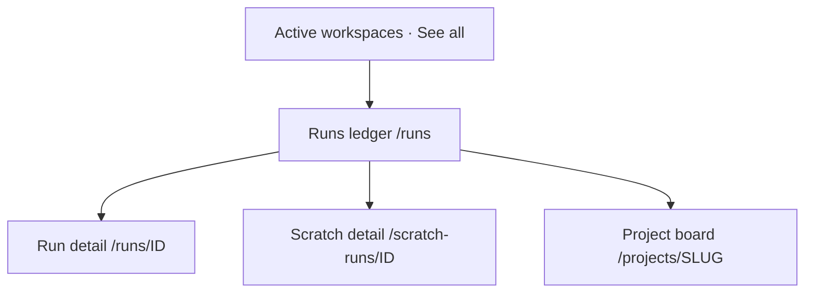

# Runs ledger

- **Type:** screen.
- **Route:** `/runs` (session-required).
- **Status:** Implemented as the platform/project-visible run ledger reached
  from the left rail Active workspaces **See all** link.
- **Source:** `web/app/(app)/runs/page.tsx`, backed by
  `web/lib/queries/runs-list.ts`.

## JTBD

When I leave the active-workspaces rail, I want a durable list of all visible
runs, not only live worktrees, so I can find scheduled launches, terminal runs,
failed attempts, scratch work, and external starts by project, date, state, and
runner.

## Roles & capabilities

| Role | Sees |
| --- | --- |
| Project viewer/member/admin | Runs in projects where they have membership. |
| Global admin | Runs across every non-archived project. |

The page is read-only. Opening a row delegates to the existing run detail route,
where action availability is re-checked by the run/workbench APIs.

## Navigation

- **Entry:** Active workspaces rail header **See all** (`/runs`), deep-linked
  filters, and future project/scheduler links.
- **Row click:** flow and standalone agent rows open `/runs/{runId}`; scratch
  rows open `/scratch-runs/{runId}`.
- **Project link:** opens `/projects/{slug}`.

## Layout & regions

1. **Header** - page title and short purpose text.
2. **URL-backed filters** - project, state, source, runner, and inclusive date
   range. Applying filters submits a GET form, so the URL is shareable and the
   browser back button works.
3. **Run history table** - recent runs first. Columns show run/task identity,
   project, status, source, started time, duration, runner, and token total.
4. **Pagination** - page-based previous/next controls, with page number in the
   URL.

## Data & APIs

- `requireActiveSession()` gates the page.
- `listRunsPage()` reads `runs`, `projects`, optional `tasks`, `flows`,
  `workspaces`, `run_cost_rollups`, and the schedule whose `last_run_id`
  matches the run.
- RBAC is embedded in the query: global admins read all non-archived projects;
  other users read only project-member rows.
- No new write model or API route is introduced.

Behavior belongs in [`../../system-analytics/runs.md`](../../system-analytics/runs.md);
this screen doc describes the surface.
