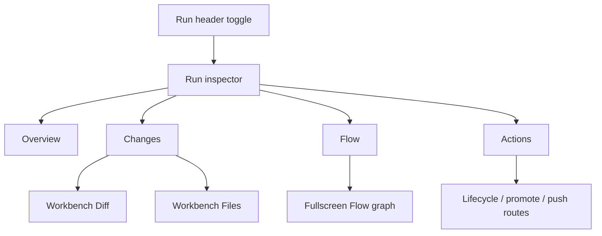
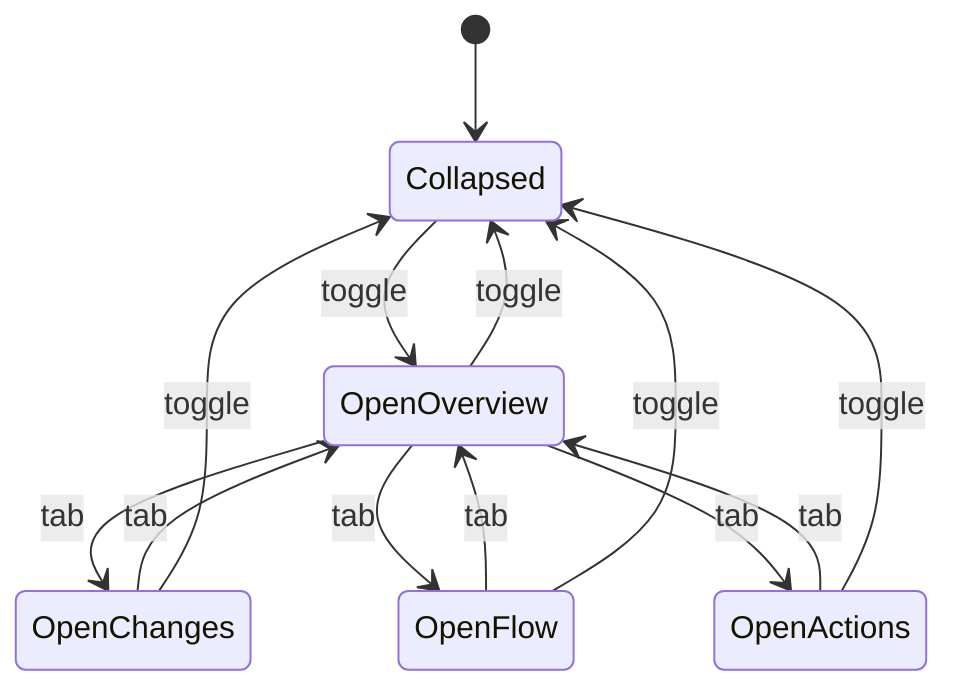

# Run inspector

- **Type:** block.
- **Routes:** shared by `/runs/{runId}` and `/scratch-runs/{runId}`.
- **Status:** Planned.
- **Source:** planned shared component. Current related sources:
  `web/components/workbench/lifecycle-actions.tsx`,
  `web/components/board/flow-graph-view-section.tsx`,
  `web/components/board/run-timeline.tsx`,
  `web/components/runs/review-panel.tsx`,
  `web/components/scratch/scratch-dialog.tsx`.

## JTBD

When I inspect any run, I want a right sidebar that answers four questions:
what changed, where is the branch, what is happening in the run, and what action
can I take next.

When I read a conversation, Flow result, file, or diff, I want those answers
nearby without shrinking the main pane into a small review widget.

## Roles & capabilities

| Role | Sees / does |
| --- | --- |
| Project viewer | Sees overview, run-scoped change size, Flow mini-map, and disabled action reasons. |
| Project member | Uses enabled lifecycle shortcuts, answers HITL, browses file details through `readRepoFiles`, and opens review surfaces. |
| Project admin / owner | Uses promotion, push, PR, archive, and drop actions when policy and run state permit them. |
| Global admin | Bypasses project role checks as owner-equivalent. |

Every action button must derive from server-side policy. The inspector may show
disabled actions, but the server route remains the authority.

## Navigation

- **Open / close:** header **Inspector** toggle; the collapsed state persists
  per user and viewport.
- **Within:** inspector tabs switch between Overview, Changes, Flow, and
  Actions.
- **Cross-navigation:** clicking a changed file opens the workbench Diff or
  Files tab. Diff links use `?wb=diff&diffFile=<path>`; source links use
  `?wb=files&file=<path>&fileView=source` so diff access never implies source
  browsing access. Clicking a Flow node opens the Flow result or fullscreen
  graph; clicking a lifecycle action opens its confirmation dialog or calls the
  route.

## Layout & regions

The inspector uses tabbed sections inside a fixed-width sidebar on desktop and a
sheet on mobile.

1. **Overview** - run kind, status, project, task or scratch name, executor,
   branch, worktree path, base branch/commit, target branch, started/ended time,
   active time, wall-clock duration, and token/cost summary.
2. **Changes** - total additions/deletions, file count, dirty-state badge, scope
   selector summary, directory-grouped changed files, file status icons, comment
   badges, and generated/large/truncated indicators where available.
3. **Flow** - for flow runs, a mini-map with current/completed/failed/stale
   nodes, node duration, token hints, and a fullscreen graph button. For scratch
   runs, this tab becomes Session and shows conversation status, context usage,
   attachments, selected capabilities, and latest tool activity.
4. **Actions** - action shortcuts grouped by risk: conversation/session
   controls, branch preservation, delivery, and destructive cleanup. Examples:
   stop, recover, snapshot, export branch, handoff branch, promote, open PR
   through the promotion flow, archive, discard, and drop. The inspector does
   not expose an arbitrary push-to-remote action in this slice.

The inspector should keep text compact and use icons for repeated controls. It
must not duplicate the main Flow result, conversation, or full diff.

## States

Disabled actions display one-line reasons:

| Reason class | Example |
| --- | --- |
| Role-gated | User can view diff but cannot promote. |
| State-gated | Run must be in `Review` before promotion. |
| Policy-gated | Delivery policy uses `pull_request`, so local merge is hidden. |
| Environment-gated | Push remote or provider token is missing. |
| Safety-gated | Target branch advanced since review. |

## Data & APIs

- Overview uses `getRunDetail`, `getRunCostSummary`, `getRunTimeline`, and
  workspace metadata.
- Changes uses lightweight change-summary data when available, plus the same
  scope model as `GET /api/runs/{runId}/diff` and
  [`workbench.md`](workbench.md).
- Flow uses `getRunNodeStatuses`, `GET /api/runs/{runId}/graph-status`, and
  Flow topology from the pinned manifest.
- Actions use `deriveWorkbenchLifecycleActions` plus promote/delivery policy
  state. Delivery shortcuts must preserve the same readiness, target-drift,
  `reviewedTargetCommit`, and truncated-diff acknowledgement contract as the
  review panel. Server routes include `POST /api/runs/{runId}/promote`,
  `POST /api/runs/{runId}/stop`, `POST /api/runs/{runId}/recover`,
  `POST /api/runs/{runId}/archive`, `POST /api/runs/{runId}/drop`,
  `POST /api/runs/{runId}/export-branch`,
  `POST /api/runs/{runId}/handoff-branch`,
  `POST /api/runs/{runId}/snapshot-commit`,
  `POST /api/scratch-runs/{runId}/stop`, and
  `POST /api/scratch-runs/{runId}/discard`.

## i18n

Planned namespace: `runInspector`. Existing labels can reuse `run`,
`workbench`, `scratch`, `readiness`, and lifecycle action keys until the shared
block gets its own namespace.

## Linked artifacts

- Screens: [`flow-run.md`](flow-run.md), [`scratch-run.md`](scratch-run.md),
  [`workbench.md`](workbench.md).
- Behavior: [`../../system-analytics/runs.md`](../../system-analytics/runs.md),
  [`../../system-analytics/scratch-runs.md`](../../system-analytics/scratch-runs.md),
  [`../../system-analytics/flow-graph.md`](../../system-analytics/flow-graph.md).
- ADRs: [ADR-052](../../decisions.md#adr-052-live-node-status-coloring-via-sse-triggered-graph-status-refetch),
  [ADR-058](../../decisions.md#adr-058-branch-targeting-at-launch-shared-promotion-service-promote-time-readiness-re-gate-m18m15-carve),
  [ADR-066](../../decisions.md#adr-066-editor-and-diff-rendering-stack-shiki-git-diff-view-codemirror),
  [ADR-082](../../decisions.md#adr-082-review-diff-completeness-with-dirty-state-protocol-and-scope-switcher).
- Source: `web/components/workbench/lifecycle-actions.tsx`,
  `web/lib/workbench-lifecycle/policy.ts`, `web/lib/runs/promote.ts`.
