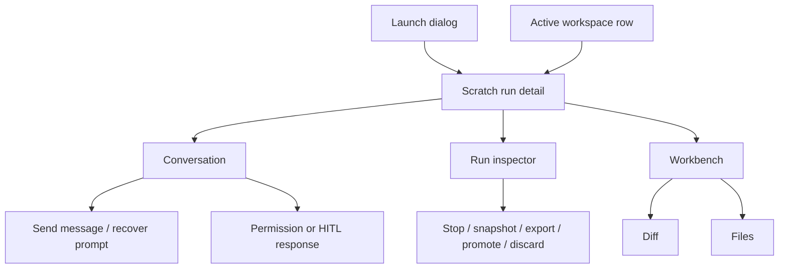
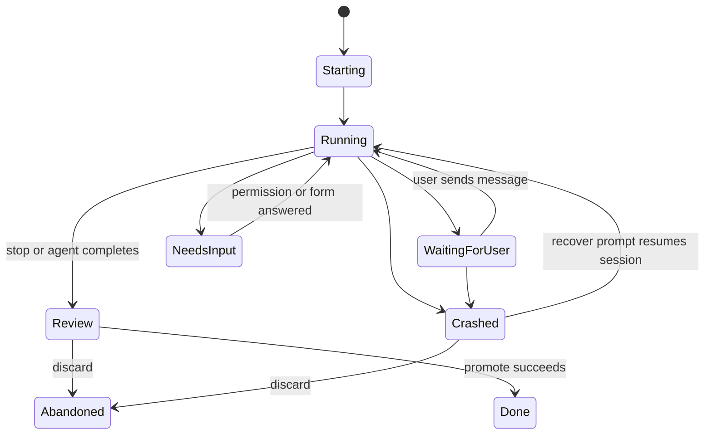

# Scratch run detail

- **Type:** screen.
- **Route:** `/scratch-runs/{runId}` (session-required).
- **Status:** Implemented. Scratch run detail is on the shared run shell: the
  conversation center plus the shared inspector and Files/Diff workbench.
- **Source:** persistent layout `web/app/(app)/scratch-runs/[runId]/layout.tsx`
  with the `?file=` pane `web/app/(app)/scratch-runs/[runId]/page.tsx`;
  conversation components `web/components/scratch/scratch-conversation.tsx`,
  `web/components/scratch/scratch-composer.tsx`,
  `web/components/scratch/scratch-permission-panel.tsx`, and
  `web/components/scratch/scratch-transcript.tsx`; shared chrome per
  [`run-inspector.md`](run-inspector.md) and [`workbench.md`](workbench.md).

## JTBD

When I open a scratch run, I want the conversation with the coding agent to own
the screen, so I can continue the session, inspect tool calls, answer permission
requests, and steer the branch without switching contexts.

When the scratch run produces changes, I want branch actions and change size
visible beside the conversation, so I can stop, snapshot, export or hand off
the branch, promote through review, or discard the workspace at the right
moment.

## Roles & capabilities

| Role | Sees / does |
| --- | --- |
| Project viewer | Sees scratch run metadata and run-scoped diff where project membership permits run visibility. |
| Project member | Sends follow-up messages, attaches context, answers pending permission/HITL prompts, browses repo files through `readRepoFiles`, and uses allowed lifecycle actions. |
| Project admin / owner | Has member capabilities plus project-level delivery actions where configured. |
| Global admin | Bypasses project role checks as owner-equivalent. |

The conversation composer must disable itself when the run is not waiting for
user input. A crashed run may expose a recover composer that sends the resume
prompt instead of a normal message.

## Navigation

- **Entry:** global launch dialog success, active workspace row, project
  scratch `+`, or direct link.
- **Primary landing:** conversation transcript.
- **Within:** inspector tabs show run info, changes, and actions; secondary
  workbench tabs open Timeline/Evidence, while Files and Diff sit in one
  collapsed-by-default disclosure.
- **Deep links:** workbench, file, diff, inspector, and source/preview state
  follow the shared URL contract in [`workbench.md`](workbench.md).
- **Exit:** project board, promoted branch/PR link, or archive/drop flow.

## Layout & regions

The scratch screen uses the conversation as the primary center:

1. **Run header** - scratch name or branch, status, branch, base branch, work
   mode, reasoning effort, and token/context meter.
2. **Conversation transcript** - user and assistant turns, Markdown rendering,
   tool-call groups, thought blocks, permission prompts, copied assistant output,
   message-level attachments, raw legacy events behind disclosure controls, and
   a collapsed **cleared history** block when the latest exact `/clear` command
   moves earlier transcript entries out of the current view without deleting
   them from the audit trail.
3. **Composer** - fixed at the bottom of the conversation. It sends a normal
   message while the run waits for the user, and a recover prompt when the run
   is crashed and resumable. It supports structured attachments and uploaded
   files. Slash suggestions include package skills plus the live ACP session's
   available commands; native runner commands are inserted as their exact raw
   command text rather than converted into capability chips. `Cmd+Enter` on
   macOS and `Ctrl+Enter` on Windows/Linux submit the composer.
4. **Inline HITL** - permission/form/human responses appear in the conversation
   path instead of a separate workflow page.
5. **Run inspector** - a collapsible right sidebar documented in
   [`run-inspector.md`](run-inspector.md). It shows branch/worktree, change size,
   token usage breakdown, wall-clock session time, action shortcuts,
   attachments, capability profile, and promotion state.
6. **Secondary workbench** - Timeline and Evidence are available as lightweight
   secondary tabs. Files and Diff are grouped inside one collapsed-by-default
   **Files / Diff** disclosure below the run interaction surface, and deep links
   open it directly. They do not replace the conversation as the scratch landing
   surface.

On mobile, the inspector collapses behind a button in the run header, and the
composer remains reachable after the transcript.

## States

| State | Main focus |
| --- | --- |
| `Starting` / `Running` | Transcript with latest tool group expanded |
| `WaitingForUser` | Transcript plus enabled composer and live slash-command suggestions |
| `NeedsInput` | Pending permission/HITL prompt in the conversation |
| `Review` | Transcript plus inspector action shortcuts and change size |
| `Crashed` | Transcript plus recover composer and failure context |
| `Done` / `Abandoned` | Frozen transcript with Diff, Timeline, and Evidence available |

## Data & APIs

- `GET /api/scratch-runs/{runId}` loads run metadata, scratch metadata,
  workspace, messages, attachments, pending HITL, capability profile, and the
  latest live available-command snapshot extracted from the run event log.
- `GET /api/runs/{runId}/stream` triggers live transcript refreshes.
- `POST /api/scratch-runs/{runId}/messages` sends follow-up messages and
  message attachments. Exact slash commands are forwarded as prompt text; the UI
  may collapse local transcript history after `/clear`, but it does not filter
  the command or delete stored messages.
- `POST /api/scratch-runs/{runId}/recover` resumes a crashed scratch session
  with a user prompt.
- `POST /api/scratch-runs/{runId}/stop` moves a live scratch run to review.
- `POST /api/scratch-runs/{runId}/discard` abandons a scratch workspace.
- `GET /api/runs/{runId}/diff` uses the shared run diff renderer for scratch
  changes once the scratch response exposes the prepared diff shape.
- `POST /api/runs/{runId}/hitl/{hitlRequestId}/respond` answers permission,
  form, or human prompts.
- Workbench routes are listed in [`workbench.md`](workbench.md).

Behavior lives in
[`../../system-analytics/scratch-runs.md`](../../system-analytics/scratch-runs.md)
and [`../../system-analytics/hitl.md`](../../system-analytics/hitl.md).

## i18n

`scratch`, plus shared `workbench` labels for the secondary workbench and
lifecycle actions.

## Linked artifacts

- Blocks: [`run-inspector.md`](run-inspector.md), [`workbench.md`](workbench.md),
  [`../chrome/launch-dialog.md`](../chrome/launch-dialog.md).
- Behavior: [`../../system-analytics/scratch-runs.md`](../../system-analytics/scratch-runs.md),
  [`../../system-analytics/hitl.md`](../../system-analytics/hitl.md).
- ADRs: [ADR-053](../../decisions.md#adr-053-workbench-file-tree-git-tracked-only-member-gated-reads),
  [ADR-066](../../decisions.md#adr-066-editor-and-diff-rendering-stack-shiki-git-diff-view-codemirror),
  [ADR-082](../../decisions.md#adr-082-review-diff-completeness-with-dirty-state-protocol-and-scope-switcher).
- Source: `web/app/(app)/scratch-runs/[runId]/page.tsx`,
  `web/components/scratch/scratch-dialog.tsx`,
  `web/components/scratch/scratch-transcript.tsx`,
  `web/components/workbench/lifecycle-actions.tsx`.
